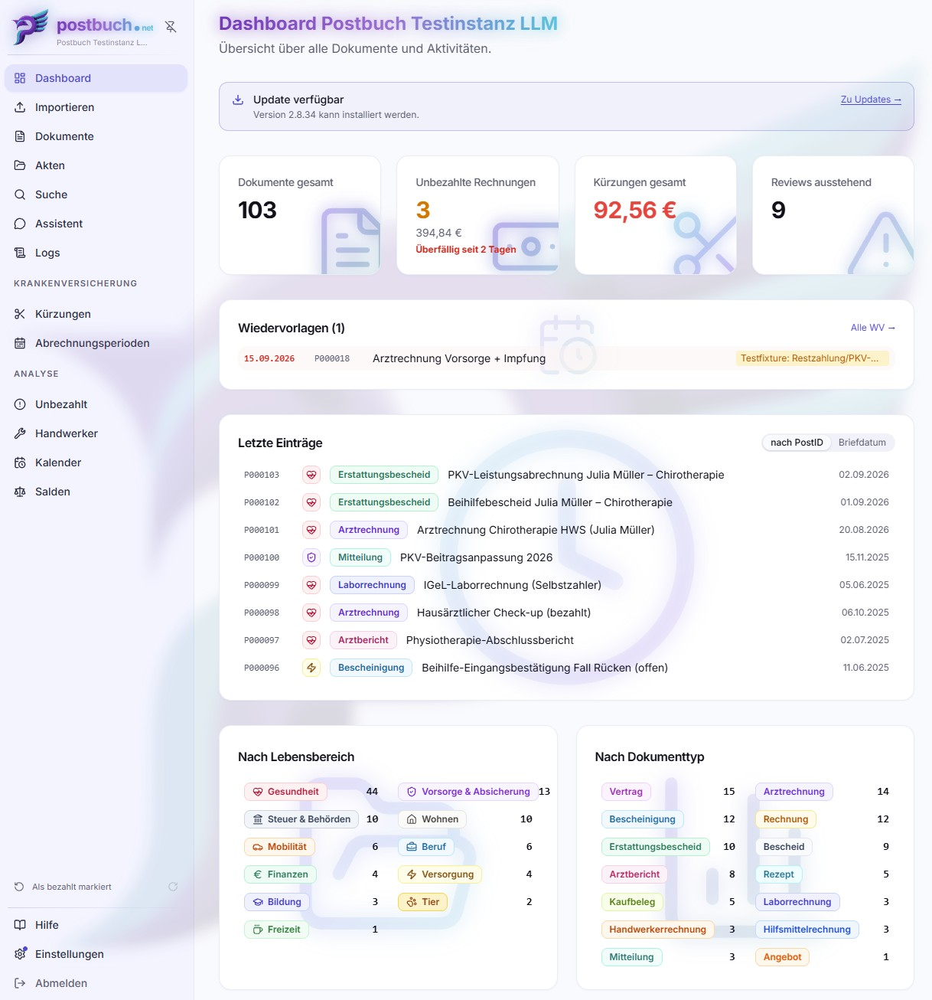

<p align="center">
  
</p>

# postbuch.net - Dokumentenverwaltung mit KI

> [!IMPORTANT]
>
> **Public Beta:** postbuch.net ist im täglichen Einsatz, aber noch jung.
> Rechne mit Fehlern und Änderungen zwischen Versionen und sichere deine Daten
> regelmäßig. Fehlerberichte über GitHub-Issues sind ausdrücklich willkommen.

postbuch.net ist eine selbstgehostete Anwendung für die digitale, KI-gestützte
Verwaltung und Archivierung deiner Post und privaten Dokumente. Ihr Backend
läuft auf deinem eigenen Linux-Server (z. B. Raspberry Pi) in Docker-Containern.
Die KI kann aus der Cloud von einem externen Anbieter oder von einem lokal
betriebenen, OpenAI-kompatiblen Server kommen. Die Oberfläche ist eine
Web-App, die im Browser oder als PWA-App läuft.

<p align="center">
  
</p>

Scans, Uploads oder ein überwachter Cloud-Ordner laufen in einer gemeinsamen
Warteschlange zusammen, **eine KI liest jedes Dokument** und trägt alle
relevanten Metadaten in eine **Datenbank** ein. Die Dateien werden in OneDrive
oder einer eigenen Nextcloud **vollautomatisch und mit passendem Dateinamen in
einer sauberen Ordnerstruktur abgelegt**. So lassen sich **Dokumente intuitiv
und schnell** wiederfinden, auch wenn sie vor langer Zeit eingepflegt wurden.

postbuch.net verfügt über eine **übersichtliche Weboberfläche zur Verwaltung der
Dokumente**, der Zugriff erfolgt im Browser. Auch eine Installation als PWA-App
auf dem PC, Smartphone oder auch Tablet ist möglich. postbuch.net bietet
klassische Dokumentenverwaltungsfunktionen wie Fristen-Überwachung,
Wiedervorlagen und Aktenanlage. Kern der Anwendung sind aber zahlreiche
nutzerfreundliche KI-Funktionen:

- Absender, Datum, Betreff, Dokumentart, eine Zusammenfassung des Inhalts und
  passende Schlagworte vergibst du nicht mehr selbst. Die KI versteht jedes
  Dokument und **trägt diese sogenannten Metadaten automatisch ein**.
- Mit der **semantischen Suche** findest du jedes Dokument schnell wieder,
  selbst wenn du andere Begriffe verwendest. Denn die KI vergleicht die
  Bedeutung deiner Suchanfrage mit der Bedeutung der Dokumente, nicht nur die
  exakten Wörter.
- Du kannst **mit deinen Dokumenten chatten**. Die KI beantwortet Fragen und
  liefert die Belege, aus denen sie die Antwort ableitet.
- Für **Privatversicherte (PKV)** bietet sie einen vollautomatischen Abgleich
  von Arztrechnungen mit PKV- und Beihilfe-Erstattungen. Sie erkennt dabei
  Kürzungen und meldet sie, damit du sie prüfen kannst.
- **Ähnliche Dokumente** findest du mit einem Klick, z. B. alle Rechnungen eines
  Handwerkers oder alle Unterlagen zu einem Autounfall. Genauso einfach lassen
  sich **zusammengehörige Dokumente zu einer Akte** zusammenfassen.

postbuch.net ist für die Verwaltung sämtlicher privater Dokumente ausgelegt, die
per Post bzw. digital als PDF eingehen oder ausgehändigt werden, z. B. für

- Rechnungen – für spezielle Typen wie Arztrechnungen und Handwerkerrechnungen
  werden eigene Workflows angeboten
- Verträge
- Angebote
- Kaufbelege
- Gesundheitsunterlagen
- Bescheide von Behörden, Versicherungen und Banken
- Kontoauszüge
- Steuerunterlagen
- Urkunden

> [!NOTE]
>
> **Nur für PDFs**
>
> postbuch.net versteht sich als **Dokumentenarchiv** – also als Ablage für
> Dokumente, die nicht mehr verändert werden. Es akzeptiert **ausschließlich das
> PDF-Format**. postbuch.net ist **kein Dokumenten-Editor**, keine
> Textverarbeitung und nicht zur Verwaltung von Entwürfen gedacht. Deine
> Ausgangspost kannst du trotzdem erfassen, indem du sie scannst oder als PDF
> speicherst.

## Bevor du startest

> [!CAUTION]
>
> **Wichtige Hinweise**
>
> - **In der Standardkonfiguration verlassen deine Dokumente dein Netz und gehen
>   zu Cloud-Diensten, die du selbst auswählst**.
> - **Nicht für Unternehmen, Selbstständige oder Vereine gedacht.**
> - **Auf Deutschland zugeschnitten – Oberfläche und Abläufe gibt es nur auf
>   Deutsch.**
> - **Niemals frei aus dem Internet erreichbar machen.**
> - **Der Code von postbuch.net basiert auf KI-Coding-Tools und ist nicht
>   vollständig menschlich gegengeprüft.**

Die Langfassung:

- postbuch.net schickt Dokumente zum Lesen an einen von dir gewählten
  KI-Anbieter (z. B. OpenAI oder Anthropic) und legt sie bei einem von dir
  gewählten Speicher-Anbieter ab (OneDrive oder eine eigene Nextcloud) – in
  beiden Fällen über deine eigenen Zugangsdaten, nicht über uns. Ein
  cloud-freier Betrieb ist möglich: eigene Nextcloud plus mindestens zwei lokal
  gehostete KI-Modelle (z. B. über Ollama oder LM Studio – eines für Embeddings,
  mindestens ein weiteres als Sprachmodell für die Analyse), laufend sichtbar am
  Cloud-frei-Check unter `Einstellungen → Allgemein`. Praktikabel ist das nur
  mit passender Inferenz-Hardware und Erfahrung im Umgang damit – und selbst
  dann: Die KI-Qualität bei kniffligen Fällen bleibt spürbar hinter einem
  Cloud-Modell zurück.
- postbuch.net ist auf Deutschland ausgelegt. Oberfläche, Doku und die
  KI-Auswertung arbeiten auf Deutsch, und die Fachfunktionen setzen deutsche
  Verhältnisse voraus: private Krankenversicherung und Beihilfe, GOÄ/GOZ/GOT bei
  Arztrechnungen, der Steuerabzug für Handwerkerleistungen, deutsche IBANs und
  Datumsformate. Außerhalb Deutschlands lässt sich die allgemeine
  Dokumentenverwaltung nutzen, die abrechnungsnahen Teile aber nicht sinnvoll.
- postbuch.net ist ausschließlich für den privaten Gebrauch gebaut. Ein
  gewerblicher, freiberuflicher oder Einsatz im Verein wirft viele Rechtsfragen
  auf – vor allem Datenschutz/DSGVO, je nach Branche auch Berufsrecht –, für die
  allein du als Betreiber verantwortlich bist. postbuch.net ist kein
  Dienstanbieter und bietet keine der dafür nötigen Absicherungen (etwa einen
  AVV).
- In deiner postbuch.net-Instanz werden Gesundheits- und Finanzdaten
  verarbeitet. Klare Empfehlung: Betreibe die Instanz nur im eigenen Netz oder
  hinter einem VPN. Die postbuch.net-eigenen Security-Mechanismen sind nicht für
  offenen Betrieb ausgelegt. HTTPS verschlüsselt nur die Übertragung, sichert
  das Produkt selbst aber nicht gegen fremde Zugriffe ab.
- Die Anwendung postbuch.net ist ein **reines Hobbyprojekt**, das selbst
  **maßgeblich durch den Einsatz von KI-Coding-Tools entwickelt** wurde. Große
  Teile des Codes sind nicht menschlich überprüft worden. Hieraus resultieren
  entsprechende Sicherheitsrisiken. Die Anwendung ist nicht kommerziell, und es
  gibt keine Garantie auf Funktion, Sicherheit oder Datenschutz. Du nutzt sie
  auf eigenes Risiko.

> [!NOTE]
>
> **postbuch.net ist kein Cloud-Dienst**
>
> postbuch.net ist der Name dieser Software, die du selbst hostest.
> **postbuch.net ist kein Cloud-Dienst**. Wir bieten weder Speicherung noch
> KI-Verarbeitung deiner Dokumente an, und wir haben keinen Zugriff auf deine
> Daten. Wir bieten auch keinen Support für die Software an – nur die Community
> kann helfen.

## Funktionen

- Posteingang (Dokumentenimport) über Netzwerkscanner, Datei-Upload im Browser
  oder einen überwachten Cloud-Ordner – alles läuft in derselben Warteschlange
  zusammen.
- KI-Analyse statt Handarbeit: Das Modell liest jedes Dokument und trägt
  Absender, Datum, Betrag und Dokumentart automatisch ein.
- Arztrechnungen, PKV & Beihilfe: Belege sammeln, für die Einreichung bündeln,
  nachhalten, Erstattungen und Kürzungen automatisch abgleichen.
- Chat mit den eigenen Dokumenten – die Antwort kommt mit den Belegen, aus denen
  sie stammt.
- Ablage in OneDrive oder einer Nextcloud-Instanz (selbst-gehostet oder
  kommerzielle Produkte wie z. B. MagentaCLOUD) – wechselbar, mit einer
  Migration, die in beide Richtungen läuft.
- Frei wählbarer KI-Anbieter: OpenAI, Anthropic, Bedrock oder jeder
  OpenAI-kompatible Endpunkt, auch selbst gehostet.
- PWA-Benachrichtigungen für neue Dokumente, Fehler, Duplikate, Fristen und
  Wiedervorlagen. Die experimentelle Discord-Anbindung wird wegen möglicher
  Datenoffenlegung bei Fehlkonfiguration nicht empfohlen.
- Etikettendruck fürs Papieroriginal (unterstützt wird ausschließlich Niimbot
  D110).
- MCP-Server stellt postbuch.net als Datenquelle für externe Tools wie Claude
  Desktop oder ChatGPT zur Verfügung.
- Backup und Wiederherstellung der Datenbank direkt in der Oberfläche. Die
  eigentlichen Dokumente sicherst du über die Ablage (OneDrive/Nextcloud)
  selbst.
- Läuft vollständig in Docker-Containern; ein Raspberry Pi mit mindestens 2 GB
  RAM reicht.

## Architektur

Docker Compose betreibt folgende Dienste:

- `postgres`: PostgreSQL + pgvector
- `app`: Node.js-API und Hintergrundjobs
- `web`: React-Oberfläche, ausgeliefert über nginx
- `caddy`: Reverse-Proxy mit automatischem HTTPS
- `scanner` + `cleaner`: eSCL-Scanner-Webhook und
  OCR-/Bildbereinigungs-Pipeline, gemeinsam optional über das Compose-Profil
  `scanner`

## Voraussetzungen

- Ein Linux-Server mit sudo-Rechten – ein Raspberry Pi mit mindestens 2 GB RAM
  reicht. Docker selbst richtet der Installer auf Debian/Ubuntu-artigen Systemen
  bei Bedarf ein.
- Ein API-Key eines geeigneten KI-Anbieters (z. B. OpenAI) mit etwas Guthaben.
  Alternativ kannst du auch einen eigenen LLM-Server betreiben, z. B. über
  Ollama oder LM Studio. Du brauchst mindestens ein Modell für Embeddings und
  ein weiteres als Sprachmodell für die Analyse.
- Eine Ablage:
  - OneDrive: ein Microsoft-Konto – dazu gehört eine kostenlose eigene
    Azure-App-Registrierung, durch die dich der Einrichtungsassistent nach dem
    ersten Login Schritt für Schritt führt. Beachte dabei den
    [Zugriffsumfang](#sicherheitshinweise): postbuch.net erhält Vollzugriff auf
    **alle** Ordner dieses Kontos, **oder**
  - Nextcloud/owncloud: ein eigener Server oder ein kommerzieller Anbieter
- Optional, aber empfohlen: eine Domain für automatisches HTTPS – eine
  kostenlose DuckDNS-Subdomain reicht
- eSCL-fähiger Scanner (optional; quasi jeder moderne
  Scanner/Multifunktionsdrucker)
- Niimbot D110 Etikettendrucker (optional)

> [!TIP]
>
> **Schnellstart mit zwei Diensten: OneDrive/MagentaCLOUD und OpenAI**
>
> postbuch.net ist auf Microsofts OneDrive als Cloud-Ablage optimiert. Viele
> haben bereits ein Microsoft-Konto und damit Zugriff auf den Dienst. In der
> kostenfreien Version bietet OneDrive genügend Speicherplatz für die meisten
> privaten Dokumentenarchive. Alternativ kann z. B. MagentaCLOUD genutzt werden,
> die auf Nextcloud basiert und ebenfalls einen leistungsstarken kostenfreien
> Tarif bietet.
>
> Embeddings und LLMs per API aus einer Hand bietet z. B. OpenAI
> (https://openai.com/de-DE/api/) an. Einmal mit dem Mindestbetrag von 5
> US-Dollar (einschließlich Steuern rund 5 Euro) aufgeladen, reicht das Guthaben
> abhängig von der Modellwahl und der Nutzungsintensität in der Regel für viele
> Monate privater Nutzung. Anthropic bietet keine Embeddings an, nur LLMs -
> daher reicht ein Anthropic-API-Key allein nicht aus, um postbuch.net zu
> betreiben.
>
> Wähle deine Anbieter aber bewusst und mit Bedacht: Sie erhalten vollen Zugriff
> auf deine Dokumente!

## Schnellstart

Der empfohlene Weg ist ein einzelner Installationsbefehl – kein manuelles
`git clone` oder Editieren einer `.env`:

```bash
curl -fsSL https://github.com/ceramgcf/postbuch.net/releases/latest/download/install.sh | bash
```

Der Installer lädt das aktuelle, signierte Release, prüft es, richtet Docker bei
Bedarf selbst ein und stellt danach nur noch die Fragen, die der Server selbst
beantwortet haben muss:

- Name der Instanz und Admin-Passwort – Datenbank- und Session-Secret erzeugt
  der Installer selbst, zufällig
- ob ein vorhandenes Datenbank-Backup eingespielt werden soll: für Umzug oder
  Neuaufbau startet der Stack leer und zeigt am Ende die Adresse, unter der die
  Sicherung hochgeladen wird
- eine kostenlose DuckDNS-Domain für automatisches HTTPS, wenn PWA oder Push
  genutzt werden sollen. Diese Funktionen brauchen eine gleichbleibend
  erreichbare HTTPS-Adresse. Beim OneDrive-Browser-Redirect dient die Adresse
  während der Kontoverknüpfung als Callback; der alternative Gerätecode kommt
  ohne Callback-URL aus.

Mehr fragt der Installer nicht. Ablage, KI-Anbieter, Scanner,
Benachrichtigungen und Backup gehören in die Oberfläche und werden dort
eingerichtet – mit Prüfung jeder Verbindung, statt blind in eine Datei
geschrieben.

Am Ende startet der Stack automatisch. Die angezeigte Adresse öffnen und als
Admin einloggen.

### Danach: der Einrichtungsassistent

Nach dem ersten Admin-Login öffnet sich automatisch der
Web-Einrichtungsassistent. Hier passiert die gesamte fachliche Einrichtung:
Instanz und Netzwerk, Personen und Zugänge, Ablage verbinden, Ordnerstruktur
anlegen und durchtesten, KI und Embeddings, Scanner suchen (falls vorhanden),
Benachrichtigungen, Backup, Abschlussprüfung.

Was der Installer nicht abfragt, wird hier erledigt: die Anleitung durch
die Azure-App-Registrierung für OneDrive bzw. die Anmeldung an der eigenen
Nextcloud, und die KI-Anbieter samt Modellwahl. Jeder Schritt prüft sein
Ergebnis gegen den echten Dienst und zeigt in der Schrittleiste an, was noch
offen ist.

Optionale Schritte wie Scanner und Benachrichtigungen dürfen offenbleiben. Die
Ablage ist dagegen zwingend: Ohne verbundenes und geprüftes OneDrive- oder
WebDAV-Backend hat postbuch.net keine Dokumentenfunktion. Der Assistent lässt
sich später über `Einstellungen` erneut öffnen; dieselben Werte lassen sich
danach auch einzeln dort ändern.

### Alternative: manuell mit Docker Compose

Für alle, die keine Installationsskripte per Pipe ausführen wollen, oder für
Entwicklung: das Repository klonen, `.env` aus `.env.example` selbst befüllen
(Secrets, Ablage, Domain), dann `docker compose up -d --build`. Es gibt dabei
keinen geführten Dialog und keine automatisch erzeugten Secrets – alles, was der
Installer oben automatisch setzt, muss hier von Hand in die `.env`. Der
Einrichtungsassistent läuft danach genauso wie nach einer Installer-Installation.
Ausführlich in [docs/installation.md](docs/installation.md).

## Sicherheitshinweise

> [!WARNING]
>
> **Die Ablage-Verbindung ist ein Vollzugriff.**
>
> Bei OneDrive verlangt postbuch.net die Berechtigung `Files.ReadWrite.All`:
> lesen, ändern und löschen in **allen** Ordnern des verbundenen
> Microsoft-Kontos, nicht nur im postbuch-Ordner. Das ist Absicht – nur so
> liegen die Dokumente im gewöhnlichen Dateibaum und bleiben auch ohne
> postbuch.net über OneDrive-App, Explorer oder onedrive.com erreichbar. Ein
> abgeschotteter App-Ordner wäre die Alternative und würde die Dateien darin
> einsperren.
>
> Das dabei ausgestellte Token liegt **unverschlüsselt in der Datenbank** und
> damit auch in jeder Backup-Datei. Wer Zugriff auf den Server, auf die
> Datenbank oder auf ein Backup hat, hat vollen Zugriff auf das komplette
> OneDrive – auch auf alles, was mit postbuch.net nichts zu tun hat. Für ein
> Nextcloud-App-Passwort gilt sinngemäß dasselbe; es lässt sich dort allerdings
> einzeln widerrufen.
>
> Wer das nicht möchte: ein separates Microsoft-Konto nur für postbuch.net
> verwenden oder eine eigene Nextcloud betreiben. Einzelheiten in
> [docs/sicherheit.md](docs/sicherheit.md#der-zugriff-auf-die-ablage-ist-ein-vollzugriff).

- Der Installer fragt Admin-Passwort und Instanzname ab und erzeugt Datenbank-
  und Session-Secret selbst, zufällig. Bei der manuellen Installation aus dem
  Quellcode ist das eigene Aufgabe – die Platzhalter in `.env` (u. a.
  `APP_PASSWORD=CHANGEME`) müssen vor dem ersten Start ersetzt werden.
- HTTPS für jede Administration bevorzugen. Der direkte Web-Port 3420 und
  ggf. der Scanner-Webhook-Port bleiben bewusst veröffentlicht – das eigene
  Netz als vertrauenswürdig behandeln.
- `.env` niemals committen oder weitergeben – sie enthält Admin-Passwort sowie
  Datenbank- und Session-Secret im Klartext. KI-Provider-Keys und
  OneDrive-/Nextcloud-Zugangsdaten stehen dort nicht: Sie werden im
  Einrichtungsassistenten bzw. unter `Einstellungen` eingetragen und liegen in
  der Datenbank. Nur bei der manuellen Installation kann ein KI-Key als
  Startwert in der `.env` stehen. Ein Datenbank-Backup ist standardmäßig
  verschlüsselt; nur wenn diese Verschlüsselung im Einrichtungsassistenten
  bewusst abgelehnt wird, enthält das Backup all diese Zugangsdaten im
  Klartext und ist damit ein Generalschlüssel – auch zur Ablage.

Sicherheitslücke melden: siehe [SECURITY.md](SECURITY.md) – bitte GitHubs
privates Vulnerability-Reporting nutzen (Tab „Security" → „Report a
vulnerability"), keinen öffentlichen Issue öffnen.

## Lizenz

Copyright (c) 2026 ceramgcf

postbuch.net ist freie Software unter der
[GNU Affero General Public License, Version 3](LICENSE): Nutzung, Selfhosting,
Veränderung und Weitergabe sind erlaubt, auch kommerziell.

Mitgelieferte Drittkomponenten behalten ihre eigene Lizenz, siehe
[THIRD-PARTY-NOTICES.md](THIRD-PARTY-NOTICES.md). **Das Projekt-Logo ist von
dieser Lizenz ausgenommen** – siehe [LOGO-LICENSE.md](LOGO-LICENSE.md). Name und
Marke sind ebenfalls nicht Teil der Lizenz, siehe [TRADEMARK.md](TRADEMARK.md).

## Transparenzhinweise

Nennungen konkreter Anbieter bzw. Hersteller in diesem README (z. B. Microsoft,
OpenAI, Anthropic, DuckDNS, Niimbot) sowie deren Unterstützung im Code erfolgen
unabhängig aus eigener Erfahrung des Entwicklers – nicht gesponsert, keine
Affiliate-Links, keine Provisionen oder sonstigen Zuwendungen von den genannten
Anbietern.

Auch im Übrigen ist das Projekt vollständig nicht-kommerziell. Es besteht auch
keine Spendenmöglichkeit.

## Weiterführende Dokumentation

Die ausführliche Dokumentation liegt in [`docs/`](docs/README.md).

**Einstieg**

- [Überblick](docs/ueberblick.md) – was postbuch.net ist, welche Begriffe gelten, worauf man sich einlässt
- [Voraussetzungen](docs/voraussetzungen.md) – Server, Ablage, KI-Anbieter, optionale Hardware
- [Installation](docs/installation.md) – Installer, manuelle Alternative, Einrichtungsassistent, OAuth-Sonderfälle

**Tägliche Arbeit**

- [Die Oberfläche](docs/oberflaeche.md) – alle Module der Web-App im Überblick
- [Dokumente importieren](docs/dokumente-importieren.md) – die sechs Eingangswege, Duplikate, Fehlerfälle
- [Die Dokumentansicht](docs/dokumentansicht.md) – Freigabe, Metadaten, Bestreiten, Erstattungen verknüpfen, Kürzungen, PDF-Betrachter
- [Akten, Verbleib und Wiedervorlagen](docs/akten-und-organisation.md) – Ordnung schaffen, Papieroriginale, Fristen
- [Suche und Assistent](docs/suche-und-assistent.md) – Volltext, semantische Suche, Chat mit den eigenen Dokumenten
- [PKV, Beihilfe und Abrechnung](docs/abrechnung-pkv-beihilfe.md) – Arztrechnungen, Einreichungen, Erstattungen, Kürzungen
- [Export und Import](docs/export-import.md) – Akte für den Anwalt, Auswertung, Umzug zwischen Instanzen
- [Mobil und PWA](docs/mobil-und-pwa.md) – Querformat-Sperre, Dokumentansicht durch Drehen, App-Installation
- [Etiketten drucken](docs/etiketten-drucken.md) – Niimbot D110, Etikettenaufbau, Browser-Voraussetzungen
- [MCP-Zugriff](docs/mcp.md) – postbuch.net als Datenquelle für Claude, ChatGPT und andere Tools
- [Benachrichtigungen](docs/benachrichtigungen.md) – empfohlene PWA-/Browser-Push-Nachrichten und experimentelles Discord

**Betrieb**

- [Ablage-Backends](docs/storage-backends.md) – OneDrive und WebDAV, Ordnerstruktur, Umzug
- [KI-Anbieter](docs/ki-provider.md) – Provider, Modellstufen, Embeddings, cloudfreier Betrieb
- [Backup und Wiederherstellung](docs/backup-wiederherstellung.md) – Datenbank **und** Dokumente sichern, Restore, Notfallwiederherstellung
- [Sicherheit](docs/sicherheit.md) – Rollenmodell, Netzwerk, Secrets, Meldewege
- [Architektur](docs/architektur.md) – Dienste, Datenfluss, Datenmodell, Schema-Pflege
- [Betrieb und Troubleshooting](docs/betrieb-troubleshooting.md) – Updates, Neustart, Logs, häufige Fehlerbilder
- [FAQ](docs/faq.md) – kurze Antworten auf wiederkehrende Fragen

**Nachschlagen**

- [Stichwortverzeichnis](docs/stichwortverzeichnis.md) – alphabetischer Index aller wichtigen Begriffe mit Sprungmarken in die Kapitel
