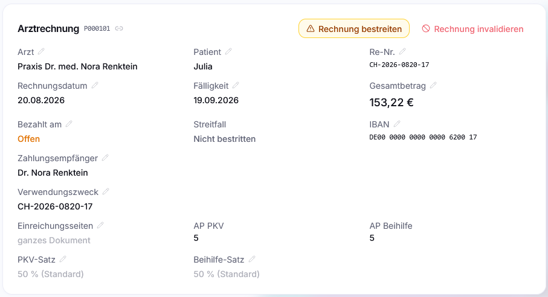
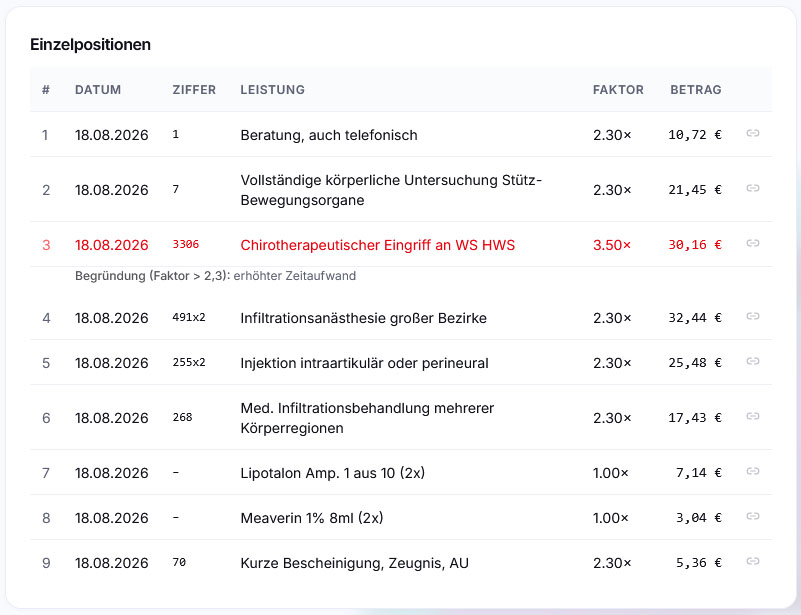
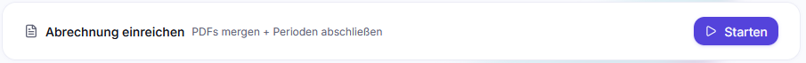
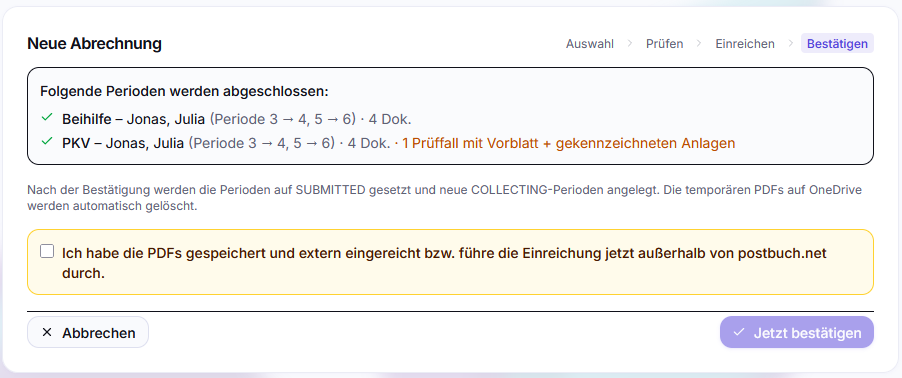
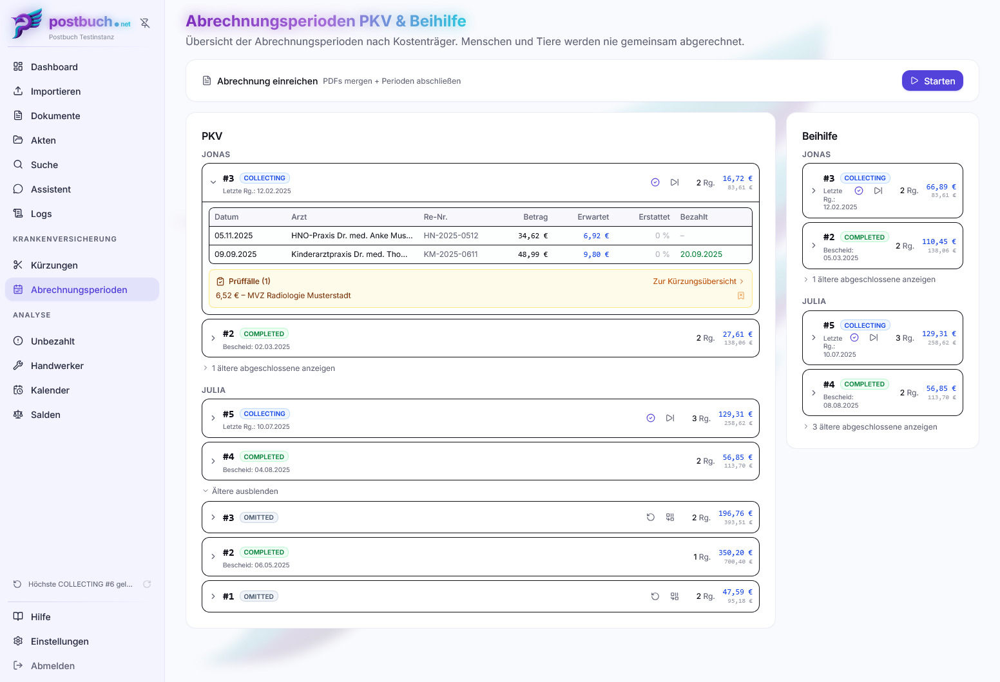

# Abrechnung: PKV, Beihilfe und offene Rechnungen

Dieses Kapitel beschreibt die Paradedisziplin von postbuch.net: die
Nachverfolgung von Arztrechnungen durch den Erstattungsprozess für
Privatversicherte. Es ist nur relevant, wenn mindestens ein Mensch als **privat
versichert** oder **beihilfeberechtigt** markiert ist – sonst blendet die
Oberfläche den ganzen Bereich aus.

## Das Problem

Bei privater Krankenversicherung zahlst du die Arztrechnung selbst und reichst
sie danach ein – bei der PKV, bei der Beihilfe, jede mit einem individuellen
Erstattungssatz. Wochen später kommt ein Erstattungsbescheid, der mehrere
Rechnungen auf einmal abrechnet, Positionen kürzt und selten eine direkt
nachvollziehbare Zuordnung vornimmt. Wer dabei nicht mitschreibt, verliert den
Überblick, welche Rechnung eingereicht, welche erstattet und welche
stillschweigend gekürzt wurde.

postbuch.net führt dafür ein Buch.

## Grundbegriffe

**Kostenträger** ist entweder `PKV` oder `Beihilfe`. Beide werden pro Mensch
getrennt aktiviert, jeweils mit einem **Satz** in Prozent (z. B. Beihilfe 70 %,
PKV 30 %).

Eine **Abrechnungsperiode** ist ein durchnummerierter Stapel: „alles, was ich
für Person X beim Kostenträger Y im Zug Nr. 3 eingereicht habe". Perioden sind
pro Mensch **und** pro Kostenträger getrennt – Beihilfe-Periode 3 hat nichts mit
PKV-Periode 3 zu tun.

Jede Periode hat genau einen von vier Zuständen:

| Status       | Bedeutung                                                   |
| ------------ | ----------------------------------------------------------- |
| `COLLECTING` | offener Sammelkorb – hier landen neue Rechnungen            |
| `SUBMITTED`  | eingereicht, Bescheid steht aus                             |
| `COMPLETED`  | ein Erstattungsbescheid ist eingetroffen und zugeordnet     |
| `OMITTED`    | bewusst nicht eingereicht (z. B. Betrag unter Selbstbehalt) |

Sobald du für einen Menschen PKV oder Beihilfe einschaltest, legt postbuch.net
automatisch Periode 1 im Status `COLLECTING` an. Der bei Periodenanlage gültige
Satz wird **in der Periode gespeichert** – ändert sich später der Beihilfesatz
(etwa bei Renteneintritt), rechnen abgeschlossene Perioden weiter mit dem alten
Satz.

## Der Durchlauf einer Rechnung

### 1. Rechnung kommt herein

Eine Arztrechnung durchläuft die Spezial-Pipeline `arztrechnung`: Die KI liest
Rechnungsnummer, Datum, Fälligkeit, Arzt, behandelte Person, Gesamtbetrag, IBAN
und Verwendungszweck aus.



Außerdem werden alle **Einzelpositionen** mit GOÄ-/GOZ-Ziffer, Faktor,
Begründung und Betrag erfasst und ausgewiesen.



### 2. Rechnung einer Periode zuordnen

Eine **Periode wird dabei ganz automatisch zugewiesen** – und zwar die höchste
`COLLECTING`-Periode, die zur behandelten Person und zum jeweiligen Kostenträger
gehört.

Auf der Detailseite der Rechnung stehen die Felder **AP PKV** und **AP
Beihilfe** (bei Tieren nur PKV). Daneben liegt der **Satz**: Voreingestellt ist
der Satz des Menschen, für diese eine Rechnung lässt er sich überschreiben
(`PKV-Satz` / `Beihilfe-Satz`) – nötig etwa bei Leistungen mit abweichendem
Erstattungssatz.

> [!CAUTION]
>
> Wurde keine behandelte Person erkannt, wird auch keine Periode zugewiesen.
> Als behandelte Person übernimmt postbuch.net nur einen Menschen mit PKV oder
> Beihilfe, dessen Kurz- oder Anzeigename bis auf Groß-/Kleinschreibung,
> Akzente und Leerzeichen eindeutig passt. Einen anderen Namen der KI verwirft
> es und setzt das Dokument auf „Review nötig". Du
> musst dann zunächst die behandelte Person (`Patient`) per Hand im Block
> "Arztrechnung" auswählen. Auch dann wird noch keine automatische
> Zuordnung zu einer Abrechnungsperiode vorgenommen. Deshalb wählst du danach
> die offene Sammelperiode. Nur Perioden im Status `COLLECTING` sind wählbar;
> solange die Periode offen ist, kannst du die Zuordnung auch wieder lösen.

 **Archivieren löst diese Zuordnung nicht.**
Eine Rechnung, die einer Periode zugeordnet ist, bleibt darin – auch als
„historisch" markiert. Sie zählt weiter in Anzahl und Summe der Periode, sie
steht weiter in der aufgeklappten Rechnungsliste (dort mit einem Kästchen
**Archiviert**), und sie wird beim Einreichen mit in das gemeinsame PDF gepackt.
Das ist Absicht: Eine noch nicht abgerechnete Rechnung soll nicht dadurch aus
der Einreichung fallen, dass jemand sie weggeräumt hat. Wer sie wirklich aus der
Periode nehmen will, **setzt das Feld AP auf leer** – solange die Periode
`COLLECTING` ist, geht das jederzeit.

### 3. Bezahlen

Solange `bezahlt am` leer ist, steht die Rechnung unter
 **Analyse → Unbezahlt**. Dafür steht
der normale Zahlungsblock der Detailseite bereit: GiroCode zum Scannen,
Kopiersymbole für IBAN & Co. und ein Knopf zum Bestreiten strittiger Beträge –
Details siehe [Zahlung und GiroCode](dokumentansicht.md#zahlung-und-girocode)
und [Eine Rechnung bestreiten](dokumentansicht.md#eine-rechnung-bestreiten).
Eine bestrittene Rechnung wird zusätzlich beim Einreichen einer
Abrechnungsperiode übersprungen – siehe unten
[Bestrittene Rechnungen werden übersprungen](#bestrittene-rechnungen-werden-übersprungen).

### 4. Periode einreichen – der Abrechnungs-Assistent

Wenn der Sammelkorb voll genug ist:
 **Analyse →
Abrechnungsperioden**, dort die Periode abschließen:



Der Abrechnungs-Assistent startet per Klick auf 
**Starten**. Er

1. lädt alle Rechnungen der gewählten Perioden. Trägt eine Rechnung
   [Einreichungsseiten](dokumentansicht.md#einreichungsseiten) ein, fließt nur
   dieser Seitenbereich ein – ohne dass die gespeicherte Originaldatei
   angetastet wird,
2. wandelt jedes PDF in **Graustufen** um (Rezepte auf A6, alles andere auf A4)
   – das spart drastisch Dateigröße beim Upload zum Kostenträger,
3. führt sie **pro Kostenträger** zu einem PDF zusammen,
4. teilt zu große Pakete an **Dokumentgrenzen** in Teile von je höchstens 3 MB
   (das übliche Upload-Limit der Portale) – nie mitten in einem Dokument und
5. legt die Ergebnisse in der Dateiablage unter
   `<postbuch.net-Wurzelverzeichnis>/_abrechnung_merged` ab.

> [!CAUTION]
>
> Haben Personen **nicht dieselbe PKV oder denselben Beihilfeträger** oder
> erwartet der Kostenträger, dass für jede Person separat eingereicht wird,
> müssen die Abrechnungsperioden **für jede Person separat** eingereicht und
> damit auch in postbuch.net separat zusammengestellt und abgeschlossen werden.
> postbuch.net erkennt das **nicht automatisch**.

Den Fortschritt siehst du live. Danach kannst und solltest du jedes erzeugte PDF
im Browser öffnen und prüfen, **bevor** du bestätigst – das ist auch der Moment,
um einen gesetzten Seitenbereich noch einmal gegenzuprüfen.

-  **Bestätigen** setzt die Perioden auf
  `SUBMITTED`, legt für jede betroffene Person × Kostenträger automatisch die
  nächste `COLLECTING`-Periode an (Nummer + 1, mit dem heute gültigen Satz) und
  räumt die Zwischen-PDFs weg.
-  **Verwerfen** löscht die Zwischen-PDFs und
  lässt die Perioden unangetastet.

Eine nicht bestätigte Sitzung läuft nach **zwei Stunden** ab und wird
automatisch aufgeräumt (ein Cron-Lauf prüft das alle 15 Minuten). Offene
Sitzungen bietet die Oberfläche innerhalb des Zwei-Stunden-Fensters zur
Wiederaufnahme an.

> [!TIP]
>
> Ein Paket lässt sich bequem **am PC zusammenstellen und prüfen**. Anschließend
> kann die am PC geöffnete Abrechnungssession **nahtlos zum Smartphone**
> wechseln, um das fertige Paket dort herunterzuladen. So kann es direkt **mit
> der App des Kostenträgers geteilt** werden, ohne dass das PDF vorher vom PC
> auf das Smartphone kopiert werden muss.

> [!CAUTION]
>
> Das **Hochladen beim Kostenträger machst du selbst** – postbuch.net hat keine
> Schnittstelle zum Kostenträger, es liefert nur das fertige Paket: eine PDF mit
> allen Rechnungen drin.

#### Bestrittene Rechnungen werden übersprungen

Eine [bestrittene](dokumentansicht.md#eine-rechnung-bestreiten) Rechnung nimmt
der Assistent nie mit ins Paket – der endgültige Betrag steht erst fest, wenn
der Streitfall geklärt ist und sollte vorher auch nicht abgerechnet werden.
Enthält die Auswahl solche Rechnungen, zeigt schon Schritt 1 einen Hinweis mit
der Anzahl, den du per Häkchen bestätigen musst, bevor „Abrechnung starten"
wählbar wird.

Die betroffenen Rechnungen bleiben zunächst in ihrer Periode und werden erst bei
**Bestätigen** automatisch in die neu angelegte `COLLECTING`-Periode verschoben
– in der Hoffnung, dass sie bis zu deren Abschluss nicht mehr bestritten sind.
Ist eine Rechnung dann immer noch bestritten, wiederholt sich derselbe Ablauf
beim nächsten Einreichen.

#### Prüfblock für die PKV: Beihilfe-Kürzungen zur Prüfung

Hast du eine Beihilfe-Kürzung [zur PKV-Prüfung vorgemerkt](#kürzungen-ansehen),
nimmt der Assistent das automatisch mit: Sobald eine ausgewählte PKV-Zielperiode
offene Vormerkungen hat, zeigt Schritt 1 die Zahl als Badge „_n_ Prüffälle (PKV)
werden mit eingereicht" – die betroffenen Beihilfebescheide und Rechnungen
laufen zusätzlich zum eigentlichen PKV-Paket noch als eigener **Prüfblock** mit
ins fertige Paket.

Der Prüfblock beginnt mit einem eigenen Vorblatt „Prüfung eines ergänzenden
Erstattungsanspruches" mit einer Tabellenzeile je betroffener Bescheidposition:
Rechnungsdatum/-betrag, der Verweis auf die zugehörige Bescheidposition sowie
der zur Prüfung gestellte gekürzte Betrag. Der Kürzungsgrund steht bewusst nicht
drauf, der geht aus der Anlage selbst hervor; die Person steht ebenfalls nicht
als eigene Spalte drin.

Als Bescheidposition steht dort die reale Beleg-Nr. aus dem Beihilfebescheid,
sofern die KI beim Auslesen eine erkannt hat – sonst „nicht erfasst". Zu jeder
Vormerkung lässt sich außerdem eine freie **Erläuterung** hinterlegen (siehe
unten); ist eine gesetzt, erscheint sie unterhalb der Tabelle als eigene Zeile
„zu &lt;Bescheidposition&gt;: …".

Jede angehängte Seite – Beihilfebescheid oder Rechnung – trägt oben einen gelben
Balken mit dem Hinweis „Anlage zur Prüfung eines ergänzenden
Erstattungsanspruchs / Nur als Prüfanlage beigefügt – keine erneute reguläre
Einreichung", damit beim Kostenträger nichts als doppelte reguläre Einreichung
missverstanden wird. Der Balken erweitert die Seite nicht, sondern verkleinert
den Originalinhalt geringfügig – die Anlage bleibt dadurch genauso groß
formatiert (A4 bzw. A6) wie regulär eingereichte Dokumente. Nach dem Bestätigen
der Session gehen die vorgemerkten Kürzungen automatisch auf „eingereicht" über,
siehe [Kürzungen ansehen](#kürzungen-ansehen).

#### Beliebige Dokumente anheften

Anders als der Prüfblock ist das **Anheften** nicht auf Beihilfe-Kürzungen
beschränkt: Jedes Dokument – ein Kostenvoranschlag, ein Krankenschein, ein
Arztbericht – lässt sich über den Knopf  **„An
PKV-/Beihilfeperiode anheften"** im Bereich Akten der Dokument-Detailseite einer
Person und einer offenen `COLLECTING`-Periode zuordnen, PKV **und/oder**
Beihilfe. Der Knopf erscheint nur, wenn überhaupt jemand bei PKV oder Beihilfe
versichert ist; hat eine Person keine Beihilfe, steht Beihilfe für sie im Dialog
erst gar nicht zur Auswahl. Ein **Grund** ist dabei Pflichtfeld – ohne Angabe,
warum das Dokument beigefügt wird, lässt sich nicht anheften.

Angeheftete Dokumente laufen automatisch mit ins Abrechnungspaket der jeweiligen
Zielperiode, **ganz am Ende**, nach dem eigentlichen Paket und nach einem
eventuellen PKV-Prüfblock. Sie beginnen mit einem eigenen Vorblatt „Beigefügte
Unterlagen zur Kenntnisnahme":

> Die folgenden Unterlagen werden zusätzlich beigefügt, ohne Teil der regulären
> Einreichung zu sein:

Für jedes angeheftete Dokument stehen Person, Betreff, Briefdatum und der
angegebene Grund. Jede angehängte Seite trägt außerdem, wie beim Prüfblock,
einen gelben Hinweisbalken „Beigefügte Unterlage – keine reguläre Einreichung /
Nur zur Kenntnisnahme beigefügt".

> [!WARNING]
>
> Beihilfestellen lehnen einen **formalen Widerspruch**, der auf diesem
> informellen Weg beigefügt wird, erfahrungsgemäß ab. Für einen Widerspruch
> gegen einen Bescheid ist ein eigenständiges, an die Beihilfestelle
> adressiertes Schreiben nötig – das Anheften eignet sich für Belege,
> Kostenvoranschläge oder sonstige Unterlagen zur Kenntnisnahme, nicht als
> Ersatz für den formalen Widerspruchsweg.

Solange eine Anheftung noch nicht eingereicht ist, lässt sie sich in der
Anheftungsliste im Bereich Akten jederzeit bearbeiten (Grund ändern) oder wieder
lösen. Nach dem Bestätigen der Abrechnungssession wechselt sie – wie die
PKV-Prüfvormerkung – automatisch auf „eingereicht" und lässt sich nicht mehr
zurücknehmen.

#### Korrekten Abschluss der Periode nicht vergessen



Erst nachdem du die Abrechnungssession **bestätigt** hast, wird die
Abrechnungsperiode auf `SUBMITTED` gesetzt. Das ist der Moment, in dem die
Rechnungen offiziell beim Kostenträger eingereicht sind. Da postbuch.net das
nicht für dich erledigen kann, musst du im allerletzten Schritt per Häkchen
bestätigen, dass du die Abrechnung tatsächlich **hochgeladen** hast – erst dann
kannst du die Abrechnungssession **abschließen**, indem du auf
`Jetzt bestätigen` klickst.

### 5. Der Erstattungsbescheid kommt

Ein Dokument der Art Erstattungsbescheid läuft in die Spezial-Pipeline
`erstattungsbescheid` und wird deutlich aufwendiger verarbeitet als andere
Dokumente:

1. **Auslesen.** Die KI bekommt einen Prompt, in dem alle versicherten Menschen
   dieser Instanz mit Kurzname, Sätzen und Kostenträgern aufgeführt sind, und
   liefert Kostenträger, Bescheiddatum, Gesamterstattung und die
   Einzelpositionen (Belegnummer, Person, Kostenart, Bezugsdatum,
   Rechnungsbetrag, Erstattungsbetrag, Kürzungsbetrag). Kennt postbuch.net das
   Layout des Kostenträgers zusätzlich, liest sie zuverlässiger – siehe
   [Kostenträger-Profile](ki-provider.md#kostenträger-profile).
2. **Zuordnen.** Jede Position wird gegen die **eingereichten** Rechnungen –
   also solche, die in einer `SUBMITTED`-Periode stehen – gematcht: gleiche
   Person, Rechnungsbetrag auf den Cent genau, noch nicht vergeben. Gibt es
   mehrere Kandidaten, entscheidet die Nähe des Rechnungsdatums zum Bezugsdatum.
   Liefert das kein eindeutiges Ergebnis – Bezugsdatum fehlt, ein Kandidat hat
   kein Rechnungsdatum, oder mehrere liegen gleich nah – greift als letzte
   Instanz die Reihenfolge der Erfassung (älteste Rechnung zuerst). Gelingt das
   Matching nicht zweifelsfrei, bleiben betroffene Positionen bewusst
   unzugeordnet – sie können später manuell zugeordnet werden.
3. **Kürzungen erkennen.** Wo der erstattete Betrag kleiner ist als der
   eingereichte, werden die Kürzungen erfasst und, wenn nötig, per KI den
   einzelnen GOÄ-Positionen der Rechnung zugeordnet – samt der Begründung des
   Kostenträgers.
4. **Perioden bewerten.** Für jede eingereichte Periode, aus der Rechnungen im
   Bescheid auftauchen, wird anhand der Zuordnungen entschieden:
   - **vollständig abgerechnet** – alle Rechnungen der Periode stehen im
     Bescheid: die Periode geht auf `COMPLETED` und merkt sich die PostID des
     Bescheids.
   - **teilweise abgerechnet** – die abgerechneten Rechnungen bleiben in der
     jetzt abgeschlossenen Periode, die übrigen wandern automatisch in eine neue
     [Restperiode](#restperioden--wenn-ein-bescheid-nur-einen-teil-abrechnet).
   - **kein Treffer** – die Periode bleibt unverändert.

   Ein Bescheid darf mehrere Perioden abschließen; eine Periode hat aber immer
   höchstens einen Abschlussbescheid.

5. **Benachrichtigen.** PWA-/Browser-Push und, falls bewusst eingerichtet, die
   experimentelle Discord-Anbindung.

Tiere werden strikt getrennt: Ein Tier-Bescheid wird nie gegen menschliche
Rechnungen gematcht und umgekehrt; Beihilfe gibt es für Tiere nicht.

Die Zuordnungsquote steht danach am Bescheid („7/8 Positionen zugeordnet").
Bleibt eine Position übrig, ordnest du sie auf der Detailseite der Rechnung
unter  **Erstattungen → Erstattung
zuordnen** von Hand zu – oder löst eine falsche Zuordnung wieder. Das geht auch
andersherum, vom Bescheid aus, und lässt sich mit SymLink-Kürzeln abkürzen;
Schritt für Schritt beschreibt das
[Die Dokumentansicht](dokumentansicht.md#erstattungen-von-hand-verknüpfen).

### Restperioden – wenn ein Bescheid nur einen Teil abrechnet

Es kommt vor, dass ein Bescheid nur einen Teil der eingereichten Rechnungen
abrechnet – etwa weil Belege noch geprüft werden. Damit die übrigen Rechnungen
nicht in einer abgeschlossenen Periode verschwinden, legt postbuch.net dafür
automatisch eine **Restperiode** an:

- Sie bekommt die nächste freie Periodennummer und startet im Status `SUBMITTED`
  – die Rechnungen gelten weiterhin als eingereicht.
- Sie übernimmt den gespeicherten Satz der Ursprungsperiode, dazu angeheftete
  Dokumente und PKV-Prüfvormerkungen der mitgenommenen Rechnungen.
- Sie merkt sich ihre **Ursprungsperiode**, also die Periode, aus der sie
  hervorgegangen ist.

Auf der Periodenseite steht diese Herkunft an beiden beteiligten Perioden: die
Restperiode trägt das Kennzeichen „aus #5", die Ursprungsperiode das Kennzeichen
„Rest → #8". Aufgeklappt zeigen beide dieselbe Kette untereinander, auch über
mehrere Stufen hinweg:

```
Periode 8 aus 5
Periode 5 aus 2
```

Was du mit einer Restperiode machst, entscheidest du selbst – automatisch
passiert nichts weiter, d. h. die Restperiode wartet weiter auf den nächsten
Bescheid. Du kannst sie aber auch:

- **erneut einreichen**: mit 
  **Zurückstufen** auf `COLLECTING` setzen und über den
  [Abrechnungs-Assistenten](#4-periode-einreichen--der-abrechnungs-assistent)
  neu einreichen – etwa weil du davon ausgehst, dass ein Beleg übersehen wurde
  –,
- **zusammenlegen**: nach dem Zurückstufen mit einer anderen`COLLECTING`-Periode
   **zusammenführen**,
- **aufgeben**: nach dem Zurückstufen
   **verzichten**, dann steht sie
  auf `OMITTED`.

Sobald eine Restperiode in eine andere Periode zusammengeführt oder gelöscht
wird, entfällt die Herkunftsangabe – die zusammengelegten Rechnungen stammen
dann aus zwei Quellen, und eine einzelne Ursprungsnummer wäre schlicht falsch.
Der Vorgang steht weiterhin im Anwendungsprotokoll.

**Nachzahlungen** brauchen keine eigene Periode. Trifft ein zweiter Bescheid
eine Rechnung, deren Periode bereits abgeschlossen ist, bleibt diese Periode
unverändert – du ordnest die Position auf der Dokumentseite einfach derselben
Rechnung zu. Das geht nicht automatisch, sondern nur manuell.

> [!NOTE]
>
> Wird ein Erstattungsbescheid **neu verarbeitet** (auch mit
> Korrekturanweisung), eine Zuordnung **von Hand geändert** oder der Bescheid
> **gelöscht**, bewertet postbuch.net die betroffenen Perioden neu: zuvor
> angelegte Restperioden werden wieder aufgelöst und ihre Rechnungen
> zurückgebucht, abgeschlossene Perioden gehen zurück auf `SUBMITTED`. Eine
> Restperiode, an der du inzwischen weitergearbeitet hast – zurückgestuft,
> selbst abgerechnet oder erneut geteilt –, bleibt dabei unangetastet; das
> vermerkt das Anwendungsprotokoll.

## Kürzungen ansehen

 **Analyse → Kürzungen** listet alles,
was ein Kostenträger nicht erstattet hat: Bescheid, Arztrechnung, Patient,
betroffene Leistung bzw. GOÄ-Ziffer, Kürzungsbetrag und Begründung. Das ist die
Grundlage für einen Widerspruch – und die Antwort auf die Frage „warum ist da
weniger gekommen als erwartet?".

Bei jedem Kostenträger wird die Kürzung mit dem dort versicherten Satz
umgerechnet: Wenn eine Position über 100 € gekürzt wird und der Satz 70 %
beträgt, fehlen dir real 70 €. Die Liste zeigt direkt diesen umgerechneten
Betrag; die Aufschlüsselung „70,00 € (100,00 € × 70 %)" steht an der
zugrundeliegenden Rechnung selbst (siehe
[Kürzungen bearbeiten](dokumentansicht.md#kürzungen-bearbeiten)).

Kürzungen, die die KI nicht gefunden oder falsch zugeordnet hat, werden am
Bescheid selbst nachgetragen und korrigiert – siehe
[Kürzungen bearbeiten](dokumentansicht.md#kürzungen-bearbeiten). Wichtig dabei:
Eine Wiederverarbeitung des Bescheids überschreibt diese Handarbeit wieder –
postbuch.net warnt davor im Dialog, verweigert die Wiederverarbeitung deshalb
aber nur, wenn eine PKV-Prüfvormerkung an einer Kürzung hängt (siehe
[Wiederverarbeiten](dokumentansicht.md#wiederverarbeiten)).

### Kürzungen als gesehen markieren

Jede Kürzung lässt sich einzeln als **gesehen** markieren – am Bescheid selbst
(siehe [Kürzungen bearbeiten](dokumentansicht.md#kürzungen-bearbeiten)) oder
direkt in der Kürzungenliste. Das ist reine Buchführung ohne fachliche Wirkung:
eine gesehene Kürzung sperrt nichts und löst nichts aus, auch nicht die
Wiederverarbeitung ihres Bescheids – sie hilft nur dabei, bereits durchgesehene
von noch offenen Kürzungen zu unterscheiden, die du noch prüfen möchtest. Auf
dem Dashboard werden nur ungesehene Kürzungen aufsummiert.

### Beihilfe-Kürzung zur PKV-Prüfung vormerken

Viele private Zusatzversicherungen erstatten über einen
**Beihilfeergänzungstarif** auch Positionen, die die Beihilfe gekürzt hat. Für
genau diesen Fall lässt sich eine Beihilfe-Kürzung mit
 **Für PKV-Prüfung vormerken**
kennzeichnen (nur bei Kostenträger Beihilfe verfügbar). Die Vormerkung hängt an
der nächsten `COLLECTING`-PKV-Periode derselben Person und läuft automatisch mit
ins Abrechnungspaket, sobald diese Periode eingereicht wird – siehe
[Prüfblock für die PKV](#4-periode-einreichen--der-abrechnungs-assistent).
Solange sie offen ist, zeigt die Kürzung das Badge **PKV-Prüfung vorgemerkt**;
 **Vormerkung entfernen** nimmt sie
zurück. Nach der Einreichung wechselt sie automatisch auf **Bei PKV
eingereicht** und lässt sich nicht mehr zurücknehmen – dafür zuerst die
zugehörige PKV-Periode [zurückstufen](#perioden-von-hand-korrigieren). Eine
vorgemerkte oder eingereichte Vormerkung schützt außerdem ihren Bescheid und
ihre Kürzung vor dem Löschen bzw. der Wiederverarbeitung, siehe
[Kürzungen bearbeiten](dokumentansicht.md#kürzungen-bearbeiten).

Beim Vormerken lässt sich optional eine freie **Erläuterung** eintragen – etwa
ein Hinweis, warum konkret ein ergänzender Anspruch besteht. Sie steht über
 **Erläuterung** jederzeit offen, solange
die Vormerkung noch nicht eingereicht ist, und landet beim Einreichen im
Vorblatt des Prüfblocks (siehe oben).

Auf der Periodenseite ( **Analyse
→ Abrechnungsperioden**) zeigt jede PKV-Periode mit Vormerkungen zusätzlich
einen gelb hinterlegten Kasten **Prüffälle**: eine kompakte Liste der
vorgemerkten und bereits eingereichten Kürzungen dieser Periode, mit direktem
Link zur Kürzungsübersicht und – solange noch vorgemerkt – demselben
-Knopf zum Entfernen.

> [!NOTE]
> 
> **Erstattet die PKV** die vorgemerkte Kürzung, erfolgt **keine automatische Zuordnung** zur Rechnung, sie muss manuell erfolgen.

## Perioden von Hand korrigieren

Die Periodenseite zeigt je Person und Kostenträger alle Perioden mit Status,
Anzahl Rechnungen, Summe, erwarteter und tatsächlicher Erstattung. Für den Fall,
dass etwas schiefging, gibt es manuelle Eingriffe:

| Aktion                                                                  | Wirkung                                                               |
| ----------------------------------------------------------------------- | --------------------------------------------------------------------- |
|  **Abschließen**        | springt direkt in den [Abrechnungs-Assistenten](#4-periode-einreichen--der-abrechnungs-assistent), um eine COLLECTING-Periode einzureichen |
|  **Zurückstufen**                 | `SUBMITTED` → `COLLECTING`, falls du doch nicht eingereicht oder die Einreichung zurückgezogen hast |
|  **Verzichten (OMITTED)** | Periode wird nicht eingereicht; eine neue Sammelperiode entsteht      |
|  **Verzicht aufheben**       | `OMITTED` → `COLLECTING`                                              |
|  **Höchste Sammelperiode löschen**  | Rechnungen wandern in die nächstniedrigere offene Sammelperiode       |
|  **Zusammenführen**          | eine Sammelperiode in eine andere schieben                            |
|  **Zuordnung nullen**               | Periode löschen und die Periodenzuordnung ihrer Rechnungen leeren     |

Perioden, die aus einer
[Teilabrechnung](#restperioden--wenn-ein-bescheid-nur-einen-teil-abrechnet)
stammen, zeigen zusätzlich ihre Herkunft an. Beim Zusammenführen, beim Löschen
der höchsten Sammelperiode und beim Nullen der Zuordnung entfällt diese
Herkunftsangabe.

Die Dialoge erklären jeweils, was mit den enthaltenen Rechnungen passiert, und
die kritischen Schritte sind rückgängig zu machen. Perioden werden **nie**
automatisch weggeräumt.

Hängt an einer PKV-Periode eine offene [PKV-Prüfvormerkung](#kürzungen-ansehen),
wirkt sich das auf diese Aktionen aus: **Verzichten** sowie ein direkter
Statuswechsel auf `SUBMITTED` außerhalb des Abrechnungs-Assistenten – etwa
**Wiederholen** nach einem **Zurückstufen** – lehnt postbuch.net ab, solange
die Vormerkung offen ist; erst verschieben oder entfernen. Die reguläre
Einreichung über den
[Abrechnungs-Assistenten](#4-periode-einreichen--der-abrechnungs-assistent)
ist davon nicht betroffen und nimmt die Vormerkung automatisch mit ins
Abrechnungspaket. **Zusammenführen** und **Höchste Sammelperiode löschen** nehmen
offene wie bereits eingereichte Vormerkungen automatisch mit auf die
Zielperiode; **Zuordnung nullen** lehnt ab, wenn die Periode dadurch ihren
notwendigen Periodenbezug verlieren würde.



---

Weiter: [Analyse](analyse.md) ·
[Zurück zur Übersicht](README.md)
