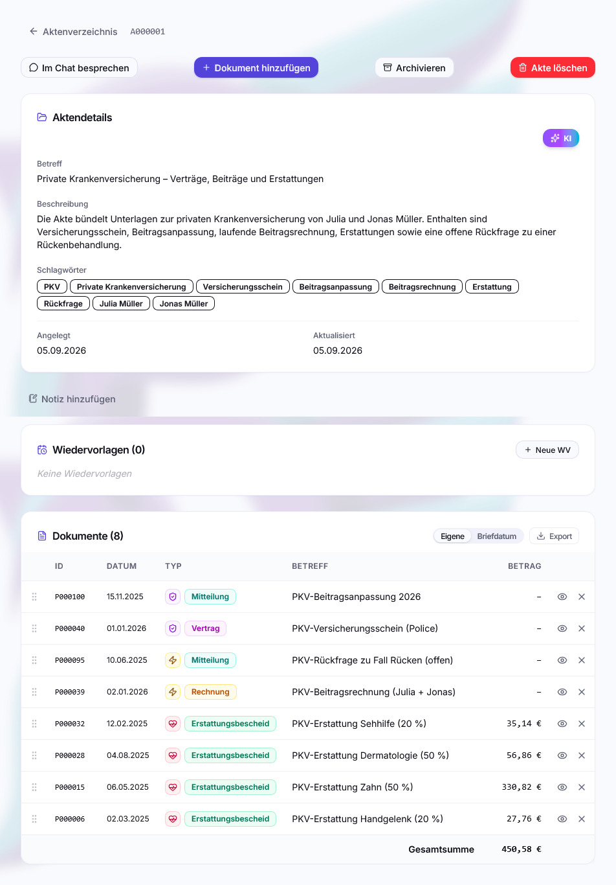

# Akten, Verbleib und Wiedervorlagen

Die KI sortiert jedes Dokument automatisch ein. Was sie nicht wissen kann: was
zu welchem _Vorgang_ gehört, wo das Papier liegt und woran du erinnert werden
willst. Dafür gibt es drei Werkzeuge.

## Akten

Eine **Akte** bündelt Dokumente zu einem Vorgang. Sie hat eine eigene Nummer
(`A000123`), einen Betreff, eine Beschreibung, Schlagwörter und eine Notiz –
genau wie ein Dokument.

### Dokumente hinzufügen

Am schnellsten geht es aus einem Dokument heraus, über den
 `Zu Akte hinzufügen`-Knopf auf der
Dokumentdetailseite: KI-Vorschläge, zuletzt benutzte Akten,
 `Akte wählen…` für eine beliebige
bestehende Akte oder 
`Neue Akte anlegen…` für eine ganz neue. Details zu diesem Menü stehen unter
[Akten (Dokumentansicht)](dokumentansicht.md#akten). Bei einer neuen Akte
vergibst du nur den Betreff, das Dokument ist danach sofort das erste darin.

Umgekehrt geht es auch aus der Akte heraus: 
`Dokument hinzufügen` schickt dich zur Dokumentliste, in einem eigenen
Auswahlmodus mit Bezug auf diese Akte; hat die Akte bereits Inhalt, ist die
Liste dabei automatisch nach Ähnlichkeit zur Akte sortiert. Eine dritte
Möglichkeit ist der [Assistent](#der-assistent-kann-das-auch).

Ein Dokument darf in **mehreren** Akten liegen – die Rechnung zum Wasserschaden
kann sowohl in der Akte „Gebäudeversicherung" als auch in „Instandhaltung
Immobilien" liegen. Auch elektronische Akten ohne jedes Dokument sind ein
gültiger Zustand, z. B. direkt nach dem Anlegen aus der Aktenliste heraus (dort
genügt für eine neue Akte der Betreff, ganz ohne Dokumentbezug).

### In der Akte arbeiten

Betreff, Beschreibung und Schlagwörter einer Akte werden genauso bearbeitet wie
die eines Dokumentes (siehe [Dokumentansicht](dokumentansicht.md)): Stiftsymbol
antippen, Wert ändern, speichern. Darunter zeigt die Aktenkarte Anlege- und
Aktualisierungsdatum.

Da eine Akte lebt und wächst, während neue Dokumente hinzukommen, muss eine
automatische Befüllung der Metadaten per Hand ausgelöst werden – dafür gibt es,
sobald die Akte **mindestens zwei** Dokumente enthält, den Knopf
 `KI` oben rechts auf der Metadatenkarte. Die KI
liest die Betreffe aller Dokumente in der Akte und schlägt einen neuen Betreff
und eine neue Beschreibung vor – diese beiden Felder werden dabei
**überschrieben**, ihr bisheriger Inhalt geht verloren. Schlagwörter behandelt
sie anders: neue Vorschläge werden zu den bestehenden **hinzugefügt**, nichts
geht dabei verloren.

Eine **Notiz** steht der Akte zusätzlich zur Verfügung, als eigener Abschnitt
unterhalb der Metadatenkarte – ein freies Textfeld für alles, was in keines der
anderen Felder passt.

### Dokumente in der Akte

Die Dokumentliste der Akte lässt sich auf zwei Arten sortieren, umschaltbar über
die beiden Knöpfe `Eigene` / `Briefdatum` oberhalb der Liste:

- **Eigene** – die Reihenfolge, die du per Ziehen am
  -Griff frei festgelegt hast.
- **Briefdatum** – automatisch nach dem Briefdatum der Dokumente sortiert. In
  diesem Modus ist das Ziehen zum manuellen Umsortieren deaktiviert, da es
  sofort von der automatischen Sortierung überschrieben würde.

Die gewählte Sortierart wird pro Akte gespeichert und zählt auch beim Export:
Ein zusammengeführtes Akten-PDF folgt genau der Reihenfolge, die die Liste
gerade anzeigt – bei `Eigene` deiner Ziehreihenfolge, bei `Briefdatum` dem
chronologischen Briefdatum.

Weitere Aktionen je Dokumentzeile:

-  **Entfernen** – löst nur die Zuordnung zu
  dieser Akte, das Dokument selbst bleibt bestehen und ist über seine Postnummer
  weiter auffindbar.
- Trägt mindestens ein Dokument der Akte einen Betrag, erscheint unter der Liste
  eine **Gesamtsumme**-Zeile.

### Export

 **Export** exportiert wahlweise alle
Dokumente der Akte oder eine per Checkbox getroffene Auswahl, in einem der
folgenden Formate:

| Format                   | Inhalt                                                                                                                                                                                                                        |
| ------------------------ | ----------------------------------------------------------------------------------------------------------------------------------------------------------------------------------------------------------------------------- |
| **Zusammengeführte PDF** | Ein einziges PDF mit Deckblatt (Akten-Metadaten) und den Dokumenten in der gewählten Reihenfolge. Vom Deckblatt aus führt ein Klick auf eine Zeile per Sprungmarke direkt zum jeweiligen Dokument. Auf 50 Dokumente begrenzt. |
| **ZIP-Archiv**           | Dieselben Inhalte als einzelne PDF-Dateien plus Deckblatt, in einem Windows-kompatiblen ZIP – ohne Mengenbegrenzung.                                                                                                          |
| **Excel-Tabelle**        | Die Spalten der aktuellen Ansicht plus Link in die Ablage.                                                                                                                                                                    |
| **Dokumentenübergabe (ZIP)** | Wieder importierbar: je Dokument eine PDF **und** eine JSON mit den übertragbaren Fach- und Metadaten.                                                                                                                   |

Siehe auch
[Export und Import](export-import.md#anwendungsfall-akte-an-den-anwalt) für den
typischen Anwendungsfall „Akte an den Anwalt".

### Akte archivieren (Historisch)

 **Archivieren** markiert die ganze Akte als
historisch – sie verschwindet aus den Standardansichten, bleibt aber über Suche
und Filter auffindbar. Was das im Detail bedeutet und wie man zurückkommt, steht
bei den Dokumenten:
[Archivieren („Historisch")](dokumentansicht.md#archivieren-historisch); für
Akten gilt es sinngemäß genauso.

Enthält die Akte Dokumente, deren Historisch-Status nicht zum neuen Akten-Status
passt (z. B. noch nicht-historische Dokumente beim Archivieren der Akte), fragt
ein Dialog nach, ob die Markierung **auch bei allen Dokumenten der Akte**
gesetzt bzw. entfernt werden soll. Ohne Häkchen ändert sich nur der Status der
Akte selbst.

### Akte löschen

 **Akte löschen** entfernt nur die Akte und
ihre Zuordnungen – die enthaltenen Dokumente bleiben vollständig erhalten und
sind über ihre Postnummer weiter auffindbar. Wie jede schreibende Aktion lässt
sich das Löschen über **Strg+Z** rückgängig machen.

### Der Assistent kann das auch

Im [Assistenten](suche-und-assistent.md) lässt sich das Anlegen und Befüllen von
Akten sprachlich erledigen: „Fasse alles zum Wasserschaden im Bad in einer Akte
zusammen." Dafür muss der Schreibmodus im Chat aktiviert sein. Unabhängig vom
Schreibmodus lässt sich jede Akte über 
`Im Chat besprechen` direkt in den Assistenten übernehmen, auch mit Lesezugriff.

## Verbleib: wo liegt das Papier?

Vieles muss man nach dem Digitalisieren nicht mehr in Papierform aufbewahren.
Aber manches will man aufbewahren. Verträge, Urkunden und Bescheide muss man im
Original behalten – und genau die findet man später nicht wieder. Der
 **Verbleib** löst das.

### Aufbau

Der Verbleib hat zwei Ebenen:

 **Kategorie** (Obergruppe) – die Art
des Aufbewahrungsortes, z. B. „Ordner", „Dokumentenmappe", „Bankschließfach",
„vernichtet". Kategorien pflegen Admins unter
 `Einstellungen → Verbleib`, jeweils
mit einem Symbol. Die Kategorie „Unbekannt" ist fest eingebaut und lässt sich
nicht entfernen.

 **Ablage** – der konkrete Ort innerhalb
einer Kategorie, z. B. Ordner „Versicherungen 2020–2025". Neue Ablagen legt
jeder mit Schreibrechten ausschließlich unter
 `Akten → Originale` an – dort Kategorie
wählen, Name vergeben. Auf der Dokumentdetailseite selbst lässt sich nur unter
bereits **bestehenden** Ablagen wählen bzw. suchen, dort kann keine neue Ablage
entstehen.

### Zuordnen

Auf der Dokumentdetailseite trägt das **Verbleib-Abzeichen** den aktuellen Ort.
Ein Klick öffnet die Auswahl: zuerst die Kategorie, danach – sofern die
Kategorie das vorsieht – eine Ablage darin, durchsuchbar bei vielen Einträgen.
Ohne bewusste Zuordnung steht ein Dokument auf der Kategorie „Unbekannt".

### Niemals aussondern: der Urkundenflag

Unabhängig von Kategorie und Ablage lässt sich ein Dokument zusätzlich als
 **„Niemals aussondern"** markieren –
für Originale, die grundsätzlich nie vernichtet werden dürfen (Geburtsurkunde,
Testament, Grundbuchauszug), unabhängig davon, wo sie gerade liegen oder ob sie
später einmal umziehen. Der Schalter sitzt direkt in der Verbleib-Auswahl auf
der Dokumentdetailseite und lässt sich unabhängig von Kategorie/Ablage ein- und
ausschalten.

Gesetzt erscheint das Symbol bernsteinfarben im Verbleib-Abzeichen und – falls
ein Etikett gedruckt wird – zusätzlich mit auf dem Etikett. Unter
`Akten → Originale` zeigt jede Ablage zusätzlich die Zahl der ihr zugeordneten
Urkunden als eigenes Badge an, wenn sie mindestens eine enthält. Über die
Filterleiste der Dokumentliste lässt sich gezielt nach urkundengeflaggten
Dokumenten filtern.

### Etikett drucken

Falls du einen Niimbot D110 hast:  **Etikett
drucken** und aufs Papier kleben. Auf dem Etikett stehen die Postnummer und ein
QR-Code, der direkt zur Dokumentseite führt – vom Blatt Papier zurück in die
Datenbank in einem Scan. Siehe [Etiketten drucken](etiketten-drucken.md).

### Ablagen verwalten

Unter  `Akten → Originale` stehen alle
Ablagen mit der Zahl der zugeordneten Dokumente (und ggf. Urkunden), filterbar
nach aktiv/archiviert/alle.

| Aktion                                                                   | Wirkung                                                                                                                                                                                  |
| ------------------------------------------------------------------------ | ---------------------------------------------------------------------------------------------------------------------------------------------------------------------------------------- |
|  **Neue Ablage**                            | Kategorie wählen, Name vergeben – der einzige Ort, an dem Ablagen entstehen                                                                                                              |
|  **Umbenennen / Kategorie ändern** | Ändert nur die Bezeichnung bzw. Einordnung, zugeordnete Dokumente bleiben in der Ablage                                                                                                  |
|  **Archivieren**                      | Die Ablage verschwindet aus der Auswahl bei neuen Zuordnungen, bestehende Zuordnungen bleiben unverändert bestehen                                                                       |
|  **Auflösen**                       | Für den echten Umzug: alle Dokumente dieser Ablage wandern auf eine andere Ablage, auf „Unbekannt" oder bleiben nur der Kategorie zugeordnet – danach wird die Ablage endgültig gelöscht |
|  **Löschen**                         | Nur möglich, wenn kein Dokument mehr in dieser Ablage liegt – sonst bietet postbuch.net stattdessen „Auflösen" an                                                                        |

Ein Dokument kann auch **nur** einer Kategorie zugeordnet sein, ohne konkrete
Ablage darin („lose" in der Kategorie) – etwa solange noch unklar ist, in
welchen Ordner es am Ende kommt. Für diesen Sammelzustand gibt es unter
`Akten → Originale` einen eigenen Auflösen-Dialog je Kategorie, der alle so
losen Dokumente auf einen Schlag in eine bestimmte Ablage übernimmt oder auf
„Unbekannt" zurücksetzt.

Der typische Fall: Ein voller Ordner wird auf zwei neue aufgeteilt. Neue Ablagen
anlegen, alten Ordner auflösen, Dokumente umziehen – die Etiketten auf dem
Papier bleiben gültig, weil der QR-Code auf die Postnummer zeigt und nicht auf
den Ort.

## Wiedervorlagen und Fristen

Eine  **Wiedervorlage** ist ein
Datum plus eine Aktion an einem Dokument oder an einer Akte: „3.7. –
Kündigungsfrist Mobilfunkvertrag läuft ab."

### Anlegen

Auf der Detailseite eines Dokuments oder einer Akte im Abschnitt
 **Wiedervorlagen**:
Fälligkeitsdatum wählen, Aktion eintragen, `Erstellen`. Erledigte Wiedervorlagen
werden über das Häkchen-Symbol abgehakt, nicht gelöscht, und lassen sich
jederzeit wieder als offen markieren; Datum und Aktion bleiben nachträglich
bearbeitbar.

### Wo sie auftauchen

-  **Dashboard** – überfällige,
  heute fällige und die nächsten sieben Tage
-  **Kalender**
  (`Analyse → Kalender`) – Monatsansicht aller Wiedervorlagen
-  **PWA-/Browser-Push** – der
  empfohlene Benachrichtigungsweg, siehe unten
-  **Assistent** – „Was steht diese
  Woche an?"

### Erinnerungen

postbuch.net prüft **stündlich**, ob für einen Nutzer eine Erinnerung fällig
ist. Jeder Nutzer stellt unter 
`Einstellungen → Benachrichtigungen` selbst ein, zu welcher Stunde er sie
bekommen möchte (Standard 9 Uhr) und ob er sie überhaupt will.

Zwei unabhängige Erinnerungsarten:

| Art                      | Wann                                                                                                       |
| ------------------------ | ---------------------------------------------------------------------------------------------------------- |
| **Wiedervorlagen**       | Am Fälligkeitstag selbst, für alle noch nicht erledigten                                                   |
| **Zahlungsfälligkeiten** | Einige Tage vor dem Fälligkeitsdatum einer offenen Rechnung – der Vorlauf ist einstellbar, Standard 3 Tage |

Jede Erinnerung wird höchstens einmal pro Tag und Vorgang verschickt. Details in
[Benachrichtigungen](benachrichtigungen.md).

---

Weiter: [Suche und Assistent](suche-und-assistent.md) ·
[Zurück zur Übersicht](README.md)
