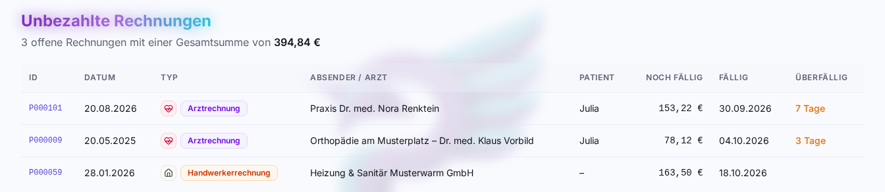
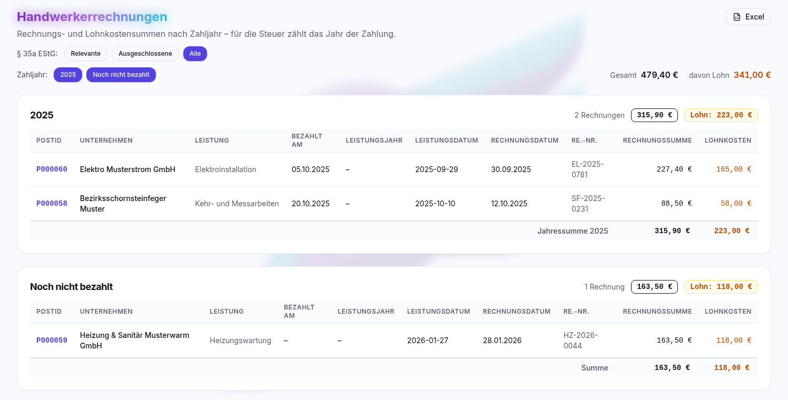
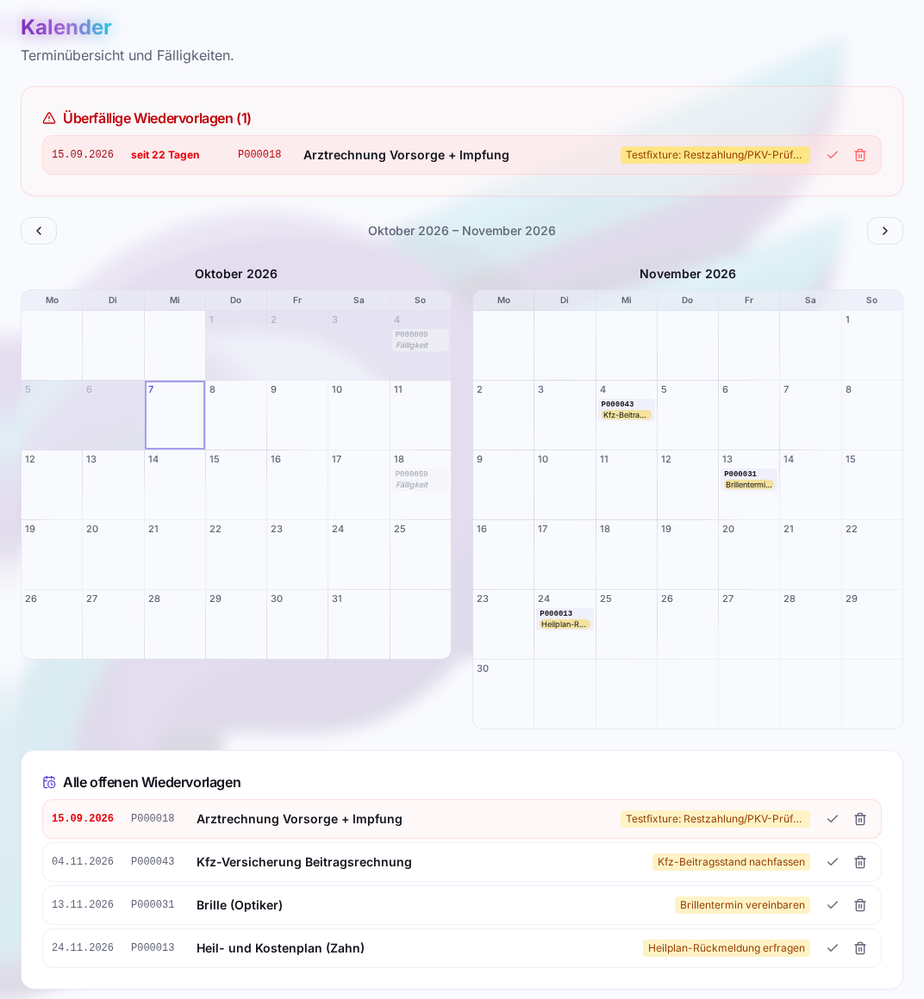

# Analyse

Fünf Auswertungsseiten liegen unter
**Analyse** in der Navigation: offene Rechnungen, Handwerker- und
Gesundheitskosten fürs Finanzamt, ein Fristenkalender und frei definierbare
Saldenkonten.

 **Unbezahlt** – alle offenen
Rechnungen quer über Arztrechnungen, Handwerkerrechnungen und generische
Rechnungen, sortiert nach Fälligkeit, mit Kennzeichnung des Überfälligen.
Bestrittene Anteile sind abgezogen; historische Dokumente bleiben draußen.

 **Handwerker** – Handwerkerrechnungen
nach **Zahljahr**, mit getrennter Summe der **Lohnkosten**. Das ist genau die
Zahl, die in der Steuererklärung für haushaltsnahe Dienstleistungen und
Handwerkerleistungen gebraucht wird; die KI liest sie aus der Rechnung mit aus.

Steuerlich zählt das Jahr, in dem die Rechnung bezahlt wurde – nicht das Jahr
der Leistung und nicht das Rechnungsdatum. Maßgeblich ist das Datum der
vollständigen Bezahlung; ist eine Rechnung erst teilweise bezahlt, das Datum
der letzten Teilzahlung. Teilzahlungen über einen Jahreswechsel hinweg werden
nicht aufgeteilt: Die Rechnung steht im Jahr ihrer letzten Zahlung. Rechnungen
ohne jede Zahlung stehen in einer eigenen Gruppe **Noch nicht bezahlt**. Über
die Jahresknöpfe lassen sich die Jahre wählen, standardmäßig die letzten zwei
Zahljahre. Die Tabelle zeigt je Rechnung das Zahldatum unter **Bezahlt am** und
daneben weiter das Leistungsjahr. Der Browser merkt sich die gewählten Filter je
Benutzer. Die Jahre merkt er relativ zum laufenden Jahr: Waren dieses und das
letzte Jahr gewählt, sind es nach dem Jahreswechsel automatisch wieder dieses und
das letzte Jahr.

Anders als die Liste „Unbezahlt" zählt diese Auswertung **archivierte Rechnungen
mit**. Archivieren heißt weggeräumt, nicht ungültig – ein bezahlter und
abgeschlossener Handwerkervorgang ist der Normalfall für das Archiv, und sein
Lohnanteil bleibt im Jahr der Zahlung trotzdem absetzbar. Damit die Summen
nachvollziehbar bleiben, sind archivierte Rechnungen deutlich gekennzeichnet:
Die Zeile trägt ein Kästchen **Archiviert**, in der Kopfzeile des Jahres steht,
wie viele es sind und welcher Lohnanteil auf sie entfällt, und über der Seite
steht dieselbe Angabe für die gewählten Jahre zusammengefasst. Soll eine
Rechnung wirklich nicht mehr mitzählen, gehört nicht sie archiviert, sondern sie
wird [invalidiert](dokumentansicht.md#rechnung-invalidieren) – dann ist sie keine
Rechnung mehr. Eine Rechnung, die durch eine
[Korrekturrechnung ersetzt](dokumentansicht.md#sonderfall-korrekturrechnung)
wurde, bleibt in der Liste sichtbar, trägt das Kennzeichen **Ersetzt** und zählt
in keiner Summe mit – gezählt wird nur die Korrekturrechnung.

Nicht jede Handwerkerrechnung ist nach § 35a EStG begünstigt, etwa bei einem
Neubau oder einer vermieteten Wohnung. Solche Rechnungen schließt man in der
[Dokumentansicht](dokumentansicht.md#untertyp-handwerkerrechnung) mit dem
Kästchen **Für § 35a EStG nicht relevant** aus; die KI setzt dieses Kästchen
nie. Der Filter **§ 35a EStG** oben auf der Seite steht standardmäßig auf
**Relevante** und blendet ausgeschlossene Rechnungen samt ihren Beträgen aus.
**Ausgeschlossene** zeigt nur diese, **Alle** beide zusammen; ausgeschlossene
Rechnungen tragen dann das Kennzeichen **§ 35a ausgeschlossen**.

 **Gesundheitskosten** –
alle Arzt-, Labor- und Hilfsmittelrechnungen sowie Rezepte, die **nicht
vollständig erstattet** wurden, gruppiert nach **Zahljahr** und darin nach
**behandelter Person**. Je Rechnung stehen PostID, Zahldatum, Gegenstelle,
Betreff, **Rechnungssumme**, **Erstattet** (Summe aller zugeordneten Positionen
aus Erstattungsbescheiden von PKV und Beihilfe) und der verbleibende
**Eigenbehalt**. Die Summen je Person und Jahr sind die Grundlage für die
Krankheitskosten als außergewöhnliche Belastung in der Steuererklärung.

Das Zahljahr wird wie bei den Handwerkerrechnungen bestimmt. Auch hier merkt sich
der Browser die Filter je Benutzer, die Jahre relativ zum laufenden Jahr. Alle Filter
liegen hinter dem Knopf 
**Filter**; daneben stehen in derselben Zeile die gerade aktiven Filter und der
Excel-Knopf. Ein Klick auf einen aktiven Filter öffnet die Auswahl, das ✕ an
einem Filter setzt ihn zurück. Im Einzelnen:

- **Anzeigen** wählt, wessen Rechnungen erscheinen: **Alle Personen**
  (Voreinstellung), **Alle Tiere** oder **Alle Tiere und Personen**.
- **Zahljahr** und **Person** (bzw. **Tier**) grenzen weiter ein;
  standardmäßig sind die letzten zwei Zahljahre gewählt.
- **Nur endabgerechnete** ist standardmäßig eingeschaltet und blendet
  Rechnungen aus, deren Abrechnungsperiode noch sammelt oder eingereicht ist.
  Maßgeblich ist allein die Periode, die der Rechnung zugeordnet ist.
  Rechnungen ohne Periode gelten als endabgerechnet. Zur Prüfung lässt sich
  der Filter ausschalten.
- **Auch vollerstattete** ist standardmäßig ausgeschaltet. Eingeschaltet
  erscheinen zusätzlich die Rechnungen, die vollständig erstattet wurden; sie
  tragen das Kennzeichen **Voll erstattet**; in der Spalte Eigenbehalt steht
  statt eines Betrags ein grauer Strich.

Rechnungen ohne
eingetragene behandelte Person stehen unter **Ohne Person**, Rechnungen im
Lebensbereich _Tier_ ohne zugeordnetes Tier unter **Tier ohne Zuordnung**.
Tiere sind in der Überschrift mit einem
 Pfotensymbol markiert.

Im Einzelnen gilt:

- **Eigenbehalt** ist die Rechnungssumme abzüglich der Erstattungen. Ist ein
  Teil der Rechnung bestritten, steht als Rechnungssumme nur der unbestrittene
  Teil, markiert mit dem
   Bestreiten-Symbol; der
  bestrittene Betrag und die ursprüngliche Summe stehen im Tooltip.
  Vollständig bestrittene Rechnungen erscheinen nicht.
- Rechnungen, die vollständig erstattet sind, erscheinen nur mit dem Filter
  **Auch vollerstattete**. Eine Erstattung über der Rechnungssumme ergibt
  keinen negativen Eigenbehalt, sondern 0 €.
- Ist **Nur endabgerechnete** ausgeschaltet, tragen Rechnungen in einer
  laufenden [Abrechnungsperiode](abrechnung-pkv-beihilfe.md) das Kennzeichen
  **PKV ausstehend** bzw. **Beihilfe ausstehend**. Ihr Eigenbehalt ist
  vorläufig: Er sinkt, sobald der Erstattungsbescheid zugeordnet ist.
- Rechnungen, die nie über postbuch.net eingereicht wurden, haben keine
  zugeordnete Erstattung und zählen mit ihrem vollen Betrag.
- Archivierte Rechnungen zählen mit und sind als **Archiviert**
  gekennzeichnet. Durch eine Korrekturrechnung ersetzte Rechnungen bleiben
  außen vor.

### Excel-Export

Beide Seiten – Handwerker und Gesundheitskosten – haben einen
Knopf  **Excel**. Er lädt genau die
gerade gewählte Auswahl (Jahre, bei Handwerker der § 35a-Filter, bei Gesundheitskosten auch Personen/Tiere,
Anzeige-Auswahl, „Nur endabgerechnete“ und „Auch vollerstattete“) als Excel-Datei herunter. Die Datei enthält zwei
Tabellenblätter: alle Rechnungen einzeln mit Zahljahr und Hinweisen (etwa
archiviert, ersetzt, für § 35a ausgeschlossen, Erstattung ausstehend, vollständig erstattet) sowie ein Blatt **Summen** je Jahr
bzw. je Jahr und Person. Bei Gesundheitskosten unterscheidet die Spalte
**Art** zwischen Mensch und Tier.

Auch die Liste der Kürzungen lässt sich als Excel-Datei herunterladen, siehe
[Kürzungen ansehen](abrechnung-pkv-beihilfe.md#kürzungen-ansehen).

 **Kalender** – alle Wiedervorlagen
und Fälligkeiten in einer Zeitachse (siehe
[Akten, Verbleib und Wiedervorlagen](akten-und-organisation.md)).

 **Salden** – frei definierbare Konten, um
Beträge im Blick zu behalten, die keinem einzelnen Dokument gehören
(Selbstbehalte, ein Darlehen an die Tochter, ein Kautionskonto). Ein Saldo hat
manuelle Buchungen und optional **SQL-Quellen**: gespeicherte Abfragen, die – an
ein einzelnes Dokument oder an eine ganze Dokumentklasse gebunden – automatisch
Buchungen liefern. Sie laufen strikt lesend (`SELECT`/`WITH`, ein Statement, 5
Sekunden Zeitlimit, Read-only-Transaktion) und dürfen nur vom Admin angelegt
werden. Salden lassen sich in der Navigation ausblenden, wenn du sie nicht
brauchst.

> [!WARNING]
>
> SQL-Quellen sind ein Entwicklerfeature und in der App auch so gekennzeichnet.
> Sie sind ab Werk abgeschaltet, müssen in den Einstellungen unter Allgemein
> bewusst freigeschaltet werden und setzen Datenbank- und SQL-Kenntnisse voraus.
> Ein fehlerhaftes Statement führt zu falschen Salden.

---

Weiter: [Export und Import](export-import.md) ·
[Zurück zur Übersicht](README.md)
