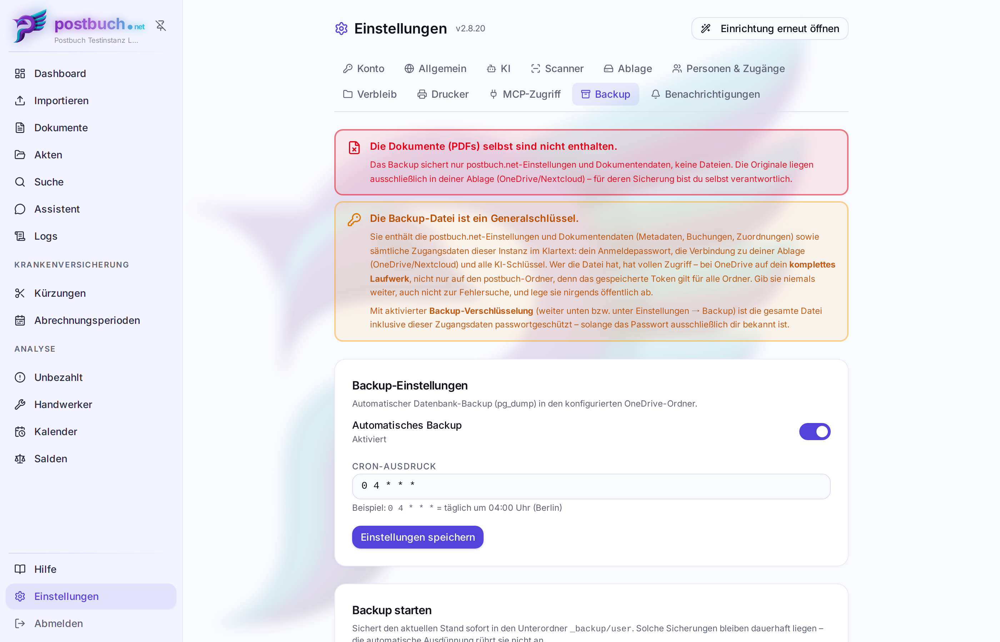
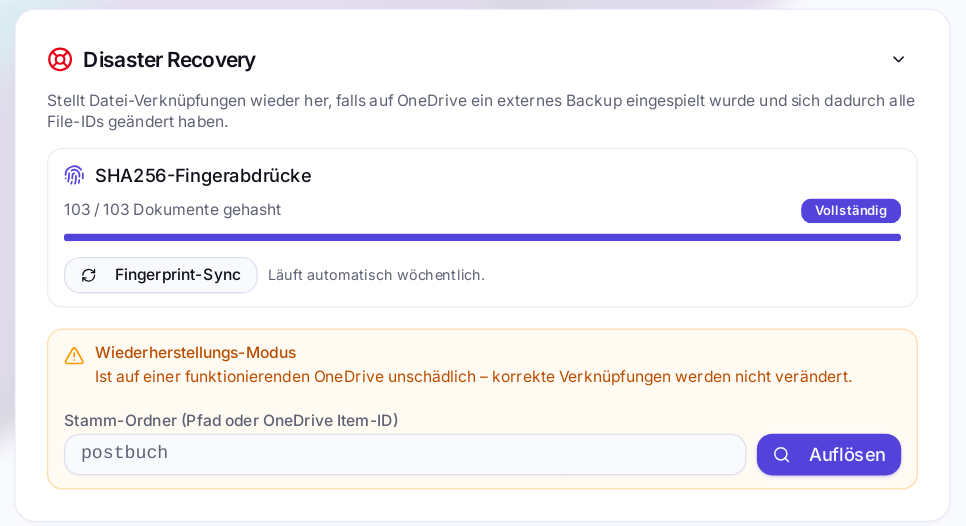

# Backup und Wiederherstellung

Ein vollständiges Backup von postbuch.net besteht aus **zwei** Teilen, und nur
einen davon erledigt die Anwendung selbst:

| Teil                                                                          | Wer kümmert sich          | Wo liegt es                                                          |
| ----------------------------------------------------------------------------- | ------------------------- | -------------------------------------------------------------------- |
| **Datenbank** – Metadaten, Klassifikation, Akten, Abrechnungen, Einstellungen | postbuch.net, automatisch | Ordner `<postbuch.net-Wurzelverzeichnis>/_backup` der aktiven Dateiablage |
| **Dokumente** – die PDFs selbst                                               | **du**                    | dort, wo du deine Dateiablage sicherst                                    |

Diese Trennung ist der wichtigste Punkt des ganzen Kapitels. Wer nur den
automatischen Datenbank-Dump hat, hat kein Backup seiner Dokumente – er hat eine
sehr genaue Beschreibung von Dateien, die möglicherweise nicht mehr existieren.



---

## Was im Dump steht

**Enthalten:** sämtliche Dokumentdaten (Titel, Beträge, Daten, Klassifikation,
Zuordnung zu Personen, Akten, Verbleib, Fristen, Abrechnungsperioden,
Einreichungen, Erstattungen), alle Personen und Zugänge samt Passwort-Hashes,
der komplette Inhalt von `_settings` – und damit **alle Zugangsdaten dieser
Instanz**: die Verbindung zur Dateiablage (OAuth-Token bzw. WebDAV-
App-Passwort) und jeder hinterlegte KI-Schlüssel. Mit der standardmäßig
aktiven [Backup-Verschlüsselung](#backup-verschlüsselung) ist die gesamte Datei
passwortgeschützt; wer die Verschlüsselung abschaltet, erhält all das im
Klartext.

**Nicht enthalten:** die PDF-Originale. Die Tabelle `post_files` ist nur ein
Abrufcache und wird per `--exclude-table-data` bewusst ohne Inhalt gesichert.
Dasselbe gilt für den semantischen Hilfekorpus: Seine Abschnitte und Embeddings
stammen vollständig aus der mitgelieferten Dokumentation und werden deshalb
nicht in jede Sicherung kopiert. Ebenfalls ohne Inhalt gesichert werden die
Web-Sitzungen: Ein Restore bringt keine alten Anmeldungen zurück. Nicht
enthalten ist außerdem die Datei `.env` des Servers.

Daraus folgt die zweite Warnung, die postbuch.net über jeder Backup-Ansicht
zeigt: **Die Backup-Datei ist ein Generalschlüssel.** Wer sie samt Passwort –
oder bei abgeschalteter Verschlüsselung auch ohne – hat, hat Zugriff auf deine
Cloud. Sie gehört nicht in einen Support-Chat, nicht in ein
Ticketsystem und nicht in einen öffentlich erreichbaren Ordner.

> [!CAUTION]
>
> Bei OneDrive reicht dieser Zugriff über den postbuch-Ordner hinaus: Das
> gespeicherte Token trägt die Berechtigung `Files.ReadWrite.All` und öffnet
> damit **das komplette Laufwerk** des verbundenen Microsoft-Kontos, auch alle
> Ordner, die mit postbuch.net nichts zu tun haben. Wer die Backup-Datei
> weitergibt, gibt sein ganzes OneDrive weiter. Dasselbe gilt sinngemäß für ein
> WebDAV-App-Passwort. Hintergrund:
> [Sicherheit](sicherheit.md#der-zugriff-auf-die-dateiablage-ist-ein-vollzugriff).

---

## Teil 1 – Die Datenbank sichern

### Einrichten

 **Einstellungen → Backup** (nur für
Administratoren). Zwei Angaben:

-  **Automatisches Backup** – Schalter. Aus
  schaltet man ihn nur mit ausdrücklicher Bestätigung: postbuch.net verlangt die
  Eingabe des Wortes `NOBACKUP`.
- **Cron-Ausdruck** – Standard `0 4 * * *`, also täglich um 04:00 Uhr. Zeitzone
  ist fest `Europe/Berlin`. Der Ausdruck wird vor dem Speichern validiert.

Voraussetzung ist ein eingerichteter Backup-Ordner. Er entsteht als
`<postbuch.net-Wurzelverzeichnis>/_backup` unterhalb des Wurzelordners, sobald
dessen [Ordnerstruktur angelegt ist](storage-backends.md#die-ordnerstruktur).
Fehlt er, zeigt die Backup-Karte einen Hinweis und der Job bricht mit einer
Warnung im Protokoll ab.

Mit  **Jetzt sichern** läuft ein einzelner
Durchgang sofort los – sinnvoll vor jedem Update und vor jedem größeren
Eingriff. Die Karte zeigt dabei an, dass die Sicherung läuft, und nennt am Ende
den Dateinamen.

Selbst ausgelöste Sicherungen – der Knopf 
**Jetzt sichern** und die Zwangssicherung vor einem Restore – landen im
Unterordner `<postbuch.net-Wurzelverzeichnis>/_backup/user`. Sie sind damit von
der automatischen Ausdünnung ausgenommen: postbuch.net löscht sie nie. Wer dort
aufräumen will, tut das selbst in der Dateiablage.

### Was ein Lauf erzeugt

Pro Durchgang entstehen **zwei** Dateien – bei den automatischen Läufen direkt
in `<postbuch.net-Wurzelverzeichnis>/_backup`, bei den selbst ausgelösten in
`<postbuch.net-Wurzelverzeichnis>/_backup/user`:

| Datei                                         | Format                                            | Zweck                                       |
| --------------------------------------------- | ------------------------------------------------- | ------------------------------------------- |
| `postbuch_<zeitstempel>_v<version>.pgdump.gz` | `pg_dump -F c`, gzip                              | Wiederherstellung über die Weboberfläche    |
| `postbuch_<zeitstempel>_v<version>.sql.gz`    | `pg_dump -F p --create --clean --if-exists`, gzip | Rückfallebene für die Handarbeit mit `psql` |

Die App-Version steht im Dateinamen, damit sie auch an einer einzeln kopierten
Datei ablesbar bleibt. Zusätzlich schreibt postbuch.net **vor** dem Dump eine
Herkunftszeile in die Datenbank: App-Version, SHA-256 des Schemas und
PostgreSQL-Version. Dadurch reist diese Auskunft im Dump mit und steht auch dann
zur Verfügung, wenn die Datei umbenannt wurde.

### Aufbewahrung

Nach jedem erfolgreichen Lauf greift eine gestaffelte Retention-Regel:

- **0–6 Tage:** alle erfolgreichen Backup-Stände,
- **7–30 Tage:** der neueste Stand jeder ISO-Kalenderwoche,
- **31–365 Tage:** der neueste Stand jedes Kalendermonats,
- **älter als 365 Tage:** der neueste Stand jedes Kalenderhalbjahrs – ohne
  zeitliches Enddatum.

Die Regel betrifft ausschließlich die automatischen Läufe direkt in
`<postbuch.net-Wurzelverzeichnis>/_backup`. Der Unterordner
`<postbuch.net-Wurzelverzeichnis>/_backup/user` mit den selbst ausgelösten
Sicherungen wird dabei nicht betreten – dort wird nichts gelöscht, egal wie alt
es ist. Mehrere automatische Läufe am selben Tag bleiben in den ersten sieben
Kalendertagen vollständig erhalten. Entschieden wird anhand der
`.pgdump.gz`-Dateien; der zugehörige SQL-Dump wird immer synchron mitgelöscht.

Praktisch heißt das: Auch ein Fehler, der erst nach mehreren Jahren auffällt,
kann noch über einen Halbjahresstand erreichbar sein. Je älter der benötigte
Stand ist, desto gröber ist allerdings das verfügbare Zeitraster.

### Backup-Verschlüsselung

Datenbank-Backups werden standardmäßig verschlüsselt: Jede Sicherung wird mit
einem Passwort (AES-256-GCM) verschlüsselt, bevor sie in die Dateiablage
geschrieben wird. Das Passwort legst du im Einrichtungsassistenten im Tab
„Backup" fest; der Assistent gilt erst als abgeschlossen, wenn dort entweder ein
Passwort gesetzt oder – nach ausdrücklicher Warnung – bewusst auf
Verschlüsselung verzichtet wurde. Später verwaltest du sie unter
 **Einstellungen → Backup →
Backup-Verschlüsselung**. Wird sie dort erst nachträglich eingeschaltet, werden
bereits vorhandene Backup-Dateien **nicht** nachträglich verschlüsselt.

#### Wie das technisch funktioniert

- Jede Instanz erzeugt beim ersten Aktivieren genau einen **Daten-Schlüssel
  (DEK)**, mit dem alle verschlüsselten Backups tatsächlich verschlüsselt
  werden. Das eingegebene Passwort verschlüsselt nicht die Datei selbst,
  sondern nur diesen DEK („Envelope Encryption“). Der DEK bleibt danach für
  immer derselbe – bei jedem Passwortwechsel und auch, wenn die
  Verschlüsselung ab- und wieder eingeschaltet wird.
- Die Instanz führt einen **Schlüsselbund**: den aktuellen DEK und jeden
  weiteren, der ihr je begegnet ist, etwa aus einem eingespielten Backup einer
  anderen Instanz. Ein Backup, dessen DEK im Schlüsselbund steht, öffnet
  postbuch.net beim Wiederherstellen ohne jede Passworteingabe.
- Der verpackte DEK steckt zusätzlich an zwei Stellen in der Dateiablage:
  - **im Kopf jeder einzelnen Backup-Datei**, verpackt mit dem Passwort, das
    beim Erstellen dieser Datei gültig war. Dieser Kopf wird nie nachträglich
    verändert.
  - **in der Schlüsseldatei `schluessel.json`** im Backup-Ordner
    `<postbuch.net-Wurzelverzeichnis>/_backup`. Sie enthält den gesamten
    Schlüsselbund, verpackt mit dem jeweils _aktuellen_ Passwort. Wer die
    Schlüsseldatei und das aktuelle Passwort hat, öffnet damit jedes Backup
    der Instanz – auch ohne laufende Instanz. Es gibt bewusst keine eigene
    Schlüsseldatei pro Backup, nur diese eine gemeinsame.
- Die Schlüsseldatei wird bei jeder Passwortänderung neu geschrieben und vor
  jedem Backup sowie bei jedem App-Start abgeglichen. So steht sie auch nach
  einer Wiederherstellung oder einem Wechsel der Dateiablage im Backup-Ordner
  des aktiven Speichers. Einträge, die sich mit dem aktuellen Passwort nicht
  öffnen lassen, verwirft postbuch.net dabei nie; sie bleiben mit ihrem
  eigenen Passwort erhalten.
- Am Dateianfang steht bei einer verschlüsselten Sicherung statt der
  gzip-Kennung die Kennung `PBE1`. Unverschlüsselte Backups bleiben normale
  `.gz`-Dateien und laufen unverändert durch jeden Restore-Weg – alte Backups
  sind von einer nachträglich aktivierten Verschlüsselung nicht betroffen.

#### Passwort ändern

Ein Passwortwechsel (dieselbe Karte, „Passwort ändern“) berechnet den DEK nicht
neu – er wird nur neu verpackt, in `schluessel.json` und in den Einstellungen
dieser Instanz. Der Kopf bereits bestehender Backup-Dateien bleibt dabei
unangetastet und damit an das damalige Passwort gebunden.

Praktisch bedeutet das: Zusammen mit der Schlüsseldatei genügt immer das
**aktuelle** Passwort. Nur wer eine einzelne ältere Backup-Datei ohne
Schlüsseldatei und ohne laufende Instanz öffnen muss, braucht das Passwort, das
beim Erstellen dieser Datei gültig war. Die Karte weist beim Ändern darauf hin.

#### Welches Passwort wann genügt

| Situation | Was nötig ist |
|---|---|
| Wiederherstellen in der laufenden Instanz, die das Backup erstellt hat | nichts – der Schlüsselbund öffnet es |
| Wiederherstellen in einer anderen oder frisch installierten Instanz, deren Dateiablage den Backup-Ordner mit `schluessel.json` enthält | das aktuelle Passwort |
| Neuaufsetzen über `/setup/restore` | das aktuelle Passwort **und** die Schlüsseldatei – oder das beim Erstellen gültige Passwort allein |
| Kommandozeile ohne jede Instanz | wie beim Neuaufsetzen |

> [!WARNING]
>
> Es gibt **keinen Zurücksetzen-Mechanismus**. Wer ein Passwort verliert und
> weder eine laufende Instanz mit passendem Schlüsselbund noch die
> Schlüsseldatei mit dem passenden aktuellen Passwort zur Hand hat, kann die
> betroffenen verschlüsselten Backups nicht mehr öffnen. Notiere dir jedes
> gesetzte Passwort sofort in einem Passwortmanager und sichere
> `schluessel.json` zusammen mit den Backups. Solange die Instanz noch läuft,
> lässt sich das aktuell gültige Passwort über
>  **Einstellungen → Backup → Passwort
> anzeigen** erneut einsehen – zur Bestätigung ist dabei das Admin-Passwort
> erneut einzugeben. Ein bereits gewechseltes, altes Passwort zeigt
> postbuch.net dabei nicht mehr an.

#### Ohne Verschlüsselung

Verschlüsselung lässt sich sowohl im Einrichtungsassistenten als auch später in
den Einstellungen ausdrücklich ablehnen bzw. wieder abschalten – jeweils erst
nach einer Bestätigung, dass Backups dann unverschlüsselt in der Dateiablage liegen.
Das ist jederzeit nachholbar, ändert aber nichts an bereits geschriebenen
Dateien. Beim Abschalten bleiben Schlüsselbund, Passwort und Schlüsseldatei
erhalten: Bereits verschlüsselte Backups lassen sich weiter wiederherstellen,
und beim Wiedereinschalten verwendet postbuch.net denselben DEK weiter.

---

## Wiederherstellen

> **Ein Restore ist nicht umkehrbar.** Alles, was nach dem Zeitpunkt des Backups
> entstanden ist, ist danach weg.

Deshalb steht vor jeder Wiederherstellung über die Oberfläche eine
**Zwangssicherung**: Der Bestätigungsdialog verlangt zuerst einen Klick auf
 **Sicherung starten**, sichert damit den
_aktuellen_ Stand nach `<postbuch.net-Wurzelverzeichnis>/_backup/user` und gibt
das Wiederherstellen erst frei, wenn dieser Lauf durch ist. Solange er läuft,
bleibt der Knopf gesperrt – das Abwarten gehört dazu.

Schlägt die Sicherung fehl, nennt der Dialog den Fehler und bietet zwei Wege:
den Lauf erneut versuchen oder – nach ausdrücklicher Warnung – mit
 **Ohne Sicherung
wiederherstellen** trotzdem fortfahren. Dann gibt es keinen Rückweg: Der
aktuelle Datenbestand wird überschrieben und ist verloren. Dieser Fall wird im
Protokoll festgehalten.

### Aus der Liste

Die Karte  **Verfügbare Backups** zeigt alle
`.pgdump.gz`-Dateien aus dem Backup-Ordner, gruppiert nach _Diese Woche_ /
_Diesen Monat_ / _Dieses Jahr_ / _Älter_. Jede Zeile nennt Dateiname,
App-Version, die ersten Stellen des Schema-Fingerabdrucks, Zeitpunkt und Größe.
Die Liste umfasst beide Ordner: Selbst ausgelöste Sicherungen aus
`<postbuch.net-Wurzelverzeichnis>/_backup/user` stehen zwischen den
automatischen und tragen die Markierung **Von Hand**.

Verschlüsselte Backups tragen zusätzlich die Markierung **Verschlüsselt**,
soweit die Datenbank ihren Backup-Eintrag kennt. Beim Wiederherstellen öffnet
postbuch.net ein verschlüsseltes Backup zuerst mit dem Schlüsselbund der
Instanz – im Normalfall ist dafür gar keine Eingabe nötig. Kennt die Instanz
den Schlüssel nicht, blendet der Dialog ein Feld **Backup-Passwort** ein, und
derselbe Knopf versucht es erneut – die bereits gelaufene Zwangssicherung gilt
dabei weiter. Angenommen wird das beim Erstellen der Datei gültige Passwort
oder das aktuelle Passwort zur Schlüsseldatei im Backup-Ordner. Ein falsches
Passwort meldet der Dialog sofort zurück; nach zehn Fehlversuchen innerhalb von
fünf Minuten sperrt postbuch.net weitere Versuche kurzzeitig.

Stammt ein Backup aus einer **neueren** App-Version als der installierten, warnt
der Bestätigungsdialog. In dem Fall zuerst postbuch.net aktualisieren, dann
einspielen – ein älteres Schema kann die neueren Daten nicht bedienen.

Der eigentliche Restore läuft in **einer einzigen Transaktion**: das Schema
`postbuch` wird verworfen, der Dump eingespielt, alles zusammen bestätigt.
Die Backup-Verschlüsselung dreht ein Restore dabei nicht zurück: Schalter,
Passwort und DEK der laufenden Instanz bleiben stehen, weil sie zur
Schlüsseldatei in der Dateiablage passen. Die Schlüssel aus dem eingespielten
Stand kommen zusätzlich in den Schlüsselbund.
Bricht irgendein Schritt ab, rollt PostgreSQL komplett zurück und die Datenbank
steht unverändert da. Danach beendet sich der App-Container absichtlich und wird
von Docker neu gestartet, damit Verbindungen, Sitzungen und Zwischenspeicher
sauber sind. Alle Web-Sitzungen, auch die eigene, sind danach beendet. Die
Oberfläche wartet währenddessen auf die App und leitet anschließend zur
Anmeldung. Meldet sich die App nach zwei Minuten noch nicht zurück, zeigt der
Dialog **Erneut prüfen** und **Zur Anmeldung** und lässt sich schließen.

Beim Neustart erkennt postbuch.net den absichtlich leeren Hilfekorpus und baut
ihn mit dem wiederhergestellten Embedding-Provider automatisch neu auf. Bis der
Lauf abgeschlossen ist, bleibt die lokale Textsuche der Hilfe verfügbar. Weil
kein alter Hilfekorpus im Backup steckt, werden dabei alle Hilfeabschnitte neu
eingebettet; je nach Provider können dafür geringe Nutzungskosten entstehen.

### Aus einer lokalen Datei

Die Karte  **Lokales Backup einspielen** nimmt
eine `.pgdump.gz` vom eigenen Rechner entgegen – für den Fall, dass die Dateiablage
gerade nicht erreichbar ist oder das Backup von einer anderen Instanz stammt.
Die Datei wird auf ihre gzip-Kennung **oder** ihre Verschlüsselungskennung
geprüft, das Größenlimit liegt bei 500 MB; ab da ist der Ablauf identisch – samt
vorgeschalteter Zwangssicherung und, falls der Schlüsselbund die Datei nicht
öffnet, der Passwortabfrage. Das gilt auch für eine frisch installierte
Instanz: Ist die Dateiablage mit dem alten Backup-Ordner verbunden, genügt das
aktuelle Passwort, weil postbuch.net die Schlüsseldatei dort selbst findet.

### Beim Neuaufsetzen

Wird eine Instanz frisch installiert oder neu aufgesetzt, fragt `install.sh`
ausdrücklich **„Backup einspielen? [j/n]"**. Bei _j_ legt der Installer das
Admin-Passwort neu fest und blendet nach dem Start eine Adresse ein:

```
http://<server>:3420/setup/restore
```

Diese Seite existiert nur, solange die Wiederherstellung aussteht; danach
verschwindet sie. Sie ist mit dem Admin-Passwort aus der `.env` geschützt und
begrenzt Fehlversuche. Nach erfolgreichem Einspielen werden alle im Dump
enthaltenen Sitzungen verworfen und das Sitzungsgeheimnis der neuen Instanz
gesetzt – angemeldet wird sich also mit dem Passwort, das beim Installieren
vergeben wurde, nicht mit dem der alten Instanz.

Ist das eingespielte Backup verschlüsselt, blendet die Seite zusätzlich ein Feld
**Backup-Passwort** und die Auswahl **Schlüsseldatei (optional)** ein und
begrenzt die Fehlversuche beim Backup-Passwort eigenständig, unabhängig vom
Admin-Passwort. Die Seite läuft, bevor die Dateiablage verbunden ist; die
Schlüsseldatei wird deshalb von Hand mitgegeben. Zwei Wege führen zum Ziel:

- **Aktuelles Passwort und Schlüsseldatei:** `schluessel.json` aus dem
  Backup-Ordner `<postbuch.net-Wurzelverzeichnis>/_backup` herunterladen, auf
  der Seite auswählen und das zuletzt gesetzte Backup-Passwort eingeben. Das
  funktioniert für jedes Backup der alten Instanz, egal wie oft das Passwort
  seither gewechselt wurde.
- **Passwort zum Erstellungszeitpunkt:** das Passwort, das beim Erstellen genau
  dieser Datei gültig war – ohne Schlüsseldatei.

Die Schlüsseldatei darf höchstens 6 KB groß sein; eine echte `schluessel.json`
bleibt weit darunter. Nach dem Einspielen übernimmt die neue Instanz den
Schlüsselbund aus dem Backup und alle Schlüssel der mitgegebenen
Schlüsseldatei.

Hier gibt es keine Zwangssicherung – die Instanz ist frisch, es existiert noch
kein Stand, den man sichern könnte. Nach dem Einspielen wartet die Seite auf
den Neustart und leitet zur Anmeldung. Dauert der Neustart länger als zwei
Minuten, bietet sie **Erneut prüfen** und **Zur Anmeldung** an.

Soll doch kein Backup eingespielt werden, führt **Ohne Backup neu einrichten**
unten auf der Seite zurück in den normalen Ablauf. Auch dafür ist das
Admin-Passwort nötig. Der Knopf funktioniert nur, solange die Datenbank noch
keine Dokumente enthält. Danach verschwindet `/setup/restore`, und nach der
ersten Admin-Anmeldung startet der
[Einrichtungsassistent](installation.md#der-einrichtungsassistent).

Das ist der saubere Weg für einen Serverwechsel: neue Maschine, Installer,
Backup einspielen, Dateiablage verbinden.

### Von Hand

Der SQL-Dump ist der Ausweg, wenn die Weboberfläche nicht mehr startet:

```bash
gunzip -c postbuch_<zeitstempel>_v<version>.sql.gz | psql -h <host> -U <user> postgres
```

Er enthält `CREATE DATABASE` und die passenden `DROP`-Anweisungen und wird
deshalb gegen die Datenbank `postgres` eingespielt, nicht gegen `postbuch`.

> [!IMPORTANT]
>
> Bei aktiver Backup-Verschlüsselung ist auch dieser SQL-Dump verschlüsselt –
> `gunzip` schlägt dann auf der rohen Datei fehl. Vorher entschlüsseln, wie im
> nächsten Abschnitt beschrieben.

#### Verschlüsselte Datei auf der Kommandozeile entschlüsseln

Das App-Image enthält ein Werkzeug, das eine verschlüsselte `.sql.gz` oder
`.pgdump.gz` in die normale gzip-Datei zurückverwandelt. Es liest die Datei von
der Standardeingabe und schreibt das Ergebnis auf die Standardausgabe. Passwort
und Schlüsseldatei übergibt es nur über Umgebungsvariablen, damit sie weder in
der Prozessliste noch in der Shell-Historie landen.

Im Installationsverzeichnis, bei laufendem Stack:

```bash
read -rs BACKUP_PASSWORT && export BACKUP_PASSWORT
docker compose exec -T -e BACKUP_PASSWORT app \
  node src/cli/backup-entschluesseln.js \
  < postbuch_<zeitstempel>_v<version>.sql.gz > klartext.sql.gz
```

Mit dem aktuellen Passwort zusätzlich die Schlüsseldatei mitgeben:

```bash
export BACKUP_SCHLUESSELDATEI="$(cat schluessel.json)"
docker compose exec -T -e BACKUP_PASSWORT -e BACKUP_SCHLUESSELDATEI app \
  node src/cli/backup-entschluesseln.js < backup.sql.gz > klartext.sql.gz
```

Startet der App-Container nicht mehr, läuft das Werkzeug auch in einem
Einmal-Container desselben Images:
`docker compose run --rm --no-deps -T --entrypoint node -e BACKUP_PASSWORT app src/cli/backup-entschluesseln.js < backup.sql.gz > klartext.sql.gz`.

Rückgabewert `0` heißt entschlüsselt (oder war gar nicht verschlüsselt), `2`
heißt, das Passwort passt nicht. Danach `unset BACKUP_PASSWORT
BACKUP_SCHLUESSELDATEI`. Die Klartextdatei ist wieder ein Generalschlüssel und
gehört nach dem Einspielen gelöscht.

---

## Teil 2 – Die Dokumente sichern

Die Originale liegen ausschließlich in deiner Dateiablage. Für ihre Sicherung ist
postbuch.net nicht zuständig – und kann es auch nicht sein: es hat dort keinen
zweiten Speicherort, den es beschreiben dürfte.

### Warum die Cloud allein kein Backup ist

Ein Cloud-Speicher schützt gegen einen Festplattendefekt, aber nicht gegen die
Fälle, die tatsächlich eintreten: eine versehentliche Löschung, ein
Verschlüsselungstrojaner auf dem synchronisierenden PC, ein gesperrtes Konto.
Synchronisation ist keine Kopie, sondern eine Replikation – auch von Schäden.
Auch der
[postbuch.net-Papierkorb `<postbuch.net-Wurzelverzeichnis>/_trash`](storage-backends.md#der-postbuchnet-papierkorb)
ist kein Backup. Er wird zwar weder von postbuch.net noch von OneDrive oder
Nextcloud automatisch geleert, liegt aber in derselben synchronisierten Dateiablage
und schützt deshalb nicht vor Kontoverlust, Verschlüsselung oder einem
versehentlichen Löschen des gesamten Wurzelordners.

### Der empfohlene Weg

Eine vollständige, offline verfügbare Kopie auf einem Desktop-PC, die vom
normalen PC-Backup miterfasst wird. Vier Schritte:

**1. Cloud-Client auf einem Desktop-PC einrichten.** Für OneDrive der
mitgelieferte Client von Windows bzw. macOS, für einen WebDAV-Speicher der
Nextcloud- oder ownCloud-Desktop-Client. Angemeldet wird sich mit dem Konto, in
dem der postbuch.net-Wurzelordner liegt. Es genügt, genau diesen Wurzelordner zu
synchronisieren.

**2. Den Ordner dauerhaft offline verfügbar machen.** Beide Client-Familien
laden standardmäßig nur Platzhalter herunter – die Datei erscheint im Explorer,
liegt aber nicht auf der Platte. Ein Backup solcher Platzhalter sichert nichts.

| Client                     | Einstellung                                                                                                 |
| -------------------------- | ----------------------------------------------------------------------------------------------------------- |
| OneDrive (Windows/macOS)   | Rechtsklick auf den Wurzelordner → **Immer auf diesem Gerät behalten**                                      |
| Nextcloud/ownCloud Desktop | **Virtuelle Dateien** für diesen Ordner deaktivieren bzw. den Ordner als normale Synchronisation einrichten |

Danach prüfen: Die Ordnergröße im Dateimanager muss ungefähr dem Belegungsstand
in der Cloud entsprechen. Stimmt sie nicht, sind noch Platzhalter im Spiel.

**3. Diesen Ordner in das PC-Backup aufnehmen.** Welches Werkzeug –
Dateiversionsverlauf, Time Machine, Duplicati, Veeam Agent, Restic – ist
zweitrangig; entscheidend sind drei Eigenschaften: das Ziel ist **nicht**
derselbe Cloud-Speicher, es gibt **Versionsstände** (nicht nur eine gespiegelte
Kopie), und das Backup läuft **automatisch**. Die Aufbewahrung sollte mindestens
so weit reichen wie die der Datenbank-Backups – sonst gibt es Datenbankstände,
zu denen die passenden Dateien fehlen.

**4. Einmal einen Rückweg proben.** Eine einzelne PDF aus dem Backup zurückholen
und öffnen. Ein Backup, aus dem noch nie etwas zurückgeholt wurde, ist eine
Vermutung.

### Zwei Nebenwirkungen

Der Ordner `<postbuch.net-Wurzelverzeichnis>/_backup` liegt innerhalb des
Wurzelordners. Die Datenbank-Dumps werden also automatisch mitgesichert –
praktisch, aber es bedeutet auch: **die lokale Kopie enthält den
Generalschlüssel** – verschlüsselt, solange die Backup-Verschlüsselung aktiv ist. Das Ziel des PC-Backups gehört verschlüsselt, und der
externe Datenträger gehört nicht offen herumliegend angeschlossen.

Der zweite Punkt ist die Serverdatei **`.env`**. Sie steht in keinem Dump und
enthält Datenbankpasswort, Sitzungsgeheimnis und Admin-Passwort. Sie muss nicht
mitgesichert werden – beim Neuaufsetzen erzeugt der Installer alle Werte neu –,
aber das Admin-Passwort gehört in einen Passwortmanager, sonst steht man beim
Wiederaufbau vor der eigenen Anmeldemaske.

---

## Der Ernstfall

Ein vollständiger Wiederaufbau in der Reihenfolge, in der er funktioniert:

1. **Server aufsetzen**, `install.sh` ausführen, bei „Backup einspielen?" _j_
   antworten und ein Admin-Passwort vergeben.
2. **Datenbank-Dump einspielen** über `/setup/restore`. War der Dump
   verschlüsselt, das zuletzt gesetzte Backup-Passwort und `schluessel.json`
   aus dem Backup-Ordner bereithalten – oder das beim Erstellen gültige
   Passwort (siehe [Beim Neuaufsetzen](#beim-neuaufsetzen)).
3. **Dateiablage verbinden** – der Dump bringt die Zugangsdaten mit, bei OneDrive
   kann je nach Alter des Backups eine neue Anmeldung nötig sein.
4. **Dokumente prüfen.** Sind die Originale in der Dateiablage unverändert vorhanden,
   ist man fertig.
5. Wurden die Dokumente aus einem Backup in die Dateiablage zurückgespielt, sind ihre
   Datei-Kennungen neu vergeben. Dann folgt der Lauf aus
   [Disaster Recovery: verlorene Datei-Verknüpfungen](#disaster-recovery-verlorene-datei-verknüpfungen).

Die Reihenfolge von Schritt 2 (Datenbank) und dem Zurückspielen der Dokumente in
die Dateiablage ist dabei egal – beides muss nur abgeschlossen sein, bevor der
DR-Lauf aus Schritt 5 startet. Er gleicht rein über den gespeicherten
SHA-256-Fingerabdruck ab, unabhängig davon, wann welcher Teil zurückkam.

> [!NOTE]
>
> Anders als die spätere Wiederherstellung über die Weboberfläche (Abschnitt
> [Aus der Liste](#aus-der-liste)) prüft `/setup/restore` **keine**
> Versionsangabe im Dateinamen. Ein zu einer neueren postbuch.net-Version
> gehörender Dump lässt sich hier also anstandslos in eine ältere, frisch
> installierte Version einspielen – `install.sh` installiert zwar praktisch
> immer die aktuelle Version, wer aber bewusst eine ältere Version für den
> Neuaufbau wählt, sollte vorher die im Dateinamen stehende Version des Backups
> mit der installierten vergleichen.

---

## Disaster Recovery: verlorene Datei-Verknüpfungen

postbuch.net merkt sich zu jedem Dokument die **Kennung** der Datei in der
Dateiablage, nicht ihren Pfad. Das ist im Normalbetrieb der stabilere Weg –
Verschieben und Umbenennen ändern nichts. Es hat aber einen Bruchpunkt: Wird die
Dateiablage selbst aus einem Backup zurückgespielt, vergibt der Anbieter neue
Kennungen. Die Dateien sind vollständig da, die Datenbank ist vollständig da,
aber keine Zeile findet mehr ihre Datei.

Genau dafür gibt es unter 
**Einstellungen → Dateiablage** die Karte
 **Disaster Recovery**.



### Fingerabdrücke – die Voraussetzung

Wiedergefunden werden kann nur, wovon ein Fingerabdruck existiert. postbuch.net
berechnet dafür laufend den SHA-256 jeder Datei und merkt sich zusätzlich
Dateinamen und Änderungszeitpunkt:

- **Wöchentlich**, sonntags um 03:00 Uhr, läuft ein Abgleich. Neu geladen und
  gehasht wird nur, was noch keinen Fingerabdruck hat oder sich seit dem letzten
  Lauf geändert hat.
- **Beim Start** stößt die App fünf Minuten nach dem Hochfahren einen Erstlauf
  an, falls Zeilen ohne Fingerabdruck existieren.
- **Fingerprint-Sync** startet den Lauf von Hand.

Der Balken in der Karte zeigt „x / y Dokumente gehasht". Steht dort **nicht**
_Vollständig_, ist der Notfallkoffer unvollständig – und der beste Zeitpunkt,
das zu bemerken, ist vor dem Notfall. Jede Zeile wird gegen ihr eigenes Backend
geprüft; ein Mischbestand aus einem laufenden Umzug ist dabei unproblematisch.

### Der Wiederherstellungslauf

Im Feld **Stamm-Ordner** steht entweder ein Pfad (etwa `postbuch`) oder eine
Element-Kennung. **Auflösen** prüft die Eingabe und zeigt den gefundenen Ordner
zur Bestätigung, erst dann startet **Recovery starten** den Lauf. Er arbeitet in
vier Phasen:

1. **Scannen** – rekursiv über alle Dateien unterhalb des Stamm-Ordners, jede
   wird heruntergeladen und gehasht. Das ist der langsame Teil und dauert je
   nach Bestand einige Minuten bis deutlich länger.
2. **Abgleich über den Fingerabdruck** – jede Datenbankzeile bekommt die Kennung
   der Datei mit passendem SHA-256.
3. **Rückfall über den Dateinamen** – für die Zeilen, die so nicht zugeordnet
   werden konnten, wird der Dateiname verglichen (Groß-/Kleinschreibung egal).
   Der Fingerabdruck wird dabei nachgetragen.
4. **Bericht** – Statistik und die Liste dessen, was offen blieb.

Der Lauf ist **auf einer intakten Dateiablage unschädlich**: korrekte Verknüpfungen
werden auf denselben Wert gesetzt, also nicht verändert. Zeilen ohne
Fingerabdruck werden nie automatisch angefasst, und bei einem Fehler bricht der
Lauf ab, statt stillschweigend weiterzulaufen. Gearbeitet wird gegen genau ein
Backend, das in der Sitzung festgehalten ist.

### Ergebnis und Handarbeit

Der Bericht zählt vier Größen: **via SHA256** und **via Dateiname**
wiederhergestellt, **unverändert** (war schon richtig) und **extra Dateien** –
Dateien in der Dateiablage, zu denen keine Datenbankzeile gehört.

Bleiben ungematchte Einträge übrig, listet die Karte sie einzeln auf. Pro Zeile
gibt es drei Möglichkeiten: eine Datei **von Hand zuweisen**, die Zeile **ohne
Verknüpfung lassen** (die Metadaten bleiben, das Original fehlt) oder den
 **Eintrag löschen**. Die Sitzung überlebt
einen Tab-Wechsel – die Handarbeit muss nicht in einem Zug erledigt werden.

---

## Grenzen

- Ein Datenbank-Backup ohne die dazugehörigen Dateien stellt Metadaten wieder
  her, keine Dokumente. Die Aufbewahrungszeiträume beider Teile sollten deshalb
  zusammenpassen.
- Ein Backup aus einer neueren App-Version wird zwar angezeigt und der Dialog
  warnt davor, aber er blockiert nicht. Vor dem Einspielen aktualisieren. Der
  umgekehrte Weg ist unkritisch: das Schema wird beim Start der App ohnehin auf
  den aktuellen Stand gebracht.
- Der Zwischenspeicher der Dokumentinhalte (`post_files`) ist absichtlich nicht
  im Dump. Er baut sich beim ersten Zugriff neu auf; der erste Aufruf eines
  Dokuments nach einem Restore dauert deshalb länger.
- Die Weboberfläche kennt keinen Zeitplan für den Fingerprint-Lauf und keinen
  Export der Dumps an einen zweiten Ort. Wer beides möchte, sichert den
  Backup-Ordner über den in Teil 2 beschriebenen Weg mit.
- Ein Passwortwechsel verschlüsselt bestehende Backup-Dateien nicht neu (siehe
  [Backup-Verschlüsselung](#backup-verschlüsselung)). Ohne Schlüsseldatei und
  ohne laufende Instanz braucht eine ältere Sicherung deshalb das Passwort, das
  beim Erstellen gültig war. Die Schlüsseldatei gehört also in jede Kopie des
  Backup-Ordners.
- Eine Instanz kennt nur die Schlüssel, die sie selbst erzeugt oder aus einem
  eingespielten Backup bzw. einer Schlüsseldatei übernommen hat. Ein Backup
  mit einem Schlüssel, der nirgends mehr verzeichnet ist, öffnet ausschließlich
  sein Passwort zum Erstellungszeitpunkt.

---

Weiter: [Sicherheit](sicherheit.md) · [Zurück zur Übersicht](README.md)
