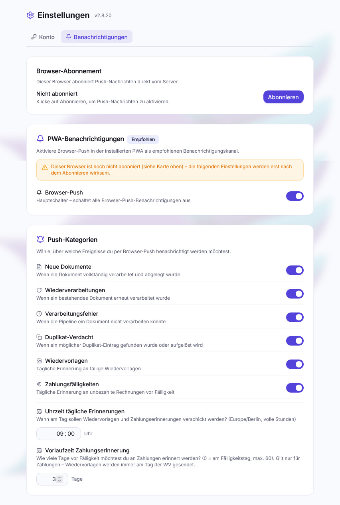

# Benachrichtigungen

postbuch.net arbeitet größtenteils im Hintergrund: Dokumente werden verarbeitet,
während du etwas anderes tust, Fristen laufen weiter, ob du hinsiehst oder
nicht. Damit du trotzdem nichts verpasst, sind **PWA-/Browser-Push-Nachrichten**
für jeden Nutzer persönlich der empfohlene Kanal. Daneben gibt es eine
**experimentelle Discord-Anbindung**, die wegen des Risikos einer
Datenoffenlegung durch Fehlkonfiguration nicht empfohlen wird.

Beide sind optional. Ohne jede Konfiguration läuft alles normal, nur eben still.

Eingestellt wird alles unter 
**Einstellungen → Benachrichtigungen**. Diesen Bereich sieht **jeder** Nutzer –
auch mit Leserechten. Push-Einstellungen sind persönlich; die experimentelle
Discord-Konfiguration und der [instanzweite Push-Schalter](#push-für-die-ganze-instanz-abschalten)
bleiben dem Administrator vorbehalten.

## Browser-Push

Push-Nachrichten erscheinen als Systembenachrichtigung deines Geräts – auch
dann, wenn postbuch.net gerade nicht geöffnet ist. Zugestellt werden sie vom
Push-Dienst des Browsers (Google, Mozilla, Apple), verschlüsselt und signiert
nach dem VAPID-Verfahren. Das Schlüsselpaar dafür erzeugt deine Instanz beim
ersten Start selbst; es verlässt sie nie.

> [!IMPORTANT]
>
> Browser-Push setzt einen **gesicherten Kontext** voraus: HTTPS über einen
> echten Hostnamen mit gültigem Zertifikat, nicht eine reine IP-Adresse und
> nicht unverschlüsseltes HTTP. Läuft postbuch.net gerade über die IP-Adresse
> oder ohne `https://`, bietet der Browser Push gar nicht erst an – selbst
> wenn er es grundsätzlich könnte. Siehe [Voraussetzungen](voraussetzungen.md)
> und die FAQ zu [DuckDNS und DNS-Rebind-Schutz](faq.md#betrieb).

> [!NOTE]
>
> Der Push-Dienst des Browserherstellers sieht nur, _dass_ deine Instanz an ein
> bestimmtes Endgerät sendet – der Inhalt ist Ende-zu-Ende verschlüsselt.

### Abonnieren

Push wird **pro Browser und pro Gerät** abonniert, nicht pro Konto. Wer am Handy
und am Laptop benachrichtigt werden will, abonniert zweimal.

1.  **Einstellungen →
   Benachrichtigungen → Browser-Abonnement**
2. **Abonnieren** klicken.
3. Die Berechtigungsanfrage des Browsers bestätigen.

Hat der Browser die Berechtigung einmal **abgelehnt**, hilft der
 Knopf nicht mehr weiter – die
Sperre muss dann in den Website-Einstellungen des Browsers aufgehoben werden.
Die App zeigt diesen Zustand an, statt ins Leere zu laufen.

Auf **iPhone und iPad** funktioniert Push erst, nachdem die App über „Zum
Home-Bildschirm" [installiert](mobil-und-pwa.md#iphone-und-ipad) wurde. Im
normalen Safari-Tab bietet iOS keinen Push an. Das entspricht Apples
Dokumentation ab iOS 16.4, ist für postbuch.net aber **nicht getestet** – es
steht kein Apple-Gerät zur Verfügung.

### Die sechs Kategorien

Über allem steht ein 
**Hauptschalter** („Browser-Push"). Ist er aus, wird gar nichts zugestellt,
unabhängig von den Einzelschaltern. Darunter entscheidest du je Ereignisart:

| Kategorie                                                                 | Ausgelöst durch                                                                            |
| ------------------------------------------------------------------------- | ------------------------------------------------------------------------------------------ |
|  **Neue Dokumente**               | Ein Dokument wurde vollständig verarbeitet und abgelegt                                    |
|  **Wiederverarbeitungen** | Ein bestehendes Dokument wurde erneut durch die Pipeline geschickt                         |
|  **Verarbeitungsfehler**         | Die Pipeline konnte ein Dokument nicht verarbeiten                                         |
|  **Duplikat-Verdacht**                  | Ein möglicher Doppeleingang wurde gefunden – oder eine offene Entscheidung wurde aufgelöst |
|  **Wiedervorlagen**      | Tägliche Erinnerung an fällige Wiedervorlagen                                              |
|  **Zahlungsfälligkeiten**               | Tägliche Erinnerung an unbezahlte Rechnungen vor Fälligkeit                                |

Alle Kategorien sind standardmäßig an. In der Praxis sind „Neue Dokumente" und
„Wiederverarbeitungen" die ersten Kandidaten zum Abschalten, sobald der
Anfangsreiz nachlässt: Ein Stapel Scans erzeugt sonst einen Stapel Meldungen.

**Duplikat-Verdacht ist die einzige Kategorie, die wirklich eine Handlung
verlangt.** Diese Meldung bleibt deshalb stehen, bis du sie wegtippst
(`requireInteraction`), vibriert auffälliger und führt beim Antippen direkt zur
offenen Entscheidung. Solange sie nicht beantwortet ist, hängt ein Dokument in
der Warteschleife.

### Die täglichen Erinnerungen

Zwei Kategorien sind keine Ereignismeldungen, sondern Tagesbriefings. Sie teilen
sich eine Einstellung:

- **Uhrzeit tägliche Erinnerungen** – volle Stunde, Standard 9:00, Zeitzone
  Europe/Berlin. Jeder Nutzer hat seine eigene; der Server prüft stündlich, für
  wen gerade die passende Stunde geschlagen hat.
- **Vorlaufzeit Zahlungserinnerung** – 0 bis 60 Tage, Standard 3. Nur für
  Zahlungsfälligkeiten. Wiedervorlagen kommen immer **am** Fälligkeitstag, ohne
  Vorlauf.

Was gemeldet wird:

- **Wiedervorlagen**: alles Unerledigte mit Fälligkeit heute oder früher.
  Überfälliges wird ausdrücklich als solches gezählt („Davon 2 überfällig").
- **Zahlungen**: offene Rechnungen, deren Fälligkeit innerhalb deiner
  Vorlaufzeit liegt, mit Betrag und Datum; bei mehreren mit Gesamtsumme.

Beide fassen zusammen statt zu spammen: eine Nachricht pro Tag und Kategorie,
nicht eine pro Vorgang. Wer die Erinnerung an einem Tag schon bekommen hat,
bekommt sie nicht erneut – auch nicht nach einem Neustart des Servers.

Ein Antippen führt zu **Wiedervorlagen** bzw. **Unbezahlt**.

### Abbestellen

**Deabonnieren** im selben Bereich entfernt genau diesen Browser. Der
Hauptschalter dagegen wirkt auf alle deine Geräte. Endgeräte, die der
Push-Dienst dauerhaft ablehnt (App gelöscht, Browserdaten geleert), werden
serverseitig aussortiert. Wer keinen Zugang mehr hat – nicht mehr anmeldefähig
oder deaktiviert –, bekommt auch auf früher abonnierte Geräte keine
Push-Nachrichten mehr.

### Push für die ganze Instanz abschalten

Wer ausschließen will, dass Benachrichtigungen über den Push-Dienst eines
Browserherstellers laufen, schaltet Push für alle ab. Diese Karte sieht nur der
Administrator:

1.  **Einstellungen →
   Benachrichtigungen → Push auf dieser Instanz**
2. **Für alle abschalten** klicken und bestätigen.

Die Karte zeigt vorher, wer gerade Push-Nachrichten bekommt – mit Anzahl der
Geräte und dem Push-Dienst (Google, Mozilla, Apple, Microsoft). Beim Abschalten
werden alle gespeicherten Geräte-Abonnements gelöscht. Danach kann niemand mehr
abonnieren, und postbuch.net verschickt keine einzige Push-Nachricht. Alle
anderen sehen unter **Browser-Abonnement** den Hinweis, dass Push vom Admin
abgeschaltet ist.

**Wieder erlauben** hebt die Sperre auf. Die Abonnements kommen dabei nicht
zurück: Jede Person abonniert ihr Gerät bei Bedarf neu. Hauptschalter,
Kategorien und Uhrzeiten bleiben erhalten.

Standardmäßig ist Push erlaubt. Der [Cloudfrei-Check](ki-provider.md#cloudfrei-check)
zeigt den Stand ebenfalls an.

## Discord

> [!WARNING]
>
> **Discord ist experimentell und wird nicht empfohlen.** Verwende stattdessen
> PWA-/Browser-Push. Discord erhält Inhalte aus Dokument- und Fehlermeldungen.
> Ein öffentlicher oder falsch berechtigter Server, Kanal, Bot oder Webhook kann
> sensible Daten für Unbefugte sichtbar machen.
>
> **Nur der Administrator kann Discord einrichten**.

Discord erzeugt einen durchsuchbaren, dauerhaften **Ereignisstrom** der Instanz
mit ausführlicheren Meldungen, als sie in eine Systembenachrichtigung passen.
Diese Dauerhaftigkeit bei einem externen Dienst ist zugleich ein zusätzliches
Datenschutzrisiko.

Anders als Push ist Discord **nicht persönlich**: Es gibt eine Konfiguration pro
Instanz, und alles landet in einem Kanal. Der Installer fragt Discord bewusst
nicht ab. Eine neue Konfiguration ist nur unter
 **Einstellungen →
Benachrichtigungen** möglich, nachdem der Administrator den experimentellen
Status und das Risiko einer Datenoffenlegung ausdrücklich bestätigt hat.

### Bot-Modus

Im Bot-Modus kann postbuch.net nicht nur senden, sondern auch **auf Klicks
reagieren**. Der praktische Nutzen: Bei einem Duplikat-Verdacht liegt die
Entscheidung als Knopfreihe unter der Meldung – du entscheidest direkt in
Discord, ohne die App zu öffnen. Die Nachricht wird danach umgeschrieben, sodass
der Kanal den Endstand zeigt.

Dafür hält die App eine dauerhafte WebSocket-Verbindung zum Discord-Gateway.

Die Einrichtung steht als aufklappbare Schritt-für-Schritt-Anleitung direkt in
den  Einstellungen (Discord-Konto →
privater Server → Kanal `#postbuch` → Anwendung im Developer Portal → Bot-Token
→ Bot autorisieren → Channel-ID kopieren). Gebraucht werden am Ende zwei
Angaben: **Bot-Token** und **Channel-ID**.

Der Bot darf **keine Administratorrechte** erhalten. Benötigt werden nur „Kanäle
ansehen", „Nachrichten senden" und „Links einbetten" im privaten Zielkanal. Der
Message Content Intent wird nicht benötigt. Kontrolliere vor dem Speichern,
welche Menschen und Rollen den Zielkanal sehen können.

### Webhook-Modus (Rückfallebene)

Eine Webhook-URL genügt, wenn es nur ums Senden geht. Discord-Webhooks können
keine Knopfdrücke entgegennehmen; bei Duplikat-Entscheidungen enthält die
Nachricht deshalb einen **signierten Direktlink** in die App statt Knöpfen.

Ist beides konfiguriert, gewinnt der Bot.

### Statusanzeige

Der Bereich zeigt immer, was gerade gilt: „Discord aktiv (Bot-Modus)", „Discord
aktiv (Webhook-Modus)" oder „Discord deaktiviert". Ist nichts konfiguriert,
läuft die App normal weiter und sendet still nichts – ein fehlender
Discord-Zugang ist nie ein Fehlerzustand.

Der Administrator kann Discord außerdem mit einem Schalter stumm stellen, ohne
die Zugangsdaten zu löschen.

Die Risikobestätigung wird bei jedem neuen Speichern von Bot-Zugangsdaten oder
einer Webhook-URL verlangt. Das Deaktivieren und Löschen einer bestehenden
Konfiguration bleibt ohne Bestätigung möglich.

## Was wo ankommt

| Ereignis                       | Push                              | Discord                           |
| ------------------------------ | --------------------------------- | --------------------------------- |
| Dokument verarbeitet           | ✅ (Kategorie „Neue Dokumente")   | ✅                                |
| Wiederverarbeitung fertig      | ✅                                | ✅                                |
| Verarbeitungsfehler            | ✅                                | ✅                                |
| Duplikat-Verdacht              | ✅ mit Handlungszwang             | ✅ mit Entscheidungsknöpfen (Bot) |
| Duplikat aufgelöst             | ✅                                | ✅ (Nachricht wird aktualisiert)  |
| Erstattungsbescheid zugeordnet | ✅ (läuft unter „Neue Dokumente") | ✅                                |
| Wiedervorlage fällig           | ✅ (täglich)                      | –                                 |
| Zahlung fällig                 | ✅ (täglich)                      | –                                 |

Die täglichen Erinnerungen gehen bewusst nur per Push: Sie sind persönlich
(eigene Uhrzeit, eigene Vorlaufzeit) und gehören nicht in einen gemeinsamen
Kanal.

## Wenn nichts ankommt

| Symptom                                                                                       | Prüfen                                                                                                                                  |
| --------------------------------------------------------------------------------------------- | --------------------------------------------------------------------------------------------------------------------------------------- |
| Kein Push, Knopf  „Abonnieren" bleibt wirkungslos | Berechtigung im Browser abgelehnt → in den Website-Einstellungen zurücksetzen                                                           |
| Hauptschalter und Kategorien stehen alle auf An, trotzdem kommt nie etwas an                  | „Browser-Abonnement" prüfen – Schalter sind nur Präferenzen, ohne Abo dieses Browsers als Ziel bleibt jeder Push technisch unzustellbar |
| Kein Push auf dem iPhone                                                                      | App muss über „Zum Home-Bildschirm" installiert sein (iOS insgesamt ungetestet)                                                         |
| Push kam früher, jetzt nicht mehr                                                             | Browserdaten gelöscht → neu abonnieren                                                                                                  |
| Einzelne Kategorie fehlt                                                                      | Kategorie-Schalter **und** Hauptschalter prüfen                                                                                         |
| Erinnerungen kommen zur falschen Zeit                                                         | „Uhrzeit tägliche Erinnerungen" ist persönlich und läuft nach Europe/Berlin                                                             |
| Benachrichtigung führt auf eine kaputte Adresse                                               | Die Basisadresse der Instanz ist nicht gesetzt – siehe [Betrieb](betrieb-troubleshooting.md)                                            |
| Discord still                                                                                 | Statusabzeichen im Einstellungsbereich prüfen; Bot muss Mitglied des Kanals sein                                                        |

---

Weiter: [Dateiablage-Backends](storage-backends.md) ·
[Zurück zur Übersicht](README.md)
