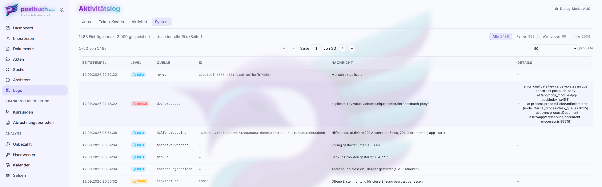

# Betrieb und Troubleshooting

Was im laufenden Betrieb anfällt: Updates einspielen, nachsehen was passiert
ist, und die Handvoll Fehlerbilder, die tatsächlich vorkommen.

## Wo man nachsieht

Der Bereich  **Logs** in der Seitenleiste hat vier Registerkarten:

| Registerkarte | Zeigt |
|---|---|
|  **Jobs** | Laufende, wartende und kürzlich beendete Pipeline-Läufe. Hier steht, in welcher Phase ein Dokument hängt. |
|  **Token-Kosten** | Was die KI-Aufrufe verbraucht haben, aufgeschlüsselt nach Modell und Zweck. |
|  **Aktivität** | Wer hat wann was angelegt, geändert, gelöscht – mit Sprung zum betroffenen Dokument. |
|  **System** | Meldungen der Anwendung selbst: INFO, WARN, ERROR mit Quelle und Details. |

Das System-Log behält die **letzten 2000 Zeilen** und läuft danach hinten
heraus. Es ersetzt die Container-Logs nicht: Was beim Start schiefgeht, bevor
die Datenbank steht, landet nur dort.

Auf dem Server, im Installationsverzeichnis (Standard `~/postbuch`):

```bash
docker compose ps                       # laufen alle Container?
docker compose logs app --tail 100      # letzte Meldungen der API
docker compose logs -f app              # laufend mitlesen
docker compose logs web --tail 50       # nginx
```

Ein schneller Lebenszeichen-Test ohne Anmeldung:

```bash
curl -s http://localhost:3420/api/health
# {"status":"ok"}
```

Antwortet das, laufen `web`, `app` und die Verbindung dazwischen.



## Updates

postbuch.net fragt täglich bei der eingetragenen Bezugsquelle nach, ob es eine
neuere Version gibt. Das Ergebnis steht unter  **Einstellungen → Allgemein** und
als Hinweis in der Seitenleiste. Nur Administratoren sehen die Karte.

### Vorabversionen

Bezieht die Instanz ihre Releases von GitHub (Standard bei neuen
Installationen), zeigt die Karte den Schalter **Vorabversionen erhalten**. Er
ist anfangs aus; die Instanz bekommt dann nur stabile Versionen. Eingeschaltet
bietet sie auch Vorabversionen an. Das sind neue Versionen, die erst eine Weile
im Einsatz sein sollen, bevor sie als stabil gelten. Sie sind genauso signiert
und geprüft, aber weniger erprobt.

Wer den Schalter wieder ausschaltet, wird nicht zurückgestuft. Die Instanz
behält ihre Version und bekommt das nächste Update, sobald eine neuere stabile
Version erscheint.

Bei einer anderen Bezugsquelle als GitHub gibt es den Schalter nicht.

Drei Zustände:

- **Aktuell** – dezenter grüner Hinweis, sonst nichts.
- **Update verfügbar** – mit Versionsnummer und Änderungen. Ist die neue
  Version als sicherheitsrelevant gekennzeichnet, wird der Hinweis auffällig.
- **Automatische Updates sind nicht eingerichtet** – der Regelfall auf einem
  selbst gepflegten Server. Dann gibt es **keinen Knopf**, sondern den Befehl
  zum Kopieren:

  ```bash
  cd ~/postbuch && ./deploy-pages/install.sh --update
  ```

  Bei einer Vorabversion enthält der Befehl zusätzlich
  `--zielversion=<x.y.z>`, damit genau diese Version geladen wird.

Darüber steht immer eine Zeile zur **Release-Signatur**. Sie sagt, ob diese
Instanz Signaturen prüfen kann und ob die letzte geprüfte gültig war. Sobald
eine Instanz einmal eine gültige Signatur gesehen hat, installiert sie nichts
Unsigniertes mehr. Näheres unter [Sicherheit](sicherheit.md).

### Was ein Update tut

Egal ob per Knopf oder von Hand – es ist derselbe Ablauf:

1. Release-Manifest und Tarball von der Bezugsquelle holen, Signatur und
   Prüfsumme prüfen. Stimmt etwas nicht, bricht der Installer ab, **bevor** er
   etwas anfasst.
2. Sicherung anlegen: der bisherige Quellbaum plus ein Datenbank-Dump, unter
   `~/postbuch/backups/backup_<zeitstempel>/`.
3. Neuen Quellbaum auspacken. Die `.env` bleibt unverändert.
4. Container neu bauen und starten. Die App wendet beim Start das Schema an
   (siehe [Architektur](architektur.md)).
5. Die ausgelieferte Hilfe wird mit dem aktiven Embedding-Modell abgeglichen.
   Neue oder geänderte Hilfeabschnitte werden beim externen KI-Anbieter neu
   eingebettet; identische Abschnitte übernimmt postbuch.net ohne neuen Aufruf.
   Dokumente und Akten werden durch ein gewöhnliches Update nicht pauschal neu
   eingebettet. Das ändert sich nur, wenn auch Provider, Modell oder Dimension
   der Embeddings gewechselt wurden. Details und Kostenbeispiele stehen unter
   [KI-Anbieter → Kosten und kostenpflichtige Aufrufe](ki-provider.md#kosten-und-kostenpflichtige-aufrufe).

Während des Laufs ist die Anwendung **einige Minuten nicht erreichbar** – bei
kleinen Servern spürbar länger, weil das Bauen der Images Zeit kostet.

### Der Update-Agent

Der `app`-Container ist absichtlich unprivilegiert: kein Docker-Socket, kein
Zugriff auf den Quellbaum. Er *kann* kein Update ausführen. Wer den Knopf in
der Oberfläche haben will, installiert dafür einen kleinen Host-Agenten, der
regelmäßig nachsieht, ob eine Anforderung vorliegt, und dann `install.sh
--update` startet. Die App schreibt nur die Anforderung; ausgeführt wird auf
dem Host. Anforderungen sind einmalig verwendbar und verfallen nach zehn
Minuten.

Ohne Agenten funktioniert alles andere unverändert – man aktualisiert eben
über die Shell.

### Zurück auf eine ältere Version

```bash
cd ~/postbuch && ./deploy-pages/install.sh --rollback
```

Der Dialog listet die vorhandenen Sicherungen mit Zeitstempel und Version und
sagt bei jeder dazu, ob ein Datenbank-Dump dabei ist. Dann kommen **zwei
getrennte Fragen**:

1. **Datenbank mit zurückrollen?** Standard ist ja, damit Code und Schema
   zusammenpassen. Alles, was seit der Sicherung entstanden ist, geht damit
   verloren. Nein zu sagen ist möglich, bedeutet aber alten Code auf einer
   neueren Datenbank – das kann dauerhaft inkonsistente Daten erzeugen.
2. **Bestätigung**: das Wort `ROLLBACK` tippen. Enter bricht ab.

Ein Rollback ist nur interaktiv möglich, nicht automatisiert.

## Häufige Fehlerbilder

**Die Seite lädt nicht.**
`docker compose ps` im Installationsverzeichnis. Steht ein Container auf
`Exited` oder `Restarting`, sagt `docker compose logs <dienst> --tail 100`
warum. Häufigste Ursache nach einem Serverneustart: Docker war schneller als
das Netzwerk oder das Dateisystem – `docker compose up -d` genügt dann.

**Anmeldung wird abgewiesen, obwohl das Passwort stimmt.**
Nach zehn Fehlversuchen innerhalb von fünf Minuten ist der Zugang kurz
gesperrt; die Meldung nennt die Wartezeit. Beim Administrator kommt eine
zweite Möglichkeit dazu: Wurde `APP_PASSWORD` in der `.env` geändert, gilt nur
noch das neue – und alte Admin-Sitzungen sind ungültig.

**Ein Dokument ist in der Pipeline gescheitert.**
 Logs → Jobs zeigt den Lauf mit Status *fehlgeschlagen* oder *unterbrochen* und
daneben  **↺ Wiederholen**. Das startet dieselbe Datei erneut, ohne dass man sie
neu hochladen muss. Vorher lohnt ein Blick ins System-Log: Ein abgelaufenes
Dateiablage-Token oder ein nicht erreichbares KI-Modell wiederholt sich sonst.

**Ein Job steht und tut nichts.**
Steht er auf *wartet auf Entscheidung*, ist es kein Fehler, sondern eine
erkannte Dublette – siehe [Dokumente importieren](dokumente-importieren.md).
Steht er auf *in Warteschlange*, laufen bereits so viele Pipelines wie erlaubt
(Standard drei), oder es läuft gerade ein Dateiablage-Umzug, der die Warteschlange
absichtlich anhält.

**Die Dateiablage antwortet nicht mehr.**
Bei OneDrive läuft das Zugriffstoken ab, wenn die Instanz länger stand oder
der Zugang bei Microsoft widerrufen wurde.  **Einstellungen → Dateiablage** zeigt
den Verbindungsstatus; von dort wird neu verbunden. Bei einem eigenen
WebDAV-Speicher prüft man zuerst, ob der Server erreichbar ist und das
App-Passwort noch gilt. Meldet postbuch.net **„Nextcloud verweigert den
Zugriff"**, stimmt die Anmeldung, aber dem Konto fehlt die Berechtigung für den
Ordner oder die Datei, zum Beispiel bei einer nur lesend freigegebenen Ablage.

Fährt OneDrive über den Legacy-Weg mit Client-Secret, unterscheidet
postbuch.net die Microsoft-Fehler `AADSTS7000222` (**„Client-Secret
abgelaufen“**) und `AADSTS7000215` (**„Client-Secret ungültig“**, meist die
geheime ID statt des Werts kopiert). Ein erneuter Login allein hilft nicht. In
Azure ein gültiges Secret erzeugen bzw. kopieren, dessen Wert und Ablaufdatum
unter  **Einstellungen → Dateiablage** eintragen und
danach neu verbinden. Scheitert die Verbindung schon beim Verbinden, bleibt das
Microsoft-Popup mit dieser Erklärung stehen, und die OneDrive-Karte zeigt sie
ebenfalls. Der Gerätecode-Weg hat kein Client-Secret.

Meldet postbuch.net **„App-Registrierung ungültig"**, kennt Microsoft die
eingetragene Client-ID nicht, oder sie passt nicht zur bestehenden Verbindung.
Ein erneuter Login allein hilft auch hier nicht. Client-ID und Mandant unter
 **Einstellungen → Dateiablage**
prüfen, speichern und danach neu verbinden.

**„Pfadprüfung: Ziel liegt außerhalb des konfigurierten Dateiablage-Ordners."**
Diese Meldung kann nur im Rahmen des internen Schutzes gegen Pfad-Ausbrüche aus
dem eigenen Nextcloud-Nutzerspeicher (`davHome`) auftreten, nie durch den
konfigurierten Postbuch-Wurzelordner selbst – der schränkt den Zugriff auf
bereits bekannte Dateien nicht ein (siehe
[Dateien manuell in der Dateiablage verschieben oder umbenennen](storage-backends.md#dateien-manuell-in-der-dateiablage-verschieben-oder-umbenennen)).
Tritt sie dennoch auf, deutet das auf einen Fehler in postbuch.net selbst hin –
bitte melden.

**Dateiablage nicht erreichbar – was bleibt erhalten?**

- Ein Scan aus Scanner/Cleaner wird vor der Verarbeitung unter
  `/data/scan_buffer` gesichert. Scheitert der erste Dateiablage-Upload, versucht
  `_scan_retry_queue` ihn mit Backoff ungefähr 10,7 Tage erneut; danach bleibt
  er als `manual_only` sichtbar und das PDF liegt weiter im Puffer.
- Ein Browser-Upload lebt bis zum ersten erfolgreichen Dateiablage-Upload nur im
  Arbeitsspeicher des App-Prozesses. Schlägt genau dieser Schritt fehl oder
  startet der Container neu, muss die Datei erneut hochgeladen werden.
- Dateien aus dem überwachten Dateiablage-Eingang bleiben dort liegen, wenn bereits
  das Auflisten scheitert. Nach Wiederherstellung findet der nächste Poll sie.
- Ein fehlgeschlagenes Datenbank-Backup wird geloggt; seine lokalen temporären
  Dumps werden anschließend entfernt. Der nächste geplante Lauf erzeugt ein
  neues Backup, es gibt keinen Upload-Retry für den fehlgeschlagenen Dump.

**Die KI liefert Unsinn oder gar nichts.**
Erst in  Logs → Token-Kosten sehen, ob der Aufruf überhaupt stattgefunden hat.
Kam nichts an, liegt es an Adresse, Schlüssel oder daran, dass ein lokal
laufendes Modell nicht erreichbar ist. Kam etwas an und das Ergebnis war
schlecht, ist es eine Modellfrage – siehe [KI-Anbieter](ki-provider.md).

**Der Scanner löst nichts aus.**
Der Scanner-Container läuft nur mit dem Profil `scanner`. `docker compose ps`
muss ihn zeigen. Fehlt er, wurde der Stack ohne das Profil gestartet.

Ohne Host-Agent lässt sich das Profil auf dem Server von Hand aktivieren:
`COMPOSE_PROFILES=scanner` in `.env` setzen und anschließend `./restart.sh`
ausführen. Die Scanner-Adresse selbst wird danach im Web-Assistenten gesucht
oder eingetragen.

**Die App zeigt nach einem Update noch die alte Oberfläche.**
Selten, weil Startseite und Service-Worker nicht zwischengespeichert werden.
Wenn doch: Seite einmal hart neu laden; auf dem Handy die installierte App
schließen und neu öffnen.

**Die Datenbank ist weg oder kaputt.**
Siehe [Backup und Wiederherstellung](backup-wiederherstellung.md). Das ist der
einzige Fehlerfall, für den es vorher etwas zu tun gab.

## Platz und Wartung

Es gibt wenig zu pflegen, aber drei Dinge wachsen:

- **Docker-Images.** Jedes Update baut neue; die alten bleiben liegen.
  `docker image prune -f` räumt herrenlose Ebenen weg.
- **Update-Sicherungen** unter `~/postbuch/backups/`. Jede enthält einen
  Datenbank-Dump. Die letzten paar behalten, ältere löschen.
- **Die Datenbank selbst**, vor allem durch Text- und Bild-Caches der
  KI-Analyse. Die PDFs liegen nicht darin – siehe [Architektur](architektur.md).

> Beim Aufräumen mit Docker-Befehlen genau hinsehen, welche Container gemeint
> sind. Auf demselben Server können andere Anwendungen laufen; `docker system
> prune -a` trifft auch die.

Der Datenbank-Dump in der Dateiablage wird automatisch nach Aufbewahrungsregeln
gestutzt, dort ist nichts zu tun.

## Wenn nichts mehr hilft

Bevor du eine Instanz neu aufsetzt: Ein vollständiges Backup besteht aus dem
Datenbank-Dump **und** den Dokumenten. Liegt beides vor, ist ein Neuaufbau
eine überschaubare Sache – der Weg steht in
[Backup und Wiederherstellung](backup-wiederherstellung.md) unter „Der
Ernstfall".

Fehler, die nach einem Programmfehler aussehen, gehören gemeldet;
Sicherheitslücken bitte **nicht** öffentlich, sondern auf dem in `SECURITY.md`
beschriebenen Weg.

---

Weiter: [FAQ](faq.md) · [Zurück zur Übersicht](README.md)
