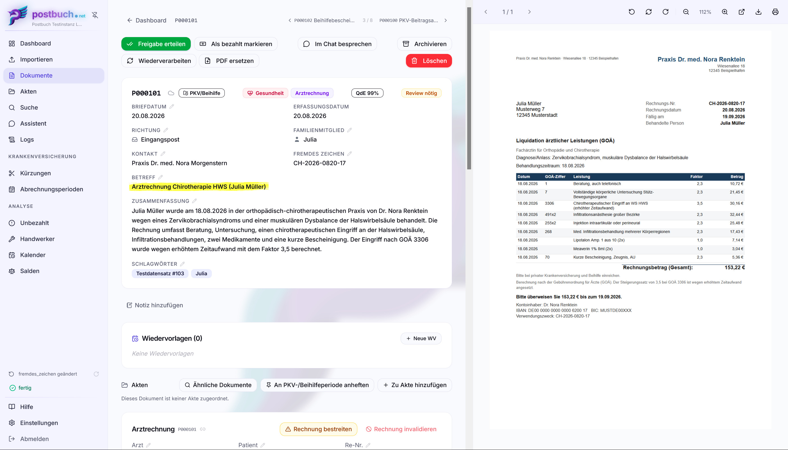
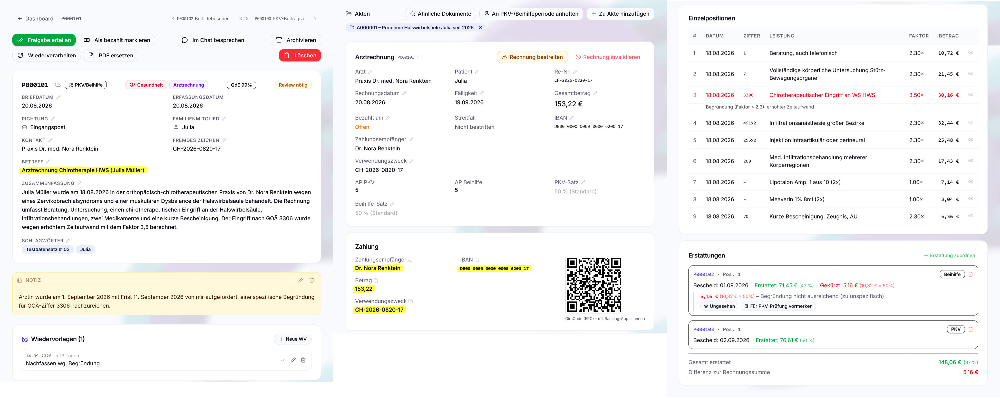
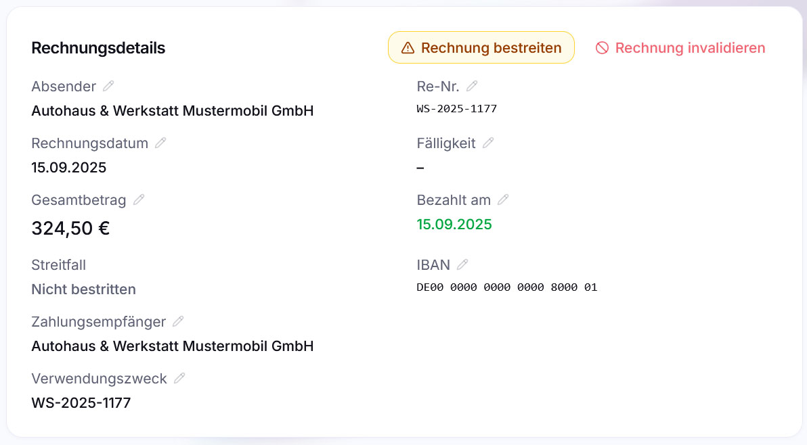
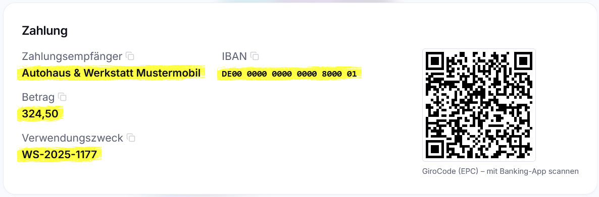
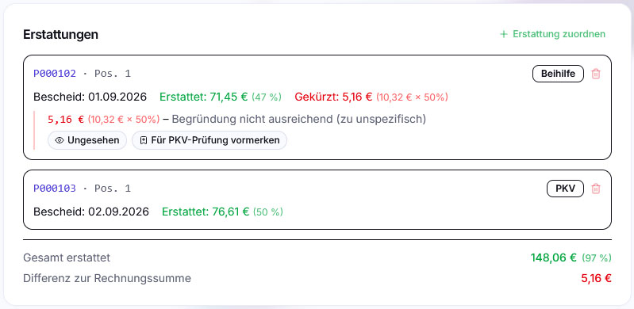
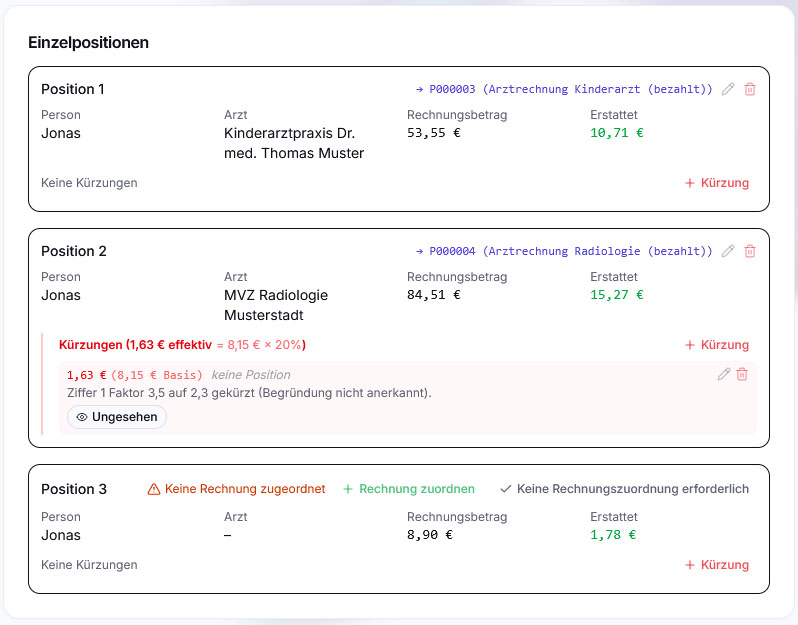
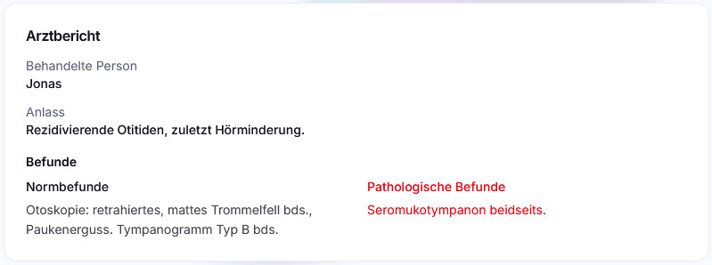
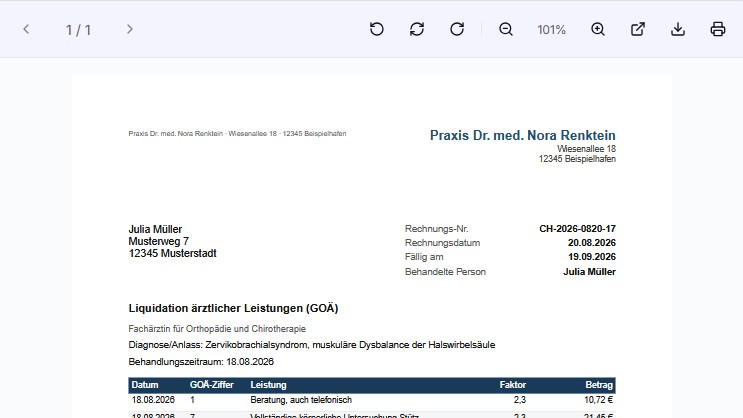

# Die Dokumentansicht

Alles, was an einem einzelnen Dokument getan werden kann, passiert auf seiner
Detailseite unter `/postbuch/<Postnummer>`. Dieses Kapitel geht sie von oben
nach unten durch: Kopfzeile, Freigabe, Aktionsleiste, Metadaten, die
dokumentartspezifischen Blöcke – und den PDF-Betrachter daneben.

## Aufbau

Am Desktop liegt die Seitenleiste links, in der Mitte die Daten, **rechts** das
PDF-Panel. Es öffnet sich auf der Detailseite von selbst, wenn das Dokument eine
Datei hat, und kann nicht geschlossen werden.

Auf dem Telefon gibt es kein PDF-Panel: Dort wird die Detailseite im Querformat
angezeigt, und ein Drehen ins Hochformat schaltet auf den Vollbild-Betrachter
um. Das ist in [Mobil und PWA](mobil-und-pwa.md) beschrieben.

In der Kopfzeile steht links der 
Rücksprung dorthin, wo man hergekommen ist („Dokumente", „Zurück zur Akte",
„Kalender", „Zurück zum Chat" …). Kam man aus einer Liste, stehen rechts daneben
 und
 **Vor- und Zurück-Knöpfe mit der
Position** („7 / 43"), die durch genau diese Liste blättern – die Filterung
bleibt dabei erhalten.

Fehlt einem Dokument das semantische Embedding, steht darüber ein gelber Hinweis
samt Knopf  **Embedding nachholen**;
solange es fehlt, findet die semantische Suche dieses Dokument nicht.

## Status und Freigabe

Jedes Dokument trägt genau einen von drei Status. Er ist eine reine
Bearbeitungs-Markierung – er schränkt nichts ein, sondern beantwortet die Frage
„habe ich da schon draufgeschaut?".

| Badge            | Bedeutung                                                                                                                                                                       |
| ---------------- | ------------------------------------------------------------------------------------------------------------------------------------------------------------------------------- |
| **AI ✓**         | Die KI hat sauber durchgearbeitet: Sicherheitsgrad mindestens 0,9 (in der Kopfzeile als **QdE** ≥ 90 % ausgewiesen) und keine Reparatur an ihrer Antwort nötig. Der Normalfall. |
| **Review nötig** | Die KI war sich unsicher (< 0,9), ihre Antwort musste maschinell repariert werden **oder** sie hat eine Person genannt, die keinem erfassten Menschen eindeutig zuzuordnen ist (das Feld bleibt dann leer). Bitte nachsehen. |
| **User ✓**       | Ein Mensch hat das Dokument angesehen und freigegeben.                                                                                                                          |

 **Freigabe erteilen** ist der erste
Knopf der Aktionsleiste und setzt den Status auf **User ✓**. Er ist grün
gefüllt, solange „Review nötig" ansteht, sonst grün umrandet, und wird nach der
Freigabe zu einem ausgegrauten „Freigabe erteilt". Das ist die einzige Stelle in
der Oberfläche, an der ein Status von Hand geändert wird – den Weg zurück gibt
es nur über **Strg+Z**, denn auch die Freigabe landet im Rückgängig-Verlauf.
Eine Wiederverarbeitung setzt den Status neu, wie beim ersten Durchlauf.

Praktisch heißt das: Die Kachel **Reviews ausstehend** auf dem Dashboard und der
Statusfilter der Dokumentliste sind die Arbeitsvorräte. Wer sie leerräumt, hat
alles gesehen, was die KI selbst für wacklig hielt.

## Die Aktionsleiste

Sie steht direkt unter der Kopfzeile und ist in Gruppen sortiert: erst der
Arbeitsablauf, dann Besprechen, dann Archivieren, dann die technischen
Eingriffe, ganz rechts das Löschen.

| Knopf                                                                   | Wirkung                                                                                        |
| ----------------------------------------------------------------------- | ---------------------------------------------------------------------------------------------- |
|  **Freigabe erteilen**         | Status → User ✓ (siehe oben)                                                                   |
|  **Als bezahlt markieren**         | Nur bei Rechnungen. Trägt das heutige Datum als Zahldatum ein; danach steht dort „Bezahlt".    |
|  **Im Chat besprechen**         | Springt in den Assistenten, mit `#<Postnummer>` schon im Eingabefeld                           |
|  **Archivieren** / **Historisch**    | Setzt bzw. entfernt die Historisch-Markierung                                                  |
|  **Wiederverarbeiten** | Lässt die KI das Dokument neu analysieren                                                      |
|  **PDF ersetzen** (bzw. **Fehlende PDF reimportieren**) | Tauscht die Datei aus bzw. reicht sie nach, behält alles andere |
|  **Löschen**                        | Löscht den Datenbankeintrag; verschiebt die PDF nach `<postbuch.net-Wurzelverzeichnis>/_trash` |

Wer nur **Lesezugriff** hat, sieht von dieser Leiste ausschließlich **Im Chat
besprechen** – der Chat funktioniert lesend. Alle anderen Knöpfe fehlen; das
Gleiche gilt für sämtliche Stift- und Papierkorb-Symbole weiter unten auf der
Seite. Ist der Lesezugriff auf die eigenen Dokumente beschränkt, fehlt auch
der Chat-Knopf, ebenso Akten, Wiedervorlagen und Anpinnen (siehe
[Sicherheit](sicherheit.md#lesezugriff-auf-die-eigenen-dokumente-beschränken)).

### Archivieren („Historisch")

Archivieren **löscht nichts, verschiebt nichts und ändert keine Daten**. Es
setzt eine einzige Markierung – „historisch" – die überall dort greift, wo
postbuch.net von sich aus eine Liste zusammenstellt.

**Wozu das gut ist.** Ein Postbuch wächst nur. Nach ein paar Jahren stehen Dinge
in den Listen, die niemanden mehr interessieren, aber jede Übersicht
verrauschen: der 2019 endabgerechnete Stromvertrag samt Schlussrechnung und
Kündigungsbestätigung, die Unterlagen des verkauften Autos, der abgelaufene
Handyvertrag, die Korrespondenz eines abgeschlossenen Schadensfalls. Diese
Dokumente will man nicht löschen – man braucht sie unter Umständen noch für
Steuer, Gewährleistung oder Nachweise –, aber man will sie auch nicht mehr
täglich sehen. Genau dafür ist die Markierung da: **abgeschlossener Vorgang,
aufbewahrt, aber weggeräumt.**

Die Faustregel: archivieren nur, wenn zu einem Vorgang _nichts mehr passieren
wird_. Solange noch eine Rechnung offen, eine Frist unbeantwortet oder eine
Erstattung unterwegs ist, bleibt das Dokument aktuell.

**Was sich dadurch ändert:**

| Ort                                                                             | Wirkung                                                                                                   |
| ------------------------------------------------------------------------------- | --------------------------------------------------------------------------------------------------------- |
|  **Dokumentliste**                      | ausgeblendet, bis der Archiv-Schalter oben rechts eingeschaltet wird                                      |
|  **Suche** (Volltext _und_ semantisch)         | ausgeblendet, bis der Archiv-Schalter über der Trefferliste eingeschaltet wird                            |
|  **Dashboard**                   | zählt nicht mit – weder in „Dokumente gesamt" noch in den Verteilungen nach Lebensbereich und Dokumentart |
| **Offene Rechnungen**                                                           | bleiben im Fälligkeitskalender sichtbar                                                                   |
|  **Analyse → Unbezahlt, Kürzungen**    | bleiben außen vor                                                                                         |
|  **Analyse → Handwerker**                 | **zählt weiter mit** – der Lohnanteil bleibt absetzbar; die Zeile wird als **Archiviert** gekennzeichnet  |
|  **Abrechnungsperioden** | **bleiben unberührt** – die Rechnung zählt weiter zur Periode und wird mit eingereicht                    |
|  **Kalender und Wiedervorlagen**    | Termine laufen unverändert weiter                                                                         |
|  **Assistent**                     | findet sie weiter, kennzeichnet sie aber in seinem Kontext ausdrücklich als **ARCHIVIERT**                |
| **Direkte Postnummer**                                                          | funktioniert unverändert – wer `P000123` eingibt oder den Link kennt, landet direkt dort                  |

Das Dokument selbst bleibt vollständig: Datei, Metadaten, Akten, Notiz,
Erstattungsbezüge, Verbleib. Nichts wird abgeschnitten.

Genau deshalb ist Archivieren **kein Ersatz für eine inhaltliche Klärung**: Eine
unbezahlte Rechnung bleibt eine unbezahlte Rechnung, sie ist nur ausgeblendet.
Wird sie später zurückgeholt, steht sie sofort wieder in „Unbezahlt". Wo eine
Forderung tatsächlich erloschen ist – der klassische Fall ist die
[Korrekturrechnung](#sonderfall-korrekturrechnung) –, gehört zusätzlich der
Rechnungsblock entfernt.

Umgekehrt gilt dasselbe: **Archivieren entwertet nichts.** Wo eine Zahl über das
Wegräumen hinaus gilt, zählt sie weiter – der Lohnanteil einer
Handwerkerrechnung nach § 35a EStG bleibt in **Analyse → Handwerker** in der
Jahressumme, und eine Arztrechnung bleibt in ihrer Abrechnungsperiode, bis diese
eingereicht ist. In beiden Ansichten sind archivierte Rechnungen ausdrücklich
als **Archiviert** gekennzeichnet, damit klar ist, woraus sich eine Summe
zusammensetzt. Soll eine Arztrechnung nicht mit eingereicht werden, setzt man
ihr **AP-Feld auf leer** statt sie zu archivieren; siehe
[PKV, Beihilfe und Abrechnung](abrechnung-pkv-beihilfe.md).

**Wie man wieder herankommt** – vier Wege, je nachdem, was man weiß:

1. **Postnummer eintippen.** In der Suche wird der Historisch-Filter bei einer
   Nummerneingabe grundsätzlich ignoriert.
2.  **Archiv-Schalter in der Dokumentliste.**
   Das Archiv-Symbol rechts über der Tabelle blendet die historischen Dokumente
   wieder ein („Historische Dokumente einblenden"). Ist er aktiv, erscheint
   zusätzlich das Kästchen **Nur historische** in der Filterleiste – damit sieht
   man ausschließlich das Archiv, was beim Aufräumen praktisch ist.
3.  **Archiv-Schalter in der Suche.**
   Dasselbe Symbol über der Trefferliste („Archivierte Einträge einblenden");
   archivierte Treffer erscheinen dann ausgegraut zwischen den übrigen.
4. **Über die Akte.** Eine Akte zeigt ihre Dokumente unabhängig von der
   Markierung.

 **Zurückholen** geht genauso wie das
Archivieren: Detailseite öffnen, derselbe Knopf – er heißt dann
 **Historisch** und ist hervorgehoben –
entfernt die Markierung wieder. Auch das steht im Rückgängig-Verlauf und ist mit
**Strg+Z** sofort zurücknehmbar.

**Ganze Akten** lassen sich in einem Zug archivieren, wahlweise samt aller
enthaltenen Dokumente; das ist der übliche Weg für einen abgeschlossenen Vorgang
und in [Akten, Verbleib und Wiedervorlagen](akten-und-organisation.md)
beschrieben. Auch der Assistent kann das auf Zuruf erledigen.

### Wiederverarbeiten

 Öffnet einen Dialog mit drei
Stellschrauben:

1. **Freitext-Hinweis an die KI** – „Bitte die Einzelpositionen genauer
   extrahieren…". Optional, wirkt nur für diesen Lauf.
2. **KI-Modell** – _Auto_ (Standard, mit automatischer
   Schwierigkeitseinschätzung) oder eine feste Stufe: _Lang_, _Leicht_,
   _Mittel_, _Schwer_. Zu jeder Stufe stehen das konkrete Modell und der
   Anbieter; Stufen, deren Modell weder PDFs noch Bilder verarbeiten kann, sind
   mit **nur Text** gekennzeichnet. Bei jeder festen Stufe entfällt die
   Voranalyse – das gewählte Modell wird direkt verwendet.
3. **Eingescannten Text verwerfen (nur das Bild an die KI geben)** – erscheint
   nur, wenn das PDF überhaupt eine Textebene hat. postbuch.net kreuzt das
   Kästchen von sich aus an, wenn es eine automatisch erkannte OCR-Textebene
   erkennt, die die KI eher in die Irre führt. Bei einer „nur Text"-Stufe ist
   die Option gesperrt – ohne Textebene bliebe dort nichts übrig, was das Modell
   lesen könnte.

Die Wiederverarbeitung ist **nicht umkehrbar**: Sie ersetzt den Datensatz und
löscht dabei den gesamten Rückgängig-Verlauf. Der Dialog sagt das auch. Bei
einem **Erstattungsbescheid** steht zusätzlich der Warnhinweis, dass manuelle
Korrekturen an Zuordnungen und Kürzungen vollständig durch die KI überschrieben
werden.

Für Fälle, in denen die Pipeline einen Zustand gar nicht zuverlässig
zurückbauen könnte, gibt es zusätzlich einen serverseitigen Riegel. Ist die
Wiederverarbeitung für ein Dokument gesperrt, erscheint der
**Wiederverarbeiten**-Knopf von vornherein ausgegraut – ein Mouseover nennt
den Grund. Ohne diese Vorabprüfung würde der Knopf normal aussehen und erst
nach dem Klick mit einer Fehlermeldung ablehnen. Gesperrt ist die
Wiederverarbeitung in genau drei Fällen:

- die **Arztrechnung** ist mit einem Erstattungsbescheid verknüpft – hier
  bleibt sie komplett gesperrt, weil eine bereits abgerechnete Zuordnung sonst
  ins Leere liefe,
- der **Erstattungsbescheid** enthält eine PKV-Prüfvormerkung – die
  Vormerkung hängt fest an der Kürzungszeile und ließe sich sonst nicht
  sauber auflösen,
- das Dokument steckt in einer laufenden Dateiablage-Migration.

Alle anderen Zustände an einem Bescheid selbst – Rechnungs- und
Positionszuordnungen, eine Periodenbindung, eine als gesehen markierte
Kürzung, eine als „ohne Rechnungsbezug" bestätigte Position – blockieren die
Wiederverarbeitung **nicht**. Sie ist hier ein ausdrücklich vorgesehener
Korrekturweg: postbuch.net nimmt die Periodenwirkung des Bescheids vor dem
Neuaufbau automatisch zurück (siehe oben) und warnt lediglich, dass dabei
manuelle Korrekturen verloren gehen.

Die Meldung im gesperrten Fall nennt jeweils den Grund und die betroffenen
Bescheide. Bei einer Arztrechnung korrigiert man die Daten dann direkt statt
neu zu extrahieren.

Der Lauf selbst läuft im Hintergrund über dieselbe Warteschlange wie ein Import;
der Fortschritt erscheint in der Aufgabenleiste. Man kann die Seite verlassen.

### PDF ersetzen

 Für den Fall, dass dieselbe Sache noch
einmal besser eingescannt wurde. Die Postnummer bleibt, ebenso Betreff,
Adressat, Detailtabellen, Aktenzuordnung und Notizen – ausgetauscht wird nur die
Datei, **ohne** KI-Lauf. Der  Knopf
führt in den Import, wo entweder ein neuer Scan ausgelöst oder eine (auch
mehrere, zusammenzuführende) PDF-Datei hochgeladen wird. Die alte Datei wandert
in den Ordner **`<postbuch.net-Wurzelverzeichnis>/_trash`** der Dateiablage; die
Aktion ist mit **Strg+Z** rückgängig zu machen. Das ist der
[eigene Papierkorb von postbuch.net](storage-backends.md#der-postbuchnet-papierkorb),
nicht der Systempapierkorb von OneDrive oder Nextcloud.

Fehlt die Datei in der Dateiablage bereits nachweislich (siehe
[Wenn eine Datei endgültig fehlt](storage-backends.md#wenn-eine-datei-endgültig-fehlt)),
heißt derselbe Knopf stattdessen **Fehlende PDF reimportieren**: Es gibt keine
alte Datei mehr zu verschieben, daher entfällt der Papierkorb-Schritt und die
Aktion lässt sich anschließend nicht rückgängig machen.

### Löschen

 Löscht Datenbankeintrag und Datei. Der
Bestätigungsdialog nennt die Postnummer und weist darauf hin, dass die Aktion
nicht rückgängig zu machen ist und den Rückgängig-Verlauf leert.

Zwei Dinge sind dabei wichtig:

- **Reihenfolge und Fundort.** Erst wird die Datei nachweislich nach
  **`<postbuch.net-Wurzelverzeichnis>/_trash`** verschoben, danach die
  Datenbankzeile gelöscht. Scheitert der erste Schritt, bleibt das Dokument
  vollständig erhalten – es gibt keine verwaisten Dateien und keine
  vorgetäuschten Löschungen. `<postbuch.net-Wurzelverzeichnis>/_trash` ist der
  [eigene Papierkorb von postbuch.net](storage-backends.md#der-postbuchnet-papierkorb),
  **nicht** der Systempapierkorb von OneDrive oder Nextcloud. Keiner der beiden
  Anbieter leert diesen normalen Ordner automatisch; die Datei bleibt dort, bis
  du sie selbst verschiebst oder löschst. Der gelöschte Datenbankeintrag und
  seine Metadaten lassen sich dadurch allerdings nicht automatisch zurückholen.
- **Löschschutz.** Eine Arztrechnung, auf die ein Erstattungsbescheid verweist –
  über eine Position oder eine Kürzung –, lässt sich nicht löschen. Die Meldung
  nennt die betroffenen Bescheide; zuerst muss dort die Zuordnung gelöst oder
  der Bescheid selbst gelöscht werden. Dieser Schutz sitzt zusätzlich als Regel
  in der Datenbank und lässt sich auch über Import- oder Wartungswege nicht
  umgehen.

## Metadaten und Verknüpfungen einsehen/verwalten

In der Mitte des Bildschirms liegt der **Metadatenbereich**. Dort finden sich
alle Daten, die postbuch.net aus dem Dokument selbst oder aus der KI-Analyse
extrahiert hat, die Felder, die du selbst eintragen kannst sowie hergestellte
Verknüpfungen mit Akten und Erstattungsbescheiden. Die Metadatenkarte ist in
zwei Abschnitte unterteilt: oben die **Abzeichenleiste** mit den wichtigsten
Kenndaten, darunter die **Felder** mit allen weiteren Informationen.

Die Metadaten können sehr umfassend sein. Im folgenden werden sie beispielhaft
an einer Arztrechnung dargestellt und in drei Spalten gruppiert. Tatsächlich
stehen alle diese Informationen untereinander und lassen sich durch Scrollen
erreichen:

 Die große Karte unter der Aktionsleiste
enthält die allgemeinen Daten jedes Dokuments. Ihre Kopfzeile beginnt mit der
**Postnummer**. Rechts daneben steht die Abzeichenleiste – thematisch gruppiert
und über die Breite verteilt, nach demselben Muster wie die Aktionsleiste
darüber. Bei Platzmangel bricht die Leiste um.

Vier Gruppen, von links nach rechts:

1. **Verbleib.** Ein  **Wolkensymbol** öffnet
   die Originaldatei in der Dateiablage (OneDrive bzw. Nextcloud/ownCloud) in einem
   neuen Tab; fehlt der Link, fehlt auch das Symbol. Daneben der **Verbleib**
   des Papieroriginals – anklickbar, mit Etikettendruck; ist nichts eingetragen,
   steht dort „? Original". Siehe
   [Akten, Verbleib und Wiedervorlagen](akten-und-organisation.md) und
   [Etiketten drucken](etiketten-drucken.md).
2. **Einordnung.** **Lebensbereich × Dokumentart** als zwei Badges (siehe
   unten).
3. **KI-Analyse.** Das **KI-Modell**, das das Dokument verarbeitet hat: ein
   Klick klappt eine Tabelle auf, die je Phase (Vorverarbeitung,
   Klassifizierung, bei Bescheiden zusätzlich EB-Parsing und Kürzungs-Matching)
   das Modell, Input- und Output-Token und die Kosten zeigt, mit Gesamtzeile.
   Daneben **QdE** in Prozent – die _Qualität der Extraktion_, also wie sicher
   sich die KI beim Auslesen war. Gab es Qualitätswarnungen, ist auch dieses
   Badge aufklappbar und zeigt sie im Klartext.
4. **Freigabe.** Der **Status** des Dokuments.

Darunter stehen die Felder. Jedes trägt neben der Überschrift ein
 **Stiftsymbol**; ein Klick macht daraus
ein Eingabefeld mit  **Speichern**,
 **Abbrechen** und einem
 Papierkorb-Symbol zum **Leeren** des Feldes
(Rückfrage: „Wirklich entfernen?"). Bearbeitbar sind:

| Feld                 | Anmerkung                                                 |
| -------------------- | --------------------------------------------------------- |
| **Briefdatum**       | Datum auf dem Schreiben                                   |
| **Richtung**         | Eingangspost oder Ausgangspost                            |
| **Familienmitglied** | Adressat, bei Ausgangspost der Absender                   |
| **Kontakt**          | die Gegenseite (Absender bzw. Empfänger)                  |
| **Fremdes Zeichen**  | Aktenzeichen, Kundennummer, Vorgangsnummer der Gegenseite |
| **Betreff**          | einzeilig                                                 |
| **Zusammenfassung**  | mehrzeilig, **Strg+Enter** speichert, **Esc** bricht ab   |
| **Schlagwörter**     | einzeln entfernen, neue über ein Eingabefeld hinzufügen   |

**Jede** dieser Änderungen landet im Rückgängig-Verlauf, benannt nach dem Feld.
**Strg+Z** nimmt sie zurück, **Strg+Y** (oder **Strg+Umschalt+Z**) stellt sie
wieder her; der Verlauf fasst die letzten zehn Schreibaktionen und lebt nur im
aktuellen Browser-Tab.

### Erkannte QR-Codes

postbuch.net liest beim Einlesen jedes Dokuments automatisch bis zu fünf Seiten
lokal nach QR-Codes ab – ohne KI, rein bildbasiert. Typischer Fund bei
privatärztlichen Rechnungen: ein **GiroCode** (Überweisungs-QR nach
EPC-Standard) und ein Link ins **Patientenportal** des Abrechners, beide auf dem
Deckblatt. Gefundene Codes stehen im Fuß der Metadatenkarte, sobald wenigstens
einer vorliegt – je Eintrag Name, Seitenzahl und Inhalt:

- Ist der Inhalt ein `http`/`https`-Link, steht er als anklickbarer Host (öffnet
  in einem neuen Tab); der volle Link erscheint bewusst nicht im Klartext,
  sondern nur als Ziel des Links.
- Ein GiroCode zeigt kurz **Empfänger · Betrag**, der volle EPC-Zahlungssatz
  lässt sich über **Details** ausklappen.
- Alles andere steht als Rohtext.

> [!WARNING]
>
> Ein Link aus einem eingescannten Dokument stammt aus einer fremden Quelle. Vor
> dem Anklicken den angezeigten Host prüfen.

Wurde ein Dokument vor Einführung dieser Funktion eingelesen, fehlt die QR-Liste
zunächst. Nutzer mit Schreibrecht sehen dann den Knopf
 **QR-Codes suchen**, der die Erkennung
einmalig für dieses eine Dokument nachholt. Ein automatischer Massen-Nachlauf
über den gesamten Bestand findet nicht statt. Sind bereits Codes gefunden, steht
stattdessen der unauffällige Text **QR-Codes erneut suchen** darunter.

### Lebensbereich und Dokumentart ändern

Ein Klick auf eines der beiden Badges öffnet **L×D-Einordnung ändern**. Beide
Werte werden gemeinsam gewählt und gemeinsam gespeichert – _Lebensbereich_ ist
„worum geht es inhaltlich?", _Dokumentart_ ist „welche Form hat das Dokument?".

Was danach passiert, entscheidet der Server:

- **Nichts geändert** → die Einordnung wird nur bestätigt und protokolliert.
- **Verträglicher Wechsel** (die neue Kombination nutzt dieselben Fachtabellen)
  → Datenbank und Dateiablageort werden direkt angepasst; die Datei wird in der
  Dateiablage in den passenden Ordner verschoben. Kein KI-Lauf, keine Kosten.
- **Unverträglicher Wechsel** (andere Fachtabellen, z. B. Bericht → Rechnung) →
  postbuch.net fragt nach: Die passenden Felder gibt es nur durch eine neue
  Extraktion. Nach der Bestätigung läuft eine Wiederverarbeitung im Hintergrund,
  mit einer Korrekturanweisung, die den gewünschten Zieltyp benennt. Der oben
  beschriebene Schutz gegen destruktive Wiederverarbeitung gilt hier genauso.

## Notiz

Unter der Metadatenkarte liegt die **Notiz** – ein freier, gelb hinterlegter
Text in Markdown, mit Überschriften, Listen, Tabellen und Links. Verweise der
Form `[[[P000123]]]` werden zu klickbaren Sprüngen auf andere Dokumente,
`[[[A000123]]]` auf eine Akte. Es gibt je Dokument genau eine Notiz;
 **Strg+Enter** speichert,
 **Esc** bricht ab, das
 Papierkorb-Symbol löscht sie.

Die Notiz ist der richtige Ort für alles, was das Dokument selbst nicht hergibt:
worüber am Telefon gesprochen wurde, was als Nächstes zu tun ist, warum ein
Betrag abweicht.

## Wiedervorlagen

Darunter die Karte 
**Wiedervorlagen (n)** – n zählt die offenen. Jeder Eintrag besteht aus **Fällig
am** und **Aktion** („z. B. Vertrag kündigen"); überfällige Zeilen sind rot,
erledigte grün und durchgestrichen, und die Restzeit steht lesbar daneben („in 3
Wochen", „Heute fällig"). Je Zeile:  abhaken
bzw.  wieder öffnen,
 bearbeiten,
 löschen – alles rückgängig zu machen. Wo
die Termine sonst noch auftauchen und wie erinnert wird, steht in
[Akten, Verbleib und Wiedervorlagen](akten-und-organisation.md).

## Akten

Der Block  **Akten** listet die
elektronischen Akten, in denen das Dokument liegt, jeweils mit einem
 Papierkorb zum Herauslösen (Rückfrage „Aus
Akte entfernen?"). Der  Zuordnen-Knopf
öffnet ein Menü mit:

-  **KI-Vorschlägen** – semantisch
  ähnliche Akten mit Trefferquote in Prozent,
- den **zuletzt benutzten** Akten,
-  **Akte wählen…** – springt in das
  Aktenverzeichnis, wo die Zielakte gesucht wird; oben läuft dabei ein Banner
  mit „Zur Akte hinzufügen" mit,
-  **Neue Akte anlegen…** – Betreff
  eintippen, **Anlegen & öffnen**.

Existiert ein Embedding, steht daneben außerdem ein Knopf
 **Ähnliche Dokumente**, der die semantische
Suche mit diesem Dokument als Anfrage öffnet.

Der Knopf  **„An PKV-/Beihilfeperiode
anheften"** erscheint, wenn eine Person eine offene PKV- oder Beihilfeperiode
hat. Er fügt jedes Dokument zusätzlich einer solchen Periode zu – für PKV,
Beihilfe oder beides. Im Dialog wählst du Person, Kostenträger und einen
**Grund**; der Grund ist Pflicht.

Das angeheftete Dokument läuft am Ende des Abrechnungspakets als zusätzliche
Unterlage zur Kenntnisnahme mit, nicht als Teil der regulären Einreichung.

Solange die Abrechnung noch nicht bestätigt ist, kannst du die Anheftung im
Bereich Akten bearbeiten oder wieder lösen. Nach der Bestätigung wird sie als
eingereicht geführt und kann nicht mehr zurückgenommen werden. Einzelheiten zum
Ablauf stehen unter
[Beliebige Dokumente anheften](abrechnung-pkv-beihilfe.md#beliebige-dokumente-anheften).

## Die Fachblöcke

Unterhalb der Metadaten folgen die **Fachblöcke**: Karten, die es nur bei
bestimmten Dokumenten gibt und die genau das zeigen, was diese Art von Schreiben
ausmacht. Welcher Block erscheint, entscheidet postbuch.net beim Verarbeiten
allein aus der Einordnung **Lebensbereich × Dokumentart** – nicht die KI wählt
ihn aus.

| Dokument                                                                             | Fachblock                                                                                           |
| ------------------------------------------------------------------------------------ | --------------------------------------------------------------------------------------------------- |
| Arztrechnung, Laborrechnung, Hilfsmittelrechnung, Rezept in _Gesundheit_ oder _Tier_ | Rechnung, medizinisch – [Untertyp](#untertyp-arztrechnung-laborrechnung-hilfsmittelrechnung-rezept) |
| Handwerkerrechnung in _Wohnen_                                                       | Rechnung mit Lohnanteil – [Untertyp](#untertyp-handwerkerrechnung)                                  |
| jedes andere Dokument mit einer bezifferten Zahlungsforderung                        | Rechnung, allgemein – [Untertyp](#untertyp-sonstige-rechnung)                                       |
| Erstattungsbescheid in _Gesundheit_ oder _Tier_                                      | [Erstattungsbescheid](#obertyp-erstattungsbescheid)                                                 |
| Arzt-/Tierarztbericht in _Gesundheit_ oder _Tier_                                    | [Bericht](#arztbericht-und-tierarztbericht)                                                         |
| alles Übrige                                                                         | keiner – es bleibt bei den Metadaten                                                                |

Die ersten drei Zeilen sind Spielarten **derselben Sache** – eines
Rechnungsblocks. Was für alle drei gilt, steht einmal unter _Obertyp: Rechnung_;
was nur für eine Spielart gilt, im jeweiligen Untertyp darunter.

### Obertyp: Rechnung

> [!WARNING]
>
> Alle Zahlen und Daten in den Rechnungs-Fachblöcken hat eine KI aus dem PDF
> gelesen. Sie kann sich verlesen, Beträge verwechseln, Positionen überspringen
> oder Zeitangaben falsch zuordnen – auch dann, wenn die Anzeige völlig
> plausibel aussieht. **Prüfe jeden Wert gegen das Original, bevor du danach
> zahlst, etwas einreichst oder ihn in eine Steuererklärung übernimmst.** Das
> gilt besonders für Betrag, IBAN, Verwendungszweck und Lohnanteil. Der QdE-Wert
> in der Abzeichenleiste sagt nur, wie sicher sich die KI war – nicht, ob sie
> recht hatte. Jedes Feld ist von Hand überschreibbar; das ist ausdrücklich
> vorgesehen und kein Notbehelf.

Ein Rechnungsblock entsteht immer dann, wenn das Dokument eine **konkrete,
bezifferte Zahlungsforderung oder Abrechnung** enthält – die Handwerkerrechnung
genauso wie die Beitragsrechnung des Vereins oder der Kaufbeleg. Eine bloße
Mitteilung über künftige Kosten reicht nicht: Abschlagsankündigung,
Beitragsanpassung oder Preiserhöhung bekommen keinen Block, weil dort nichts
Fälliges steht.

Ein Dokument mit Rechnungsblock nimmt damit an allem teil, was postbuch.net über
offene Beträge weiß: Es taucht in 
**Analyse → Unbezahlt** auf, zählt in die Summe offener Beträge auf dem
Dashboard und erscheint im Fälligkeitskalender.

#### Was im Rechnungsblock steht

Die Kopfzeile des Blocks trägt seinen Namen, bei medizinischen Rechnungen
zusätzlich die Postnummer und das [SymLink](#symlinks)-
 **Kettensymbol**; rechts stehen die
Knöpfe  **Rechnung bestreiten**
und – je nach Spielart –  **Rechnung
invalidieren** oder  **Rechnungsblock
löschen** (siehe [Sonderfall Korrekturrechnung](#sonderfall-korrekturrechnung)).
Darunter das Datenraster. In jeder Spielart wiederkehrend:

| Feld                                                  | Bedeutung                                                          |
| ----------------------------------------------------- | ------------------------------------------------------------------ |
| **Absender** / **Arzt** / **Unternehmen**             | wer die Forderung stellt                                           |
| **Re-Nr.**                                            | Rechnungsnummer der Gegenseite                                     |
| **Rechnungsdatum**                                    | Datum auf der Rechnung                                             |
| **Fälligkeit**                                        | Zahlungstermin – er speist den Fälligkeitskalender                 |
| **Bezahlt am**                                        | leer heißt „Offen" (bernsteinfarben), gesetzt heißt bezahlt (grün) |
| **Streitfall**                                        | „Nicht bestritten" oder der bestrittene Anteil samt „Noch fällig"  |
| **Gesamtbetrag**                                      | hervorgehoben                                                      |
| **IBAN**, **Zahlungsempfänger**, **Verwendungszweck** | die Überweisungsdaten                                              |

Diese Felder sind genauso bearbeitbar wie die Metadaten:
 **Stift** zum Ändern,
 **Speichern**,
 **Abbrechen**, Papierkorb zum **Leeren**. Leer
ist dabei eine gültige Aussage – sie heißt „unbekannt", nicht „null".

#### Bezahlt oder offen

Eine Rechnung als bezahlt zu kennzeichnen geht auf zwei Wegen, und beide
schreiben in dasselbe Feld:

-  **Als bezahlt markieren** in der
  Aktionsleiste setzt das **heutige** Datum. Der Knopf steht nur bei Dokumenten
  mit Rechnungsblock; danach heißt er „Bezahlt" und ist ausgegraut. Die Aktion
  landet im Rückgängig-Verlauf.
- **Bezahlt am** im Rechnungsblock nimmt jedes beliebige Datum entgegen – der
  Weg für eine Rechnung, die vor drei Wochen überwiesen wurde. Im
  Bearbeitungsmodus setzt **Entfernen** die Rechnung wieder auf offen.

Mit dem Bezahldatum verschwindet die Rechnung aus „Unbezahlt", aus der Summe
offener Beträge und aus dem Fälligkeitskalender – und der Zahlungsblock darunter
verschwindet gleich mit.

#### Zahlung und GiroCode

Solange eine Rechnung **offen** ist und tatsächlich noch etwas zu zahlen bleibt,
zeigt postbuch.net einen eigenen Block **Zahlung**. Er erscheint nur unter drei
Bedingungen: kein Bezahldatum, der Gesamtbetrag liegt über dem bestrittenen
Anteil, und es ist wenigstens eine Zahlungsangabe bekannt.

Links stehen **Zahlungsempfänger**, **IBAN**, **Betrag** und, falls vorhanden,
der **Verwendungszweck** – hervorgehoben und jeweils mit einem kleinen
 Kopiersymbol neben der Feldbezeichnung, das
den Wert in die Zwischenablage legt und das kurz mit einem grünen
 Haken quittiert. Die IBAN wird lesbar
gruppiert angezeigt, kopiert aber ohne Leerzeichen.

Rechts daneben steht der **GiroCode** – ein EPC-QR-Code nach dem Standard
EPC016-06, den jede gängige Banking-App als Überweisungsvorlage einliest. Er
erscheint nur, wenn IBAN, Empfänger und ein Betrag größer null vorliegen.

Wichtig ist der Betrag darin: Es ist der **offene** Betrag, also Gesamtbetrag
minus bestrittener Anteil – nicht zwingend die Summe, die auf dem Papier steht.
Und auch hier gilt die Warnung von oben doppelt: IBAN und Betrag stammen aus der
KI-Auslesung. Ein Abgleich mit dem PDF daneben wird dringend empfohlen, bevor
der QR-Code fotografiert wird.

#### Eine Rechnung bestreiten

Ist eine Rechnung ganz oder teilweise strittig, wäre sie in der Liste
„Unbezahlt" ein Dauergast – obwohl gerade nichts zu zahlen ist. Dafür gibt es in
der Kopfzeile jedes Rechnungsblocks den Knopf
 **Rechnung bestreiten** (später
 **Streitfall bearbeiten**).

Der Dialog fragt genau eine Zahl ab: den **bestrittenen Betrag**, höchstens den
Rechnungsbetrag. Vorbelegt ist der volle Betrag.

- **Teilbestritt** → nur der unbestrittene Rest gilt als fällig.
- **Voller Bestritt** → es ist vorerst nichts fällig.
-  **Streitfall aufheben** → alles ist wieder
  fällig.

Das Feld **Streitfall** im Datenraster zeigt danach „_X_ bestritten" bzw.
„Vollständig bestritten" und darunter „Noch fällig: …". Der bestrittene Anteil
ist überall abgezogen, wo Offenes summiert wird: in der Liste „Unbezahlt", in
den Dashboard-Kacheln und im GiroCode.

postbuch.net führt bewusst **keine strukturierte Streitakte**. Der Dialog bittet
deshalb darum, in der Dokumentnotiz festzuhalten, wann und wie der unbestrittene
Teil gezahlt wurde, was bestritten wird und wie die Klärung ausgeht.

Das gilt für alle drei Spielarten des Rechnungsblocks gleichermaßen.

#### Sonderfall Korrekturrechnung

Häufig endet ein Streit damit, dass die Gegenseite eine **korrigierte Rechnung**
schickt – mit neuer Rechnungsnummer, neuem Betrag, oft mit Storno- oder
Gutschriftvermerk zur alten. Dann gibt es zwei Dokumente für einen Vorgang, und
die Frage ist, was mit dem alten passiert.

Fachlich ist die Lage eindeutig: Eine Rechnung, die durch eine andere Rechnung
ersetzt wurde, **ist keine Rechnung mehr**. Sie fordert nichts mehr, sie ist
nicht mehr fällig, sie kann nicht mehr bezahlt werden. Übrig bleibt ein
Schriftstück, das dokumentiert, was zuerst behauptet wurde. Genau so soll das
alte Dokument danach im Postbuch stehen.

**Der empfohlene Weg:**

1. **Die Korrekturrechnung ganz normal importieren.** Sie ist ein eigenes
   Dokument mit eigener Postnummer – sie ersetzt das alte nicht, sie kommt dazu.
   („PDF ersetzen" ist hier **falsch**: das ist für einen besseren Scan
   desselben Schreibens gedacht, nicht für ein neues Schreiben mit anderem
   Inhalt.)
2. **Den Rechnungsblock der alten Rechnung entfernen** – bei Arzt-, Handwerker-
   und Pflichttyp-Rechnungen mit dem Knopf 
   **Rechnung invalidieren**, sonst mit 
   **Rechnungsblock löschen**. Damit hört das Dokument auf, eine Forderung zu
   sein: keine Fälligkeit, kein offener Betrag, kein GiroCode, kein Streitfall
   mehr. Welcher Knopf wo steht: siehe unten.
3.  **Optional: Die alte Rechnung
   archivieren.** Sie verschwindet aus den Listen, bleibt aber vollständig
   erhalten und auffindbar. Man greift aber nicht mehr versehentlich die
   Falsche.
4. **Optional: Beide verbinden.** In die Notiz der alten Rechnung
   `[[[P000456]]]` (die neue) schreiben, in die Notiz der neuen `[[[P000123]]]`
   (die alte), jeweils mit einem Satz dazu. Beide Notizen werden zu klickbaren
   Verweisen. Wer den Vorgang später prüft, sieht in beiden Richtungen, was
   passiert ist. Noch sauberer: beide in eine gemeinsame Akte legen.

**Warum der Block weg muss und Archivieren allein nicht genügt.** Archivieren
setzt nur eine Markierung. Solange der Rechnungsblock steht, bleibt das Dokument
eine unbezahlte Rechnung – nur eine versteckte. Holt jemand es später aus dem
Archiv zurück (ein Klick, auch versehentlich beim Aufräumen), steht die längst
korrigierte Forderung sofort wieder in „Unbezahlt" und in der Summe offener
Beträge. Im **Fälligkeitskalender** taucht sie sogar durchgehend auf: Der zeigt
offene Fälligkeiten unabhängig davon, ob ein Dokument archiviert ist. Ohne
Rechnungsblock kann beides nicht passieren – dann ist das Dokument das, was es
tatsächlich ist: ein Schreiben ohne Forderung.

**So entfernt man den Block, je nach Spielart:**

- **Sonstige Rechnung** (Block _Rechnungsdetails_) bei einer Dokumentart, die
  keine Rechnung sein muss – etwa _Mitteilung_ oder _Korrespondenz_: In der
  Kopfzeile des Blocks steht 
  **Rechnungsblock löschen**. Ein Klick, Dialog bestätigen, fertig. Kein
  KI-Lauf, keine Kosten, alles andere am Dokument bleibt, wie es ist.
- **Arztrechnung, Handwerkerrechnung, Dokumentart _Rechnung_ oder _Kaufbeleg_:**
  Hier hängt der Block an der Einordnung – ein Fachblock ohne passende
  Dokumentart wäre ein Widerspruch. Deshalb steht in der Kopfzeile des Blocks
   **Rechnung invalidieren**. Der Dialog
  kündigt vorher an, was der Knopf auslöst, und wartet auf die Bestätigung:
  - Die Dokumentart wird automatisch auf **Korrespondenz** umgeschaltet, der
    Lebensbereich bleibt.
  - Das Dokument wird **neu durch die KI verarbeitet**. Die KI bekommt als
    Hinweis mit, dass die Rechnung invalidiert wurde, und stellt dem Betreff
    **[Invalidierte Rechnung]** voran – in jeder Liste sofort erkennbar. Ob die
    KI dem Hinweis folgt, entscheidet nicht über das Ergebnis: der
    Rechnungsblock entfällt in jedem Fall.
  - Die Datei zieht in den Korrespondenz-Ordner der Dateiablage um.
  - Der Lauf kostet einen KI-Durchgang und dauert einige Sekunden bis Minuten;
    der Fortschritt steht in der Aufgabenleiste unten.

  **Verloren gehen dabei die Rechnungsdaten** – Beträge, Fälligkeit,
  Einzelpositionen, Lohnanteil. **Erhalten bleiben** Postnummer, Notiz,
  Wiedervorlagen, Aktenzugehörigkeit, Originalverbleib und der Archivstatus.

  **Abgelehnt wird die Invalidierung**, solange am Dokument ein manuell
  gesetztes Bezahldatum oder ein Streitfall hängt, es an einer
  Abrechnungsperiode bzw. einem Satz-Override klebt, ein Erstattungsbescheid
  darauf verweist oder gerade eine Dateiablage-Migration läuft. Die Meldung nennt den
  Grund; erst das auflösen – Bezahldatum entfernen, Streitfall aufheben,
  Abrechnungsperiode leeren. Das ist Absicht: Eine bereits bezahlte oder
  eingereichte Rechnung ist kein Fall für die Invalidierung, sie behält ihren
  Block.

**Warum nicht löschen?** Möglich, aber selten richtig. Der Beleg, dass zuerst
falsch abgerechnet wurde, ist genau das, was man bei einer erneuten Nachfrage
braucht – und die Datei landet nur im Papierkorb der Dateiablage, aus dem sie nach
dem Löschen des Dokuments noch von Hand geborgen werden kann. Dieser
[`<postbuch.net-Wurzelverzeichnis>/_trash`-Ordner](storage-backends.md#der-postbuchnet-papierkorb)
wird nicht automatisch geleert. Bei einer Arztrechnung, die schon eingereicht
wurde, verweigert postbuch.net das Löschen ohnehin.

**Warum nicht bloß „vollständig bestritten" lassen?** Weil das den falschen
Sachverhalt festhält. Bestreiten heißt „strittig, Ausgang offen"; nach der
Korrektur ist nichts mehr strittig, sondern erledigt. Rechnerisch käme man zum
selben Ergebnis, fachlich liest sich das Postbuch danach falsch. Kein
Rechnungsblock plus Archiv sagt, was tatsächlich gilt: **keine Forderung,
abgeschlossen**.

**Zwei Sonderfälle:**

- **Die alte Rechnung wurde bereits bezahlt** und der Differenzbetrag kommt
  zurück: Rechnungsblock **stehen lassen** und nicht archivieren, bis die
  Gutschrift verbucht ist – Betrag und Bezahldatum sind hier der Nachweis, und
  ohne sie verliert man die Spur. Die Gutschrift selbst ist ein eigenes
  Dokument.
- **Die alte Arztrechnung wurde bereits eingereicht** und steckt in einer
  Abrechnungsperiode: erst dort auflösen, sonst zeigt der Bescheid später auf
  eine Rechnung, die es so nicht mehr gibt. Siehe
  [PKV, Beihilfe und Abrechnung](abrechnung-pkv-beihilfe.md).

### Untertyp: Arztrechnung, Laborrechnung, Hilfsmittelrechnung, Rezept

Diese vier Dokumentarten teilen sich denselben Fachblock – er heißt in der
Kopfzeile wie die jeweilige Dokumentart. Liegt das Dokument im Lebensbereich
**Tier**, wechseln die Beschriftungen mit: aus _Arzt_ wird _Tierarzt / Praxis_,
aus _Patient_ wird _Tier_, aus _Ziffer_ wird _GOT / PZN_, und der Block heißt
„Tierarztrechnung".

Zusätzlich zu den gemeinsamen Rechnungsfeldern stehen hier **Patient** (bzw.
**Tier**) sowie die Felder für die Erstattung: **AP PKV** und **AP Beihilfe**
für die Abrechnungsperioden und, sobald eine davon greift, **PKV-Satz** und
**Beihilfe-Satz**. Die Satzfelder zeigen grau den Satz, der an der Person
hinterlegt ist; wird einer überschrieben, gilt der Wert nur für diese eine
Rechnung. Bei Tieren entfällt die Beihilfe.

Neben **AP PKV** bzw. **AP Beihilfe** steht ein
 **Plus**, solange es eine offene, sammelnde
Periode für diese Person und diesen Kostenträger gibt – ein Klick hängt die
Rechnung dort ein. Ist sie bereits einer noch sammelnden Periode zugeordnet,
steht dort stattdessen ein  **Papierkorb**
zum Lösen (mit Rückfrage). Bei einer bereits eingereichten Periode fehlen beide
Symbole; dort wird nichts mehr verschoben. Der ganze Ablauf steht in
[PKV, Beihilfe und Abrechnung](abrechnung-pkv-beihilfe.md).

#### Einreichungsseiten

Rechnungen privatärztlicher Verrechnungsstellen bestehen oft aus einem Deckblatt
mit Zahlungsdaten, dem eigentlichen Rechnungsoriginal und gelegentlich einem
Duplikat. Für den Kostenträger zählt nur das Original.

Das Feld **Einreichungsseiten** trägt zwei Zahlen, **von** und **bis**
(1-basiert, inklusive) – erkennt die KI-Analyse ein solches mehrteiliges
Dokument, sind sie bereits vorbelegt, ansonsten leer. Ein Klick auf das
 Stiftsymbol öffnet zwei kleine
Zahlenfelder;  **Entfernen** setzt beide
wieder leer.

Leer bedeutet **ganzes Dokument** – das ist zugleich das Verhalten alter,
unmarkierter Dokumente. Ein gesetzter Bereich wirkt ausschließlich beim
**Zusammenstellen** einer Kostenträger-Einreichung (siehe
[PKV, Beihilfe und Abrechnung](abrechnung-pkv-beihilfe.md#4-periode-einreichen--der-abrechnungs-assistent)):
Das in der Dateiablage gespeicherte Original bleibt davon unberührt, auch die
PDF-Ansicht auf dieser Seite zeigt weiterhin alle Seiten. Passt der eingetragene
Bereich nicht zur tatsächlichen Seitenzahl des Dokuments, greift beim
Zusammenstellen automatisch der Fallback **ganzes Dokument**.

#### Einzelpositionen der Rechnung

Hat die Rechnung Einzelpositionen, folgt darunter eine Tabelle mit Nummer,
Behandlungsdatum, Ziffer (GOÄ/GOZ bzw. GOT/PZN), Leistung, Faktor und Betrag.
Steht bei einer Position eine **Begründung** – bei Menschen üblicherweise für
einen Faktor über 2,3 –, wird sie klein darunter eingeblendet.

Positionen, die in einem Erstattungsbescheid **gekürzt** wurden, erscheinen
**rot**. Das ist der schnellste Weg zu sehen, woran eine Erstattung gescheitert
ist. Am rechten Rand jeder Zeile liegt das [SymLink](#symlinks)-Kettensymbol.

#### Erstattungen und Abrechnungsperioden

Die Karte **Erstattungen** listet, was zu dieser Rechnung schon zurückgeflossen
ist: je Eintrag die Postnummer des Bescheids (verlinkt, mit Positionsnummer),
den Kostenträger als Abzeichen, Bescheiddatum, erstatteten Betrag mit
Prozentanteil und die Kürzung. Darunter stehen **Gesamt erstattet** und die
**Differenz zur Rechnungssumme** – die Zahl, die am Ende auf dir sitzen bleibt.

Ist noch nichts zugeordnet, steht dort „Keine Erstattungen zugeordnet."; der
Knopf  **+ Erstattung zuordnen** ist
trotzdem da.

#### Erstattungen von Hand verknüpfen

Beim Verarbeiten eines Erstattungsbescheids ordnet postbuch.net jede Position
selbsttätig der passenden eingereichten Rechnung zu – gleiche Person, Betrag auf
den Cent, noch nicht vergeben. Wo das nicht eindeutig geht, bleibt die Position
bewusst offen, statt zu raten (siehe
[PKV, Beihilfe und Abrechnung](abrechnung-pkv-beihilfe.md)). Diese Reste werden
von Hand nachgezogen – von beiden Seiten aus, mit demselben Ergebnis.

**Von der Rechnung aus.** In der Karte **Erstattungen** wählt
 **+ Erstattung zuordnen** in Schritt 1 den
Bescheid und in Schritt 2 die Position darin. Die Positionsliste ist beschriftet
– „bereits dieser Rechnung zugeordnet" (nicht wählbar) und „aktuell P000123
zugeordnet – wird umgehängt" (wählbar, aber gewarnt).

**Vom Bescheid aus.** Auf der Detailseite des Erstattungsbescheids trägt jede
Position rechts oben ihre Zuordnung:

- ohne Zuordnung: „Keine Rechnung zugeordnet" plus
   **+ Rechnung zuordnen**,
- mit Zuordnung: ein  Link auf die
  Rechnung, ein  **Stift** zum Wechseln
  und ein  **Papierkorb** zum Lösen.

Der Auswahldialog sucht über Nummer, Betreff oder Kontakt und beschränkt sich
auf Rechnungsarten (Arztrechnung, Laborrechnung, Rezept, Hilfsmittelrechnung).

Manche Positionen gehören gar keiner Rechnung – etwa ein pauschaler
Verwaltungskostenabzug im Bescheid. Für genau diesen Fall steht neben **+
Rechnung zuordnen** der Knopf **Keine Rechnungszuordnung erforderlich**: Er
bestätigt ausdrücklich, dass hier nichts zuzuordnen ist, und die Position zeigt
danach das Kästchen **Geprüft · ohne Rechnungsbezug**. **Prüfung zurücknehmen**
macht das rückgängig, **Doch Rechnung zuordnen** wechselt direkt in den normalen
Zuordnungsdialog. Ohne diese Bestätigung – und ohne Rechnungszuordnung –
markiert  **Analyse → Kürzungen** die
betroffene Kürzung als „Zuordnung offen".

**Lösen** ist in beiden Richtungen eine Rückfrage wert, denn zugehörige
Kürzungen verlieren dabei ihren Positionsbezug – der Kürzungsbetrag bleibt, die
Angabe „welche GOÄ-Ziffer" geht verloren.

#### SymLinks

Neben Rechnungen und Positionen steht ein kleines
 Kettensymbol, das ein **SymLink-Token**
in die Zwischenablage legt und kurz mit einem Häkchen bestätigt:

- `P000123` – die ganze Rechnung,
- `P000123-4` – Einzelposition 4 dieser Rechnung.

Dasselbe Token lässt sich in jedes Zuordnungsfeld einfügen, statt zu suchen. Das
ist der schnelle Weg, wenn man ohnehin gerade in der Rechnung steht: Token
kopieren, im Bescheid einfügen, fertig.

### Untertyp: Handwerkerrechnung

Der Block heißt **Handwerkerrechnung** und entsteht nur im Lebensbereich
_Wohnen_. Er hat keine Einzelpositionen und keine Erstattungen – dafür
eigene Felder:

- **Leistungsjahr** – die vierstellige Jahreszahl, in der die Leistung
  erbracht wurde. postbuch.net ermittelt sie automatisch bei der
  Klassifikation; wie jedes andere Feld lässt sie sich manuell ändern
  (inklusive Rückgängig machen). Auf der Seite
   **Analyse → Handwerker** wird nach
  diesem Jahr gruppiert – nicht nach dem Rechnungsdatum, denn für die
  Steuererklärung zählt das Leistungsjahr, nicht der Tag der Rechnungsstellung.
  Rechnungen, denen kein Jahr zugeordnet werden konnte, erscheinen dort in
  einer eigenen Gruppe „Ohne Zuordnung".
- **Leistungsdatum** als freier Text – der Original-Wortlaut von der
  Rechnung (z. B. „2025" oder „03/2025"), rein zur Information und
  unabhängig vom Leistungsjahr.
- **Lohnkosten** – der nach § 35a EStG begünstigte Anteil. Er wird auf der Seite
  **Analyse → Handwerker** je Leistungsjahr aufsummiert – **auch dann, wenn
  das Dokument archiviert ist.** Ein bezahlter Handwerkervorgang kann ins
  Archiv, bleibt aber absetzbar; die Seite weist archivierte Rechnungen
  deshalb eigens aus, statt sie stillschweigend wegzulassen (siehe
  [Archivieren](#archivieren-historisch)).

Auch **Leistung** (was gemacht wurde) steht hier als eigenes Feld.

#### Wie der Lohnanteil ermittelt wird

postbuch.net füllt das Feld **Lohnkosten** so:

- Weist die Rechnung einen Lohn-, Arbeits- oder §-35a-Anteil **selbst aus**,
  wird dieser übernommen. Das hat immer Vorrang.
- Sonst wird er aus den Positionen **selbst berechnet**: begünstigt ist alles
  außer Material – Arbeitszeit, Anfahrt und Fahrtkosten, Maschinen- und
  Gerätekosten sowie Verbrauchsmittel. Nicht begünstigt sind Materialkosten und
  gelieferte Waren wie Ersatzteile, Fliesen, Farbe oder Pflastersteine.
- Entsorgungskosten zählen nur mit, wenn sie **Nebenleistung** sind, etwa die
  Schuttabfuhr nach einer Renovierung. Steht die Entsorgung selbst im
  Vordergrund, bleibt sie außen vor.
- Der Wert ist immer ein **Bruttobetrag inklusive Umsatzsteuer**. Sind die
  Positionen netto ausgewiesen, wird der Steuersatz aufgeschlagen.
- Steckt Material untrennbar in einer Sammelposition, bleibt das Feld **leer** –
  nicht 0,00 €. Leer heißt „unbekannt" und ist die Aufforderung, selbst
  nachzusehen.

> [!WARNING]
>
> Die Zahl ist ein Vorschlag der KI, keine rechtssichere Ermittlung. Es obliegt
> dem Benutzer, den Wert vor jeder Steuererklärung gegen die Rechnung zu prüfen
> und bei Bedarf zu korrigieren – das Feld ist von Hand überschreibbar.

### Untertyp: Sonstige Rechnung

Alles, was eine bezifferte Forderung enthält, aber weder medizinisch noch
Handwerk ist, bekommt den allgemeinen Block **Rechnungsdetails**: Absender,
Re-Nr., Rechnungsdatum, Fälligkeit, Bezahlt am, Streitfall, Gesamtbetrag und die
Überweisungsdaten. Einzelpositionen gibt es hier nicht.

Weil dieser Block an der Einschätzung der KI hängt und nicht an der Dokumentart,
entsteht er gelegentlich zu Unrecht – etwa bei einem Schreiben, das nur Beträge
referiert. Deshalb steht in seiner Kopfzeile
 **Rechnungsblock löschen**. Der Dialog ist
deutlich: Der Block wird **dauerhaft** entfernt und lässt sich nur über eine
[Wiederverarbeitung](#wiederverarbeiten) neu erzeugen; der Rückgängig-Verlauf
hilft hier nicht.

Der zweite, ebenso wichtige Anwendungsfall ist die
[Korrekturrechnung](#sonderfall-korrekturrechnung): Ein Dokument, dessen
Forderung durch eine neue Rechnung ersetzt wurde, soll den Block verlieren – es
ist keine Rechnung mehr, und ohne Block kann es auch nach einem versehentlichen
Zurückholen aus dem Archiv nicht wieder als fällig auftauchen.

Bei den Dokumentarten **Rechnung** und **Kaufbeleg** steht an dieser Stelle
stattdessen  **Rechnung invalidieren**:
Dort ist der Rechnungsblock zwingend, und der Server lehnt ein bloßes Löschen
auch dann ab, wenn es auf anderem Weg versucht wird – ein Dokument der Art
_Rechnung_ ohne Rechnungsdaten wäre ein Widerspruch. Der Invalidieren-Knopf löst
deshalb beides gemeinsam aus: Umstellung der Dokumentart auf _Korrespondenz_ und
Wiederverarbeitung ohne Rechnungsblock. Was der Dialog ankündigt und wann er
ablehnt, steht unter
[Sonderfall Korrekturrechnung](#sonderfall-korrekturrechnung).

### Obertyp: Erstattungsbescheid

Der Bescheid ist die Gegenrichtung zur Rechnung: Er sagt, was ein Kostenträger
tatsächlich zahlt. Er entsteht in _Gesundheit_ und _Tier_ und wird **nicht** in
der normalen Pipeline aufgebaut, sondern in einem eigenen Hintergrundjob. Ist
der noch nicht fertig, steht an der Stelle des Blocks ein blauer Hinweis mit
Ladekringel – „Positionen und Zuordnung erscheinen hier automatisch, sobald der
Abgleich fertig ist". Einfach stehen lassen; die Seite füllt sich von selbst.

Der Kopfblock zeigt **Kostenträger**, **Bescheiddatum** und den
**Erstattungsbetrag** (grün, hervorgehoben), dazu die **Hinweise** aus dem
Schreiben und die **Matching-Zusammenfassung**, also das Protokoll dessen, was
postbuch.net beim automatischen Zuordnen entschieden hat. Anders als bei
Rechnungen sind diese Felder **nicht** einzeln bearbeitbar – was hier falsch
steht, wird über eine [Wiederverarbeitung](#wiederverarbeiten) korrigiert,
solange noch keine Handarbeit daran hängt.

#### Die Positionen des Bescheids

Darunter steht jede Bescheidposition als eigener Kasten: **Position _n_**, dazu
Person, Arzt, Rechnungsbetrag und der erstattete Betrag in Grün. Rechts oben
sitzt die Zuordnung zur Rechnung – siehe
[Erstattungen von Hand verknüpfen](#erstattungen-von-hand-verknüpfen).

#### Kürzungen bearbeiten

Unter jeder Bescheidposition steht der Kürzungsblock – rot abgesetzt, sobald es
etwas zu zeigen gibt. Die Überschrift rechnet mit:

> **Kürzungen (70,00 € effektiv = 100,00 € × 70 %)**

Der erste Betrag ist der, der real fehlt, der zweite die Basis auf dem Bescheid,
der Prozentsatz der Leistungssatz der Position. Bei Beihilfeberechtigten fallen
die beiden auseinander: Wird eine Leistung über 100 € nicht anerkannt und der
Beihilfesatz beträgt 70 %, fehlen 70 €. Bei ausschließlicher PKV-Versicherung
und einem Satz von 100 % sind beide Zahlen gleich.

 **+ Kürzung** legt eine neue an, der
 **Stift** ändert eine bestehende, der
 **Papierkorb** löscht sie. Der Dialog hat
drei Felder:

| Feld                          | Bedeutung                                                                    |
| ----------------------------- | ---------------------------------------------------------------------------- |
| **Kürzungsbetrag (€)**        | die **Basis** vor dem Leistungssatz – also das, was auf dem Bescheid steht   |
| **Begründung**                | im Klartext, z. B. „Höchstsatz überschritten"                                |
| **Betroffene Einzelposition** | die GOÄ-Position der verknüpften Rechnung, oder „– keine (ganze Rechnung) –" |

Die Auswahlliste zeigt Nummer, GOÄ-/GOZ-Ziffer, Leistung und Betrag der
Rechnungsposition. Sie erscheint nur, wenn die Bescheidposition bereits mit
einer Rechnung verknüpft ist – sonst steht dort „Erst eine Rechnung zuordnen,
dann kann eine Einzelposition gewählt werden". Die Reihenfolge ist also:
zuordnen, dann kürzen.

Der Gesamt-Kürzungsbetrag der Position wird bei jedem Anlegen, Ändern und
Löschen serverseitig neu als Summe berechnet; von Hand gepflegt wird er nie. In
der Rechnung erscheinen betroffene Einzelpositionen rot markiert, und
 **Analyse → Kürzungen** listet alles
instanzweit auf.

**Jede Kürzung trägt darunter ihre eigene Statuszeile:**

-  **Ungesehen**/**Gesehen** markiert, ob die
  Kürzung bereits durchgesehen wurde – rein informativ, siehe
  [Kürzungen ansehen](abrechnung-pkv-beihilfe.md#kürzungen-ansehen).
- Bei **Beihilfe**-Bescheiden kommt
   **Für PKV-Prüfung vormerken**
  hinzu, solange die Kürzung noch nicht vorgemerkt ist; danach zeigt ein Badge
  **PKV-Prüfung vorgemerkt** und 
  **Vormerkung entfernen** löst es wieder. Ist die Vormerkung bereits bei einer
  PKV-Periode eingereicht, steht dort nur noch das Badge **Bei PKV
  eingereicht**, keine Aktionen mehr. Details zum ganzen Prüfvormerkungs-Ablauf
  stehen unter
  [Beihilfe-Kürzung zur PKV-Prüfung vormerken](abrechnung-pkv-beihilfe.md#kürzungen-ansehen).

Der  **Papierkorb** löscht eine Kürzung nur,
wenn dabei kein fachlicher Zustand verloren geht: Eine **vorgemerkte** Kürzung
warnt vor dem Löschen und nimmt die Vormerkung automatisch mit; eine bereits
**eingereichte** Vormerkung blockiert das Löschen ganz – erst die zugehörige
PKV-Periode bearbeiten oder die Vormerkung dort zurücknehmen.

Und noch einmal, weil es die häufigste Falle ist: Eine **Wiederverarbeitung des
Bescheids überschreibt genau diese Handarbeit** – Zuordnungen, Kürzungen,
gesehen-Markierungen und Periodenbindung eingeschlossen. postbuch.net lehnt
die Wiederverarbeitung deshalb aber nur ab, wenn eine **PKV-Prüfvormerkung**
an einer Kürzung hängt; alle übrigen Zustände blockieren nicht, sondern lösen
nur den Warnhinweis im Wiederverarbeiten-Dialog aus (siehe
[Wiederverarbeiten](#wiederverarbeiten)).

### Arztbericht und Tierarztbericht

Der einzige Fachblock, der **keine** Rechnung ist. Er zeigt die behandelte
Person (bei Tieren: das behandelte Tier), den **Anlass** und die **Befunde** in
zwei Spalten: **Normbefunde** links, **Pathologische Befunde** rechts und rot.
Ist eine Seite leer, steht dort „Keine Normbefunde erfasst" bzw. „Keine
pathologischen Befunde".

Dieser Block ist **reine Anzeige** – kein Stift, kein Speichern. Was dort falsch
steht, wird über eine [Wiederverarbeitung](#wiederverarbeiten) korrigiert.

> [!CAUTION]
>
> Ein Befundtext ist eine KI-Zusammenfassung des PDFs, keine ärztliche Aussage.
> Für jede medizinische Entscheidung gilt ausschließlich das Originaldokument im
> Betrachter daneben.

## Der PDF-Betrachter

Das Panel rechts zeigt die Datei seitenweise. Es ist über den linken Rand
**breiter oder schmaler zu ziehen** (200 Pixel bis 80 % der Fensterbreite),
solange kein Dialog offen ist.

| Bedienelement                                                                                                                             | Wirkung                                                                                            |
| ----------------------------------------------------------------------------------------------------------------------------------------- | -------------------------------------------------------------------------------------------------- |
|  /  mit „3 / 12"                                         | eine Seite zurück / vor                                                                            |
| **Mausrad** über der Seite                                                                                                                | blättert ebenfalls, höchstens ein Sprung pro 0,4 Sekunden                                          |
|  /  180° /  | dreht das Dokument - dieser Zustand wird _dauerhaft_ in die Datei in der Dateiablage zurückgeschrieben. |
|  / % /                                                    | Verkleinern, aktuelle Stufe, Vergrößern (10 % bis 300 %)                                           |
|  **In neuem Tab öffnen**                                                                   | Datei im Browser-Betrachter                                                                        |
|  **Herunterladen**                                                                             | speichert als `2026-03-14 P000123 Betreff.pdf`                                                     |
|  **Drucken**                                                                                          | druckt das angezeigte Dokument                                                                     |
|  **Schließen**                                                                                            | nur in der Vorschau aus Liste oder Akte                                                            |

Die Drehknöpfe sind kein Anzeigetrick: Sie schreiben die Drehung **dauerhaft in
die Datei in der Dateiablage** zurück, damit ein quer eingescanntes Dokument auch für
Export, Weitergabe und alle künftigen Aufrufe richtig herum liegt. Deshalb sind
sie bei Lesezugriff nicht vorhanden. Schlägt das Drehen fehl, erscheint eine
Fehlermeldung und die Datei bleibt unverändert.

Lädt ein großes PDF, zeigt der Betrachter nach drei Sekunden „Großes Dokument
wird verarbeitet…". Liegt die Datei nicht mehr im lokalen Zwischenspeicher, holt
postbuch.net sie **einmalig** aus der Dateiablage nach und blendet solange „Dokument
wird aus Archiv geladen (42 %)" ein. Scheitert auch das, bleibt es bei einer
Fehlermeldung statt eines zweiten Versuchs.

In der [mobilen Ansicht](mobil-und-pwa.md) gibt es keine klassische
Werkzeugleiste: Nach dem Drehen ins Hochformat sitzt unten mittig ein runder
Knopf mit  Menü-Symbol, der auf
Tippen alle Werkzeuge – Drehen, Herunterladen, Drucken – als Halbkreis-Menü
aufklappt.

---

Weiter: [Akten, Verbleib und Wiedervorlagen](akten-und-organisation.md) ·
[Zurück zur Übersicht](README.md)
