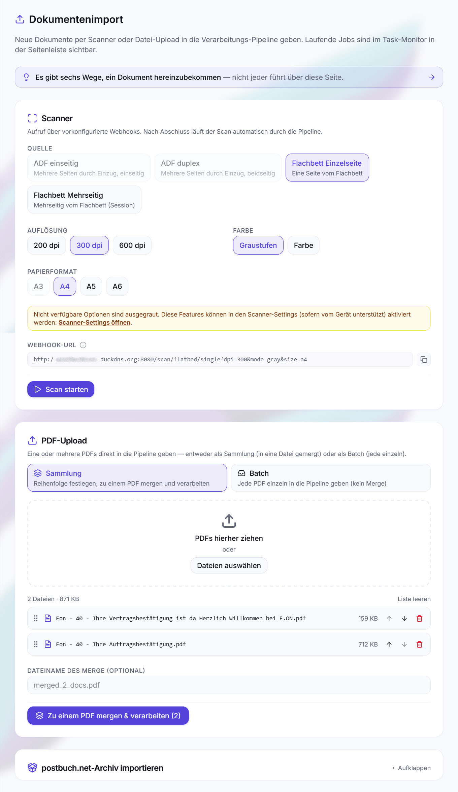

# Dokumente importieren

postbuch.net nimmt **PDF-Dateien** und **Papier** entgegen – sonst nichts.
Papier wird dabei zuerst zu einer PDF: gescannt oder mit dem Handy
abfotografiert.

Word-Dateien, Bilder, Tabellen oder E-Mails werden nicht angenommen. Grund ist
kein fehlendes Format, sondern der Anspruch an das Ergebnis: Die KI-Analyse, die
Dateiablage in der Cloud, die Seitenansicht, der Etikettendruck und jeder spätere
Export arbeiten mit einem einzigen, seitengetreuen Format. Wandle solche Dateien
vorher in eine PDF um – jedes Textprogramm und jedes Handy kann das.

Es gibt sechs Eingangswege. **Alle münden in dieselbe Warteschlange**: Was
danach passiert, ist unabhängig davon, woher das Dokument kam.

| #   | Weg                                                                                                                        | Art    |
| --- | -------------------------------------------------------------------------------------------------------------------------- | ------ |
| 1   | [ Überwachter Cloud-Ordner](#weg-1-überwachter-cloud-ordner)               | PDF    |
| 2   | [ Scannen per Foto vom Smartphone](#weg-2-scannen-per-foto-vom-smartphone)       | Papier |
| 3   | [ Datei-Upload über „Importieren"](#weg-3-datei-upload)                                 | PDF    |
| 4   | [ Scannen über „Importieren"](#weg-4-scannen-über-importieren)                       | Papier |
| 5   | [ Scan-Webhook im eigenen Netz](#weg-5-scan-webhook-im-eigenen-netz)                   | Papier |
| 6   | [ Scanner speichert direkt in die Cloud](#weg-6-scanner-speichert-direkt-in-die-cloud) | Papier |

Dieselbe Übersicht zeigt die App selbst unter 
**Importieren → „Es gibt sechs Wege, ein Dokument hereinzubekommen"** – dort mit
den aufgelösten Ordnerpfaden deiner Instanz. Direkt nach dem
Einrichtungsassistenten erscheint sie einmal von selbst.



_Die Import-Seite mit Scanner-Einstellungen, PDF-Sammlung und bereits
ausgewählten Dateien._

## Weg 1: Überwachter Cloud-Ordner

Legst du eine PDF in den Ordner `<postbuch.net-Wurzelverzeichnis>/_inbox` deiner Dateiablage, holt postbuch.net sie
von selbst ab. Der vollständige Pfad ist `<postbuch.net-Wurzelverzeichnis>/_inbox`; welcher
Wurzelordner das auf deiner Instanz ist, steht in der App unter
 `Importieren → Sechs Wege` und unter
 `Einstellungen → Dateiablage`.

Das Polling läuft ab dem Anlegen der Ordnerstruktur alle **60 Sekunden**; unter
 `Einstellungen → Dateiablage` lässt es
sich ausschalten und das Abfrageintervall ändern. Mehrere Dateien auf einmal
sind ausdrücklich vorgesehen – jede wird ein eigenes Dokument.

Das ist der bequemste Weg, wenn die Cloud ohnehin auf deinem Gerät eingebunden
ist: unter Windows als Ordner im Explorer, unter Android eine PDF über „Teilen"
an die OneDrive- oder Nextcloud-App senden und dort in
`<postbuch.net-Wurzelverzeichnis>/_inbox` ablegen. Die PDF-Rechnung aus dem
Mail-Anhang ist damit in zwei Klicks in postbuch.net.

## Weg 2: Scannen per Foto vom Smartphone

Ohne Scanner im Haus: Die App deiner Cloudablage bringt einen Dokumentenscan
mit. OneDrive und Nextcloud entzerren die abfotografierte Seite, schneiden sie
zu und speichern sie als PDF; mehrere Seiten landen in einer Datei.

Als Zielordner `<postbuch.net-Wurzelverzeichnis>/_inbox` wählen – damit läuft der
Scan über denselben überwachten Ordner wie
[Weg 1](#weg-1-überwachter-cloud-ordner).

## Weg 3: Datei-Upload

Auf der Seite  `Importieren` per Drag & Drop
oder Dateiauswahl. Zwei Modi:

 **Sammlung** – Alle abgelegten PDFs werden
vorab **zu _einer_ Datei zusammengeführt** und als _ein_ Dokument verarbeitet.
Die Reihenfolge lässt sich vorher per  /
 Pfeiltasten ändern, der Dateiname ist
frei wählbar. Das ist der Weg für einen Brief mit Anlagen oder ein mehrteilig
gescanntes Schreiben.

 **Batch** – Jede Datei wird **separat**
verarbeitet und bekommt eine eigene Postnummer. Das ist der Weg für einen Stapel
unabhängiger Dokumente.

## Weg 4: Scannen über „Importieren"

Voraussetzung ist ein eSCL-fähiger Netzwerkscanner und das Compose-Profil
`scanner`. Eingerichtet wird er unter
 `Einstellungen → Scanner` oder im
Einrichtungsassistenten; die Gerätesuche findet Geräte im eigenen Netz selbst.
Antwortet das Gerät beim Test, schaltet postbuch.net das Compose-Profil
`scanner` automatisch ein – sofern der Host-Agent läuft. Ausschalten geht unter
 `Einstellungen → Scanner` und nur
nach ausdrücklicher Rückfrage; danach erreichen gescannte Seiten postbuch.net
nicht mehr.

Auf der  Import-Seite wählst du in der
 Scanner-Card:

| Einstellung      | Optionen                                                                            |
| ---------------- | ----------------------------------------------------------------------------------- |
| **Quelle**       | ADF · ADF Stapel · Flachbett Einzelseite · Flachbett Mehrseitig (Session)           |
| **Seiten**       | Vorderseite · Beidseitig – nur bei ADF-Quellen und nur, wenn der Scanner laut Einstellungen duplexfähig ist; Vorgabe ist Beidseitig |
| **Auflösung**    | Was das Gerät für die gewählte Quelle meldet                                        |
| **Farbe**        | Graustufen oder Farbe                                                               |
| **Papierformat** | A3 (falls unterstützt), A4, A5, A6 – nur bei Flachbett (Einzelseite oder Mehrseitig) |

Auflösung und Farbmodus hängen an der Quelle – der Einzug eines Geräts kann
andere Werte anbieten als das Flachbett. Beim Einzug (ADF) ist das Papierformat
fest auf A4 eingestellt, dort gibt es keine Auswahl. Ist der Scanner laut
Einstellungen nicht duplexfähig, entfällt der Seiten-Schalter und es wird immer
nur die Vorderseite gescannt.

Bei **Flachbett Mehrseitig** läuft eine Session: Seite auflegen, scannen,
nächste Seite auflegen, und am Ende die Session abschließen. Alle Seiten werden
zu einem Dokument. Das gewählte Papierformat gilt für die gesamte Session und
lässt sich nach der ersten Seite nicht mehr ändern. Passiert 60 Sekunden lang
nichts mehr, wird eine Session automatisch abgeschlossen und die bis dahin
gescannten Seiten gehen in die Verarbeitungs-Pipeline.

Bei **ADF** werden alle eingezogenen Blätter zu **einem** Dokument
zusammengefasst – das eignet sich für ein mehrseitiges Schreiben. Willst du
dagegen mehrere unterschiedliche Belege auf einmal in den Einzug legen, nutze
**ADF Stapel**: Hier wird **jedes Blatt zu einem eigenen Dokument**. Bei
Beidseitig zählen Vorder- und Rückseite eines Blatts zusammen; eine leere
Rückseite wird automatisch entfernt, sodass das Ergebnis in diesem Fall
einseitig ist. Kommt es mitten im Stapel zu einem Papierstau, gehen die bereits
fertig gescannten Blätter trotzdem einzeln in die Pipeline; nur für die
verbliebenen Blätter musst du den Vorgang wiederholen.

Nach dem Scan durchläuft jede Datei die Bereinigungs-Pipeline im
`cleaner`-Container (automatische Drehung, Zuschnitt, Entzerrung, OCR-Textebene)
und wird dann an die App übergeben. Im ADF-Stapel mit Beidseitig werden für den
Zuschnitt die Inhaltsmasken beider Seiten übereinandergelegt. So bestimmt der
gesamte Nutzinhalt von Vorder- und Rückseite den gemeinsamen Ausschnitt, der
auf beide Seiten angewendet wird. Automatisch erkannte Leerseiten werden bei
Beidseitig entfernt (typische unbedruckte Rückseite); bei Vorderseite und
Flachbett Mehrseitig bleibt jede gescannte Seite erhalten, da du sie dort
bewusst selbst ausgelöst hast.

### Scanner-Erkennung kalibrieren

Administrierende Personen können unter **Einstellungen → Scanner →
Scanner-Kalibrierungsassistent** bis zu drei einseitige Testseiten aufnehmen.
Diese Dateien bleiben ausschließlich im lokalen Testbereich: Sie durchlaufen
weder die Dokumentpipeline noch die Datenbank und erhalten keine PostID.

Für eine belastbare Abstimmung eignen sich unterschiedliche Grenzfälle – etwa
eine wirklich leere Seite, helles Durchscheinen von der Vorderseite und ein
blasser Thermobeleg. Im zweiten Schritt zeigt der Assistent für alle Testseiten
live, ob sie als Leerseite entfernt würden und wo der automatische Zuschnitt
läge. Erst die ausdrückliche Bestätigung im letzten Schritt übernimmt die Werte.
Der Assistent darf jederzeit folgenlos geschlossen werden; vorhandene Testseiten
stehen beim nächsten Start wieder bereit und können einzeln ersetzt oder
gelöscht werden.

## Weg 5: Scan-Webhook im eigenen Netz

Jede Scan-Einstellung auf der Import-Seite hat eine eigene Adresse. Sie steht
dort als **Webhook-URL** zum Kopieren und ändert sich mit Quelle, Auflösung,
Farbmodus und Format – die angezeigte URL gehört immer genau zu dem, was gerade
eingestellt ist. Ihre Form:

```
http://<adresse-dieser-instanz>:<scanner-port>/scan/adf/simplex?dpi=300&mode=gray
```

Ein Aufruf dieser URL löst sofort einen Scan aus. Das ist eine **technische
Schnittstelle** für andere Geräte im selben Netz: ein Smarthome-Knopf neben dem
Scanner, eine Tastenbelegung, ein Skript, eine Hausautomatisierung. Für den
täglichen Gebrauch brauchst du sie nicht.

> [!NOTE]
>
> Der Scanner-Dienst hört nur im lokalen Netz und kennt keine Anmeldung. Er
> gehört deshalb nie ins Internet weitergeleitet – wer die Adresse erreicht,
> kann scannen.

Bei **Flachbett Mehrseitig** braucht es mehrere Aufrufe: je Seite
`/scan/flatbed/session/scan`, am Ende `/scan/flatbed/session/finish`.

## Weg 6: Scanner speichert direkt in die Cloud

Manche Netzwerkscanner können selbst in eine Cloud ablegen. Ist deine
Cloud-Dateiablage mit `<postbuch.net-Wurzelverzeichnis>/_inbox` als Ziel
eingerichtet, holt postbuch.net die Scans wie jede andere Datei über
[Weg 1](#weg-1-überwachter-cloud-ordner) ab.

Das können nur wenige Geräte. Ob es geht, entscheidet allein der Scanner. Eine
Bereinigung durch den `cleaner`-Container findet auf diesem Weg nicht statt –
die Seiten kommen so an, wie das Gerät sie speichert.

## Was danach passiert

Die Verarbeitung läuft in Phasen. Standardmäßig laufen bis zu **drei** Dokumente
gleichzeitig. Anpassen lässt sich das unter

`Einstellungen → Allgemein → Verarbeitungs-Pipeline`.

| Phase | Was passiert                                                                                                     |
| ----- | ---------------------------------------------------------------------------------------------------------------- |
| 0     | Scanner-Eingang in die Dateiablage hochladen                                                                          |
| 1     | PDF herunterladen                                                                                                |
| 2     | **KI-Analyse** – Absender, Datum, Betreff, Zusammenfassung, Schlagwörter, Lebensbereich × Dokumentart, Fachdaten |
| 2.5   | Validierung und Reparatur der KI-Ausgabe                                                                         |
| 3     | **Duplikatprüfung** über Embedding-Ähnlichkeit                                                                   |
| 4     | Duplikat-Handling, falls nötig                                                                                   |
| 5     | Dateiablage in den Zielordner, Umbenennung                                                                            |
| 6     | PWA-/Browser-Push und, falls bewusst eingerichtet, experimentelles Discord                                       |
| 7     | PDF-Rotation korrigieren                                                                                         |
| 8     | Datenbank-Einträge inkl. Embedding                                                                               |
| 9     | PDF-Cache (das Embedding wurde bereits in Phase 8 gespeichert)                                                   |

Den Fortschritt siehst du live im Navigationpunkt `Logs → Jobs`. Die Seite darf
man verlassen.

Bei einem Cloud-Anbieter rufen die KI-Phasen den eingestellten Provider
kostenpflichtig auf; bei einem lokal betriebenen, OpenAI-kompatiblen Anbieter
entstehen keine externen API-Kosten pro Dokument. Ein Import umfasst
normalerweise Voranalyse, Hauptanalyse und ein Embedding; bei
Reparatur, Fallback oder einem Erstattungsbescheid können weitere Aufrufe
dazukommen. Als grobe Orientierung sind **1–20 Eurocent je Dokument** üblich,
mit günstigen Modellen auch weniger und bei langen, schwierigen oder mehrfach
versuchten Dokumenten auch mehr. Die vollständige Aufschlüsselung steht unter
[KI-Anbieter → Kosten und kostenpflichtige Aufrufe](ki-provider.md#kosten-und-kostenpflichtige-aufrufe).

### Duplikate (Experimentell)

Erkennt Phase 3 ein wahrscheinliches Duplikat, wird die Verarbeitung
**angehalten** statt blind fortgesetzt. Auf dem Dashboard erscheint eine
**offene Entscheidung**: das neue und das bestehende Dokument nebeneinander, mit
der Wahl zwischen Verwerfen, Ersetzen und Trotzdem anlegen. Dieselbe
Entscheidung lässt sich aus der PWA-/Browser-Push-Nachricht öffnen. Ist die
nicht empfohlene, experimentelle Discord-Anbindung bewusst eingerichtet, enthält
auch deren Meldung einen Link oder Bot-Schaltflächen.

Das Feature ist experimentell. Aktuell werden viele Duplikate nicht zuverlässig
erkannt.

### Wenn etwas schiefgeht

Fehlgeschlagene Dokumente landen im Ordner
`<postbuch.net-Wurzelverzeichnis>/_failed` der Dateiablage und erscheinen in einer
eigenen Karte auf dem Dashboard, von wo aus sich die Verarbeitung wiederholen
lässt. Angehaltene Läufe (z. B. wegen Duplikatverdacht) liegen in
`<postbuch.net-Wurzelverzeichnis>/_suspended` und werden fortgesetzt, sobald du
entschieden hast.

Häufige Ursachen und ihre Behebung stehen unter
[Betrieb und Troubleshooting](betrieb-troubleshooting.md).

## Nachträglich korrigieren

 **Erneut verarbeiten** – Auf der
Detailseite eines Dokuments lässt sich die KI-Analyse wiederholen, wahlweise mit
einer anderen Modellstufe (Auto, Lang, Leicht, Mittel, Schwer). Man kann dem
Modell auch eine Freitext-Korrekturanweisung mit auf den Weg geben, die es
beachten wird. Sinnvoll, wenn ein schwieriges Dokument beim ersten Versuch
falsch verstanden wurde. Optional lässt sich dabei die OCR-Textebene entfernen,
wenn sie schlechter ist als das Bild selbst; postbuch.net schlägt das von sich
aus vor, wenn es eine fragwürdige Textebene erkennt. Dabei entstehen erneut
ungefähr dieselben KI-Kosten wie beim Import; eine feste Modellstufe spart die
Voranalyse, nicht aber die Hauptanalyse und das neue Embedding.

 **PDF ersetzen** – Ersetzt nur die
PDF-Datei (neuer Scan derselben Sache, in besserer Qualität). Die Postnummer,
alle Metadaten, Akten- und
Verbleib-Zuordnungen bleiben unverändert, und es läuft **kein** KI-Lauf.
Erreichbar über die Aktionsleiste des Dokuments. Fehlt die bisherige Datei in
der Dateiablage bereits nachweislich, heißt derselbe Knopf **Fehlende PDF
reimportieren** (siehe
[Wenn eine Datei endgültig fehlt](storage-backends.md#wenn-eine-datei-endgültig-fehlt)).

**Dokumentart ändern** – Ist die neue Art mit der alten kompatibel (gleiche
Fachdatenstruktur), werden Datenbank und Dateiablageort direkt aktualisiert. Das
Dokument wird auch in der Dateiablage entsprechend verschoben. Erfordert die neue Art
eine andere Auswertung, fragt postbuch.net nach und startet danach eine
KI-Wiederverarbeitung.

**Manuelle Änderungen** – Fast alle Metadatenfelder lassen sich über das  Stift-Symbol händisch korrigieren. Vor allem für kleinere Änderungen ist das oft der schnellste Fix.

## Cache-Mode

Wer viele Dokumente am Stück einliest – etwa beim erstmaligen Digitalisieren
eines Aktenschranks –, kann den **Cache-Mode** einschalten. Er bündelt die
Verarbeitung auf ein _fixes_ Modell und nutzt dessen Prompt-Caching, was die
Kosten deutlich senkt.

- Die Modellstufe wird vorher gewählt und bleibt für die Dauer fest.
- Der Modus gilt **global** für alle Eingangswege, auch Scanner und
  Cloud-Ordner.
- Lange Dokumente (mehr als 10 Seiten) laufen weiterhin über die normale Kette.
- Ohne neue Verarbeitung schaltet sich der Modus nach einer Weile selbst ab; die
  verbleibende Zeit steht auf der Karte.

Die Karte erscheint auf der Import-Seite nur, wenn Cache-Mode in den
KI-Einstellungen freigeschaltet ist.

## Sonderfall: Dokumentenübergabe einspielen

Kein Weg für ein erstes Dokument, sondern für einen bestehenden Bestand: Ein
zuvor exportiertes **Dokumentenübergabe-ZIP** wird ohne erneuten KI-Lauf wieder
eingelesen. Abrechnungsperioden, Akten, Wiedervorlagen, Salden und PKV-Prüfungen
werden bewusst nicht übernommen; direkte Beziehungen zwischen den im Paket
enthaltenen Dokumenten bleiben erhalten. Vor dem Import ordnest du die
Personen aus dem Paket den Menschen dieser Instanz zu. Nur mit Admin-Zugang
sichtbar, bis 2 GB pro ZIP. Ausführlich in
[Export und Import](export-import.md#anwendungsfall-dokumente-in-eine-andere-instanz-umziehen).

---

Weiter: [Die Dokumentansicht](dokumentansicht.md) ·
[Zurück zur Übersicht](README.md)
