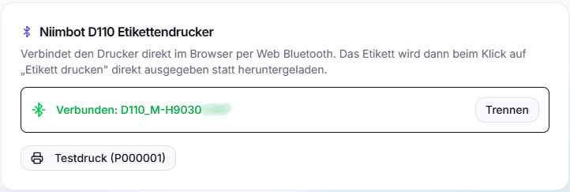
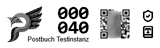

# Etiketten drucken

Ein digitalisiertes Dokument ist gut auffindbar, das Papieroriginal im Ordner
nicht. postbuch.net schließt diese Lücke mit kleinen Klebeetiketten: Du klebst
eines auf das Blatt oder auf den Ordnerrücken und hast damit die **PostID** und
einen **QR-Code** in der Hand, der direkt auf die Detailseite führt.

Das Etikett ist der physische Gegenpol zum
[Verbleib](akten-und-organisation.md): Der Verbleib sagt dir, wo das Papier
liegt; das Etikett sagt dem Papier, wo im System es hingehört.

## Hardware

Unterstützt wird der **Niimbot D110** – ein handtellergroßer Thermodrucker, der
über Bluetooth angesprochen wird und ohne Tinte oder Toner auskommt.

- **Etikettenband: 12 × 40 mm**, weiß, schwarze Schrift, **mit Lücken** („with
  gaps", also einzelne Etiketten auf Trägerband, keine Endlosrolle).
- Andere Bandgrößen sind nicht vorgesehen: Der Etikettenaufbau ist fest auf 320
  × 96 Druckpunkte gerechnet, was genau 12 mm Druckkopfbreite bei 40 mm
  Etikettenlänge entspricht.

Der Drucker wird **direkt aus dem Browser** angesprochen, nicht vom Server. Der
postbuch.net-Server muss den Drucker also weder sehen noch kennen; er kann in
einem ganz anderen Raum stehen.

## Browser-Voraussetzungen

Die Verbindung läuft über **Web Bluetooth**. Das schränkt die Browserwahl ein:

| Umgebung                              | Etikettendruck                       |
| ------------------------------------- | ------------------------------------ |
| Chrome / Edge / Brave auf **Android** | ✅                                   |
| Chrome / Edge / Brave auf **Windows** | ✅                                   |
| Chrome auf **Linux**                  | meist ja, je nach Bluetooth-Stack    |
| **Firefox** (alle Systeme)            | ❌ keine Web-Bluetooth-Unterstützung |
| **Safari** / iPhone / iPad            | ❌ keine Web-Bluetooth-Unterstützung |

Zusätzlich verlangt Web Bluetooth einen _secure context_: Die App muss über
**HTTPS** (oder `localhost`) laufen. Über eine nackte `http://…`-LAN-Adresse
erscheint der Drucker-Bereich zwar, die Verbindung kommt aber nicht zustande.

Erkennt die App keinen Web-Bluetooth-Support, zeigt sie das in den Einstellungen
offen an, statt den Knopf ins Leere laufen zu lassen.

## Drucker verbinden

Eine Einrichtung in den Einstellungen ist **nicht nötig**, um zu drucken. Die
Kopplung entsteht immer **ad hoc**, dort wo gerade gedruckt wird – siehe
[Etikett drucken](#etikett-drucken): Klickst du dort zum allerersten Mal
überhaupt auf **Etikett drucken**, ohne dass der Drucker je zuvor verbunden war,
fragt der Browser in genau diesem Moment nach dem Gerät und druckt anschließend.

 **Einstellungen → Drucker** (nur für
Administratoren sichtbar) dient ausschließlich dazu, die Verbindung **isoliert
zu testen** – Kopplung prüfen, Testdruck auslösen, Bandlage kontrollieren –
bevor man produktiv aus einem Dokument heraus druckt. Ein Umweg über die
Einstellungen ist dafür kein Muss.

1.  **Verbinden** klicken. Der Browser
   öffnet seinen eigenen Geräte-Dialog.
2. Den D110 auswählen. Eine vorherige Kopplung im Betriebssystem ist **nicht**
   nötig – der Browser erledigt das mit.
3. Nach erfolgreicher Verbindung steht dort „Verbunden: _Gerätename_".
4.  **Testdruck (P000001)** druckt ein
   Beispieletikett, damit du Bandlage und Schwärzung prüfen kannst, bevor du
   echte Dokumente etikettierst.

Die Verbindung lebt nur so lange wie die geöffnete Seite: **Nach jedem Neuladen
musst du erneut verbinden.** Das ist eine Eigenschaft von Web Bluetooth, keine
Einstellung – Browser geben Bluetooth-Zugriff nur nach ausdrücklicher
Nutzergeste frei und behalten ihn nicht über Seitenaufrufe hinweg.

## Etikett drucken

Etiketten werden nicht in den Einstellungen gedruckt, sondern dort, wo sie
gebraucht werden: auf der **Detailseite eines Dokuments**, im Menü des
[Verbleib-Abzeichens](akten-und-organisation.md#verbleib-wo-liegt-das-papier).

1. Dokument öffnen.
2. Auf das Verbleib-Abzeichen klicken (das kleine Feld mit Symbol und
   Ablageort).
3.  **Etikett drucken** wählen.

Was dann passiert, hängt vom Zustand ab:

| Zustand                               | Verhalten                                                        |
| ------------------------------------- | ---------------------------------------------------------------- |
| Drucker verbunden                     | Etikett wird sofort gedruckt                                     |
| Nicht verbunden                       | Der Browser fragt nach dem Gerät; danach wird gedruckt           |
| Verbindung abgelehnt oder Druckfehler | Das Etikett wird als PNG heruntergeladen (`etikett-P000123.png`) |

Der Download-Fallback ist ausdrücklich Teil des Ablaufs: Auf einem iPhone oder
in Firefox bekommst du zwar keinen Direktdruck, aber immer noch die fertige
Bilddatei – die du über ein anderes Programm auf denselben Drucker geben oder
archivieren kannst.

## Was auf dem Etikett steht

Das Layout ist fest und für 12 mm Höhe und 40 mm Breite auf Lesbarkeit
optimiert:

| Bereich      | Inhalt                                                                                                                                                  |
| ------------ | ------------------------------------------------------------------------------------------------------------------------------------------------------- |
| links        | postbuch.net-Logo, monochrom gerastert                                                                                                                  |
| Mitte links  | die **PostID-Ziffern**, zweizeilig in Dreiergruppen (`000` / `123`)                                                                                     |
| Mitte rechts | **QR-Code** auf die Detailseite (`<deine-adresse>/postbuch/P000123`)                                                                                    |
| rechts außen | Das **Verbleib-Symbol** der gewählten Kategorie und – falls zutreffend – das **Urkunden-Kennzeichen** () |
| unten        | der **Instanzname**, klein und rechtsbündig                                                                                                             |

Die zweizeiligen Dreiergruppen sind Absicht: Sechs Ziffern nebeneinander wären
bei 12 mm Bandhöhe zu klein, um sie im Regal ablesen zu können. Der Instanzname
kommt aus `INSTANCE_NAME` bzw. den Einstellungen.

Der QR-Code wird pixelgenau ins Druckraster gerechnet (ein QR-Modul entspricht
einer ganzen Anzahl Druckpunkte), damit er beim Druck sauber scannbar bleibt. Er
enthält Host und Pfad, unter denen du postbuch.net aufrufst – ohne
Protokollangabe; die meisten Scanner ergänzen sie automatisch. Scannbar ist er
folglich nur, solange das Gerät diesen Host erreicht.

## Praxis

- **Kein Einrichtungsschritt vorab nötig**: Du kannst direkt aus einem Dokument
  heraus auf „Etikett drucken" klicken, auch wenn der Drucker noch nie verbunden
  war – die Kopplung passiert dann in diesem Moment.
- **Etikettieren lohnt sich bei allem, was in Papierform aufgehoben wird**:
  Urkunden, Verträge, Bescheide, Handwerkerrechnungen mit Garantiebezug.
  Alltagspost, die ohnehin in den Schredder geht, braucht kein Etikett.
- **Reihenfolge**: erst Verbleib und Urkunden-Kennzeichen setzen, dann drucken –
  die Symbole auf dem Etikett kommen aus genau diesen Feldern.
- Thermoetiketten verblassen bei direkter Sonne und Hitze. Für Dokumente, die
  jahrzehntelang lesbar bleiben sollen, ist der QR-Code ein Komfortmerkmal, kein
  Archivierungsmittel – die Wahrheit steht in der Datenbank und in der Dateiablage.

---

Weiter: [MCP-Zugriff](mcp.md) · [Zurück zur Übersicht](README.md)
