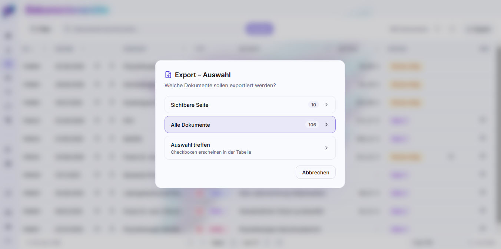

# Export und Import

Deine Dokumente sollen dich überallhin begleiten können – zum Anwalt, zur
Steuerberaterin, in die Instanz deines Kindes, das ausgezogen ist, oder auf eine
Festplatte, die von postbuch.net nichts weiß. Deshalb gibt es vier Exportformate.
Eines davon ist die **Dokumentenübergabe** in eine andere postbuch.net-Instanz.

## Wo Export startet

Der Export-Dialog ist an zwei Stellen erreichbar, jeweils über den
 **Export**-Button oben rechts über der Tabelle:

-  **Dokumente** (die Hauptliste) – exportiert, was dort gerade zu sehen ist,
  einschließlich aller gesetzten Filter.
-  **Akte** (Detailseite einer Akte) – exportiert die Dokumente der Akte in ihrer
  festgelegten Reihenfolge, mit den Akten-Metadaten im Deckblatt.

Der Dialog fragt in zwei Schritten: erst **welche Dokumente**, dann **welches
Format**.

### Schritt 1: Umfang

| Auswahl | Bedeutung |
|---|---|
|  **Sichtbare Seite** | genau die Zeilen der aktuellen Seite |
|  **Alle Dokumente** | alles, was auf die **aktiven Filter** passt – nicht nur die aktuelle Seite |
|  **Auswahl treffen** | Ankreuzfelder erscheinen in der Tabelle, du pickst einzeln |

„Alle Dokumente" holt die Trefferliste seitenweise nach. Bei sehr großen Mengen
kannst du trotzdem in Teilmengen exportieren – etwa Jahr für Jahr über den
Datumsfilter – damit die Übergabe übersichtlich bleibt.

### Schritt 2: Format

| Format | Ergebnis | Grenze |
|---|---|---|
|  **Zusammengeführte PDF** | ein einziges PDF: Deckblatt mit Inhaltsverzeichnis, dahinter alle Dokumente | max. **50** Dokumente |
|  **ZIP-Archiv** | einzelne PDFs plus Deckblatt in einem ZIP | – |
|  **Excel-Tabelle** | die Spalten der aktuellen Ansicht plus Link in die Dateiablage | – |
|  **Dokumentenübergabe (ZIP)** | wieder importierbar: je Dokument eine PDF **und** eine JSON mit den übertragbaren Fach- und Metadaten | – |

Bei mehr als zehn Dokumenten laufen PDF-, ZIP- und Dokumentenübergabe-Export als
Hintergrundjob mit Fortschrittsanzeige; der Download startet, sobald die Datei
fertig ist. Beim Dokumentenübergabe-Export bricht der Export ab, wenn ein
angefordertes Dokument oder seine PDF nicht vollständig gelesen werden kann.

### Das Deckblatt

PDF- und ZIP-Export bekommen ein generiertes Deckblatt: Name der Instanz,
Exportdatum, Anzahl und eine Tabelle aller enthaltenen Dokumente mit Datum, Art,
Kontakt, Betreff, Status und Betrag. Die Tabellenzeilen sind **verlinkt** – im
zusammengeführten PDF springt ein Klick zur richtigen Seite, im ZIP öffnet er
die zugehörige Datei daneben. Beim Export aus einer Akte trägt das Deckblatt
zusätzlich Betreff, Beschreibung, Schlagwörter und Notiz der Akte und heißt
`Übersicht.pdf`.

Die Dateien im ZIP sind durchnummeriert und tragen PostID und Betreff im Namen,
sodass die Reihenfolge auch im Dateimanager erhalten bleibt.

## Anwendungsfall: Akte an den Anwalt

Alles zu einem Vorgang, in einer Datei, in der richtigen Reihenfolge:

1. Akte öffnen, Dokumente in die gewünschte Reihenfolge bringen.
2.  `Export` → `Alle Dokumente in Akte` →  **Zusammengeführte PDF**.
3. Fertig ist ein PDF, das mit einem Inhaltsverzeichnis beginnt und aus dem man
   direkt in jedes Dokument springen kann.

Bei mehr als 50 Dokumenten nimmst du stattdessen das **ZIP-Archiv** – dann liegt
das Deckblatt als eigene Datei bei, und die Links darin öffnen die
Einzeldateien.

## Anwendungsfall: Dokumente in eine andere Instanz umziehen

Das Kind zieht aus und betreibt künftig eine eigene postbuch.net-Instanz. Seine
Dokumente sollen mit – einschließlich der dokumenteigenen Fachdaten wie
bestrittenen Rechnungsbeträgen, aber ohne Abrechnungsperioden, Akten- und
Wiedervorlagekontext und ohne erneute KI-Analyse.

**Auf der abgebenden Instanz:**

1.  **Dokumente** öffnen, im Filter die Person auswählen. Zwei Ankreuzfelder
   steuern, in welcher Rolle sie zählt:
   - *als Adressat/Absender* – Post, die an sie ging oder von ihr kam,
   - *als Patient* – Arztrechnungen, Berichte und Erstattungspositionen, die sie
     betreffen.

   Für einen vollständigen Umzug lässt du beide an. Prüfe die Trefferzahl, bevor
   du weitergehst.
2. Bei Bedarf zusätzlich einschalten, dass **historische** Dokumente mitkommen.
3.  `Export` → `Alle Dokumente` →  **Dokumentenübergabe (ZIP)**.

**Auf der aufnehmenden Instanz:**

4.  **Importieren** öffnen (nur mit Admin-Zugang sichtbar), Karte
   *Dokumentenübergabe importieren* (ganz unten) aufklappen.
5. ZIP hineinziehen, Konfliktverhalten wählen (siehe unten), **Übergabe prüfen**.
6. Personen zuordnen (siehe unten), dann  **Import starten**.

Das ZIP wird direkt von der Platte gestreamt hochgeladen (kein Zwischenspeichern
im Arbeitsspeicher). Ein Fortschrittsbalken zeigt zuerst den Upload, danach die
Prüfung des Pakets. Anschließend wartet die vorbereitete Übergabe **30 Minuten**
auf deine Zuordnung; verlässt du die Seite in diesem Schritt oder läuft die
Frist ab, lädst du das ZIP erneut hoch. **Abbrechen** verwirft die vorbereitete
Übergabe sofort. Nach **Import starten** läuft der Import im Hintergrund; die
Seite kann dann verlassen und der Fortschritt später erneut abgerufen werden. Es
kann jeweils nur eine Dokumentenübergabe gleichzeitig vorbereitet oder
importiert werden.

### Personen zuordnen

Personen hängen an Dokumenten über ihren Kurznamen – als Adressat/Absender und
als behandelte Person bei Arztrechnungen, Arztberichten und Positionen von
Erstattungsbescheiden. Heißen die Menschen auf beiden Instanzen nicht exakt
gleich, würden Dokumente sonst ins Leere zeigen. Deshalb listet die Prüfung
**alle Personennamen des Pakets** mit der Zahl ihrer Dokumente und je einem
Auswahlfeld:

| Anzeige | Bedeutung |
|---|---|
| **exakt** (grün) | Kurzname identisch – vorausgewählt |
| **Vorschlag – …** (gelb) | eindeutiger Treffer über andere Schreibweise (Groß-/Kleinschreibung, Umlaute, Leerzeichen), gleichen Anzeigenamen oder einen kleinen Tippfehler – vorausgewählt, bitte prüfen |
| *Kein eindeutiger Treffer* | nichts vorausgewählt – du entscheidest |

Für jeden Namen wählst du einen vorhandenen Menschen, **Keine Zuordnung** (das
Feld bleibt am Dokument leer) oder **+ Neu anlegen …**. Letzteres öffnet den
bekannten Dialog aus `Einstellungen → Personen & Zugänge`, vorbelegt mit Kurz-
und Anzeigenamen aus dem Paket; nach dem Speichern ist der neue Mensch direkt
zugeordnet.

**Import starten** ist erst möglich, wenn jeder Name entschieden ist. Die
Zuordnung gilt für das gesamte Paket, die importierten Dokumente brauchen danach
kein eigenes Review. Umgeschrieben werden nur die Personenfelder; ein Name, der
in Betreff, Zusammenfassung oder Notiz als Freitext vorkommt, bleibt unverändert.
Der Importbericht listet die angewendete Zuordnung.

Der Import lädt jede PDF in die Dateiablage der Zielinstanz und schreibt die
Metadaten Spalte für Spalte aus den JSONs – **keine KI-Analyse und keine
Duplikat-Pipeline**. LxD-Codes werden im Ziel streng geprüft. Beziehungen zu
nicht enthaltenen Dokumenten werden aufgelöst und im Bericht ausgewiesen. Am Ende
steht ein Bericht: importiert / übersprungen / fehlerhaft.

> [!WARNING]
>
> ⚠️ Der Archiv-Upload ist auf **2 GB pro ZIP** begrenzt, entpackt auf
> **4 GB**. Größere Bestände exportierst und importierst du in mehreren
> Paketen, z. B. jahresweise. Für den Upload braucht der Server freien
> Speicherplatz in Höhe der ZIP-Größe plus 1 GiB Reserve; fehlt er, lehnt
> postbuch.net den Upload vorab ab und nennt benötigten und freien Platz. Ein Archiv darf höchstens 20.000 Einträge
> enthalten; verschlüsselte ZIPs werden abgelehnt. Sehr große Exportpakete
> nutzen ggf. das Zip64-Format – ältere postbuch.net-Instanzen vor dieser
> Version können ein Zip64-ZIP nicht importieren; beim Aufteilen in kleinere
> Pakete entfällt das.

Erst wenn der Import auf der Zielinstanz geprüft ist, räumst du auf der
Quellinstanz auf – über  `Einstellungen → Personen & Zugänge`, wo der
Löschdialog dir vorher zeigt, wie viele Dokumente betroffen sind und was mit
gemischten Dokumenten (mehrere beteiligte Personen) passiert.

### Was in der Dokumentenübergabe steckt

`manifest.json` – Formatkennung und -version, erzeugende App-Version,
Exportzeitpunkt, Instanzname, eine explizite Liste des enthaltenen und bewusst
ausgelassenen Umfangs sowie eine **Personenlegende**: Kurzname, Anzeigename und
Tier-Kennzeichen der Menschen, die in den enthaltenen Dokumenten vorkommen. Sie
dient der Zielinstanz nur für Zuordnungsvorschläge und das Vorbelegen beim
Neuanlegen; weitere Stammdaten wie Versicherung, Sätze oder Zugänge stecken
nicht darin.

Pro Dokument `P000123.pdf` und `P000123.json` – die Originaldatei und daneben:

- alle übertragbaren Felder aus der Dokumenttabelle (Datum, Art, Kontakt, Betreff,
  Zusammenfassung, Schlagwörter, Status, Notiz, Richtung, LxD und Prüfsumme …),
- die fachlichen Detaildaten der Spezial-Pipeline (Arztrechnung mit
  Einzelpositionen, bestrittenem Betrag sowie Erstattungsbescheid mit Positionen
  und Kürzungen, …),
- den Embedding-Vektor mit seiner **Signatur** (Provider/Modell/Dimension),
- die dokumenteigene Reparatur-/Provenienzspur (`data_repaired_at` und
  `data_repairs`),
- den ursprünglichen KI-Extraktionsblob 1:1 als Beleg.

Exportiert werden die **echten Datenbankwerte** einschließlich deiner
Korrekturen, nicht bloß das, was die KI damals gelesen hat.

Nicht Bestandteil der Dokumentenübergabe sind Abrechnungsperioden und ihre
Bescheidbindungen, PKV-Prüfungen, Abrechnungssessions, Akten und Aktenlinks,
Wiedervorlagen, Verbleib-Referenzen, Personenstammdaten, Salden, Logs und Caches.
Die Periodenfelder an Arztrechnungen werden im Übergabepaket nicht geschrieben
und beim Import auch dann auf `NULL` zurückgesetzt, wenn der Ziel-Datenbanktrigger
für eine bekannte Person zunächst eine offene Sammelperiode ableiten würde. `NULL` bedeutet dabei „keine aktive
Periodenzuordnung“, nicht Periode 0.

Eine Rechnung und ein Erstattungsbescheid können trotzdem miteinander verbunden
bleiben, wenn beide Dokumente im selben Paket enthalten sind. Fehlt eines der
beiden Dokumente, wird der optionale Bezug gelöst und im Importbericht genannt.

### Konfliktverhalten beim Import

| Modus | Verhalten |
|---|---|
| **Überspringen** (Standard) | Existiert ein Dokument mit derselben Prüfsumme, wird es nicht angefasst |
| **Neu anlegen** | Es wird immer eine neue PostID vergeben – auch bei identischem Inhalt |

„Überspringen" ist der sichere Standard und macht wiederholte Importläufe
idempotent, soweit die Prüfsumme vorhanden ist. „Neu anlegen" ist der richtige
Modus, wenn du dieselben Dokumente bewusst ein zweites Mal führen willst. Ein
Dokument der Zielinstanz wird niemals durch eine Dokumentenübergabe gelöscht oder
überschrieben.

Der Import akzeptiert ältere Archivstände weiterhin, behandelt sie aber ebenfalls
als Dokumentenübergabe und übernimmt daraus keine Perioden- oder Kontexttabellen.
Bei einem aktuellen Übergabepaket müssen Lebensbereich und Dokumentart in der
Zieltaxonomie vorhanden sein; sonst schlägt dieses Dokument kontrolliert fehl,
statt still unter einer falschen Klassifikation zu landen. Unbekannte Zusatzfelder
werden ignoriert. Status, Richtung und ein vorhandener Embedding-Block werden
ebenfalls strukturell geprüft; beschädigte Werte werden nicht still verworfen.
Fehlt einem Dokument das Embedding, wird es beim Import neu berechnet, sofern ein
Embedding-Provider konfiguriert ist.

> [!CAUTION]
> 
> **Die Dokumentenübergabe ist kein Backup der Instanz.** Sie enthält Dokumente
> und ihre übertragbaren Fachdaten, aber keine Einstellungen, keine Zugangsdaten,
> keine Abrechnungsperioden, keine Akten, keine Chats, keine Salden und keine
> Log-Historie. Für das vollständige Sicherungskonzept
> siehe [Backup und Wiederherstellung](backup-wiederherstellung.md).

## Einzelnes Dokument weitergeben

Für ein einzelnes PDF brauchst du keinen Export: Der PDF-Betrachter neben der
Detailseite hat Knöpfe zum  **Herunterladen**,  **Drucken** und direkt auf der Detailseite gibt es einen Knopf zum  **Öffnen in der
Dateiablage**. Der Dateiname wird dabei aus PostID, Briefdatum und Betreff gebildet,
ist also auch außerhalb von postbuch.net sprechend. Der Weg über den
Export-Dialog lohnt sich erst, wenn Deckblatt, Reihenfolge oder Metadaten
mitsollen.

---

Weiter: [Mobil und PWA](mobil-und-pwa.md) · [Zurück zur Übersicht](README.md)
