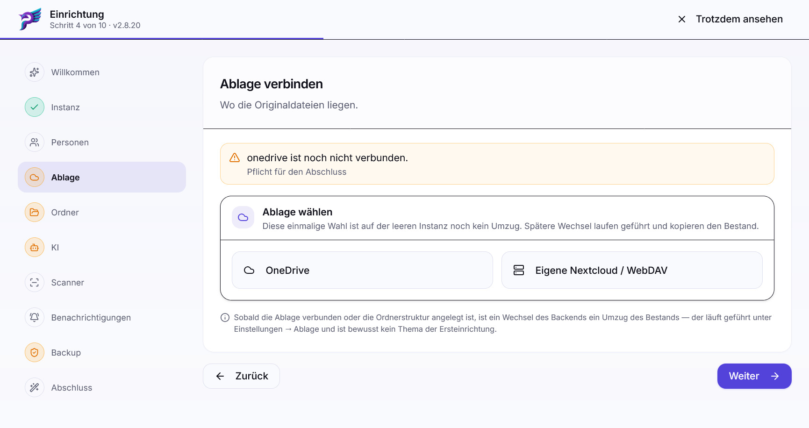

# Installation

Es gibt zwei Wege: den **Installer** (empfohlen) und die **manuelle Installation
mit Docker Compose**. Beide führen zum selben Stack; der Installer nimmt nur die
Handarbeit ab und erzeugt Secrets zufällig.

## Weg 1: Installer

```bash
curl -fsSL https://github.com/ceramgcf/postbuch.net/releases/latest/download/install.sh | bash
```

Der Installer

1. lädt Release-Manifest und Tarball von der Bezugsquelle, standardmäßig den
   [GitHub Releases](https://github.com/ceramgcf/postbuch.net/releases) des Projekts,
2. prüft die **Ed25519-Signatur** des Manifests und den SHA-256 des Archivs
   (siehe [Sicherheit](sicherheit.md#herkunft-der-software)),
3. richtet Docker auf Debian-/Ubuntu-artigen Systemen bei Bedarf ein,
4. führt durch den Einrichtungsdialog,
5. schreibt `.env` mit `chmod 600`,
6. startet den Stack.

Auf Debian 13 installiert der Installer Docker Compose aus dem Systempaket
`docker-compose`; es stellt auch den Aufruf `docker compose` bereit.
Nach einer automatischen Docker-Installation setzt der Installer die Einrichtung
im selben Lauf mit `sudo docker compose` fort. Ein neues Login ist nur nötig,
wenn du Docker später ohne `sudo` bedienen möchtest.

Installationsverzeichnis ist standardmäßig `~/postbuch` (bei Diensten unter
`root`: `/root/postbuch`), änderbar über `--install-dir=`. Pro Rechner ist genau
eine postbuch.net-Instanz zulässig; der Installer legt keine zweite an.

Liegt die Instanz nicht unter `~/postbuch`, findet der Installer sie trotzdem.
Ohne `--install-dir=` sucht er in dieser Reihenfolge:

1. im Verzeichnis, in dem das aufgerufene `install.sh` liegt,
2. im aktuellen Verzeichnis (z. B. `cd /pfad/zur/instanz` vor
   `curl … | bash`),
3. im Pfad aus der Merkdatei `~/.postbuch-installdir`,
4. unter `~/postbuch`.

Die Merkdatei schreibt der Installer nach jeder Installation und bei jedem
Aufruf gegen eine bestehende Instanz; bei der Deinstallation entfernt er sie.
Die gefundene Quelle zeigt das Menü unter „Bestehende Installation gefunden“ an.

### Der Einrichtungsdialog Schritt für Schritt

Das ist der fachliche Einrichtungsdialog. Nach der Bezugsquelle fragt der
Installer nicht: Neue Installationen beziehen Releases von GitHub, bestehende
behalten die Quelle aus ihrer `.env`. Eine andere Quelle setzt nur
`--quelle=<https-url>`; verlangt sie eine Anmeldung, fragt der Installer nach
Basic-Auth-Zugangsdaten. Neue Installationen erhalten nur stabile Versionen;
Vorabversionen lassen sich später in der Oberfläche einschalten (siehe
[Updates](betrieb-troubleshooting.md#updates)).

| Frage                  | Was passiert                                                                                                                                                                                                 |
| ---------------------- | ------------------------------------------------------------------------------------------------------------------------------------------------------------------------------------------------------------ |
| **Instanzname**        | Erscheint in der Seitenleiste und auf gedruckten Etiketten. Frei wählbar, z. B. „Familie Muster".                                                                                                            |
| _(automatisch)_        | Datenbank-Passwort und Session-Secret werden zufällig erzeugt.                                                                                                                                               |
| **Backup einspielen?** | Für Umzüge und Neuaufbau: Der Stack startet leer und zeigt am Ende die Adresse `.../setup/restore`, unter der ein Datenbank-Backup hochgeladen wird. Von dort geht es auch ohne Backup in den Einrichtungsassistenten.                                                         |
| **Admin-Passwort**     | Das Kennwort für den Benutzer `admin`. Es landet als `APP_PASSWORD` in der `.env`.                                                                                                                           |
| **DuckDNS/HTTPS**      | Eine kostenlose DuckDNS-Subdomain mit Token; Caddy holt das Zertifikat selbst. Für OneDrive nachdrücklich empfohlen, für Browserzugriff optional, für eine dauerhaft installierte PWA und Push erforderlich. |

Dateiablage, OneDrive/Nextcloud, KI samt Embedding, Scanner, Benachrichtigungen und
Backup-Einstellungen konfigurierst du nach dem ersten Admin-Login im
Web-Assistenten. Nicht-interaktive und
Bestandspfade dürfen die entsprechenden ENV-Variablen weiterhin verwenden.

Am Ende zeigt der Installer die Adresse an, unter der die Oberfläche erreichbar
ist. Dort als `admin` mit dem gesetzten Passwort anmelden.

Discord fragt der Installer bewusst nicht mehr ab. Für Benachrichtigungen sind
die PWA-/Browser-Push-Benachrichtigungen unter  **Einstellungen →
Benachrichtigungen** vorgesehen. Discord ist experimentell, wird wegen des
Risikos einer Datenoffenlegung durch Fehlkonfiguration nicht empfohlen und kann
nur später in der Weboberfläche nach einer ausdrücklichen Warnbestätigung
eingerichtet werden.

### Nützliche Aufrufformen

```bash
install.sh                                  # geführte Installation oder Update
install.sh --update                         # Update mit Rückfragen
install.sh --update --yes --non-interactive # Update ohne Rückfragen (Agent)
install.sh --rollback                       # auf ein vorhandenes Backup zurückrollen
install.sh --dry-run                        # bis einschließlich Backup laufen, dann abbrechen
install.sh --erwarte-sha256=<hex>           # Tarball muss diese Prüfsumme haben
install.sh --quelle=<https-url>             # abweichende Bezugsquelle
install.sh --update --zielversion=<x.y.z>   # genau diese Version, auch eine Vorabversion
```

> [!WARNING]
>
> Die Notausgänge `--ohne-signatur-fortfahren` und `--erlaube-rueckschritt`
> hebeln Signaturprüfung bzw. Versionsschutz aus. Sie existieren für
> Ausnahmefälle und sollten im Normalbetrieb nie gebraucht werden.

### Der Installer liegt lokal im Installationsverzeichnis

Der Installer gehört zum Release. Er liegt nach einer Installation passend zur
installierten Version unter `<Installationsverzeichnis>/install.sh` und ein zweites Mal unter
`<Installationsverzeichnis>/deploy-pages/install.sh`. Zum Verwalten der Instanz muss er also
nicht erneut heruntergeladen werden:

```bash
~/postbuch/install.sh
```

Der Aufruf funktioniert von jedem Verzeichnis aus, weil der Installer die
Instanz in seinem eigenen Verzeichnis sucht.

Das Menü führt auf Deinstallation, Rollback, Adminpasswort-Wechsel und
Stack-Steuerung (Start/Restart/Stop, Autostart). Diese Punkte fragen die
Bezugsquelle nicht ab und funktionieren deshalb auch ohne Internetzugang. Nur
Update und Clean-Neuinstallation laden ein Release nach und brauchen Netz.

Die Kopie wird bei jeder Installation und jedem Update neu geschrieben und
gehört damit immer zur laufenden Version.

## Weg 2: Manuell mit Docker Compose

Für alle, die keine Skripte per Pipe ausführen wollen, und für Entwicklung.

```bash
git clone <repository-url> postbuch
cd postbuch
cp .env.example .env
# .env vollständig ausfüllen – siehe unten
docker compose up -d --build
```

Es gibt hier **keinen geführten Dialog und keine automatisch erzeugten
Secrets**. Alles, was der Installer setzt, muss von Hand hinein. Pflichtfelder
plus eine optionale Variable:

| Variable                 | Bedeutung                                                                                                                   |
| ------------------------ | --------------------------------------------------------------------------------------------------------------------------- |
| `POSTGRES_PASSWORD`      | Datenbank-Passwort. Beliebig, aber lang und zufällig.                                                                       |
| `SESSION_SECRET`         | 32 Byte Zufall in Hex, z. B. `openssl rand -hex 32`.                                                                        |
| `APP_PASSWORD`           | Admin-Passwort.                                                                                                             |
| `INSTANCE_NAME`          | Anzeigename der Instanz.                                                                                                    |
| `APP_BASE_URL`           | Basisadresse für Links in Benachrichtigungen und für den OneDrive-Browser-Callback bei einer Verbindung oder Neuverbindung. |
| `STORAGE_BACKEND`        | `onedrive` oder `nextcloud`. **Wirkt nur bei der Erstinstallation gegen eine leere Datenbank.**                             |
| `POSTBUCH_FEED_BASE_URL` | Bezugsquelle für Updates, z. B. `https://github.com/ceramgcf/postbuch.net/releases`. Leer = keine Update-Prüfung.            |

Alle `CHANGEME`-Platzhalter müssen vor dem ersten Start ersetzt sein.

### Optionale Profile

```bash
docker compose --profile scanner up -d   # Scanner + Cleaner
docker compose --profile caddy   up -d   # Reverse-Proxy mit automatischem HTTPS
```

> [!NOTE]
>
> **ENV liefert Startwerte und Laufzeitwerte.**
>
> Beim _ersten_ Start werden die fachlichen ENV-Werte in die Datenbanktabelle
> `_settings` übernommen. Danach liest die Anwendung die meisten Einstellungen
> aus der Datenbank und pflegt sie in der Oberfläche. Die Bezugsquelle für
> Release-Feeds (`POSTBUCH_FEED_BASE_URL` und `POSTBUCH_FEED_AUTH`) kommt
> direkt aus der ENV und wird nach einem Neustart wirksam. Bedrock- und
> Push-Einstellungen richtest du im Web-Assistenten bzw. unter Einstellungen
> ein. Mit
> `ENV_FORCE_OVERRIDE=1` lässt sich das erneute Überschreiben der DB-Settings
> aus der ENV erzwingen.

## Der Einrichtungsassistent

Nach dem ersten Admin-Login öffnet sich automatisch der Assistent unter
`/einrichtung`.



Er hat zehn Schritte:

1.  **Willkommen**
2.  **Instanz** – Instanzname, Basisadresse und die Einstellungen, die der
   Host-Agent auf dem Server ausführt (Port, Adresse, TLS über DuckDNS). Der
   Installer hat all das bereits gesetzt; der Schritt zeigt es deshalb nur an
   und gibt die Formulare erst über  „Ändern" frei
3.  **Personen** – Menschen anlegen, Zugänge vergeben
4.  **Dateiablage** – Backend wählen, OneDrive per Gerätecode verbinden oder Nextcloud
   anmelden
5.  **Ordner** – Wurzelordner festlegen, Ordnerstruktur anlegen,
   Dateiablage-Selbsttest (empfohlen, keine Pflicht)
6.  **KI** – Anbieter verbinden, alle Modellklassen und das Embedding wählen
7.  **Scanner** – Netzwerkscanner suchen und einbinden (optional)
8.  **Benachrichtigungen** – Push auf diesem Gerät einrichten
9.  **Backup** – Sicherung aktivieren oder NOBACKUP bewusst bestätigen
10.  **Abschluss** – Abschlussprüfung

Links steht eine Schrittleiste, die den geprüften Zustand jedes Schritts zeigt
(erledigt, offene Pflicht, offen); auf schmalen Bildschirmen wird daraus eine
Reihe oben. Über sie lässt sich auch direkt zu einem Schritt springen.

Dateiablage und KI werden **im Assistenten selbst** eingerichtet – mit denselben
Karten wie in den Einstellungen. Der Assistent wird dafür nicht verlassen. Die
Dateiablage ist dabei keine optionale Erweiterung: Erst eine verbundene
OneDrive- oder WebDAV-Dateiablage mit angelegter Ordnerstruktur macht die
Dokumentfunktionen von postbuch.net nutzbar. Der Dateiablage-Selbsttest ist
empfohlen, aber keine Pflicht für den Abschluss.

Vorbelegte Felder stammen immer aus dem Ist-Zustand dieser Instanz. Ist ein Wert
der App nicht bekannt – etwa der auf dem Host aktive Port –, bleibt das Feld
leer und sagt das.

Jeder Schritt zeigt Prüfzeilen an; Pflichtprüfungen sind als solche markiert.
Jede Prüfzeile ist zugleich ein Sprungziel: ein Klick führt in den Schritt, in
dem sich die Sache erledigen lässt.  „Weiter" stößt die Istprüfung im Hintergrund
an, damit der nächste Schritt einen aktuellen Stand vorfindet. Solange
Pflichtprüfungen offen sind, führt die Oberfläche Admins zurück in den
Assistenten. „Trotzdem ansehen“ gilt nur für die aktuelle Sitzung und wird
protokolliert. Andere Rollen sehen bis zum Abschluss einen Wartehinweis. Die
Hilfe ist davon ausgenommen und bleibt jederzeit erreichbar:  „Hilfe“ im Kopf des
Assistenten und die Anleitungs-Links in seinen Karten öffnen sie in einem neuen
Tab – schlank, ohne die übrige App-Navigation –, sodass der Assistent dabei nicht
verlassen wird. Jeder
Wert ist danach auch einzeln unter  `Einstellungen` änderbar.

Dieses Zurückführen gilt **ausschließlich für die Ersteinrichtung**, die der
Installer bei einer neuen Installation vormerkt. Eine laufende Instanz wird nie
in den Assistenten gezwungen – weder durch ein Update noch dadurch, dass jemand
ihn später öffnet.

### Den Assistenten später noch einmal öffnen

`Einstellungen` hat oben rechts den Knopf  **„Einrichtung erneut öffnen"** (nur
für den Admin). Er führt in denselben Assistenten mit dem aktuellen Ist-Zustand
der Instanz – zum Nachschauen, was noch offen ist, oder um einen Bereich geführt
nachzuziehen. Die Oberfläche bleibt dabei für alle normal benutzbar: Offene
Pflichtprüfungen sperren hier nichts, und andere Rollen bekommen keinen
Wartehinweis zu sehen. Verlassen wird der Assistent über die normale Navigation.

### Wahl der Dateiablage zurücknehmen

Die Wahl zwischen OneDrive und Nextcloud fällt einmal – sie ist aber nicht
sofort bindend. Solange nichts verbunden, keine Ordnerstruktur angelegt und kein
Dokument vorhanden ist, bietet der Schritt „Dateiablage" den Weg zurück zur Auswahl
an. Danach ist ein Wechsel ein Umzug des Bestands und läuft geführt unter
 `Einstellungen → Dateiablage`.

### Der KI-Schritt baut sich auf

Der Schritt ist in vier Stufen gegliedert, die nacheinander freigeschaltet
werden:

1.  **KI-Provider verbinden** – immer offen.
2. **Modellempfehlungen** – sobald ein Provider antwortet. Ganz oben steht
   „Modellempfehlungen alle übernehmen".
3. **Modelle je Aufgabe** – sobald ein Sprachmodell-Provider antwortet.
4. **Embedding-Modell** – sobald ein Provider antwortet, der Embeddings kann.

Sprachmodell und Embedding werden getrennt geprüft und sind **beide Pflicht**.
Ein Anbieter, der beides kann (OpenAI), erledigt sie in einem Aufwasch; sonst
sind es zwei Anbieter. Jede Änderung an den Providern aktualisiert die übrigen
Stufen sofort.

### Scanner im Assistenten

Die Netzwerksuche startet erst auf Klick – es springt kein Dialog von selbst
auf. Antwortet das Gerät beim  Test, schaltet der Assistent das Compose-Profil
`scanner` automatisch ein. Ausschalten lässt es sich später wieder unter
 `Einstellungen → Scanner`.

### TLS über DuckDNS im Assistenten

Läuft auf dem Server der Host-Agent, kann Schritt 2 eine DuckDNS-Domain
einrichten und Caddy dafür starten. Der Assistent zeigt die zuletzt übergebene
Domain wieder an; der **Token** erscheint nur als Punkte, weil postbuch.net ihn
nicht innerhalb der Kernanwendung speichert – er wird unmittelbar an den
Host-Agenten durchgereicht. Hat der Installer den Token in die `.env`
geschrieben, weiß die App davon nur, _dass_ einer existiert, und zeigt genau das
an.

Für jede Änderung wird der Token deshalb erneut gebraucht: „Ändern" gibt das
Feld frei, und ohne neuen Token bleibt der Knopf gesperrt. Wurde die Domain vor
dieser Version eingerichtet, schlägt der Assistent sie aus der Basisadresse vor
und kennzeichnet das als abgeleitet.

Vor dem Auftrag prüft „TLS aktivieren“, ob die Domain wirklich auf diesen
Server zeigt. Dazu fragt postbuch.net öffentliche DNS-Server und vergleicht
die Antwort mit der LAN-Adresse, die der Host-Agent meldet. Anschließend prüft
es, ob auch dein Router die Domain auflöst. Hält die Prüfung an, nennt sie den
Grund: kein Eintrag (Tippfehler oder Subdomain nicht angelegt), eine andere
Adresse (meist die öffentliche, die DuckDNS beim Anlegen einträgt) oder ein
DNS-Rebind-Schutz im Router. Nach der Korrektur prüfst du erneut, oder du
aktivierst TLS trotzdem. Dieselbe Prüfung macht der Installer, wenn du dort
die Domain eingibst. Einen bloßen Namen wie `meinpostbuch` ergänzen beide zu
`meinpostbuch.duckdns.org`.

Sobald im KI-Schritt ein Embedding-Provider eingerichtet ist, bereitet
postbuch.net die eingebaute Hilfe automatisch für den Assistenten auf. Das
geschieht als Hintergrundjob und blockiert den Einrichtungsassistenten nicht.

### Adresse einer laufenden Instanz ändern

Eine bereits eingerichtete Instanz auf eine andere DuckDNS-Domain umzuziehen
geht im Assistenten, verlangt aber **zwei getrennte Aufträge** an den
Host-Agenten. Sie hängen nicht zusammen: „TLS aktivieren" schreibt Domain, Token
und die Caddy-Konfiguration, „Auf dem Host anwenden" schreibt die Basisadresse.
Wer nur die Domain wechselt, hat danach ein gültiges Zertifikat für die neue
Adresse, während die App weiterhin Links auf die alte erzeugt.

Der Host-Agent nimmt immer nur **einen** Auftrag gleichzeitig an; der zweite
wird abgelehnt, solange der erste offen ist. Zwischen den Schritten also die
Erfolgsmeldung abwarten – der Agent holt sich Aufträge etwa im Minutentakt und
startet dabei Container neu.

In dieser Reihenfolge vorgehen:

1. **DNS und Portfreigabe** auf die neue Domain umstellen. Die neue Domain muss
   auf die eigene öffentliche IP zeigen und die Ports 80/443 müssen den Server
   erreichen, sonst bekommt Caddy kein Zertifikat.
2. **TLS aktivieren** – neue Domain und Token eintragen. Der Token wird dabei
   erneut gebraucht, weil postbuch.net ihn nicht speichert.
3. **Basisadresse** auf `https://<neue-domain>` ändern und **„Auf dem Host
   anwenden"** drücken. Das schreibt `APP_BASE_URL` in die `.env` _und_ den Wert
   in die Datenbank; `app` und `web` starten neu.

Weicht die eingetragene Basisadresse von der DuckDNS-Domain ab, weist der
Assistent im Schritt „Instanz" darauf hin und bietet an, das jeweils andere Feld
zu übernehmen.

Danach ist noch außerhalb von postbuch.net zu erledigen:

- **Azure**: die neue Redirect-URI
  `https://<neue-domain>/api/onedrive-auth/callback` in der App Registration
  eintragen. Ohne sie schlägt die **nächste** Kontoverknüpfung mit
  `redirect_uri_mismatch` fehl – eine bestehende Verbindung läuft zunächst
  weiter, siehe [OneDrive-OAuth](#onedrive-oauth-die-sonderfälle).
- **PWA auf den Geräten**: die alte Adresse ist für den Browser eine andere
  Anwendung. Die installierte App muss entfernt und unter der neuen Adresse neu
  installiert werden; Push-Benachrichtigungen sind dort erneut zu erlauben.
- **Lesezeichen und geteilte Links** zeigen weiterhin auf die alte Adresse.

> [!NOTE]
>
> Eine **eigene Domain** statt DuckDNS lässt sich über den Assistenten nicht
> einrichten. Der Host-Agent akzeptiert nur Namen der Form `name.duckdns.org`
> und schreibt eine feste Caddy-Konfiguration für dessen DNS-Prüfung. Eine
> eigene Domain wird direkt in `caddy/Caddyfile` auf dem Server konfiguriert.

## OneDrive-OAuth: die Sonderfälle

> [!WARNING]
>
> Die Anmeldung erteilt postbuch.net die Berechtigung `Files.ReadWrite.All` –
> Vollzugriff auf **alle** Ordner des Microsoft-Kontos, nicht nur auf den
> postbuch-Ordner. Das ist nötig, damit die Dokumente im gewöhnlichen Dateibaum
> liegen und ohne postbuch.net erreichbar bleiben; die Kehrseite ist ein
> Generalschlüssel zu deinem OneDrive, der unverschlüsselt in der Datenbank und
> in jedem Backup liegt. Bevor du verbindest:
> [Sicherheit](sicherheit.md#der-zugriff-auf-die-dateiablage-ist-ein-vollzugriff).

Beim Browser-Redirect geht der OAuth-Callback von Microsoft an
`<APP_BASE_URL>/api/onedrive-auth/callback`. Diese Adresse muss in der Azure App
Registration exakt so eingetragen sein und der verwendete Browser muss sie
während der Anmeldung erreichen können – sonst bricht die Anmeldung mit
`redirect_uri_mismatch` ab.

Nach erfolgreicher Kontoverknüpfung holt postbuch.net neue Zugriffstoken still
aus dem gespeicherten Token-Cache. Eine funktionierende Callback-URL wird wieder
gebraucht, wenn das Konto nach einer Trennung, einem Token-Widerruf, einem
verlorenen Token-Cache oder einem anderen Anmeldefehler erneut verknüpft wird.

**HTTPS-Adresse** Am bequemsten ist eine erreichbare HTTPS-Adresse, zum Beispiel
über DuckDNS. Für eine auf anderen Geräten dauerhaft installierte PWA und für
Push muss diese Adresse gleichbleibend erreichbar sein. Beim
OneDrive-Browser-Redirect dient dieselbe Adresse zugleich als Callback und
erspart den Tunnel. Wird die App-URL vor einer späteren Kontoverknüpfung
geändert, muss die neue Redirect-URI auch in Azure eingetragen werden.

### Localhost-Tunnel von einem anderen Rechner

Auf einem Headless-Server kann der Browser-Redirect ohne öffentliche Domain und
ohne Browser auf dem Server stattfinden. Der Browser-Rechner stellt dabei
`localhost` per SSH zum postbuch.net-Server durch:

1. Setze vor der Verbindung unter  **Einstellungen → Allgemein → App-URL** (bei
   der Erstinstallation: `APP_BASE_URL`) den Wert `http://localhost:3420`.
2. Trage in Azure als Web-Redirect-URI exakt
   `http://localhost:3420/api/onedrive-auth/callback` ein.
3. Starte auf dem Rechner, auf dem der Browser läuft, einen SSH-Tunnel und lass
   das Terminal bis zum Abschluss der Anmeldung offen:

   ```bash
   ssh -N -L 3420:127.0.0.1:3420 <ssh-benutzer>@<server-adresse>
   ```

4. Öffne auf **diesem Browser-Rechner** `http://localhost:3420`, melde dich an
   und starte  **Einstellungen → Dateiablage → OneDrive verbinden**.

Der Microsoft-Redirect zu `localhost` landet nun beim Browser-Rechner und wird
durch SSH an postbuch.net weitergereicht. Nach erfolgreicher Verbindung kann der
Tunnel beendet werden. Soll die App-URL danach wieder für Links in
Benachrichtigungen auf die normale LAN- oder HTTPS-Adresse zeigen, stelle sie
zurück. Für eine spätere Neuverbindung wiederholst du den Tunnel-Ablauf.

**Standard: Gerätecode** Neue Instanzen verwenden den Gerätecode. Er braucht nur
die Client-ID der eigenen App, kein Secret und keine Redirect-URI. Die
vollständige Anleitung steht unter
[OneDrive-App registrieren](onedrive-app-registrierung.md). Der Browser-Redirect
bleibt für Bestands- und Firmen-Setups erhalten und kehrt per Popup in den
Assistenten zurück.

## Weitere Erläuterungen zu den Schritten des Einrichtungsassistenten

- [Dateiablage-Backends](storage-backends.md) – Ordnerstruktur anlegen
- [KI-Anbieter](ki-provider.md) – Modelle wählen
- [Backup und Wiederherstellung](backup-wiederherstellung.md) – **vor** dem
  ersten echten Dokument einrichten

## Nach der Installation

- [Die Oberfläche](oberflaeche.md) kennenlernen
- [Dokumente importieren](dokumente-importieren.md) – der erste Scan

---

Weiter: [Die Oberfläche](oberflaeche.md) · [Zurück zur Übersicht](README.md)
