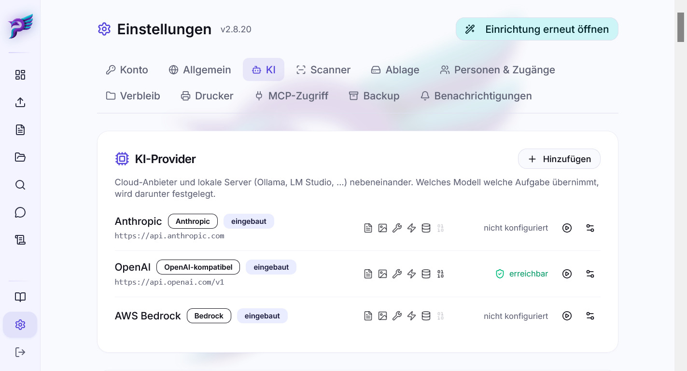

# KI-Anbieter

postbuch.net bringt kein eigenes Sprachmodell mit. Es ruft Modelle auf, die du
selbst bereitstellst – als Cloud-Dienst mit API-Schlüssel oder als lokalen
Server auf deiner eigenen Hardware. Alles dazu steht unter
 **Einstellungen → KI** (nur für
Administratoren sichtbar).

Ein erreichbares Sprachmodell ist Voraussetzung für die Dokumentverarbeitung. Es
übernimmt die automatische Klassifikation und ermöglicht den Büroassistenten;
Embeddings ergänzen semantische Suche und Duplikatprüfung.

Für einen schnellen Einstieg kann ein OpenAI-Entwicklerkonto mit kleinem
Guthaben sowohl Sprachmodelle als auch Embeddings liefern. Das ist ein Beispiel
für einen kurzen Ein-Konto-Weg, keine Anbieterempfehlung und keine
Preisgarantie. Cloudfrei geht es mit einem lokalen OpenAI-kompatiblen Chatmodell
und einem lokalen Embedding-Modell.

---

## Provider

Ein **Provider** ist eine API-Adresse plus ein Schlüssel plus eine Liste von
Fähigkeiten. Drei Einträge sind eingebaut und lassen sich bearbeiten, aber nicht
löschen: `anthropic`, `openai` und `bedrock`. Alles Weitere legst du selbst an –
beliebig viele.

Beim Anlegen hilft eine Vorlage:

| Vorlage           | Typ               | Adresse                                |
| ----------------- | ----------------- | -------------------------------------- |
| OpenAI            | OpenAI-kompatibel | `https://api.openai.com/v1`            |
| Anthropic         | Anthropic         | `https://api.anthropic.com`            |
| AWS Bedrock       | Bedrock           | – (Region statt URL)                   |
| Ollama            | OpenAI-kompatibel | `http://host.docker.internal:11434/v1` |
| LM Studio         | OpenAI-kompatibel | `http://host.docker.internal:1234/v1`  |
| OpenRouter        | OpenAI-kompatibel | `https://openrouter.ai/api/v1`         |
| Benutzerdefiniert | OpenAI-kompatibel | frei                                   |

`host.docker.internal` ist dabei aus Sicht des Containers das der Weg zu einem
Dienst, der auf demselben Rechner läuft. Läuft der Provider auf einem anderen
Rechner innerhalb oder außerhalb deines LANs, muss die Adresse entsprechend
angepasst werden.

### Fähigkeiten

Jeder Provider trägt sechs Schalter:

| Fähigkeit                            | Bedeutung                                                                                      |
| ------------------------------------ | ---------------------------------------------------------------------------------------------- |
| **PDF-Dokumente direkt verarbeiten** | Das Modell nimmt ein PDF als solches entgegen                                                  |
| **Bilder verstehen**                 | PDF wird für dieses Modell in Seitenbilder umgewandelt                                         |
| **Werkzeuge/Tool-Calling**           | Voraussetzung für den Büroassistenten                                                          |
| **Antworten streamen**               | Antwort erscheint fortlaufend statt am Stück                                                   |
| **Prompt-Caching**                   | Wiederholte Prompt-Anteile werden günstiger abgerechnet                                        |
| **Embeddings erzeugen**              | Voraussetzung für semantische Suche, Duplikatprüfung und die semantische Hilfe des Assistenten |

> [!CAUTION]
>
> postbuch.net probiert diese Fähigkeiten **nicht** aus, sondern glaubt der
> Angabe. Ein Modell, das einen PDF-Block entgegennimmt und ihn still ignoriert,
> antwortet trotzdem – und halluziniert dann eine Klassifikation, statt zu
> scheitern. Ein falsch gesetzter Schalter ist deshalb schlimmer als ein zu
> vorsichtig gesetzter.

Für lokale Server (Ollama, LM Studio, vLLM …) sind PDF und Bild deshalb zunächst
**aus**. Schalte sie erst frei, wenn du geprüft hast, dass dein Modell das
wirklich kann.

Kann ein Modell weder PDF noch Bilder, bekommt es statt des PDFs den lokal
extrahierten Text. In diesem Fall wird die OCR-Textebene nie entfernt – sie ist
dann die einzige Informationsquelle. Solche Modelle werden nicht empfohlen, weil
sie die Klassifikation stark verschlechtern.

### Schlüssel

Der Schlüssel eines Providers wird gespeichert, aber **nie wieder ausgeliefert**
– auch nicht an Administratoren. Im Dialog gibt es nur ein Schreibfeld. Wer den
Schlüssel vergessen hat, trägt einen neuen ein.

Adressen im privaten Netz (`192.168.…`, `localhost`, `host.docker.internal`)
erfordern eine ausdrückliche Freigabe pro Provider. Die Checkbox erscheint nur,
wenn die eingetragene Adresse tatsächlich privat aussieht – sonst würde sie
vorsorglich angehakt und der Schutz wäre wertlos. Hintergrund unter
[Sicherheit](sicherheit.md).

### Testen und Löschen

 **Testen** ruft die Modell-Liste des
Providers ab und zeigt, wie viele Modelle er anbietet. Das ist zugleich die
Quelle für die Auswahllisten weiter unten.

 **Löschen** ist zweistufig: Der erste
Versuch scheitert, wenn der Provider noch in Gebrauch ist, und nennt die
betroffenen Stellen. Erst danach lässt sich das Löschen erzwingen.

---

## Modellstufen

postbuch.net benutzt nicht ein Modell, sondern mehrere – nach Schwierigkeit
gestaffelt. Das ist der wichtigste Kostenhebel: Der Großteil der Post ist
einfach, und einfache Post braucht kein teures Modell.

| Stufe                | Wofür                                                                                                                         |
| -------------------- | ----------------------------------------------------------------------------------------------------------------------------- |
| **Voranalyse**       | Schätzt die Schwierigkeit eines Dokuments auf einer Skala von 0 (sehr leicht) bis 1 (sehr schwierig) ein (sehr kurzer Aufruf) |
| **Langes Dokument**  | Alles mit mehr als 10 Seiten                                                                                                  |
| **Leicht**           | Schwierigkeit ≤ 0,25                                                                                                          |
| **Mittel**           | Schwierigkeit > 0,25 und < 0,5                                                                                                |
| **Schwierig**        | Schwierigkeit ≥ 0,5                                                                                                           |
| **Letzter Fallback** | Notfallmodell am Ende jeder Kette                                                                                             |

Die Voranalyse läuft zuerst und entscheidet, welche Kette greift:

| Fall               | Kette                                       |
| ------------------ | ------------------------------------------- |
| mehr als 10 Seiten | Langes Dokument → Leicht → Letzter Fallback |
| einfach            | Leicht → Letzter Fallback                   |
| mittel             | Mittel → Leicht → Letzter Fallback          |
| schwierig          | Schwierig → Mittel → Letzter Fallback       |

Scheitert ein Modell – Netzwerkfehler, Überlastung, unbrauchbare Antwort –,
rückt automatisch das nächste Glied nach. Ein Konfigurationsfehler (falscher
Schlüssel, unbekanntes Modell) wird dabei als dauerhaft erkannt und nicht
sinnlos wiederholt.

Darunter, in einem eigenen Block, stehen vier Modelle, die **nicht** an dieser
Kette hängen:

| Klasse                    | Wofür                                                         |
| ------------------------- | ------------------------------------------------------------- |
| Assistent: Recherche      | Der Such-Agent des Büroassistenten – **braucht Tool-Calling** |
| Assistent: Antwort        | Formuliert die endgültige Antwort, gestreamt                  |
| Assistent: Titel          | Erzeugt den Gesprächstitel (sehr kurzer Aufruf)               |
| Akte: Metadaten-Vorschlag | Schlägt Betreff, Beschreibung und Schlagwörter einer Akte vor |

Jede Zeile wird als **Provider + Modell** gespeichert, nie nur als Modellname.
Zwei lokale Server mit demselben `llama3.3` wären sonst nicht unterscheidbar.

Im Einrichtungsassistenten müssen **alle zehn Klassen** auf einen erreichbaren
Provider zeigen – die sechs der Pipeline ebenso wie die vier für Büroassistent
und Akten-Vorschlag. Zusätzlich ist ein nutzbares Embedding-Modell Pflicht;
Sprachmodell und Embedding werden getrennt geprüft.

### Empfehlungen

Über der Modell-Konfiguration steht eine kuratierte Empfehlungsliste. Sie wird
**mit dem Release ausgeliefert** und nur mit neuen Releases aktualisiert. Die
Informationen können veraltet sein und erfolgen ohne Gewähr. Die Übernahme ist
ein bewusster Klick, keine Automatik. Kandidaten, die auf deiner Instanz nicht
verwendbar sind, erscheinen mit Grund (z. B. „Provider nicht konfiguriert") –
eine stumm gekürzte Liste sähe aus wie ein Defekt.

Die Liste enthält auch eine Empfehlung für das **Embedding-Modell**. Diese Zeile
ist bewusst ein Sonderfall: „Alle übernehmen" fasst sie **nicht** an, und beim
einzelnen Übernehmen fragt postbuch.net ausdrücklich nach – denn ein Wechsel
entwertet alle vorhandenen Embeddings, bis sie neu berechnet sind (siehe
Abschnitt _Embeddings_). Die Dimension wird auch hier nicht aus der Empfehlung
übernommen, sondern mit einem Testaufruf an deinem Provider ermittelt.

Modellwahl und Nutzung erfolgen auf eigenes Risiko; maßgeblich für Preise und
Verfügbarkeit sind immer die Angaben des jeweiligen KI-Anbieters.

### Kosten und kostenpflichtige Aufrufe

postbuch.net selbst berechnet keine Nutzungsgebühr. Ein externer
Cloud-KI-Anbieter rechnet jedoch jeden LLM- und Embedding-Aufruf nach seinem
eigenen Tarif ab. Bei einem selbst betriebenen Provider wie Ollama oder LM
Studio gibt es keine Rechnung pro Aufruf; Strom und Hardware bleiben natürlich
eigene Betriebskosten.

Die folgenden Beträge sind bewusst grobe **Richtwerte in Eurocent, Stand August
2026**. Sie beruhen auf den mitgelieferten Modellpreisen und einem
anonymisierten Plausibilitätsabgleich mit echten Aufrufen. Anbieter rechnen
meist in US-Dollar und können Preise, Wechselkurs, Steuern und Zuschläge ändern.
Maßgeblich ist deshalb immer die Abrechnung des Providers.

| Vorgang                                | Welche externen KI-Aufrufe entstehen?                                                                                                                                 | Grober Richtwert                                                                                                                                           |
| -------------------------------------- | --------------------------------------------------------------------------------------------------------------------------------------------------------------------- | ---------------------------------------------------------------------------------------------------------------------------------------------------------- |
| Dokument importieren                   | Kurze Voranalyse, eigentliche PDF-/Textanalyse und ein Embedding; bei ungültiger Antwort zusätzlich ein Reparatur- oder Fallback-Aufruf                               | meist **1–20 ct je Dokument**; mit sehr günstigen Modellen auch darunter, bei langen oder schwierigen Dokumenten, Retries und teuren Modellen auch darüber |
| Dokument erneut verarbeiten            | Erneute Analyse und neues Embedding; bei einer fest gewählten Modellstufe entfällt nur die Voranalyse                                                                 | ungefähr wie ein neuer Import                                                                                                                              |
| Erstattungsbescheid                    | Zusätzlich zum Import eine eigene Detailauswertung und, falls Kürzungen vorliegen, möglicherweise ein weiterer Zuordnungsaufruf                                       | oft zusätzlich **1–15 ct**                                                                                                                                 |
| Eine Antwort des Assistenten           | Mehrere Recherche-Runden, Embedding-Suchen, gegebenenfalls PDF-Vision, Schlussantwort und beim ersten Beitrag ein kurzer Titel-Aufruf                                 | häufig **1–15 ct**, bei breiten Fragen oder PDF-Vision auch **25 ct und mehr**                                                                             |
| Semantisch suchen                      | Die Anfrage wird für Dokumente und Akten separat eingebettet; „mehr laden" kann erneut aufrufen                                                                       | normalerweise zusammen **unter 0,01 ct je Suche**                                                                                                          |
| Dokument- oder Aktenmetadaten ändern   | Relevante Dokumentfelder werden neu eingebettet. Auch Aktenanlage, Betreff/Beschreibung sowie Hinzufügen oder Entfernen eines Dokuments erneuern das Akten-Embedding. | normalerweise **unter 0,01 ct je Objekt**                                                                                                                  |
| KI-Metadaten für eine Akte vorschlagen | Ein kurzer LLM-Aufruf mit den Akten- und Dokumentmetadaten                                                                                                            | gewöhnlich **unter 1 ct**                                                                                                                                  |
| Embedding-Modell speichern             | Ein winziger Test-Embedding-Aufruf ermittelt die Vektor-Dimension                                                                                                     | deutlich **unter 0,01 ct**                                                                                                                                 |
| Alle Embeddings neu berechnen          | Je ein Aufruf pro veraltetem Dokument, pro veralteter Akte und pro nicht wiederverwendbarem Hilfeabschnitt                                                            | Beispiel: **500 Dokumente, 20 Akten und 250 Hilfeabschnitte etwa 2–10 ct**, je nach Embedding-Modell und Textlänge                                         |

Ein normaler Import besteht also nicht aus „einem KI-Aufruf". Fällt ein Modell
aus oder liefert unbrauchbare Daten, kann die Fallback-Kette mehrere Versuche
abrechnen. Auch ein fehlgeschlagener Provider-Aufruf kann Kosten verursachen.
Umgekehrt sind lokale Schritte wie Scanner-OCR, PDF-Rotation, Volltextsuche,
Datenbankabfragen und das reine Ersetzen einer PDF **keine** externen
KI-Aufrufe.

Zu jedem Sprachmodell lassen sich Preise je eine Million Token hinterlegen:
**In** (Eingabe), **Out** (Ausgabe), **Cache-Write** (Schreiben in den
Prompt-Cache) und **Cache-Read** (Lesen aus dem Prompt-Cache). Die beiden
Cache-Preise unterscheiden sich je Anbieter und Modell und stehen in dessen
Preisliste. Bleibt ein Cache-Feld leer, zählen diese Token zum normalen
Eingabepreis. Daraus berechnet postbuch.net die Kosten je Dokument und
unter  **Logs → Token-Kosten**. Dort ist
jeder erfasste Aufruf mit Kategorie, Provider, Modell und Tokenmenge
nachvollziehbar. Dabei gelten vier wichtige Einschränkungen:

- Der Preis hängt am **Modellnamen**, nicht am Provider. Nutzt du dasselbe
  Modell bei zwei Providern zu unterschiedlichen Preisen, teilen sich beide
  einen Wert – die Oberfläche weist darauf hin.
- Von Hand eingetragene Preise werden als _manuell_ markiert und von der
  Empfehlungs-Übernahme nicht überschrieben.
- Embedding-Aufrufe werden im Token-Log erfasst, erscheinen dort aber ohne
  Geldbetrag, wenn für das Embedding-Modell kein Preis hinterlegt ist. Auch
  Aufrufe ohne vom Provider gemeldete Token oder ohne gepflegten Modellpreis
  fehlen in der Kostensumme. Die Summe ist dann **unvollständig**, nicht null;
  die Providerrechnung bleibt die verlässliche Gesamtsicht.
- Möglicherweise umfasst das Token-Log nicht alle angefallenen Kosten.

---

## Embeddings

Embeddings sind Zahlenvektoren, die Inhalte beschreiben. Sie tragen die
**semantische Dokumentensuche**, die **Duplikatprüfung** und die **Hilfesuche
des Assistenten** – ohne sie bleibt die Suche eine reine Volltextsuche.

Welches Modell empfohlen wird, steht in den mit dem Release ausgelieferten
Modellempfehlungen – die Karte nennt es beim gewählten Provider direkt, und es
ist zugleich die Voreinstellung einer frischen Installation. Wer ohne Cloud
arbeitet, betreibt ein eigenes Embedding-Modell auf einem selbst gehosteten,
embedding-fähigen Provider; auch dafür steht ein Kandidat in der Liste.

Zur Auswahl stehen nur Provider, die _Embeddings erzeugen_ können. Die
**Vektor-Dimension wird nicht eingegeben**: Der Server ermittelt sie mit einem
einzigen Testaufruf, und dieses Ergebnis ist verbindlich.

Die in der Oberfläche sichtbare Vorgabe ist zunächst nur ein **Vorschlag** und
noch keine gespeicherte Konfiguration.

**Wichtig beim Wechsel des Embedding-Modells:** Jede Zeile trägt eine Signatur
aus Provider, Modell und Dimension, und Suche wie Duplikatprüfung
berücksichtigen **ausschließlich** Zeilen mit der aktuell aktiven Signatur.
Direkt nach dem Umschalten findet die semantische Suche deshalb schlagartig
weniger – bis der Neuberechnungslauf durch ist. Die Karte zeigt den Fortschritt
an. Das ist kein Defekt, sondern die Alternative zu einem stillen Mischbestand
aus unvergleichbaren Vektoren.

Die mit der jeweiligen postbuch.net-Version ausgelieferte Hilfe wird ebenfalls
in kleine Abschnitte zerlegt und im Hintergrund eingebettet. So kann der
Assistent-Chat effizient auf die Hilfe zugreifen. Das geschieht automatisch,
sobald bei einer Neuinstallation ein Embedding-Provider konfiguriert wurde,
zusammen mit einer notwendigen Neuberechnung nach einem Provider- oder
Modellwechsel und nach jedem Anwendungsupdate. Ein Hash sorgt dafür, dass
unveränderte Hilfe nicht noch einmal berechnet wird; unveränderte Abschnitte
können aus dem vorherigen Korpus übernommen werden.

> [!IMPORTANT]
>
> Ein Update kann deshalb kurz nach dem Neustart kostenpflichtige
> Embedding-Aufrufe auslösen. Bei unverändertem Embedding-Modell werden nur neue
> oder inhaltlich geänderte Hilfeabschnitte berechnet; Dokumente und Akten
> werden durch ein gewöhnliches Update nicht pauschal neu eingebettet. Nach
> einem Provider-, Modell- oder Dimensionswechsel ist dagegen der vollständige
> Neuberechnungslauf für Dokumente, Akten und Hilfe nötig. Die Karte zeigt vor
> dem Start, wie viele Einträge veraltet sind.

Ein neuer Hilfekorpus wird erst aktiviert, wenn er vollständig ist. Während des
Aufbaus oder bei einem Providerfehler bleibt deshalb der letzte vollständige
Stand nutzbar. Den Zustand zeigt die Embedding-Karte unter
 `Einstellungen → KI`; der Lauf
selbst erscheint in der Aufgabenanzeige.

Die Hilfekorpus-Daten sind ein regenerierbarer Cache und deshalb nicht Teil der
Datenbanksicherung. Nach dem Einspielen eines Backups baut postbuch.net sie beim
Neustart automatisch vollständig aus der mitgelieferten Dokumentation auf.

---

## Cache-Mode

Beim Verarbeiten mehrerer Dokumente hintereinander lohnt es sich, dasselbe
Modell zu benutzen und den gemeinsamen Prompt-Anteil zwischenspeichern zu
lassen. Genau das macht der **Cache-Mode**: festes Klassifikationsmodell statt
Staffelung, dazu Prompt-Caching, sofern der Provider es kann.

| Einstellung                   | Wirkung                                                                                                                                                             |
| ----------------------------- | ------------------------------------------------------------------------------------------------------------------------------------------------------------------- |
| Auf der Import-Seite anbieten | Blendet dort einen Start/Stopp-Schalter ein                                                                                                                         |
| Automatisch aktivieren        | Springt an, sobald mehrere Dateien gleichzeitig eingehen oder innerhalb von 5 Minuten ein zweites Dokument eintrifft; Rücksetzung nach 15 Minuten ohne Verarbeitung |
| Modellvorgabe für Auto-Modus  | Auf welche Stufe (Leicht/Mittel/Schwierig) gebündelt wird                                                                                                           |

Beide Schalter sind unabhängig voneinander.

---

## Eigene Klassifikations-Hinweise

Ein Freitextfeld (bis 6000 Zeichen), dessen Inhalt bei **jeder** Analyse in den
Prompt wandert. Gedacht für Wissen, das nur bei dir gilt:

- Kontext: _„Fabi ist unser Pferd."_, _„Rechnungen von Dr. Meier wurden immer
  bereits vor Ort beglichen."_
- Ableitungsregeln: _„Ein PAID-Stempel bedeutet, dass die Rechnung bezahlt
  ist."_
- Abgrenzungen: _"Weiterbildungsunterlagen führst du im Lebensbereich 'Beruf',
  nicht unter 'Bildung'."_

Das ist der schnellste Weg, wiederkehrende Fehlklassifikationen abzustellen –
schneller als jeder Modellwechsel. Darunter zeigt eine weitere Karte die
verwendeten System-Prompts, rein zur Ansicht.

---

## Kostenträger-Profile

Beim Auslesen eines Erstattungsbescheids
([Der Erstattungsbescheid kommt](abrechnung-pkv-beihilfe.md#5-der-erstattungsbescheid-kommt))
arbeitet die KI mit einem generischen Prompt, der ohne Zusatzwissen auskommt.
Kennt postbuch.net das Layout eines bestimmten Kostenträgers – etwa eine
bestimmte Beihilfestelle oder Krankenversicherung – zusätzlich, liest sie
zuverlässiger: Tabellenaufbau, typische Formulierungen, wo Kürzungsbegründungen
stehen. Genau dieses Layoutwissen verwaltet die Karte **Kostenträger-Profile**.

postbuch.net bringt fertige Profile für ausgewählte Kostenträger mit. Solange
du keines davon aktiviert hast, stehen sie nur als Vorlage im Programmcode und
belegen keine eigene Zeile in deiner Datenbank – sie tauchen in einem eigenen
Abschnitt **Mitgelieferte Profile verfügbar** auf. Ein Profil beschreibt das
Layout genau eines Absenders, und für einen Kostenträger mit anderem Aufbau
verschlechtert es die Auswertung, statt sie zu stützen. Sie sind Vorlagen,
keine Voreinstellung – aktiviere nur, wenn dein Kostenträger dabei ist. Erst
die Aktivierung legt die Zeile in deiner Datenbank an; von da an gehört sie dir
und wird durch ein App-Update nicht mehr automatisch verändert.

Ändert eine spätere postbuch.net-Version den Text eines bereits von dir
aktivierten mitgelieferten Profils, wird das nicht heimlich nachgezogen. Die
Karte zeigt dir an dem Profil stattdessen das Badge **Update verfügbar** mit
einer Erklärung. Bevor du die neue Fassung übernimmst, verlangt postbuch.net
eine Sicherung der bisherigen Fassung als `.json`-Datei – erst danach lässt
sich **Update übernehmen** anklicken. So verlierst du nie ungewollt eine
Fassung, mit der deine bisherigen Bescheide ausgewertet wurden.

Ein Profil beschreibt nur, wie ein Kostenträger seine Bescheide aufbaut – es
hebt keine der festen Parsing-Regeln auf und ersetzt sie nicht. Jedes Profil
lässt sich einzeln aktivieren oder deaktivieren; höchstens 5 Profile sind
gleichzeitig aktiv. Bearbeiten geht nicht – ein nicht mehr passendes Profil
löschst du und erzeugst bei Bedarf ein neues. Bereits ausgelesene Bescheide
behalten ihren Text, verlieren beim Löschen nur den Verweis auf das Profil.

**Profil extrahieren** erzeugt ein neues Profil automatisch aus echten
Bescheiden: Dazu eine [Akte](oberflaeche.md#akten) anlegen, die ausschließlich
Erstattungsbescheide desselben Kostenträgers enthält – enthält sie auch andere
Dokumente oder mischt sie Kostenträger, bietet postbuch.net sie hier gar nicht
erst an. Idealerweise etwa fünf Bescheide, darunter möglichst welche mit
Kürzungen, damit die KI auch diesen Teil des Layouts sieht. Das fertige Profil
wird automatisch benannt und aktiviert, sofern ein Slot frei ist.

### Profile weitergeben und übernehmen

**JSON exportieren** an einem Profil zeigt zuerst den kompletten Dateiinhalt zum
Mitlesen und lädt ihn erst nach Bestätigung als `.json`-Datei herunter. Die
Datei enthält nur Name, Kostenträger-Typ und den Profiltext.

Die Vorschau ist kein Beiwerk: Der Profiltext ist von der KI geschrieben. Sie
ist angewiesen, ausschließlich Layout zu beschreiben und keinerlei
personenbezogene Daten aufzunehmen – garantieren lässt sich das nicht. Lies den
Text deshalb durch, bevor du ihn aus dem Haus gibst. Namen, Anschriften,
Versicherten-, Vorgangs- oder Rechnungsnummern, Beträge, Daten und Diagnosen
gehören nicht hinein.

**Profil importieren** liest eine solche `.json`-Datei wieder ein – etwa eine,
die du auf einem anderen Gerät erzeugt hast, oder eine aus fremder Hand. Auch
hier zeigt postbuch.net zuerst den kompletten Dateiinhalt und speichert erst
nach Bestätigung. Das Profil wird als „Importiert" abgelegt und bleibt zunächst
**inaktiv**; scharf wird es erst, wenn du es in der Liste aktivierst.

Diese Trennung ist Absicht. Ein aktives Profil geht wörtlich in den Prompt ein,
mit dem die KI deine eigenen Bescheide liest. Zwischen „Datei geöffnet" und
„fremder Text beeinflusst meine Auswertung" gehört deshalb ein bewusster Blick
in den Text – erst recht bei Dateien, die du nicht selbst erzeugt hast. Was dort
steht, soll das Layout eines Absenders beschreiben und sonst nichts.

Ein Profil, das bei dir gut funktioniert, kannst du der Entwicklung vorschlagen;
gut geprüfte Profile können in einer späteren Version für alle mitgeliefert
werden. Der Weg dafür steht im Projekt-Repository unter „Issues" als Vorlage
_Kostenträger-Profil beisteuern_ bereit.

---

## Duplikat-Erkennung

Zwei Werte steuern, wann postbuch.net einen Doppeleingang vermutet:

| Einstellung           | Standard   | Bedeutung                                                              |
| --------------------- | ---------- | ---------------------------------------------------------------------- |
| Ähnlichkeits-Schwelle | 0,80       | Ab welcher Cosinus-Ähnlichkeit zweier Embeddings ein Verdacht entsteht |
| Entscheidungs-Timeout | 60 Minuten | Wie lange ein pausiertes Dokument auf deine Entscheidung wartet        |

Höhere Schwelle = weniger Verdachtsfälle, dafür mehr echte Duplikate, die
durchrutschen. Der Ablauf selbst steht unter
[Dokumente importieren](dokumente-importieren.md#duplikate-experimentell).

---

## Cloudfrei-Check

Ganz oben unter  **Einstellungen →
Allgemein** steht eine eingeklappte Karte, die eine einzige Frage beantwortet:
_Wo verlassen Daten mein eigenes Netzwerk?_

Sie listet jeden möglichen Datenabfluss dieser Instanz – Dateiablage, jeden
KI-Provider, Embeddings, Discord, Push-Benachrichtigungen, dynamisches DNS und
Update-Prüfung – und markiert ihn als „bleibt im Haus" oder „geht nach draußen".
Die Einstufung kommt vom Server und richtet sich nach deiner **tatsächlichen**
Konfiguration, nicht nach einer festen Liste bekannter Cloud-Anbieter.

Grün markiert eine Verbindung im eigenen Netz oder eine nicht aktivierte
Funktion. Der Zähler zeigt die aktuell geprüften Verbindungen als dynamische
Anzahl.

Bei den **Push-Benachrichtigungen** zählt, ob gerade jemand Push bekommt. Ist
das der Fall, nennt die Zeile die Personen mit Anzahl ihrer Geräte und dem
jeweiligen Push-Dienst. Grün steht dort entweder „von niemandem genutzt –
erlaubt“ (jede Person kann Push jederzeit für sich einschalten) oder „vom Admin
abgeschaltet“.

Wer postbuch.net vollständig ohne fremde Dienste betreiben will, braucht: einen
WebDAV-Speicher im eigenen Netz, einen lokalen Modellserver für Klassifikation
**und** Embeddings. Discord bleibt unkonfiguriert, und Push wird unter
**Einstellungen → Benachrichtigungen → Push auf dieser Instanz**
[für alle abgeschaltet](benachrichtigungen.md#push-für-die-ganze-instanz-abschalten).
Erst damit ist ausgeschlossen, dass jemand Push später für sich einschaltet. Der
Cloudfrei-Check ist die Kontrollinstanz dafür.

---

Weiter: [Backup und Wiederherstellung](backup-wiederherstellung.md) ·
[Zurück zur Übersicht](README.md)
