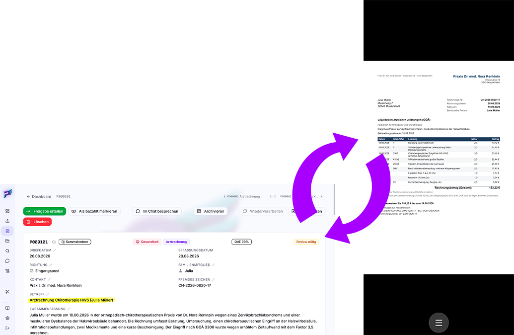

# Mobil und PWA

postbuch.net verfügt auf mobilen Endgeräten wie Smartphone und Tablet über
einen eigenen Bedienmodus. Er beruht auf einer einzigen Grundentscheidung: **Die
postbuch.net-Oberfläche arbeitet im Querformat, das Dokument im Hochformat.**
Durch Drehen des Geräts schaltet man in der Dokumentendetailseite um, ob man die
Meta- und Fachdaten des Dokumentes oder das PDF ansehen möchte.

## Was „mobil" technisch bedeutet

Die App fragt nicht nach Bildschirmbreite und nicht nach Betriebssystem, sondern
nach der Eingabeart: `matchMedia('(pointer: coarse)')`. Alles mit
Touch-Bedienung – Smartphone wie Tablet – gilt als mobil, jedes Gerät mit Maus
oder Trackpad als Desktop. Ein schmales Browserfenster auf dem PC löst den
Mobilmodus also **nicht** aus.

Im Mobilmodus ändert sich gegenüber dem Desktop:

- Das feste  PDF-Panel rechts neben der
  Detailseite entfällt; an seine Stelle tritt der Vollbild-Betrachter im
  Hochformat.
- Tabellen verlieren die feste Spaltenbreite und die Ziehgriffe zum
  Spaltenanpassen; lange Texte werden abgeschnitten statt umgebrochen.
- Die  Spaltenauswahl öffnet sich als
  eingebettetes Feld statt als schwebendes Menü.
- Die Seitenleiste klappt nicht beim Überfahren auf, sondern erst auf Tippen.

## Die Querformat-Sperre

Solange du dich durch Listen, Einstellungen oder die Abrechnung bewegst, hält
die App das Gerät im Querformat fest. Der Grund ist banal und praktisch:
Dokumententabellen mit acht Spalten sind hochkant nicht lesbar.

Der Lock wird beim Wechsel zwischen Seiten erneuert und außerdem jedes Mal, wenn
die App aus dem Hintergrund zurückkommt – Android hebt Locks beim Wegschalten
gerne auf.

**Wenn die Sperre nicht greift**, zeigt die App einen dunklen Vollbildhinweis
mit  Drehsymbol und dem Text „Bitte Gerät
in Querformat drehen." Das ist der Fallback für Browser, die den Lock nicht
anbieten – allen voran **Safari auf dem iPhone**, das die API nicht unterstützt.
Dort funktioniert alles andere, nur das automatische Festhalten nicht; du drehst
selbst.

> [!WARNING]
>
> Die Sperre setzt außerdem einen _secure context_ voraus, also HTTPS oder
> `localhost`. Wer die App über eine nackte `http://…`-LAN-Adresse aufruft,
> bekommt statt der Sperre den Drehhinweis zu sehen. Das ist einer der Gründe,
> warum sich der [Caddy-Betrieb mit TLS](installation.md) auch im Heimnetz
> lohnt.

### Wo Hochformat ausdrücklich erlaubt ist

Zwei Stellen melden der App aktiv „hier darf (und _soll_) hochkant gedreht
werden", und nur dort wird der Lock aufgehoben:

| Stelle                                          | Was im Hochformat passiert                           |
| ----------------------------------------------- | ---------------------------------------------------- |
| **Dokument-Detailseite** (`/postbuch/<PostID>`) | Der Vollbild-PDF-Betrachter erscheint                |
| **Abrechnungs-Assistent, Schritt 2 (Prüfen)**   | Die zusammengeführte Einreichungs-PDF wird angezeigt |

Überall sonst bleibt es beim Querformat. Der Hinweis „Zum Anzeigen: Gerät
hochkant drehen" im Abrechnungs-Assistenten ist genau dieser Mechanismus;
daneben steht immer auch ein 
Download-Knopf, falls du das PDF lieber in einer anderen App öffnest.

## Dokumente ansehen durch Drehen

Das ist die zentrale mobile Geste:

1. Ein Dokument aus der Liste antippen → Detailseite im **Querformat**, mit
   Metadaten, Beträgen, Akten und Verbleib.
2. Gerät **hochkant** drehen → das PDF füllt den Bildschirm.
3. Gerät wieder ins **Querformat** drehen → der Betrachter schließt sich, du
   bist zurück in den Metadaten.

Es gibt bewusst keinen „PDF öffnen"-Knopf und keinen „Schließen"-Knopf: Die
Drehung _ist_ die Bedienung.

**Ausnahme zum Schutz der Eingabe:** Tippst du gerade in ein Feld oder ist ein
Dialog offen, erscheint der Betrachter beim Drehen **nicht**. Sonst würde das
Aufklappen der Bildschirmtastatur, das auf manchen Geräten eine Orientierungs-
meldung auslöst, dir mitten im Satz das Dokument über die Eingabe legen. Der
Fokusschutz hat 200 ms Nachlauf, damit kurzes Fokus-Wandern beim Drehen nicht
fälschlich als „fertig getippt" gilt.

## Bedienung im Vollbild-Betrachter

| Geste                              | Wirkung                                                                |
| ---------------------------------- | ---------------------------------------------------------------------- |
| Wischen links / rechts             | eine Seite vor / zurück (ab 60 px waagerechter Strecke, nur ungezoomt) |
| Zwei Finger auseinander / zusammen | stufenloses Zoomen (_Pinch-to-Zoom_)                                   |
| Ein Finger ziehen (gezoomt)        | Bildausschnitt verschieben                                             |
| Doppeltipp                         | Zoom und Ausschnitt zurücksetzen                                       |
| Gerät zurück ins Querformat        | Betrachter schließen                                                   |

Unten in der Mitte sitzt ein großer runder Knopf. Er zeigt ein
 Menüsymbol und klappt auf Tippen
einen **Halbkreis mit fünf Aktionen** auf:

| Position    | Aktion                                                    |
| ----------- | --------------------------------------------------------- |
| links       | 90° nach links drehen                                     |
| links oben  |  Herunterladen |
| oben        | 180° drehen                                               |
| rechts oben |  Drucken              |
| rechts      | 90° nach rechts drehen                                    |

Die drei Drehknöpfe schreiben die Drehung **dauerhaft in die PDF-Datei in der
Dateiablage** zurück – das ist derselbe Vorgang wie im Desktop-PDF-Panel, nicht bloß
eine Anzeigekorrektur. Schlägt er fehl, erscheint drei Sekunden lang eine
Fehlermeldung. Bei einem Dokument ohne PDF sind die Drehknöpfe deaktiviert.

Ist die Ansicht gezoomt oder verschoben, wechselt der runde Knopf sein Symbol
und setzt bei Tippen zuerst die Ansicht zurück.

## Als App installieren (PWA)

postbuch.net bringt ein Web-App-Manifest und einen Service Worker mit und lässt
sich damit wie eine native App auf den Startbildschirm legen. Das Manifest ist
auf `display: fullscreen` gestellt – die installierte App läuft also ohne
Adressleiste und ohne Browser-Rahmen.

> [!NOTE]
>
> Die PWA-/Browser-Push-Nachrichten sind der empfohlene Benachrichtigungskanal.
> Die alternative Discord-Anbindung ist experimentell und wird nicht empfohlen,
> weil Fehlkonfigurationen sensible Daten offenlegen können. Einrichtung und
> Ereigniskategorien stehen unter [Benachrichtigungen](benachrichtigungen.md).

**Voraussetzung ist eine gleichbleibend erreichbare HTTPS-Adresse.** Ändert sich
die Domain, zeigt die bisherige App weiter auf die alte Adresse und muss über
die neue Adresse erneut installiert werden. Einen Installationsknopf _innerhalb_
der App gibt es bewusst nicht: Die Installation läuft immer über das Menü des
Browsers.

| Plattform         | Browser                  | Stand                                   |
| ----------------- | ------------------------ | --------------------------------------- |
| **Android**       | Chrome, Edge, Brave      | ✅ getestet                             |
| **Windows**       | Chrome, Edge             | ✅ getestet                             |
| **macOS**         | Safari 17+, Chrome, Edge | ⚠️ nicht getestet                       |
| **Linux**         | Chrome, Edge, Chromium   | ⚠️ nicht getestet                       |
| **iPhone / iPad** | Safari                   | ⚠️ nicht getestet – siehe Warnung unten |

Firefox installiert auf dem Desktop grundsätzlich keine Web-Apps. Unter Android
bietet Firefox „Zum Startbildschirm hinzufügen" an; die Verknüpfung startet die
App, verhält sich aber nicht in allen Punkten wie eine Chrome-Installation.

### Android

1. Die postbuch.net-Adresse über `https://` in Chrome (oder Edge/Brave) öffnen
   und anmelden.
2. Menü (drei Punkte) → **App installieren** bzw. **Zum Startbildschirm
   hinzufügen**.
3. Bestätigen. Die App liegt danach im Launcher und startet wie eine native
   App im Vollbild.

Hier greifen alle mobilen Besonderheiten dieses Kapitels: Querformat-Sperre,
Vollbild-Betrachter und der Doppeldruck-Schutz der
[Zurück-Taste](#die-zurück-taste-im-installierten-zustand).

### Windows

1. Die Adresse in Chrome oder Edge öffnen und anmelden.
2. Rechts in der Adressleiste erscheint ein **Installationssymbol** (Monitor mit
   Pfeil). Alternativ über das Menü – je nach Browserversion unter **Apps →
   Diese Website als App installieren** (Edge) bzw. **Streamen, Speichern und
   Teilen → Seite als App installieren** (Chrome).
3. Bestätigen. Die App bekommt einen Startmenü-Eintrag und ein eigenes Fenster
   ohne Browser-Rahmen; sie lässt sich an die Taskleiste anheften.

Auf Windows funktioniert auch der [Etikettendruck](etiketten-drucken.md), weil
Chrome und Edge dort Web Bluetooth unterstützen.

### macOS

- **Safari ab Version 17:** Menü **Ablage → Zum Dock hinzufügen**.
- **Chrome / Edge:** Installationssymbol in der Adressleiste, wie unter Windows.

### Linux

Chrome, Chromium und Edge bieten das Installationssymbol in der Adressleiste an;
die App landet dann als eigener Fenster-Eintrag im Anwendungsmenü der
Desktop-Umgebung.

### iPhone und iPad

> [!WARNING]
>
> **Auf iOS und iPadOS ist nichts davon getestet.**
>
> Der Entwickler von postbuch.net verfügt über kein Apple-Gerät. Der hier
> beschriebene Weg entspricht dem, was Apple für Web-Apps dokumentiert, ist aber
> an keiner Stelle praktisch überprüft worden – weder die Installation selbst
> noch das Verhalten der App danach. Rechne mit Abweichungen und betrachte die
> iOS-Nutzung als experimentell.

1. Die Adresse in **Safari** öffnen und anmelden.
2. Teilen-Symbol → **Zum Home-Bildschirm**.
3. Namen bestätigen.

Bekannte Einschränkungen unter iOS – die ersten beiden ergeben sich aus
fehlender Browser-Unterstützung und gelten unabhängig von der Installation:

- Die **Querformat-Sperre greift nicht** (siehe oben): Safari bietet
  `screen.orientation.lock` nicht an. Das Gerät muss von Hand gedreht werden.
- **Etikettendruck ist nicht möglich**, weil Safari kein Web Bluetooth
  unterstützt – siehe [Etiketten drucken](etiketten-drucken.md).
- **Push-Benachrichtigungen** setzt Apple ab iOS 16.4 voraus und nur, wenn die
  App tatsächlich über „Zum Home-Bildschirm" installiert wurde, nicht im
  normalen Safari-Tab. Auch das ist hier nicht verifiziert.

Andere Browser auf dem iPhone (Chrome, Edge, Firefox) benutzen dieselbe
Safari-Engine und bieten den Homescreen-Weg teilweise ebenfalls an. Getestet ist
auch das nicht.

## Die Zurück-Taste im installierten Zustand

Im Vollbildmodus gibt es keine Browser-Zurück-Taste, wohl aber die
Hardware-/Gesten-Zurück-Taste von Android. Ohne Gegenmaßnahme würde ein
unbedachter Rückwärtswisch auf der Startseite die App schließen.

Deshalb fängt die installierte App den ersten Rückwärtsschritt ab und zeigt:

> **App beenden?** Zum Beenden bitte erneut die Hardware-Zurück-Taste drücken.
> Oder Abbrechen wählen.

Erst der **zweite** Druck beendet wirklich. „Abbrechen" bringt dich zurück in
die App. Innerhalb der App navigierst du normal über die Seitenleiste und die
Zurück-Pfeile der Oberfläche.

Der Schutz ist an die Installationserkennung gekoppelt (Anzeigemodus
`standalone`/`fullscreen`/`minimal-ui`, iOS-Standalone-Flag, Android-Kennung).
Im normalen Browser-Tab greift er nicht – dort funktioniert die Zurück-Taste wie
gewohnt.

## Aktualisierungen

Der Service Worker hat **absichtlich keinen Cache für Netzwerkanfragen**: Alle
Anfragen laufen unverändert über den Browser. Er ist ausschließlich für
[Push-Benachrichtigungen](benachrichtigungen.md) zuständig. Damit kann eine alte
zwischengespeicherte Version dich nie in einem veralteten Zustand festhalten.

Der Webserver liefert `index.html`, den Service Worker und das Manifest mit
`no-store` aus und die Programmdateien unter `/assets/` mit ETag-Prüfung. Nach
einem Update genügt es deshalb in aller Regel, die App zu schließen und wieder
zu öffnen. Hängt sie doch einmal auf einer alten Fassung, hilft ein Neuladen mit
gedrückter Umschalttaste bzw. auf dem Telefon das Leeren der Website-Daten für
diese Adresse.

---

Weiter: [Etiketten drucken](etiketten-drucken.md) ·
[Zurück zur Übersicht](README.md)
