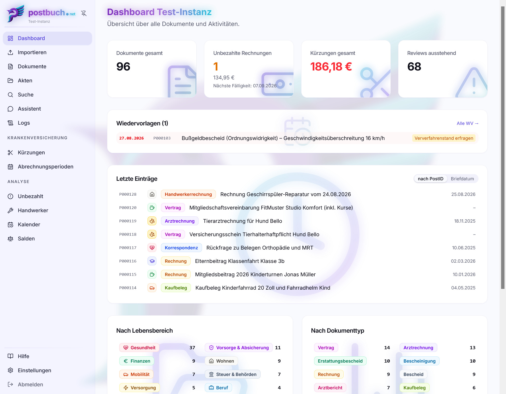
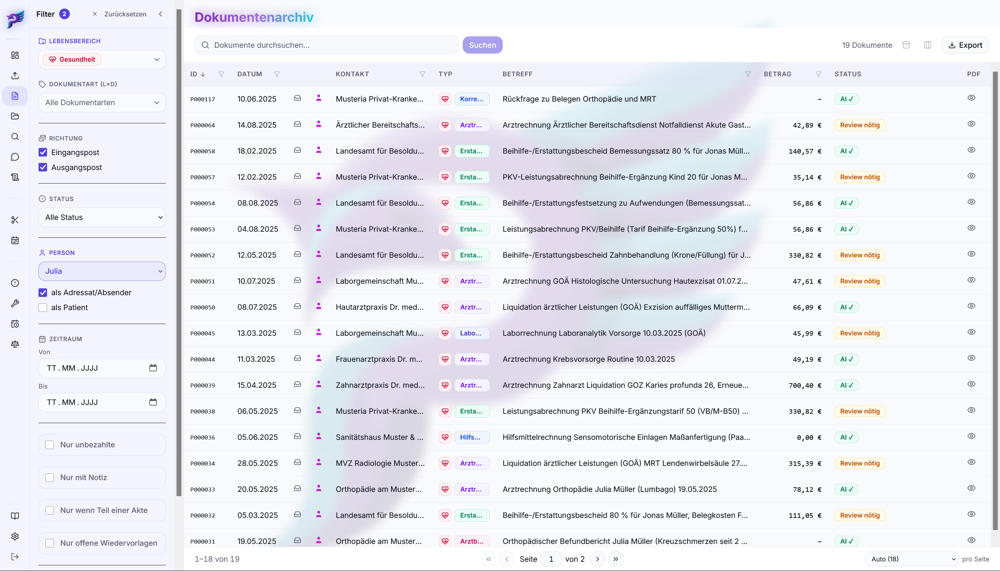

# Die Oberfläche

Die Web-App besteht aus einer Seitenleiste links und dem Inhaltsbereich rechts.
Die Seitenleiste ist ab Werk dauerhaft ausgeklappt. Über das  Pinnadel-Symbol
wechselt sie zum dynamischen Modus, in dem sie nur beim Überfahren mit der Maus
bzw. Antippen ausklappt. Für kleine Bildschirme z. B. von Mobilgeräten wird der
dynamische Modus empfohlen.

## Navigation

| Eintrag         | Inhalt                                                        |
| --------------- | ------------------------------------------------------------- |
|  **Dashboard**   | Kennzahlen, offene Entscheidungen, Wiedervorlagen, Warnbanner |
|  **Importieren** | Scannen, hochladen, Dokumentenübergabe einspielen             |
|  **Dokumente**   | Die Liste aller Dokumente mit Filtern, Sortierung und Export  |
|  **Akten**       | Elektronische Akten und die Verwaltung der Papier-Ablagen     |
|  **Suche**       | Volltext- und semantische Suche über Dokumente und Akten      |
|  **Assistent**   | Chat mit den eigenen Dokumenten                               |
|  **Logs**        | Systemprotokolle (für Nicht-Admins ausblendbar)               |

Darunter zwei Gruppen:

**Krankenversicherung** – erscheint nur, wenn mindestens ein Mensch als PKV-
oder Beihilfe-versichert eingetragen ist:  Kürzungen ·  Abrechnungsperioden

**Analyse:**  Unbezahlt ·  Handwerker ·  Kalender ·  Salden _(für Nicht-Admins
ausblendbar)_

Ganz unten stehen  **Hilfe**,  **Einstellungen** und der  Abmelden-Knopf. Ein
kleiner Punkt am Zahnrad zeigt Admins an, dass ein Update bereitliegt.

**Hilfe** öffnet genau diese Dokumentation innerhalb der Anwendung. Sie wird mit
dem Web-Container ausgeliefert und kommt vom eigenen Server – es wird nichts
nachgeladen, kein Internetzugang nötig. Querverweise zwischen den Kapiteln, die
Sprungmarken und das [Stichwortverzeichnis](stichwortverzeichnis.md)
funktionieren dort genauso wie in der Textfassung; lange Kapitel bekommen auf
breiten Bildschirmen rechts ein Inhaltsverzeichnis.

### Undo/Redo

Über der Fußzeile der Seitenleiste erscheint eine
**Rückgängig/Wiederholen**-Leiste, sobald es etwas rückgängig zu machen gibt.
Sie merkt sich die letzten **10** schreibenden Aktionen, lebt nur im Browser-Tab
und ist nach einem Neuladen der Seite wieder leer.

### Aufgabenanzeige

Laufende Hintergrundarbeiten – Import, KI-Wiederverarbeitung,
Embedding-Neuberechnung – melden ihren Fortschritt in einer Statusleiste am
unteren Rand; die Oberfläche fragt den Serverstand dafür in kurzen Abständen ab.
Man kann die Seite verlassen, die Arbeit läuft auf dem Server weiter.
Abgeschlossene Aufgaben verschwinden nach fünf Minuten von selbst; die Liste
lebt im aktuellen Browser-Tab.

## Dashboard

Oben stehen **Banner**, die nur bei Bedarf erscheinen und jeweils direkt zur
Lösung verlinken:

- kein Backup aktiv
- KI-Konfiguration fehlerhaft: Provider nicht erreichbar oder ein eingestelltes
  Modell wird vom Provider nicht mehr gelistet (der Link führt Admins in die
  KI-Einstellungen)
- Update verfügbar (nur Admins)
- fehlgeschlagene Dokumente
- fehlende Embeddings
- Scan-Wiederholungen
- Dateiablage (OneDrive/Nextcloud) nicht verbunden
- Dateiablage-Umzug begonnen, aber nicht abgeschlossen (Mischbestand)
- offene Duplikat-Entscheidungen

Darunter die Kennzahlen-Kacheln: **Dokumente gesamt**, **Unbezahlte Rechnungen**
(mit Summe und nächster Fälligkeit), **Kürzungen gesamt** (nur bei versicherten
Personen) und **Reviews ausstehend**. Jede Kachel ist ein Sprung in die
zugehörige Liste.

Es folgen die **Wiedervorlagen** der nächsten sieben Tage samt überfälliger, die
**letzten Einträge** sowie zwei Verteilungen: **nach Lebensbereich** und **nach
Dokumentart**. Ein Klick auf ein Segment filtert die Dokumentliste entsprechend.

## Dokumente

Die zentrale Liste. Über die
 **Spaltenauswahl** lassen sich Spalten
ein- und ausblenden, die Breite der Spalten kann durch Ziehen an den Grenzen der Spaltenköpfe geändert werden; die Konfiguration bleibt gespeichert.

 **Filterleiste** – filtern nach Volltext, Person (wahlweise als _Adressat_
und/oder als _behandelte Person_; „(ohne)“ zeigt Dokumente ohne Personenzuordnung), Lebensbereich, Dokumentart, Status, Zeitraum,
Schlagwörtern sowie danach, ob in der Dateiablage die Datei zu einem Dokument fehlt
(siehe [Wenn eine Datei endgültig fehlt](storage-backends.md#wenn-eine-datei-endgültig-fehlt)).
Die aktiven Filter bestimmen auch, was ein Export mit dem
Umfang „Alle Dokumente" umfasst – siehe [Export und Import](export-import.md).

Bei den filterbaren Spalten (ID, Datum, Kontakt, Betreff und Betrag) öffnet ein
Klick auf das kleine  im Spaltenkopf ein
Eingabefeld. Ein beliebiger Wort- oder Zahlenbestandteil genügt; die Liste wird
sofort auf passende Einträge eingeschränkt.

Die Spalten **ID**, **Datum**, **Kontakt** und **Betrag** lassen sich durch Klick
auf den jeweiligen Spaltennamen auf- und absteigend sortieren. Ein weiterer
Klick wechselt die Richtung;  bzw.  im Spaltenkopf zeigen die aktuelle
Sortierung an.

Ein Klick auf das  am rechten Rand einer Zeile
öffnet die zugehörige PDF direkt in einem Viewer am rechten Bildschirmrand.

 **Historisch** – abgeschlossene Vorgänge bzw. überholte Dokumente (z. B. ein alter, gekündigter Stromliefervertrag) lassen sich als _historisch_ markieren.
Sie verschwinden aus den Standardansichten, bleiben aber auffindbar.

### Dokumentdetailansicht

Durch Anklicken eines Dokumentes in der Liste gelangt man auf die Dokumentendetailansicht. Sie zeigt in der Mitte die Metadaten und **rechts** das PDF. Über Vor-
und Zurück-Knöpfe in der Kopfzeile blättert man durch die Liste, aus der man
gekommen ist:  und
. Mit
 gelangt man wieder zur vorherigen
Ansicht.

> Dieser Abschnitt ist eine Übersicht. Das eigene Kapitel
> [Die Dokumentansicht](dokumentansicht.md) beschreibt alle Bedienelemente der
> Detailseite – Freigabe, Metadaten bearbeiten, Bestreiten, Erstattungen von
> Hand verknüpfen, Kürzungen, PDF-Betrachter.

Die Datenblöcke richten sich nach der Dokumentart: eine Arztrechnung zeigt
Einzelpositionen mit GOÄ-Ziffern und Erstattungsstand, eine Handwerkerrechnung
den steuerlich relevanten Lohnanteil, ein Erstattungsbescheid die Erstattungs-
und Kürzungspositionen.

Immer vorhanden:

-  **Basisdaten**: Lebensbereich,
  Dokumentart, Briefdatum, Betreff, Zusammenfassung, Schlagwörter – alles nachträglich änderbar
-  **Notiz** – freier Text
-  **Wiedervorlage** – Datum plus Anlass
- **Verbleib** – wo das Papieroriginal liegt, mit Etikettendruck
  . Das Symbol des Verbleibs richtet sich
  nach der gewählten Originalablage.
-  **Akten** – Zugehörigkeit anlegen oder lösen

In der Aktionsleiste:

| Aktion                           | Wirkung                                                                                                                                        |
| -------------------------------- | ---------------------------------------------------------------------------------------------------------------------------------------------- |
|  **Freigabe erteilen** | Setzt den Status auf „User ✓" – gesehen und in Ordnung |
|  **Als bezahlt markieren** | Markiert Rechnungen als heute gezahlt |
|  **Im Chat besprechen** | Öffnet den Assistenten mit einer Referenz auf dieses Dokument |
|  **Archivieren** / **Historisch** | Markierung setzen bzw. entfernen |
|  **Wiederverarbeiten** | KI-Analyse wiederholen, mit Wahl der Modellstufe und Korrekturanweisungen  |
|  **PDF ersetzen** (bzw. **Fehlende PDF reimportieren**) | Neue PDF-Datei, gleiche Postnummer, ohne KI-Lauf |
|  **Löschen** | Datenbankeintrag löschen; PDF nach `<postbuch.net-Wurzelverzeichnis>/_trash` verschieben ([Einzelheiten](storage-backends.md#der-postbuchnet-papierkorb)) |

Bei offenen Rechnungen mit IBAN erzeugt postbuch.net zusätzlich einen
**GiroCode** (EPC-QR-Code), den Banking-Apps direkt einlesen.

## Akten

Zwei Registerkarten:

 **Elektronisch** – die Akten mit ID, Betreff, Dokumentanzahl, Schlagwörtern und
Änderungsdatum. In der Akte lassen sich Dokumente frei sortieren, entfernen und
hinzufügen; die ganze Akte lässt sich als PDF, ZIP, Excel-Tabelle oder
Dokumentenübergabe exportieren.

 **Originale** – die Verwaltung der physischen Ablagen: Obergruppen (Kategorien)
und die konkreten Ablagen darin, jeweils mit der Zahl der zugeordneten
Dokumente. Ablagen lassen sich archivieren oder _auflösen_, wobei ihre Dokumente
auf eine andere Ablage umgezogen werden.

Details in [Akten, Verbleib und Wiedervorlagen](akten-und-organisation.md).

## Krankenversicherung

| Seite                   | Inhalt                                                                                           |
| ----------------------- | ------------------------------------------------------------------------------------------------- |
|  **Kürzungen**           | Alle Erstattungskürzungen, nach Bescheid gruppiert, mit Gesamtsumme                            |
|  **Abrechnungsperioden** | Sammel- und Einreichungsstand je Person und Kostenträger                  |

Die beiden Seiten erscheinen nur bei versicherten Personen. Siehe
[PKV, Beihilfe und Abrechnung](abrechnung-pkv-beihilfe.md).

## Analyse

| Seite                   | Inhalt                                                                                                                                                                                                    |
| ----------------------- | --------------------------------------------------------------------------------------------------------------------------------------------------------------------------------------------------------- |
|  **Unbezahlt**           | Alle offenen Rechnungen mit Fälligkeit und Summe                                                                                                                                                          |
|  **Handwerker**          | Handwerkerrechnungen nach Leistungsjahr gruppiert, mit dem steuerlich absetzbaren Lohnanteil – standardmäßig die letzten zwei Jahre; archivierte Rechnungen zählen mit und sind als solche gekennzeichnet |
|  **Kalender**            | Monatsansicht aller Wiedervorlagen und (Zahlungs-)Fristen                                                                                                                                                            |
|  **Salden**              | Frei definierbare Konten mit manuellen Buchungen, optional zusätzlich aus einer hinterlegten SQL-Abfrage                                                                                                  |

## Einstellungen

Elf Registerkarten. Für **Admins** sind alle sichtbar. Nicht-Admins sehen nur
 **Konto** und  **Benachrichtigungen**, Schreibberechtigte zusätzlich
 **MCP-Zugriff**.

| Tab                    | Inhalt                                                                                                                       | Kapitel                                     |
| ---------------------- | ---------------------------------------------------------------------------------------------------------------------------- | ------------------------------------------- |
|  **Konto**              | Eigenes Passwort ändern                                                                                                      |                                             |
|  **Allgemein**          | Instanzname, Basis-URL, Sichtbarkeit einzelner Menüpunkte, Parallelität der Verarbeitungs-Pipeline, Cloud-frei-Check, Update | [Betrieb](betrieb-troubleshooting.md)       |
|  **KI**                 | Anbieter, Modellstufen, Empfehlungen, Embedding-Modell                                                                       | [KI-Anbieter](ki-provider.md)               |
|  **Scanner**            | Scanner suchen und einbinden, Auflösung, Farbmodus                                                                           | [Importieren](dokumente-importieren.md)     |
|  **Dateiablage**             | OneDrive/Nextcloud verbinden, Ordner, Umzug                                                                                  | [Dateiablage-Backends](storage-backends.md)      |
|  **Personen & Zugänge** | Menschen anlegen, Rollen, PKV-/Beihilfe-Sätze                                                                                | [Sicherheit](sicherheit.md)                 |
|  **Verbleib**           | Kategorien für Papierablagen                                                                                                 | [Akten](akten-und-organisation.md)          |
|  **Drucker**            | Niimbot D110 verbinden                                                                                                       | [Etiketten drucken](etiketten-drucken.md)   |
|  **MCP-Zugriff**        | Tokens für externe Tools                                                                                                     | [MCP](mcp.md)                               |
|  **Backup**             | Zeitplan, Aufbewahrung, Wiederherstellung                                                                                    | [Backup](backup-wiederherstellung.md)       |
|  **Benachrichtigungen** | PWA-/Browser-Push (empfohlen), Discord (experimentell)                                                                       | [Benachrichtigungen](benachrichtigungen.md) |

---

Weiter: [Dokumente importieren](dokumente-importieren.md) ·
[Zurück zur Übersicht](README.md)
