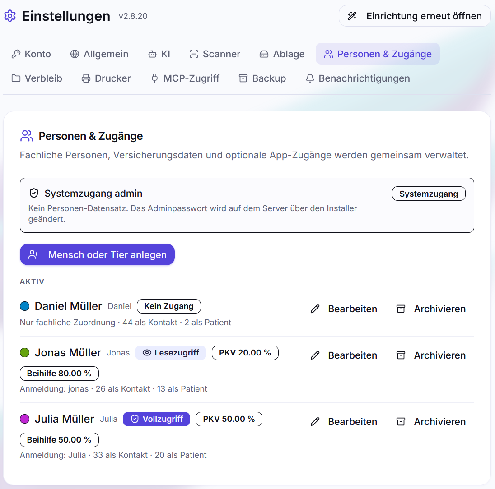

# Sicherheit

postbuch.net verwaltet die empfindlichsten Unterlagen eines Haushalts –
Arztrechnungen, Versicherungsvorgänge, Verträge. Dieses Kapitel beschreibt, wie
der Zugriff darauf geregelt ist, was von außen erreichbar ist und wo die Grenzen
liegen. Es beschreibt den Ist-Zustand, keine Absichtserklärung.

---

## Rollen und Zugänge

Es gibt genau **drei** Zugriffsstufen, und nur zwei davon sind Rollen in der
Datenbank:

| Stufe         | Woher                                                                                   | Darf                                                            |
| ------------- | --------------------------------------------------------------------------------------- | --------------------------------------------------------------- |
| `admin`       | fest der Benutzername `admin`, Passwort ausschließlich aus `APP_PASSWORD` in der `.env` | alles, einschließlich Einstellungen, Personen, Backup, Updates  |
| `vollzugriff` | im UI angelegte Person mit Zugang                                                       | alles Fachliche: erfassen, ändern, löschen, suchen, exportieren |
| `lesezugriff` | im UI angelegte Person mit Zugang                                                       | ausschließlich lesen – alle oder nur die eigenen Dokumente      |

**Der Administrator ist kein Datenbankbenutzer.** Er existiert nur, solange
`APP_PASSWORD` gesetzt ist, und sein Passwort lässt sich nicht in der Oberfläche
ändern – nur in der `.env`, gefolgt von einem Neustart des App-Containers. Es
gibt genau einen Admin pro Instanz.

`lesezugriff` wird nicht pro Route durchgesetzt, sondern zentral: **jede**
schreibende HTTP-Methode auf `/api/*` wird für diese Rolle abgelehnt. Eine
vergessene Prüfung in einer einzelnen Route kann diese Sperre nicht aushebeln.

Admin-Bereiche sind darüber hinaus vollständig abgeriegelt: Einstellungen,
Personen & Zugänge, Backup, Updates, das Verbinden der Dateiablage und die Verwaltung
der SQL-Salden-Quellen. Was auch Nicht-Admins sehen müssen, liefert ein eigener
Endpunkt mit einer **Feld-Whitelist** – nicht die vollständigen Einstellungen
mit ausgeblendeten Feldern.

Angelegt werden Zugänge unter  **Einstellungen → Personen & Zugänge**. Eine
Person muss keinen Zugang haben: Kinder tauchen typischerweise als Person in
Dokumenten auf, ohne sich jemals anmelden zu können.

### Lesezugriff auf die eigenen Dokumente beschränken

Beim Lesezugriff legt das Feld **Sieht** fest, wie weit er reicht:

- **Alle Dokumente** – der gesamte Bestand der Instanz, nur ohne Ändern.
- **Nur eigene Dokumente** – ausschließlich die Dokumente, denen diese Person
  zugeordnet ist, in der Regel als Adressat. Dass jemand auf einer Arztrechnung
  als behandelte Person steht, macht das Dokument nicht zu seinem eigenen.

Ein typischer Haushalt: Die Mutter erledigt die Familienkorrespondenz und hat
Vollzugriff. Der Vater hat Lesezugriff auf alle Dokumente. Die minderjährigen
Kinder haben Lesezugriff nur auf ihre eigenen Dokumente – ihr Zeugnis, ihren
Ausbildungsvertrag, Post von der Krankenkasse an sie selbst.

Wer nur die eigenen Dokumente sieht, bekommt eine bewusst schlanke Oberfläche:
die Dokumentliste, die Dokumentansicht mit PDF, die Suche (Volltext und
semantisch), die Hilfe und in den Einstellungen das eigene Konto.
Übersicht, Analyse, Krankenversicherung, Akten, Wiedervorlagen, Verbleib,
Anpinnen, der Assistent, Export, Logs und Benachrichtigungen fehlen ganz. Sie
würden sonst Beträge, Namen oder Zusammenhänge aus fremden Dokumenten
verraten. Die Grenze setzt der Server durch, nicht die Oberfläche: Jede
Schnittstelle, die nicht ausdrücklich für diesen Lesebereich freigegeben ist,
lehnt die Anfrage ab, und ein fremdes Dokument antwortet so, als gäbe es es
nicht.

In der Personenliste trägt ein solcher Zugang das Abzeichen **Lesezugriff:
eigene Dokumente**. Welche Dokumente als eigene gelten, folgt der Person im
Dokument: Wird die Zuordnung eines Dokuments geändert, sieht es ab sofort nur
noch die neue Person.

### Wenn ein Zugang endet

Rollenwechsel, Änderung des Lesebereichs, Passwortänderung und Löschen einer Person **widerrufen in
derselben Datenbanktransaktion** alle Web-Sitzungen und alle MCP-Token dieser
Person. Wer ausgesperrt werden soll, ist damit sofort ausgesperrt – nicht erst
nach Ablauf des Sitzungscookies.

Für den Administrator gibt es das Gegenstück: Jede Admin-Sitzung trägt einen
Fingerabdruck des aktuellen `APP_PASSWORD`. Wird das Passwort in der `.env`
geändert und die App neu gestartet, passt der Fingerabdruck nicht mehr und alle
alten Admin-Sitzungen sind ungültig.

---

## Anmeldung

- **Sitzungen liegen in PostgreSQL**, nicht im Arbeitsspeicher. Sie überstehen
  einen Neustart des Containers – im laufenden Betrieb ist das Alltag. In
  Backups werden sie nicht mitgesichert, und ein Restore beendet alle
  bestehenden Sitzungen.
- **Anmeldenamen** unterscheiden nicht zwischen Groß- und Kleinschreibung:
  `Anna` und `anna` sind derselbe Zugang und können nicht zweimal vergeben
  werden. `admin` ist in jeder Schreibweise für den Administrator reserviert,
  auch die Anmeldung als `Admin` gelingt. Leerzeichen vor oder nach dem Namen
  werden ignoriert.
- **Cookie:** `httpOnly`, `sameSite=strict`, Laufzeit 7 Tage. Das `Secure`-Flag
  wird gesetzt, sobald die Anfrage tatsächlich über HTTPS kam. Ohne
  Reverse-Proxy im LAN wäre ein hartes `Secure` gleichbedeutend mit „kein Login
  möglich", deshalb ist es an das Protokoll gekoppelt.
- **Passwörter** werden mit scrypt gespeichert (N = 32768, r = 8, p = 1) und
  bekommen je Passwort einen zufälligen 128-Bit-Salt. Ältere, deterministisch
  abgeleitete Hashes werden beim nächsten erfolgreichen Login automatisch auf
  das aktuelle Verfahren gehoben.
- **Brute-Force-Bremse:** 10 Fehlversuche pro 5 Minuten, gezählt je Kombination
  aus IP und Benutzername. Danach `429` mit `Retry-After`. Erst wenn nur noch
  wenige Versuche übrig sind, nennt die Anmeldemaske die Restzahl – ein
  Vertipper soll keinen Zähler auslösen.
- Die Mindestlänge für Passwörter beträgt sechs Zeichen. Das ist eine untere
  Schranke der Software, keine Empfehlung.

---

## Was von außen erreichbar ist

Im Auslieferungszustand hört postbuch.net auf **Port 3420** und ist damit im
lokalen Netz erreichbar, nicht aus dem Internet. Wer von unterwegs zugreifen
will, stellt einen Reverse-Proxy davor – mitgeliefert ist Caddy im Profil
`caddy`, mit automatischem Zertifikat über DuckDNS oder eine eigene Domain
(siehe [Installation](installation.md)).

Ohne HTTPS fehlen drei Dinge gleichzeitig: die Installation als PWA, der
Service-Worker und das `Secure`-Flag am Sitzungscookie. Eine dauerhaft
installierte PWA braucht außerdem eine gleichbleibend erreichbare Adresse, weil
sie an den bisherigen Origin gebunden bleibt. Eine Instanz, die über das
Internet erreichbar sein soll, gehört deshalb ausnahmslos hinter TLS.

**Nicht von außen erreichbar**, obwohl sie am selben Port hängen:

| Pfad                   | Absicherung                                                                                                         |
| ---------------------- | ------------------------------------------------------------------------------------------------------------------- |
| `/api/webhooks/*`      | nginx antwortet von außen mit `404`; zusätzlich Token-Prüfung per `X-Webhook-Token` (zeitkonstanter Vergleich)      |
| `/api/internal/config` | nginx antwortet von außen mit `404`; nur im Docker-Netz erreichbar, verteilt u. a. den Webhook-Token an den Cleaner |

Der 404-Block ist dabei nicht das einzige Schloss, sondern das zweite: Der
Webhook prüft seinen Token unabhängig davon, weil `/api/` sonst pauschal
durchgereicht wird.

Vor dem allgemeinen Cookie-Session-Schutz liegen mehrere eigenständig
abgesicherte Routen: `/api/health` für die Gesundheitsprüfung,
`/api/public/scanner-port` für die Auskunft über den Scanner-Port, `/api/auth`
für Login und Sitzungsprüfung, `/api/onedrive-auth`
für den Microsoft-OAuth-Flow mit eigener State-Prüfung, `/api/webhooks/*` mit
Token-Prüfung, `/api/mcp` mit Bearer-Token und `/api/internal/config` für den
internen Docker-Netzverkehr. Die Seite `/setup/restore` ist während der
Einrichtung mit dem Admin-Passwort und einer Fehlversuchsbegrenzung geschützt.

Der Webserver setzt außerdem `X-Content-Type-Options: nosniff`,
`X-Frame-Options: DENY`, `Referrer-Policy: same-origin` und eine
`Permissions-Policy`, die Kamera, Mikrofon und Standort abschaltet.

### MCP-Token

Der Zugriff durch externe KI-Werkzeuge läuft nicht über Cookies, sondern über
Bearer-Token (`pb_…`). Gespeichert wird ausschließlich deren SHA-256-Wert; den
Klartext zeigt die Oberfläche genau einmal beim Erzeugen. Token gehören zu einer
Person, können ablaufen und lassen sich einzeln widerrufen. Der MCP-Zugang ist
konstruktionsbedingt **lesend** – Details in [MCP-Zugriff](mcp.md).

---

## Ausgehende Verbindungen

Jede URL, die man in postbuch.net konfigurieren kann – der KI-Anbieter, der
WebDAV-Server – ist der Sache nach ein Werkzeug, um die Anwendung fremde
Adressen aufrufen zu lassen. Das ist beabsichtigt: ein Ollama im eigenen
Intranet ist genau das Ziel. Verboten wird deshalb nicht, sondern eingehegt:

- nur `http:` und `https:`, keine Zugangsdaten in der URL,
- **keine automatischen Weiterleitungen** – eine 30x-Antwort gilt als
  Konfigurationsfehler; nebenbei verhindert das, dass ein Anmelde-Header an
  einen fremden Host weitergereicht wird,
- der Name wird **selbst aufgelöst**, die IP geprüft und die Verbindung gegen
  genau diese geprüfte IP aufgebaut. Ohne diesen Schritt ließe sich jede
  Positivliste über DNS-Rebinding umgehen,
- private Ziele nur nach ausdrücklicher Freigabe pro Anbieter. Zwei Bereiche
  bleiben **immer** gesperrt, auch mit Freigabe: `169.254.0.0/16`
  (Cloud-Metadaten) und `100.64.0.0/10`,
- Zeitlimits und Größenbegrenzungen für Antworten,
- Fehlermeldungen privater Ziele werden nicht an den Browser durchgereicht –
  sonst wäre die Anwendung ein Lesegerät für das eigene Netz.

Wohin Daten überhaupt abfließen können, beantwortet der  Cloudfrei-Check unter
 **Einstellungen → Allgemein**; siehe [KI-Anbieter](ki-provider.md).

> [!WARNING]
>
> Die Discord-Anbindung ist experimentell und wird nicht empfohlen. Sie sendet
> Inhalte aus Dokument- und Fehlermeldungen an einen externen Dienst. Fehler bei
> Server-, Kanal-, Bot- oder Webhook-Berechtigungen können diese Daten für
> Unbefugte sichtbar machen. Nutze stattdessen PWA-/Browser-Push; eine neue
> Discord-Konfiguration verlangt in der Oberfläche eine ausdrückliche
> Risikobestätigung.

---

## Geheimnisse

**In der `.env`** stehen das Datenbankpasswort, das Sitzungsgeheimnis und das
Admin-Passwort. Die Datei wird nie in ein Repository eingecheckt und gehört
niemandem außer dem Server. Wer sie weitergibt, gibt die Instanz weg.

**In der Datenbank** stehen alle übrigen Zugangsdaten: OAuth-Token der Dateiablage,
WebDAV-App-Passwort, KI-Schlüssel. Die API gibt sie **nie** zurück – weder
Administratoren noch dem eigenen Frontend. Erkannt werden sie an Namensregeln,
die sowohl beim Lesen als auch beim Schreiben greifen; die Oberfläche zeigt
entsprechend nur, _ob_ ein Schlüssel hinterlegt ist. Welche Einstellungen über
die API überhaupt gesetzt werden dürfen, regelt eine **Positivliste**: eine neue
Einstellung muss ausdrücklich eingetragen werden, statt dass jeder nicht
verbotene Name durchrutscht.

**Die Backup-Datei** ist standardmäßig verschlüsselt: Mit aktivierter
[Backup-Verschlüsselung](backup-wiederherstellung.md#backup-verschlüsselung)
liegt jede Sicherung passwortgeschützt in der Dateiablage. Wird die Verschlüsselung
im Einrichtungsassistenten bewusst abgelehnt oder später unter Einstellungen →
Backup deaktiviert, enthält die Backup-Datei stattdessen all das im Klartext
und ist damit ein Generalschlüssel für die Instanz _und_ für die
dahinterliegende Cloud – siehe
[Backup und Wiederherstellung](backup-wiederherstellung.md).

### Der Zugriff auf die Dateiablage ist ein Vollzugriff

Das ist der Punkt mit der größten Tragweite in diesem Kapitel, deshalb steht er
ausdrücklich da:

**Bei OneDrive** verlangt postbuch.net die Graph-Berechtigung
`Files.ReadWrite.All` – lesen, ändern und löschen in **allen** Ordnern des
verbundenen Microsoft-Kontos, nicht nur im postbuch-Ordner. Das ist eine
bewusste Entscheidung: Nur mit dieser Berechtigung liegen die Dokumente im
gewöhnlichen Dateibaum und bleiben auch ohne postbuch.net erreichbar, über die
OneDrive-App, den Explorer oder onedrive.com. Die engere Alternative
(`Files.ReadWrite.AppFolder`) würde die Dateien in einen abgeschotteten
App-Ordner sperren – der Preis dafür wäre, dass sie ohne diese Anwendung nicht
mehr sinnvoll zugänglich sind.

**Bei einem WebDAV-Speicher** gilt dasselbe in anderer Form: Das App-Passwort
gilt für alle Dateien des Cloud-Kontos. Dass postbuch.net nur unterhalb seines
eigenen Ordners arbeitet, ist eine Selbstbeschränkung der Anwendung, keine
Grenze der Berechtigung.

Daraus folgt, was jeder Betreiber wissen muss:

- Das Token bzw. App-Passwort steht **unverschlüsselt in der Datenbank**
  (`_settings.onedrive_tokens` bzw. die WebDAV-Zugangsdaten).
- Ein Datenbank-Backup enthält es damit ebenfalls.
- **Wer Zugriff auf den Server, auf die Datenbank oder auf eine Backup-Datei
  hat, hat vollen Zugriff auf die gesamte Dateiablage** – bei OneDrive also auf dein
  komplettes Laufwerk, einschließlich aller Ordner, die mit postbuch.net nichts
  zu tun haben.

Gegenmaßnahmen, in dieser Reihenfolge:

1. Instanz im eigenen Netz oder hinter einem VPN betreiben, nicht offen im
   Internet (siehe
   [Was von außen erreichbar ist](#was-von-außen-erreichbar-ist)).
2. Backup-Dateien so behandeln wie das Cloud-Passwort selbst, oder die
   [Backup-Verschlüsselung](backup-wiederherstellung.md#backup-verschlüsselung)
   aktivieren.
3. Ein eigenes Microsoft-Konto nur für postbuch.net verwenden – dann ist der
   Generalschlüssel ein Schlüssel zu einem Konto, in dem sonst nichts liegt.
4. Oder einen eigenen WebDAV-Speicher nutzen: der Zugriff lässt sich dort
   einzeln widerrufen, und der Server gehört dir.

Widerrufen wird eine OneDrive-Verbindung unter  **Einstellungen → Dateiablage → Verbindung trennen**; unabhängig davon lässt sich die Berechtigung im
Microsoft-Konto unter _Datenschutz → Apps und Dienste_ entziehen. Ohne gültige
Verbindung ruht die Dokumentverarbeitung – die Metadaten in der Datenbank
bleiben unberührt.

---

## Herkunft der Software

Releases werden mit einem Ed25519-Schlüssel signiert, dessen privater Teil nur
dem Entwickler bekannt ist. Der Installer prüft die signierte
Release-Beschreibung und den Hash des Archivs, bevor er es verwendet; schlägt
die Prüfung fehl, bricht er ab. Der öffentliche Schlüssel steckt in der
installierten Version.

Sicherheitskorrekturen gibt es ausschließlich für das **jeweils neueste
Release**. Wie aktualisiert wird, steht in
[Betrieb und Troubleshooting](betrieb-troubleshooting.md).

Sicherheitslücken werden über die private Meldefunktion von GitHub (Reiter
**Security** → **Report a vulnerability**) gemeldet. Die Einzelheiten stehen in
`SECURITY.md` im Wurzelverzeichnis.

---

## Grenzen – was postbuch.net nicht leistet

Diese Punkte sind bewusst gewählt, nicht übersehen:

- **Nur eine Sichtbarkeitsgrenze.** Ein Lesezugriff lässt sich auf die
  eigenen Dokumente beschränken (siehe
  [oben](#lesezugriff-auf-die-eigenen-dokumente-beschränken)). Wer ändern darf,
  sieht dagegen immer alle Dokumente der Instanz. Wer mehrere voneinander
  getrennte Bestände mit jeweils eigenen Bearbeitern braucht, braucht getrennte
  Instanzen.
- **Kein Zugriffsprotokoll pro Dokument.** Die Seite  **Logs** verzeichnet
  Systemereignisse und Änderungen, nicht jeden Lesezugriff.
- **Keine Ende-zu-Ende-Verschlüsselung der Dokumente.** Sie liegen so in der
  Dateiablage, wie sie hereinkamen. Bei OneDrive kann der Anbieter sie lesen; wer das
  nicht will, betreibt einen eigenen WebDAV-Speicher.
- **Kein Schutz gegen einen kompromittierten Server.** Wer Zugriff auf den Host
  hat, hat Zugriff auf `.env`, Datenbank und alle Token – und damit auf die
  gesamte Dateiablage, nicht nur auf den postbuch-Ordner (siehe
  [Der Zugriff auf die Dateiablage ist ein Vollzugriff](#der-zugriff-auf-die-dateiablage-ist-ein-vollzugriff)).
- **Keine Zwei-Faktor-Authentifizierung.** Das Passwort ist der einzige Faktor;
  auch deshalb wird dringend davon abgeraten, die Instanz aus dem Internet
  erreichbar zu machen.

---

Weiter: [Architektur](architektur.md) · [Zurück zur Übersicht](README.md)
