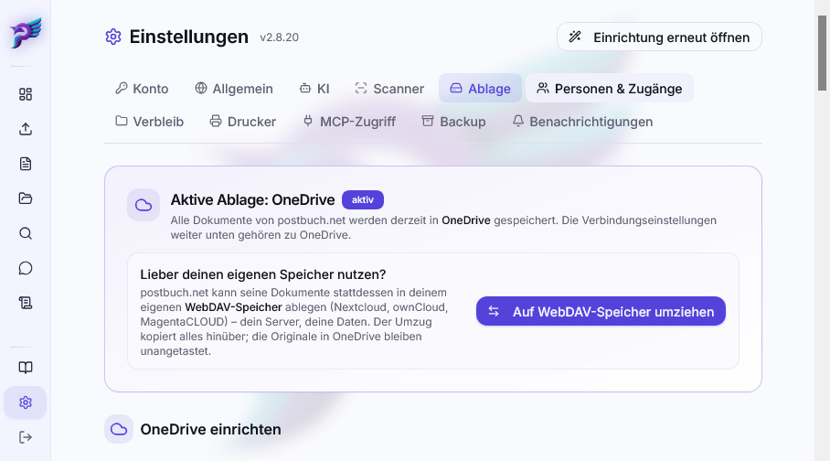
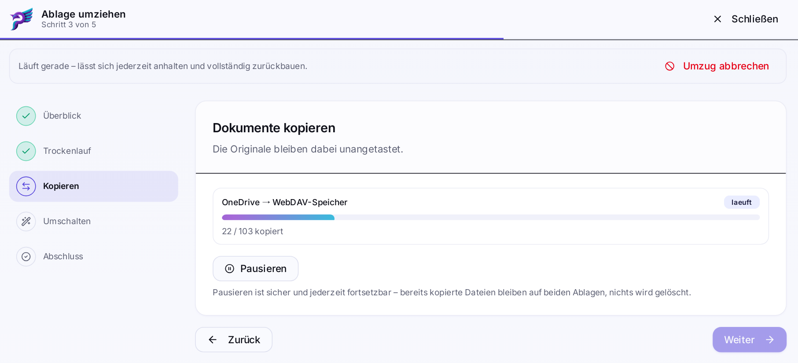

# Dateiablage-Backends

Die PDFs selbst liegen nie auf dem postbuch.net-Server, sondern immer in einer
externen **Dateiablage**. In der Datenbank steht nur, welches Dokument zu welcher
Datei gehört. Damit ist die Dateiablage der Ort, an dem deine Dokumente wirklich
wohnen – und der Ort, den dein eigenes Backup erfassen muss (siehe
[Backup und Wiederherstellung](backup-wiederherstellung.md)).

> [!IMPORTANT]
>
> **Eine funktionsfähige Dateiablage ist zwingend.** Ohne verbundenes OneDrive- oder
> WebDAV-Backend kann postbuch.net keine Dokumente aufnehmen, verarbeiten oder
> sichern. Bereits einmal geöffnete PDFs liegen zusätzlich als begrenzte,
> regenerierbare Zwischenkopie in der Datenbank und bleiben dadurch teils auch
> ohne Dateiablage lesbar – einen sinnvollen Betriebsmodus ohne Dateiablage ergibt das
> aber nicht; wählbar ist nur, welches Backend du verwendest.

postbuch.net kennt zwei Dateiablagen:

- **OneDrive** – Microsofts Cloud, angebunden über Microsoft Graph und eine
  eigene, kostenlose Azure-App.
- **WebDAV-Speicher** – dein eigener Server. Intern heißt dieses Backend
  `nextcloud`, der Adapter spricht aber generisches WebDAV der ownCloud-Familie
  (`oc:fileid`). Verifiziert gegen **Nextcloud** und **ownCloud**;
  **MagentaCLOUD** ist Nextcloud-basiert und funktioniert ebenfalls.

Beide werden über dieselbe interne Schnittstelle angesprochen
(`app/src/lib/storage/`). Alles, was oberhalb davon liegt – Pipeline,
Sortierung, Backup, Export, Disaster Recovery – kennt nur diese Schnittstelle
und nicht das konkrete Backend.

---

## Welche Dateiablage ist aktiv?

Die aktive Dateiablage steht in `_settings.storage_backend` und wird oben im Tab
 **Einstellungen → Dateiablage**
unübersehbar angezeigt. Sie bestimmt **nur, wo neue Dokumente landen**.

Umgeschaltet wird sie an genau **einer** Stelle: am Ende eines Umzugslaufs
(unten, Abschnitt „Umzug"). Es gibt bewusst keinen Schalter „aktive Dateiablage
wechseln" – ein Umschalten ohne vorherige Kopie hinterlässt sonst Dokumente,
deren Dateien nicht mehr erreichbar sind.

Die Variable `STORAGE_BACKEND` in der `.env` wirkt **ausschließlich bei der
Erstinstallation gegen eine leere Datenbank**. Auf einer benutzten Instanz ist
ein Ändern dieser Zeile wirkungslos.

---

## OneDrive

> [!WARNING]
>
> **postbuch.net erhält Zugriff auf dein gesamtes OneDrive – nicht nur auf den
> postbuch-Ordner.**
>
> Die Verbindung verlangt die Graph-Berechtigung `Files.ReadWrite.All`: lesen,
> ändern und löschen in **allen** Ordnern des verbundenen Kontos. Das ist
> Absicht. Nur so liegen die Dokumente im gewöhnlichen Dateibaum (z. B.
> `/postbuch/…`) und bleiben ohne postbuch.net erreichbar – über die
> OneDrive-App, den Explorer oder onedrive.com. Die engere Alternative
> (`Files.ReadWrite.AppFolder`) würde die Dateien in einen abgeschotteten
> App-Ordner sperren; genau das soll nicht passieren.
>
> **Folge:** Das ausgestellte Token liegt unverschlüsselt in der Datenbank
> (`_settings.onedrive_tokens`) – und damit auch in jeder Backup-Datei. Wer
> Zugriff auf den Server, auf die Datenbank oder auf ein Datenbank-Backup hat,
> hat vollen Zugriff auf dein komplettes OneDrive, auch auf alles, was mit
> postbuch.net nichts zu tun hat. Siehe
> [Sicherheit](sicherheit.md#der-zugriff-auf-die-dateiablage-ist-ein-vollzugriff).

Wer diesen Vollzugriff nicht erteilen will, verwendet entweder ein eigenes
Microsoft-Konto nur für postbuch.net oder einen
[eigenen WebDAV-Speicher](#eigener-webdav-speicher). Ganz auf eine Dateiablage zu
verzichten ist nicht möglich. Eine OneDrive-Verbindung lässt sich für Wartung,
Neuverbindung oder einen Backend-Wechsel unter
 **Einstellungen → Dateiablage →
Verbindung trennen** und zusätzlich im Microsoft-Konto unter _Datenschutz → Apps
und Dienste_ widerrufen. Solange keine funktionsfähige Dateiablage verbunden ist,
stehen die Dokumentfunktionen von postbuch.net still.

Die Einrichtung ist unter
[OneDrive-App registrieren](onedrive-app-registrierung.md) beschrieben. Im
 Dateiablage-Tab wählst du zwischen zwei
Verbindungswegen:

| Weg                       | Was du brauchst                                                     | Wann sinnvoll                                     |
| ------------------------- | ------------------------------------------------------------------- | ------------------------------------------------- |
| **Gerätecode** (Standard) | nur eine Client-ID, kein Secret, keine Redirect-URI                 | Einfachster Weg; vermeidet auch den Secret-Ablauf |
| **App mit Secret**        | Client-ID, Client-Secret, Ablaufdatum und registrierte Redirect-URI | Bestandsregistrierungen                           |

Beide Wege benutzen deine **eigene** Azure-App; postbuch.net liefert keine
Client-ID mit. Ein Wechsel des Verbindungswegs trennt eine bestehende Verbindung
– danach ist eine neue Anmeldung nötig. Ein Client-Secret läuft spätestens nach
24 Monaten ab. Ist sein Ablaufdatum hinterlegt, erinnert postbuch.net 60 Tage
vorher; `AADSTS7000222` wird ausdrücklich als „Client-Secret abgelaufen“
angezeigt statt als allgemeiner Tokenfehler.

---

## Eigener WebDAV-Speicher

Zwei Angaben, in dieser Reihenfolge:

1. **Server-Adresse** – die Adresse, unter der du deine Cloud im Browser
   aufrufst, ohne `/index.php` und ohne Unterseite (z. B.
   `https://cloud.example.de`).
2. **Anmeldung** – zwei gleichwertige Wege:
   - **Schnell verbinden (Nextcloud/MagentaCLOUD)** nutzt den
     Nextcloud-Login-Flow v2: Du bekommst einen Link, meldest dich dort im
     Browser an und bestätigst den Zugriff. Nextcloud erzeugt daraufhin ein
     eigenes App-Passwort für postbuch.net. Der Vorgang läuft in einem
     Zeitfenster, das die Oberfläche als Countdown anzeigt; er lässt sich
     jederzeit abbrechen.
   - **Benutzername & App-Passwort** für ownCloud und alles andere. Erzeuge dort
     ein App-Passwort (meist unter _Einstellungen → Sicherheit →
     App-Passwörter_).

**Dein reguläres Cloud-Passwort gehört nie in postbuch.net.** Der Login-Flow
sieht es systembedingt nicht, und beim manuellen Weg trägst du bewusst ein
App-Passwort ein – das lässt sich in deiner Cloud einzeln widerrufen, ohne dass
du irgendwo sonst dein Passwort ändern musst.

> [!WARNING]
>
> Auch hier reicht der Zugriff über den postbuch-Ordner hinaus: Ein
> Nextcloud-App-Passwort gilt für **alle Dateien dieses Cloud-Kontos** – dass
> postbuch.net nur unterhalb seines eigenen Ordners arbeitet, ist eine
> Selbstbeschränkung der Anwendung, keine Grenze der Berechtigung. Das
> App-Passwort steht unverschlüsselt in der Datenbank und damit in jeder
> Backup-Datei. Zwei Unterschiede zu OneDrive: Der Zugriff lässt sich in der
> Cloud jederzeit einzeln widerrufen, und der Server gehört möglicherweise dir.

### Unverschlüsselte Adressen

`http://` statt `https://` behandelt postbuch.net abgestuft:

| Ziel                                                    | Verhalten                                                      |
| ------------------------------------------------------- | -------------------------------------------------------------- |
| Öffentlich erreichbare Adresse per `http`               | **Blockiert.** Die Adresse lässt sich nicht speichern.         |
| Adresse im privaten Netz per `http` (z. B. `192.168.…`) | Möglich, aber nur nach ausdrücklicher Bestätigung per Checkbox |
| `https`                                                 | Normalfall, keine Rückfrage                                    |

> [!TIP]
>
> `http`-Adressen im privaten Netz werden auch dann erkannt, wenn die Dateiablage
> über einen DNS-Namen statt über ihre IP angesprochen wird – aufgelöst wird
> vor der Prüfung in jedem Fall.

Das ist kein Sonderfall der Dateiablage, sondern eine Eigenschaft aller ausgehenden
Verbindungen mit konfigurierbarer URL – mehr dazu unter
[Sicherheit](sicherheit.md).

### Selbsttest

Bei verbundenem WebDAV-Speicher gibt es einen
 **Selbsttest**. Er ist kein „funktioniert
die Verbindung?"-Ping, sondern ein Konformitätstest der Dateiablage-Schnittstelle: Er
legt Dateien mit Umlauten und Leerzeichen an, provoziert eine Namenskollision,
prüft, dass eine Datei nach dem Verschieben über dieselbe ID auffindbar bleibt,
vergleicht Prüfsummen nach dem Herunterladen und testet die Abwehr gefährlicher
Dateinamen.

Der Test arbeitet ausschließlich in einem eigenen Ordner
`<postbuch.net-Wurzelverzeichnis>/_postbuch_selftest/<zufällige ID>/` und räumt
genau diesen wieder ab. Er gibt keine fremden Dateinamen und keine fremden
Inhalte zurück und schaltet nichts um. Ein fehlgeschlagener Schritt mit
Schild-Symbol ist **sicherheitsrelevant** und sollte vor der Nutzung dieses
Servers geklärt werden.

---

## Was die beiden Dateiablagen unterscheiden

Die Adapter melden ihre Fähigkeiten deklarativ; es wird nichts „ausprobiert".

| Eigenschaft                           | OneDrive | WebDAV-Speicher |
| ------------------------------------- | -------- | --------------- |
| Anmeldung                             | OAuth    | App-Passwort    |
| Pfadauflösung (Datei → lesbarer Pfad) | ja       | ja              |
| Prüfsumme in den Metadaten            | nein     | nein            |
| Freier Speicherplatz abfragbar        | ja       | nein            |

Dass beide Backends **keine** Prüfsumme in den Metadaten liefern, hat eine
praktische Folge: Wo postbuch.net eine Datei wirklich verifizieren muss – Umzug,
Disaster Recovery –, wird sie heruntergeladen und lokal gehasht. Das kostet Zeit
und Datenvolumen, ist aber der einzige belastbare Weg.

---

## Die Ordnerstruktur

Konfiguriert wird **nur der Wurzelordner** (Standard `postbuch`, mehrstufige
Pfade wie `archiv/postbuch` sind erlaubt) – festgelegt im Pflichtschritt
 **Ordner** des
[Einrichtungsassistenten](installation.md#der-einrichtungsassistent). Alles
darunter verwaltet postbuch.net selbst. Die Verbindungskarte des
WebDAV-Speichers zeigt den Wurzelordner nur an, festgelegt wird er im
Ordner-Schritt. Angelegt wird:

**Sieben Systemordner**

| Ordner                                                | Inhalt                                                                                                           |
| ----------------------------------------------------- | ---------------------------------------------------------------------------------------------------------------- |
| `<postbuch.net-Wurzelverzeichnis>/_inbox`             | Eingangsordner – hier hineingelegte Dateien werden automatisch verarbeitet und importiert                        |
| `<postbuch.net-Wurzelverzeichnis>/_failed`            | Fehlgeschlagene Verarbeitungen                                                                                   |
| `<postbuch.net-Wurzelverzeichnis>/_suspended`         | Dokumente mit offenem Duplikat-Verdacht                                                                          |
| `<postbuch.net-Wurzelverzeichnis>/_trash`             | Von postbuch.net selbst verwalteter Papierkorb                                                                   |
| `<postbuch.net-Wurzelverzeichnis>/_backup`            | Datenbank-Backups; im Unterordner `user` die selbst ausgelösten Sicherungen, die nie automatisch gelöscht werden |
| `<postbuch.net-Wurzelverzeichnis>/_abrechnung_merged` | Zusammengeführte Abrechnungs-PDFs                                                                                |
| `<postbuch.net-Wurzelverzeichnis>/_debug`             | KI-Debuglogs, nur bei aktiviertem Debug-Modus                                                                    |

**Ein Ordner je Lebensbereich** – zwölf Stück, fest mit dem Release ausgeliefert
(_Tier_, _Steuer & Behörden_, _Vorsorge & Absicherung_, _Gesundheit_, _Beruf_,
_Bildung_, _Mobilität_, _Versorgung_, _Wohnen_, _Finanzen_, _Freizeit_,
_Allgemeines_). Bei der [Ablage nach Person](#ablage-nach-person) liegen sie
stattdessen unter den Personenordnern.

Unterhalb der Lebensbereiche gibt es **Ordner je Dokumentart**. Diese entstehen
**nicht** im Voraus, sondern erst, wenn das erste Dokument einer Kombination
Lebensbereich × Dokumentart abgelegt wird. Aus 12 Lebensbereichen und 18
Dokumentarten würden sonst über 200 leere Ordner – angelegt wird nur, was
tatsächlich belegt ist. Enthält ein Dokumentart-Name Zeichen, die OneDrive in
Ordnernamen verbietet (`\ / : * ? " < > |`), wird für den Ordnernamen ersetzt;
die Anzeige in der App bleibt unverändert.

### Ablage nach Person

Statt nach Lebensbereich lässt sich die Ablage auch zuerst nach Person
gliedern. Umgestellt wird unter 
**Einstellungen → Dateiablage** auf der Karte **Ablagestruktur**:

| Struktur               | Pfad unterhalb des Wurzelordners             |
| ---------------------- | -------------------------------------------- |
| **Nach Lebensbereich** | `<Lebensbereich>/<Dokumentart>` (Standard)   |
| **Nach Person**        | `<Person>/<Lebensbereich>/<Dokumentart>`     |

Maßgeblich ist die Person, der ein Dokument zugeordnet ist, in der Regel der
Adressat. Der Personenordner heißt wie ihr Kurzname. Dokumente ohne
zugeordnete Person liegen im Ordner `Gemeinsam`. Die Systemordner (`_inbox`,
`_trash` …) bleiben unverändert direkt unter dem Wurzelordner. Personen-,
Lebensbereichs- und Dokumentartordner entstehen erst, wenn das erste Dokument
dort abgelegt wird.

Die Umstellung verschiebt den gesamten Bestand des aktiven Backends im
Hintergrund, Datei für Datei; die Karte zeigt den Fortschritt. Neue Dokumente
landen sofort in der neuen Struktur. Erst wenn alle Dateien umgezogen sind,
entfernt postbuch.net die leer gewordenen Ordner der bisherigen Struktur.
Ordner, in denen noch fremde Dateien liegen, bleiben stehen und werden im
Ergebnis gezählt. Schlägt das Verschieben einzelner Dateien fehl, bleiben alle
alten Ordner stehen; die Karte listet die betroffenen Dokumente, und ein
erneuter Klick auf die aktive Struktur setzt den Umzug fort. Die Dateien
behalten dabei ihre Datei-ID, der Zugriff aus postbuch.net funktioniert also
während des ganzen Umzugs. Nur Sync-Programme auf angeschlossenen Rechnern
haben bei großen Beständen entsprechend viel abzugleichen.

Vor der Umstellung auf **Nach Person** prüft postbuch.net, ob sich alle
Kurznamen als Ordnernamen eignen. Ein Kurzname darf nicht mit `_` oder `.`
beginnen, nicht `Gemeinsam` lauten und keinem Lebensbereich entsprechen;
außerdem dürfen sich zwei Kurznamen nicht nur in der Groß- und
Kleinschreibung unterscheiden. Passt ein Kurzname nicht, nennt die Karte ihn
samt Grund, und er muss zuerst unter **Einstellungen → Personen & Zugänge**
geändert werden. Dieselben Regeln gelten beim Anlegen und Umbenennen von
Personen.

Solange die Ablage nach Person gegliedert ist, folgt sie Änderungen
automatisch:

- **Andere Person am Dokument:** Die Datei wandert in den Ordner der neuen
  Person bzw. nach `Gemeinsam`.
- **Kurzname geändert:** Der Personenordner wird umbenannt; die Dateien
  bleiben, wo sie sind.
- **Person gelöscht:** Ihre verbleibenden Dokumente wandern nach `Gemeinsam`,
  anschließend wird ihr leerer Personenordner entfernt.

Zwei Regeln gelten überall, auch beim Umzug:

- **Vorhandene Ordner werden nie überschrieben** – es wird nur ihre ID
  gelesen. Gelöscht wird ein Ordner nur, wenn er leer ist und nach einem
  Wechsel der Ablagestruktur oder dem Löschen einer Person nicht mehr gebraucht
  wird. Die Karte 
  **Wurzelordner umziehen** (siehe unten) lässt sich deshalb mit **demselben**
  Wurzelordner gefahrlos erneut auslösen; sie markiert jeden Ordner als _neu_
  oder _vorhanden_.
- Die Ordner-IDs stehen **je Backend getrennt** unter
  `_settings.storage_folders[<backend>]`. Beide Dateiablagen können also gleichzeitig
  eine vollständige Struktur haben.

### Wurzelordner umziehen

Ist einmal ein Wurzelordner eingerichtet – nach dem Pflichtschritt
 **Ordner** ist das auf jedem
Einrichtungsweg der Fall –, steht unter 
**Einstellungen → Dateiablage** dieselbe Karte weiter zur Verfügung, jetzt unter dem
Namen  **Wurzelordner
umziehen**. Ein **anderer** eingetragener Pfad ist ein echter Umzug: Die Karte
legt die Struktur unter dem neuen Ordner an und verschiebt anschließend den
**gesamten Dokumentenbestand des aktiven Backends** dorthin – der bisherige
Ordner bleibt dabei unangetastet. Dokumente in einem anderen, nicht mehr
aktiven Backend (z. B. nach einem Dateiablage-Umzug mit gemischtem Bestand) laufen
dabei nicht mit.

Weil ein Umzug nichts ist, was beiläufig passieren sollte, fragt postbuch.net
einmal nach, sobald der eingetragene Ordner vom eingerichteten abweicht:
_„Sollen die Daten wirklich dorthin umgezogen werden?"_ Erst nach der
Bestätigung wird verschoben.

Bleibt der eingetragene Pfad dagegen unverändert – das Feld ist beim Öffnen der
Karte bereits mit dem aktuellen Wurzelordner vorausgefüllt, ein Klick genügt –,
entfällt die Rückfrage, und die Karte läuft sofort durch. Das ist kein reiner
Leerlauf: Im selben Zug geht postbuch.net **jedes** Dokument des aktiven
Backends mit gespeicherter Datei-ID einzeln durch (direkt über die ID aufgelöst, kein Durchsuchen der
Dateiablage nötig – siehe [unten](#dateien-manuell-in-der-dateiablage-verschieben-oder-umbenennen))
und verschiebt es in seinen korrekten Ordner der gewählten
[Ablagestruktur](#ablage-nach-person), falls es dort nicht bereits liegt. Das gilt ausdrücklich auch für Dateien, die von Hand
irgendwo außerhalb der postbuch.net-Ordnerstruktur gelandet sind: Sie werden
über ihre ID gefunden und zurückgeholt, ganz gleich ob der Wurzelordner-Pfad
dabei geändert oder unverändert gelassen wurde.

Beide Schritte – Ordner anlegen und anschließend den Dokumentenbestand
verschieben – zeigen dabei je einen eigenen Fortschrittsbalken mit
Live-Zählstand. Der Umzug läuft auch dann im Hintergrund bis zum Ende weiter,
wenn die Einstellungsseite währenddessen verlassen oder neu geladen wird.

### Der postbuch.net-Papierkorb

> [!IMPORTANT]
>
> Der Papierkorb von postbuch.net ist der gewöhnliche Ordner
> **`<postbuch.net-Wurzelverzeichnis>/_trash`** in der Dateiablage. Er ist **nicht**
> der Papierkorb von OneDrive oder Nextcloud.

Beim Löschen eines Dokuments verschiebt und benennt postbuch.net dessen PDF in
diesem Ordner um. Erst nach der bestätigten Verschiebung wird der
Datenbankeintrag gelöscht. Auch verworfene Duplikate, ersetzte PDF-Versionen und
beim Dateiablage-Umzug ausdrücklich aufgeräumte Quelldateien landen dort.

`<postbuch.net-Wurzelverzeichnis>/_trash` ist technisch ein normaler Unterordner
des konfigurierten Wurzelordners. Deshalb gilt:

- **Keine automatische Leerung:** Weder postbuch.net noch OneDrive oder
  Nextcloud löschen Dateien aus `<postbuch.net-Wurzelverzeichnis>/_trash` nach
  einer Aufbewahrungsfrist. Sie bleiben dort, bis du sie selbst verschiebst oder
  löschst.
- **Nicht im Cloud-Papierkorb suchen:** Eine über postbuch.net gelöschte Datei
  erscheint nicht im OneDrive- oder Nextcloud-Systempapierkorb. Öffne in der
  Dateiablage stattdessen `<postbuch.net-Wurzelverzeichnis>/_trash`.
- **PDF und Datensatz sind verschieden:** Nach dem Löschen eines Dokuments ist
  die PDF noch in `<postbuch.net-Wurzelverzeichnis>/_trash`, der
  Datenbankeintrag mit Metadaten, Notizen und Verknüpfungen aber nicht. Soll die
  PDF wieder in postbuch.net erscheinen, verschiebe sie nach
  `<postbuch.net-Wurzelverzeichnis>/_inbox` oder importiere sie erneut; sie wird
  als neues Dokument verarbeitet.
- **Undo beim PDF-Ersetzen:** Die alte Version bleibt ebenfalls in
  `<postbuch.net-Wurzelverzeichnis>/_trash`. Solange sie dort liegt, kann
  postbuch.net den Austausch mit **Strg+Z** rückgängig machen.

Willst du Speicherplatz freigeben, räumst du
`<postbuch.net-Wurzelverzeichnis>/_trash` bewusst selbst über die Oberfläche
deiner Dateiablage auf. Erst dieses manuelle Löschen kann die Dateien in den
Systempapierkorb des Anbieters verschieben; ab dann gelten dessen eigene
Aufbewahrungsregeln.

---

## Eingangsordner-Polling

Damit eine Datei, die du direkt in `<postbuch.net-Wurzelverzeichnis>/_inbox`
legst, verarbeitet und importiert wird, fragt postbuch.net den Ordner regelmäßig
ab. Einstellbar unter 
**Einstellungen → Dateiablage → Automatisches Polling**:

| Feld                 | Bedeutung                                       |
| -------------------- | ----------------------------------------------- |
| Polling aktiv        | Schaltet die Abfrage ganz ab                    |
| Intervall (Sekunden) | Standard 60 s, empfohlen 30–120 s, Minimum 10 s |

Eingeschaltet wird das Polling nicht von Hand, sondern beim Anlegen der
Ordnerstruktur: Sobald `<postbuch.net-Wurzelverzeichnis>/_inbox` existiert,
läuft die Abfrage mit 60 Sekunden. Wer sie danach ausschaltet, behält diese
Entscheidung – sie wird nicht wieder überschrieben.

postbuch.net merkt sich dabei **nicht** einen Zeitstempel, sondern welche
Dateien gerade in Bearbeitung sind. Grund: Eine Datei, die aus einem anderen
Ordner zurück in die Inbox verschoben wird, behält ihr ursprüngliches
Erstellungsdatum – eine zeitstempelbasierte Erkennung würde sie nie wieder
aufgreifen.

---

## Umzug zwischen den Dateiablagen

Der Klick auf **Auf … umziehen** in 
**Einstellungen → Dateiablage** öffnet einen eigenständigen **Migrationsassistenten**
(`/ablage-umzug`, analog zum Einrichtungsassistenten) statt Karten direkt in den
Einstellungen aufzuklappen. Der Umzug ist symmetrisch: OneDrive → WebDAV und
zurück sind derselbe Ablauf mit vertauschten Parametern. Er verkraftet
Unterbrechungen – bei einigen tausend Dokumenten läuft er Stunden.

Der Assistent lässt sich jederzeit über das 
oben schließen, ohne dass Fortschritt verloren geht: Der Zustand steht im
laufenden Migrationslauf auf dem Server, nicht im Browser. Solange ein Lauf
offen ist, zeigt das Dashboard einen Hinweisbanner mit einem Link zurück in den
Assistenten – genau an die Stelle, an der es weitergeht.

Der Assistent führt durch fünf Schritte:

**1. Überblick.** Zeigt Quelle und Ziel und verlangt, dass das Zielbackend
verbunden ist. Die Verbindungskarte des Zielbackends bleibt dabei **immer**
sichtbar, nicht nur solange die Verbindung fehlt – so lässt sich eine
bestehende Verbindung auch trennen und mit einem anderen Konto neu aufbauen,
ohne den Assistenten zu verlassen.

**2. Trockenlauf.** Zwei Teilschritte mit eigenem Fortschrittsbalken: zuerst die
Ordnerstruktur im Ziel anlegen (oder finden – bestehende Ordner werden dabei nie
überschrieben), erst danach lässt sich der eigentliche Trockenlauf starten.
Dieser erste Teilschritt wird bei **jedem** Lauf frisch ausgeführt, auch wenn
zuvor schon einmal eine Ordnerstruktur angelegt wurde – er verlässt sich
niemals auf einen zwischengespeicherten „ist schon eingerichtet"-Zustand,
sondern prüft live gegen das Zielbackend nach. Wurden Ordner dort von Hand
gelöscht, fällt das hier sofort auf, statt erst beim stillen Scheitern jedes
einzelnen Uploads im Schritt „Kopieren". Der Trockenlauf selbst zählt, **ohne
etwas zu kopieren oder zu ändern**, und erfasst dabei immer den gesamten
Bestand im Quellbackend – eine Begrenzung gibt es nicht mehr. Das Ergebnis
nennt die Zahl kopierbarer Dokumente, Dokumente ohne Datei, Dokumente ohne
Zielordner sowie das, was bewusst in der Quelle zurückbleibt (fehlgeschlagene
Verarbeitungen, pausierte Duplikate).

**3. Kopieren.** Der Start („Kopieren starten") sitzt bewusst hier und nicht
schon im Trockenlauf-Schritt, erst nach einer bestätigten Checkbox. Pro
Dokument: aus der Quelle herunterladen → SHA-256 gegen den gespeicherten Wert
prüfen → ins Ziel hochladen → Ziel-ID sofort speichern → **erneut vom Ziel
herunterladen und noch einmal hashen** → erst dann die Datenbankzeile
umschreiben.

Der zweite Download ist kein Übereifer: Ein Upload, den ein Reverse-Proxy
unterwegs abgeschnitten hat, antwortet trotzdem mit „OK". Ohne die Nachkontrolle
fiele die Beschädigung erst beim Öffnen auf – dann aber möglicherweise ohne
Quelle.

**Pausieren ist jederzeit sicher.** Bereits kopierte Dateien liegen dann auf
beiden Dateiablagen; gelöscht wird nichts. Ein Wiederanlauf greift nur Dokumente auf,
die offen, fehlerhaft oder erst halb übertragen sind, und überspringt alles,
was im Ziel bereits mit passender Prüfsumme liegt – verglichen wird **immer**
über die Prüfsumme, nie über Name oder Größe.

Bleiben einzelne Dokumente liegen, erscheint eine **Restliste** mit Fehlertext
und drei Möglichkeiten je Zeile: _Erneut_ versuchen, als _Ohne Datei_ markieren
oder das Dokument löschen. Alternativ lässt sich der Lauf mit „Trotzdem
abschließen" beenden.

**Umzug abbrechen.** Solange weder umgeschaltet noch aufgeräumt wurde, zeigt
der Assistent oberhalb der Schritte durchgehend einen Knopf „Umzug abbrechen" –
unabhängig davon, in welchem Schritt gerade gearbeitet wird. Läuft gerade ein
Trockenlauf oder ein Kopiervorgang, hält der Klick diesen zuerst an; in beiden
Fällen dreht er anschließend alles, was dieser Lauf bereits kopiert hat, wieder
zurück. Die betroffenen Dokumentzeilen zeigen danach wieder auf ihre
Originaldatei im Quellbackend. Die Kopien im Zielbackend werden dabei **nicht**
gelöscht, sie bleiben nur unverknüpft liegen – der Rückbau ist damit
verlustfrei. Der Lauf gilt danach als abgebrochen; ein neuer Umzug beginnt bei
Schritt 1.

**4. Umschalten.** Bis hierher landen neue Dokumente weiterhin in der alten
Dateiablage. Unmittelbar vor dem eigentlichen Umschalten prüft der Assistent noch
einmal auf **Nachzügler** – Dokumente in der alten Dateiablage, die kein Teil dieses
Laufs sind, etwa weil sie erst nach dem Trockenlauf hinzukamen. Solange
Nachzügler offen sind, bleibt Umschalten **gesperrt**; ein Klick nimmt sie in
den Lauf auf und schickt zurück in den Kopier-Schritt, damit sie mitkopiert
werden. Verloren gehen Nachzügler nie – jede Dokumentzeile merkt sich ihr
eigenes Backend und bleibt lesbar –, aber sie sollen nicht unbemerkt in der
alten Dateiablage liegen bleiben. Das eigentliche Umschalten ist ein eigener,
ausdrücklich zu bestätigender Klick; die Prüfsummen werden dabei gegen das neue
Ziel neu erfasst, damit die Notfallwiederherstellung sofort wieder greift.

**5. Abschluss.** Optional lassen sich die Quelldateien aufräumen (mit eigenem
Fortschrittsbalken) – ein zweistufig bestätigter Schritt, der die Quelldateien
nur in **`<postbuch.net-Wurzelverzeichnis>/_trash`** verschiebt, nicht löscht.
Der Ordner wird [nicht automatisch geleert](#der-postbuchnet-papierkorb).
Dateien, auf die noch eine offene Duplikat-Entscheidung oder ein
Fehler-Dokument zeigt, bleiben liegen. „Jetzt nicht" verlässt den Assistenten,
ohne etwas zu entscheiden – der Hinweisbanner im Dashboard bleibt bestehen und
führt jederzeit hierher zurück. Wer das Aufräumen bewusst nie nachholen will,
kann es über „Aufräumen dauerhaft überspringen" (mit eigener Rückfrage)
abschließend ausblenden; erst dann steht statt „Jetzt nicht" ein schlichtes
„Fertig".

Ist aufgeräumt, bietet der Assistent zusätzlich an, die Verbindung zur alten
Dateiablage gleich mit zu trennen – sie wird ab hier nicht mehr gebraucht. Das ist
optional und lässt sich ebenso gut später nachholen, unter **Einstellungen →
Dateiablage** (siehe nächster Abschnitt).

> [!IMPORTANT]
>
> Auch nach dem Aufräumen liegen die Quelldateien nur im Papierkorb der alten
> Dateiablage – postbuch.net löscht dort nie endgültig etwas. Um den Speicherplatz
> wirklich freizugeben (den Papierkorb der alten Dateiablage leeren, ein nicht mehr
> gebrauchtes Konto kündigen o. Ä.), muss selbst in der alten Dateiablage aktiv
> gehandelt werden. Der Assistent weist am Ende ausdrücklich darauf hin.

### Der Rückweg

Ein Rückumzug ist **kein Zurückspulen** eines alten Laufs, sondern ein neuer
Lauf mit vertauschter Quelle und vertauschtem Ziel über den aktuellen
Datenbestand.

### Mischbestand ist ein gültiger, aber provisorischer Zustand

Jede Dokumentzeile merkt sich ihr eigenes Backend. Eine Datei bleibt dort, wo
sie liegt, auch wenn inzwischen umgeschaltet wurde. Ein pausierter oder
abgebrochener Umzug hinterlässt deshalb keine kaputte Installation, sondern
eine, die weiterläuft: alte Dokumente aus der alten Dateiablage, neue aus der neuen.
Beide Backends bleiben dabei lesbar und schreibbar – nichts geht verloren,
nichts muss sofort nachgeholt werden.

Damit ein begonnener Umzug aber nicht unbemerkt liegen bleibt, zeigt das
Dashboard in diesem Zustand einen Hinweisbanner mit einem Link zurück in den
Migrationsassistenten – direkt an die Stelle, an der es weitergeht. Der Ton
unterscheidet sich je nach Stand: Solange noch kopiert oder umgeschaltet werden
muss, ist der Banner eine deutliche Erinnerung; ist bereits umgeschaltet und nur
noch das optionale Aufräumen der Quelle offen, ist er neutral gehalten. Fehlt zu
einem Mischbestand ein zugehöriger Lauf (etwa nach einem manuellen Eingriff),
zeigt ein zweiter, allgemeinerer Banner die Anzahl der Dokumente je Backend mit
einem Link zu **Einstellungen → Dateiablage**. Der Banner verschwindet erst, wenn
alle Dokumente im Zielbackend liegen und (optional) die Quelle aufgeräumt ist.

> [!WARNING]
>
> Der Mischzustand sollte schnellstmöglich beendet werden, indem der Umzug
> abgeschlossen wird. Ein Mischbestand ist **nicht für den Dauerbetrieb**
> gedacht: Er ist ein Übergangszustand, der nur während eines Umzugs entsteht.
> Wer ihn dauerhaft belässt, hat seine Dokumente in zwei Wurzelverzeichnissen,
> die er beide sichern muss.

Unabhängig von einem konkreten Umzug gilt: Ist neben der aktiven Dateiablage noch
eine zweite Backend-Verbindung hinterlegt (typischerweise ein Rest nach einem
abgeschlossenen oder übersprungenen Aufräumen), zeigt **Einstellungen →
Dateiablage** dafür ganz oben eine Warn-Karte mit einem Knopf, um die ungenutzte
Verbindung zu trennen.

---

## Dateien manuell in der Dateiablage verschieben oder umbenennen

Wird ein bereits importiertes Dokument von Hand in der Dateiablage bewegt oder
umbenannt – im Explorer, in der OneDrive-App, in der Nextcloud-Weboberfläche –,
merkt postbuch.net das zunächst gar nicht, und muss es auch nicht: Gespeichert
wird pro Dokument nicht der Pfad, sondern eine unveränderliche **Datei-ID**
(`storage_id`). Sowohl Microsoft Graph als auch `oc:fileid` bei Nextcloud/
ownCloud überstehen Verschieben und Umbenennen unbeschadet – die ID bleibt
gleich, der Pfad wird bei Bedarf live neu aufgelöst. Genau das prüft auch der
[Selbsttest](#selbsttest) des WebDAV-Speichers automatisiert.

Aufgelöst wird eine ID dabei nie durch Durchsuchen der Dateiablage, sondern **direkt**
– bei OneDrive über den Graph-Endpunkt `/items/{id}`, bei Nextcloud über
DAV-SEARCH nach `oc:fileid` bzw., wenn der Server SEARCH nicht kennt (ownCloud),
über den Endpunkt `/remote.php/dav/meta/{id}`. Bei OneDrive und bei Nextcloud
ist das genau ein Request pro Dokument, unabhängig davon, wie viele Dateien
insgesamt in der Dateiablage liegen. Bei ownCloud fällt zusätzlich der zunächst
fehlschlagende SEARCH-Versuch an, bevor der Meta-Endpunkt bzw. PROPFIND als
Fallback greift – dort sind es dann mehrere Requests pro Dokument.

- **Umbenennen** wirkt sich nur auf die Anzeige aus. Der neue Name landet
  spätestens beim nächsten Lauf des Hintergrundabgleichs (unten) in
  `storage_filename`; bis dahin zeigt postbuch.net noch den alten Namen,
  obwohl der Zugriff bereits vorher funktioniert.
- **Verschieben innerhalb derselben Dateiablage** ist bei beiden Backends
  unkritisch – unabhängig davon, in welchen Ordner, auch außerhalb der von
  postbuch.net angelegten Struktur und auch außerhalb des konfigurierten
  Wurzelordners. Der Zugriff auf den Dateiinhalt – Anzeigen, Ersetzen,
  Löschen – prüft nur die aufgelöste ID, nie den aktuellen Pfad der Datei.
  Das gilt für OneDrive genauso wie für Nextcloud/ownCloud: Auch wenn die
  einzelnen Nextcloud-Datei-IDs kleine, fortlaufende Dezimalzahlen sind statt
  langer Zufallsstrings, bleibt jede in der Datenbank gespeicherte ID
  uneingeschränkt abrufbar, egal wohin die Datei von Hand verschoben wurde –
  eine kaputte Dateiablage durch ein einziges verschobenes Dokument soll es nicht
  geben.
- **Ordentlich einsortiert** wird eine so verschobene Datei trotzdem wieder,
  auch wenn sie schon vorher normal erreichbar war: Ein Klick auf
   **Wurzelordner umziehen**
  in  **Einstellungen → Dateiablage** (siehe
  [oben](#wurzelordner-umziehen)) – auch mit unverändertem Pfad – geht jedes
  Dokument mit gespeicherter ID durch und räumt es zurück in seinen korrekten
  Ordner, falls es dort nicht mehr liegt. Das ist
  reine Ordnung in der Dateiablage, keine Voraussetzung für den Zugriff.

> [!NOTE]
>
> Ein echtes, nicht behebbares Problem entsteht erst, wenn die Datei-ID selbst
> verschwindet – die Datei wurde gelöscht, in eine andere Cloud kopiert oder
> durch ein eigenes Cloud-Backup ersetzt. Dann hilft auch **Wurzelordner
> umziehen** nicht mehr, sondern nur ein eigenes Backup der Datei oder die
> [Disaster Recovery](#wenn-sich-alle-datei-ids-geändert-haben) über den
> SHA-256-Fingerabdruck.

Im Hintergrund läuft dafür turnusmäßig (wöchentlich) ein Fingerprint-Abgleich:
Er prüft für jedes Dokument mit Datei-ID Namen und Änderungszeitpunkt gegen die
Dateiablage und zieht Abweichungen automatisch nach – derselbe Mechanismus, der im
Ernstfall die Disaster-Recovery-Zuordnung über SHA-256 erst ermöglicht. Meldet
die Dateiablage dabei für eine Datei-ID ein bestätigtes „nicht gefunden", löst
derselbe Lauf gleich die Verknüpfung (siehe unten) – ein eigener zweiter
Rundgang durch die gesamte Dateiablage ist dafür nicht nötig.

### Wenn eine Datei endgültig fehlt

Meldet die Dateiablage für die Datei-ID eines Dokuments ausdrücklich „nicht
gefunden" – nicht bloß vorübergehend nicht erreichbar, sondern nachweislich
gelöscht oder verschoben, ohne dass sich das über die ID auflösen lässt –,
löst postbuch.net die Verknüpfung. Das Dokument bleibt mit allen Daten,
Notizen und Zuordnungen erhalten, zeigt aber kein PDF mehr an.

Geprüft wird das automatisch beim [Wurzelordner umziehen](#wurzelordner-umziehen),
über den wöchentlichen Fingerprint-Abgleich (siehe oben) sowie jederzeit auf
Zuruf über den Knopf  **Dateiablage auf fehlende
Dateien prüfen** in 
**Einstellungen → Dateiablage**. Betroffene Dokumente findest du in der
Dokumentliste über den Filter **„Nur wenn Datei in der Dateiablage fehlt"** (siehe
[Die Oberfläche](oberflaeche.md#dokumente)).

Auf der Dokumentendetailseite ersetzt in diesem Fall der Knopf
 **Fehlende PDF reimportieren** den
sonst gleich aussehenden **PDF ersetzen**-Knopf (siehe
[Die Dokumentansicht](dokumentansicht.md#pdf-ersetzen)): Es gibt nichts mehr
zu ersetzen, wohl aber eine neue Datei unter derselben Postnummer nachzureichen.

---

## Wenn sich alle Datei-IDs geändert haben

Spielst du in deiner Cloud ein eigenes Backup ein, bekommen die Dateien dort in
der Regel neue IDs – postbuch.net findet dann nichts mehr, obwohl alle Dateien
da sind. Genau dafür gibt es die **Disaster Recovery** im selben Tab: Sie hasht
jede Datei unterhalb eines angegebenen Stammordners und ordnet sie über die
gespeicherten SHA-256-Fingerabdrücke wieder zu.

Beschrieben ist das zusammen mit den übrigen Notfallwegen in
[Backup und Wiederherstellung](backup-wiederherstellung.md#disaster-recovery-verlorene-datei-verknüpfungen).

---

Weiter: [KI-Anbieter](ki-provider.md) · [Zurück zur Übersicht](README.md)
