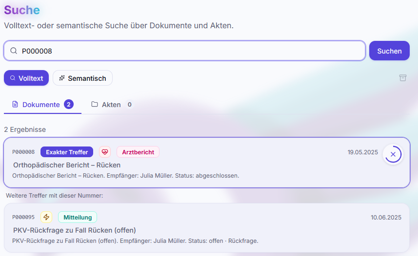
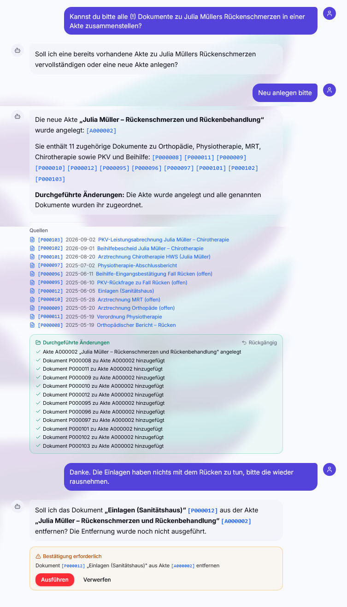

# Suche und Assistent

Zwei Wege führen zu einem Dokument: die 
**Suche** (du weißt ungefähr, wonach du suchst) und der
 **Assistent** (du hast eine Frage, deren
Antwort in mehreren Dokumenten steckt).

## Suche

Erreichbar über die Sidebar, aus dem Dokumentenarchiv oder aus dem
Aktenverzeichnis. Das Ergebnis ist in zwei Registerkarten geteilt:
 **Dokumente** und
 **Akten** – beide werden bei jeder Suche
parallel abgefragt, die Trefferzahl steht am Reiter.

### Zwei Modi

| Modus                                                   | Was passiert                                                                                                                              | Grenze                                     |
| ------------------------------------------------------- | ----------------------------------------------------------------------------------------------------------------------------------------- | ------------------------------------------ |
|  **Volltext**       | PostgreSQL-Volltextsuche mit deutscher Wortstammerkennung über Betreff, Zusammenfassung, Kontakt, Schlagwörter, fremdes Zeichen und Notiz | 50 Treffer                                 |
|  **Semantisch** | Vektorsuche über die Embeddings der Dokumente – findet inhaltlich Ähnliches, auch ohne wörtliche Übereinstimmung                          | 20 pro Seite, „mehr laden" blättert weiter |

Der Volltextmodus sucht in den **Metadaten**, nicht im PDF-Inhalt: „Kraftfahrt"
findet auch „Kraftfahrzeugversicherung", aber ein Wort, das nur mitten im
gescannten Brief steht und weder in Betreff noch Zusammenfassung auftaucht,
findet er nicht. Genau dafür ist der semantische Modus da – er vergleicht die
Bedeutung der Anfrage mit der Bedeutung des Dokuments. Mit dem Suchbegriff
„Einrenken" findet er auch eine Rechnung, in der nur „Chiropraktik" steht.

> [!CAUTION]
>
> Semantische Suche setzt einen konfigurierten **Embedding-Provider** voraus
> (siehe [KI-Provider](ki-provider.md)). Ohne ihn bleibt nur Volltext. Außerdem
> werden nur Dokumente gefunden, deren Embedding mit dem _aktuell_ eingestellten
> Modell erzeugt wurde – nach einem Modellwechsel muss neu eingebettet werden,
> sonst fehlen alte Dokumente still im Ergebnis.

> [!TIP]
>
>  **Historische** Dokumente und Akten sind
> standardmäßig ausgeblendet; ein Schalter über der Ergebnisliste nimmt sie mit
> auf.

### Nummer eingeben = direkt zu Dokument/Akte springen

Tippst du `P000123`, `p123`, `#A45` oder Ähnliches ein, erkennt die Suche das
als Nummerneingabe:

- Der exakte Treffer wird oben hervorgehoben.
- Ein **Countdown-Ring** läuft drei Sekunden – danach springt die Ansicht
  automatisch auf die Detailseite.
- Abbrechen:  Ring anklicken, `Esc` drücken oder
  irgendwo klicken/scrollen. Dann bleibst du in der Ergebnisliste.
- Wer „reduzierte Bewegung" im Betriebssystem eingestellt hat, bekommt den Ring
  ohne Animation, der Countdown läuft trotzdem.
- Eine `A`-Nummer schaltet automatisch auf die Registerkarte
   **Akten** um.

Bei einer Nummerneingabe wird der 
Historisch-Filter bewusst ignoriert und die semantische Suche gar nicht erst
angestoßen: Wer eine Nummer eintippt, will genau dieses Objekt sehen.

Kommst du über den  Zurück-Button in die
Suche zurück, springt sie **nicht** erneut automatisch weiter – sonst säßest du
in einer Schleife fest.

### Aktenmodus

Fügst du aus einer Akte heraus Dokumente hinzu, öffnet sich dieselbe Suche im
**Aktenmodus**: Ein Banner nennt die Ziel-Akte, und jeder Treffer bekommt einen
Direktbutton  „zur Akte
hinzufügen". Die Zuordnung ist über die Rückgängig-Funktion der Oberfläche
sofort widerrufbar. Über  „Zur Akte" geht
es zurück in die Akte.

## Assistent

Der  **Assistent** ist ein Chat, der **deine
Dokumente und die mit dieser Version ausgelieferte Hilfe lesen kann** – z. B.
diesen Text, den du gerade liest. Er beantwortet Fragen, die sich nicht aus
einer Trefferliste ablesen lassen, sondern nur wenn man ein oder mehrere
Dokumente liest und Beziehungen zwischen ihnen herstellt. Beispiele:

- „Was habe ich 2025 insgesamt an Zahnarztkosten gehabt, und wie viel davon ist
  erstattet?"
- „Welche Rechnung gehört zu diesem Erstattungsbescheid?"
- „Steht in meinem Mietvertrag etwas zur Kaution?"
- "Welche Versicherungen habe ich aktuell und was kosten sie mich?"
- "Wie hat sich mein Bruttogehalt über die letzten 10 Jahre entwickelt?"
- „Wie lange läuft mein aktueller Gasvertrag noch?"

aber auch:

- „Wie archiviere ich eine Akte?" oder
- „Wo richte ich den Scanner ein?"

### Wie er arbeitet

Der Assistent bekommt nicht deine ganze Datenbank vorgelegt, sondern
**Werkzeuge**, mit denen er sich selbst holt, was er braucht:

- **Recherchieren** – Dokumente semantisch und per Volltext durchsuchen,
  Metadaten eines Dokuments abrufen, Akten durchsuchen, eine Akte samt
  Dokumentliste laden, Wiedervorlagen und Fälligkeiten auflisten.
- **Bedienung erklären** – passende Abschnitte der eingebauten Hilfe semantisch
  finden. Verwendete Hilfeabschnitte stehen als klickbare Quellen unter der
  Antwort und öffnen direkt das betreffende Kapitel.
- **Hineinschauen** – den extrahierten Volltext eines Dokuments laden, oder bei
  tabellenlastigen Dokumenten (Gehaltsabrechnung, Kontoauszug, Steuerbescheid)
  das PDF selbst per Vision-Modell ansehen. Letzteres geht nur bei PDFs mit
  höchstens **acht Seiten**; bei längeren bleibt ihm der Volltext.

Das läuft in Runden: suchen, Ergebnisse bewerten, gezielt nachladen, antworten.
Pro Antwort sind maximal **12 Runden** und **10 Dokument-Ladungen** erlaubt –
danach muss er aus dem berichten, was er hat, und Lücken benennen. Diese Grenzen
bremsen Kosten und verhindern Endlosschleifen; bei sehr breiten Fragen („zeig
mir alles zu…") kann es sein, dass er einschränken muss. Dann ist eine präzisere
Frage die bessere Antwort.

Die Hilfe wird dabei nicht vollständig in jede Anfrage geladen. Der Assistent
sucht erst nach wenigen passenden Abschnitten und bekommt nur diese in den
Kontext. Ist der semantische Hilfekorpus noch nicht fertig oder der
Embedding-Provider vorübergehend nicht erreichbar, bleibt eine lokale Textsuche
als Rückfall erhalten.

Der Assistent nutzt **zwei Modelle**: ein schnelles, günstiges für die
Rechercherunden und ein starkes für die Schlussantwort. Beide werden getrennt
unter  `Einstellungen → KI` als
eigene Modellklassen „Assistent: Recherche" und „Assistent: Antwort" gewählt
(siehe [KI-Provider](ki-provider.md)).

### Dokumente direkt referenzieren

Mit `#P000123` (Dokument) oder `#A000045` (Akte) in der Nachricht hängst du das
Objekt direkt an die Frage an – der Inhalt wird geladen, _bevor_ der Assistent
loslegt, er muss also nicht erst danach suchen.

Zur Schreibweise: Das Rautezeichen ist Pflicht, und die Nummer muss
**sechsstellig** sein. `#P000123` funktioniert, `#P123` nicht – anders als im
Suchfeld, das kurze Eingaben verzeiht. Groß- und Kleinschreibung ist egal
(`#p000123` geht auch). Der schnellste Weg zu einer korrekten Referenz ist der
Knopf  **Im Chat besprechen** auf der
Detailseite eines Dokuments: Er öffnet den Assistenten mit der fertigen Referenz
im Eingabefeld. Sonst kopiert man die Nummer aus der Kopfzeile des Dokuments
oder der Akte.

Grenzen: maximal **fünf** Referenzen pro Nachricht – weitere werden ignoriert,
mit einem Hinweis darauf, welche –, und Volltexte werden bei **8000 Zeichen**
gekappt. Mehrfachnennungen desselben Objekts zählen einmal.

Was mitkommt: bei einem **Dokument** die Metadaten (Datum, Art, Kontakt, Status,
Person, fremdes Zeichen), Zusammenfassung, Schlagwörter, Notiz und der
extrahierte Volltext; archivierte Dokumente sind ausdrücklich als `ARCHIVIERT`
gekennzeichnet. Bei einer **Akte** kommen Betreff, Beschreibung, Schlagwörter,
Notiz und die Liste der enthaltenen Dokumente mit – nicht deren Volltexte; die
lädt der Assistent bei Bedarf selbst nach. Bei Dokumenten ohne extrahierbaren
Text (reine Scans) kommen nur die Metadaten mit, und der Assistent kann
entscheiden, ob er das PDF ansehen will.

In deiner abgeschickten Nachricht werden die Referenzen als klickbare Chips
dargestellt, in der Antwort genannte Dokumente ebenso. Der Zurück-Weg führt in
den Chat zurück.

### Bearbeiten-Modus

Standardmäßig **liest** der Assistent nur. Das
 Stift-Symbol schaltet den
Bearbeiten-Modus für den jeweiligen Chat ein; dann darf er zusätzlich Akten
anlegen und pflegen sowie Schlagwörter und Notiz eines Dokuments ändern. Zwei
unabhängige Sperren:

1. **Rolle.** Wer nur `lesezugriff` hat, kann den Modus nicht einschalten – die
   Schreibwerkzeuge werden dem Modell gar nicht erst angeboten.
2. **Schalter.** Auch mit Schreibrechten ist der Modus pro Chat aus, bis du ihn
   aktivierst. Er wird beim Wechsel in einen anderen Chat wieder zurückgesetzt.

Braucht der Assistent Schreibrechte, führt er die Aktion nicht einfach aus,
sondern fragt: „Bearbeiten-Modus nötig" – mit einem Knopf, der ihn einschaltet
und die Antwort fortsetzt.

Was dann passieren darf, ist gestaffelt:

| Art der Aktion | Beispiele                                                                                                                                           | Verhalten                                                                                                               |
| -------------- | --------------------------------------------------------------------------------------------------------------------------------------------------- | ----------------------------------------------------------------------------------------------------------------------- |
| **Additiv**    | Akte anlegen, Dokument zur Akte hinzufügen, Reihenfolge der Dokumente ändern, Akte auf historisch setzen (wahlweise samt der enthaltenen Dokumente) | wird sofort ausgeführt, mit  **Rückgängig**-Knopf an der Antwort              |
| **Bedingt**    | Betreff, Beschreibung, Schlagwörter oder Notiz einer **Akte** ändern; Schlagwörter oder Notiz eines **Dokuments** ändern                            | füllt es nur ein leeres Feld, läuft es durch; würde es Vorhandenes **überschreiben**, wird es zur Bestätigung vorgelegt |
| **Destruktiv** | Dokument aus Akte entfernen, Akte löschen                                                                                                           | **immer** bestätigungspflichtig                                                                                         |

Vorgelegte Aktionen erscheinen als Karte unter der Antwort mit
 **Bestätigen** und
 **Verwerfen**. Bestätigen führt alle offenen
Aktionen in _einer_ Transaktion aus – entweder alle oder keine. Ausgeführte
Aktionen behalten ihre inverse Operation;
 **Rückgängig** spielt sie in
umgekehrter Reihenfolge zurück, ebenfalls transaktional. Pro Antwort sind
höchstens 50 Schreibaktionen möglich.

Was er **nicht** ändern kann – die Werkzeuge dafür existieren schlicht nicht:

- **Dokumente** löschen, hochladen, ersetzen oder wiederverarbeiten, und keine
  Datei in der Dateiablage verschieben.
- Von einem Dokument alles außer Schlagwörtern und Notiz: Betreff, Briefdatum,
  Dokumentart, Kontakt, Person, Richtung, Status, Beträge, Fälligkeit und
  „bezahlt am" bleiben ihm verschlossen. Ein einzelnes Dokument archivieren kann
  er nicht.
- Wiedervorlagen anlegen oder abhaken: das liest er nur.
- Abrechnungsperioden, Kostenträger-Profile, Menschen, Einstellungen, Backups
  und der Verbleib eines Dokuments – dieser ganze Bereich ist für ihn
  unsichtbar, weder lesend noch schreibend.

Sein schreibender Zugriff endet also bei der Aktenpflege und den beiden
Dokumentfeldern Schlagwörter und Notiz.

### Chats verwalten

Links liegt die Liste der Unterhaltungen. Titel werden automatisch aus der
ersten Frage erzeugt und lassen sich per 
Stift umbenennen;  Löschen entfernt den Chat
samt Verlauf. Jeder Nutzer sieht ausschließlich seine eigenen Chats – auch der
Admin kann fremde Chatlisten und -inhalte nicht einsehen. Lediglich das Löschen
fremder Chats ist dem Admin vorbehalten.

Eine laufende Antwort lässt sich mit dem 
Stopp-Knopf abbrechen. Bereits ausgeführte additive Aktionen bleiben dann
bestehen und sind über Rückgängig zurücknehmbar.

## Was wähle ich wann?

- **Nummer bekannt** → Suchfeld, Nummer eintippen, drei Sekunden warten.
- **Stichwort bekannt** → Volltextsuche.
- **Nur das Thema bekannt** → semantische Suche.
- **Frage statt Suche** → Assistent. Er ist langsamer und kostet KI-Aufrufe,
  aber er liest die Dokumente wirklich.
- **Große Akte anlegen** → Assistent, weil er die Dokumente für dich automatisch
  finden und hinzufügen kann.

---

Weiter: [PKV, Beihilfe und Abrechnung](abrechnung-pkv-beihilfe.md) ·
[Zurück zur Übersicht](README.md)
